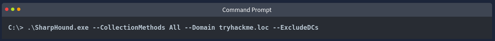
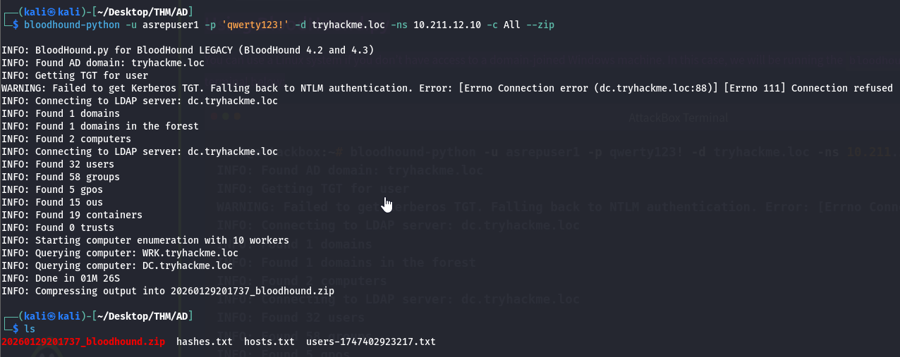
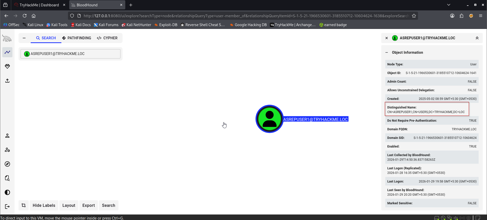
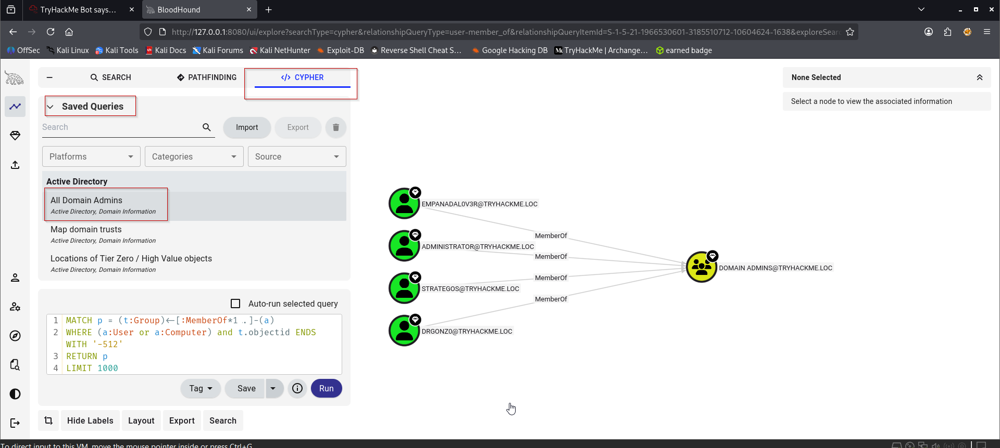
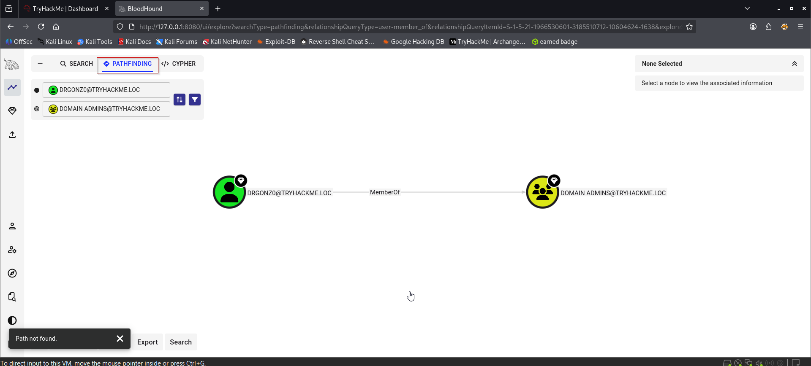

BloodHound remains the most potent tool for Active Directory (AD) enumeration, revolutionising the field since its release in 2016. Initially developed by SpecterOps, it introduced a graph-based perspective to AD security — a fundamental shift that has since been embraced by attackers and defenders alike.
A Brief History

For years, red teamers -and, unfortunately, attackers- had the advantage of visibility into complex AD relationships. BloodHound’s introduction changed everything by enabling security professionals to map permissions, group memberships, and trust relationships in a graph rather than relying on isolated lists.

A now-famous phrase best captures this shift:

    “Defenders think in lists. Attackers think in graphs.” — John Lambert.

Defenders traditionally worked with static lists, like a list of Domain Admins or servers. In contrast, attackers exploited the hidden relationships between users, groups, and computers — relationships that only became visible through graph analysis.

Microsoft recognised the tool’s effectiveness, ultimately integrating similar graph-based methodologies into Defender for Identity.
The Two-Stage Attack Model

BloodHound empowered a new two-stage approach to attacking Active Directory environments:

Stage 1: Enumeration

Attackers deploy data collectors (like SharpHound or BloodHound-python) to gather information about the AD structure, including user sessions, group memberships, access control lists (ACLs), and delegation settings. Even if detected early by the blue team, attackers now possess enough offline data to build a complete attack graph.

Stage 2: Targeted Attack

Using BloodHound offline, attackers identify precise, efficient paths to their goals (e.g., obtaining Domain Admin privileges). When they re-enter the environment, they can move laterally and escalate privileges within minutes, often faster than the blue team can respond to the first alert.

This ability to plan attacks offline based on detailed relationship mapping made BloodHound an indispensable tool for offence and proactive defence.
Evolution and Modern Capabilities

    Azure support: BloodHound now includes AzureHound, which allows the enumeration of Azure Entra ID environments and traditional on-prem AD.
    New attack primitives: Updates have added detection of attack paths involving techniques like Resource-Based Constrained Delegation (RBCD) through primitives such as AddAllowedToAct and AllowedToAct.
    Advanced analysis algorithms: Techniques like the Butterfly algorithm offer improved risk scoring and prioritisation, enabling users to understand the impact of relationships and vulnerabilities better.

These enhancements allow BloodHound to tackle even larger, hybrid (cloud/on-prem) environments with much greater efficiency and depth.
Defender’s Perspective

Today, defenders leverage BloodHound (and BloodHound Enterprise) to proactively identify misconfigurations, excessive privileges, and risky access pathways before attackers can exploit them.

By continuously mapping and monitoring AD relationships, defenders can harden their environments against standard and advanced attack techniques, making BloodHound a tool for both attack and defense.
Data Collection

You’ll often hear users mention SharpHound and BloodHound-python interchangeably. However, it’s important to note that they’re not the same. SharpHound is specifically the data collection component of BloodHound. It gathers Active Directory (AD) information, which BloodHound then visualises in attack graphs. Therefore, understanding SharpHound’s capabilities is crucial before we analyse graphs in BloodHound.
Understanding SharpHound

SharpHound is the official BloodHound data collector, written in C#. It enumerates key AD elements such as:

    Group memberships
    Session data
    Access Control Lists (ACLs)
    Domain trusts
    Privileged relationships (like local administrator rights)

Types of SharpHound Collectors

SharpHound.exe: This is a Windows executable designed for standard enumeration on domain-joined Windows machines. Due to its versatility and robust functionality, it is currently the recommended method.
AzureHound.ps1: A PowerShell script focused specifically on Azure Entra ID environments. It enables enumerating cloud-specific configurations and identities seamlessly into hybrid AD scenarios.
SharpHound.ps1 (Deprecated): Previously a PowerShell variant used for stealth operations, it is particularly useful for loading scripts directly into memory to avoid antivirus detection. However, recent releases have discontinued support, favouring the executable and Python-based approaches.

BloodHound.py (Python Collector)

Beyond SharpHound, there’s also the Python-based collector known as BloodHound.py. Ideal for Linux-based systems or environments where Python is preferred, BloodHound.py can enumerate AD domains without requiring Windows-specific tooling. It supports authentication through credentials, NTLM hashes, or Kerberos tickets, and outputs JSON or compressed ZIP files compatible with BloodHound’s GUI.

Note: Your BloodHound and SharpHound versions must match for the best results. Updates to BloodHound usually mean older SharpHound results cannot be ingested. Additionally, while BloodHound.py is widely used for Linux-based environments, the BloodHound development team does not officially support it.
Executing SharpHound

When conducting an assessment on Windows, we can run SharpHound on a domain-joined Windows machine; however, please note that the binary can be blocked by Windows Defender. You can run it on the Windows command line, as shown below.



Parameters explained:

    --CollectionMethods All: Specifies that all data collection methods should be used
    --Domain tryhackme.loc: Targets the specified domain for data collection
    --ExcludeDCs: Excludes domain controllers from the collection process to reduce detection risk

Using BloodHound.py

You can use a Linux system if you don’t have access to a domain-joined Windows machine. In this case, we will be running the bloodhound-python. The command is shown in the terminal below:

```sh
bloodhound-python -u asrepuser1 -p 'qwerty123!' -d tryhackme.loc -ns 10.211.12.10 -c All --zip
```


Parameters explained:

    -u username: Specifies the username for authentication
    -p password: Specifies the password for authentication
    -d tryhackme.loc: Targets the specified domain for data collection
    -ns: Specifies the IP address of a DNS server
    -c All: Uses all available collection methods
    --zip: Compresses the output into a ZIP archive for easy import into BloodHound

Notice that the last line tells us the compressed file’s name containing our output. In the next step, we will log in at BloodHound-CE to import and ingest this zip file.
Operational Security Considerations

When conducting assessments, be aware that data collection tools like SharpHound and BloodHound.py may trigger security alerts. To minimise detection:

    Use the --ExcludeDCs flag to avoid querying domain controllers
    Employ stealthier collection methods, such as DCOnly, to limit interactions with sensitive systems
    Run collectors from systems with appropriate antivirus exclusions or non-domain-joined machines using the runas command with the /netonly flag to authenticate without joining the domain

Please always make sure you have proper authorisation before conducting such activities.
Accessing BloodHound-CE

BloodHound-CE now runs as a web application, typically hosted on a different machine. To access it:

    Open a browser on your AttackBox or host machine
    Navigate to the BloodHound-CE server’s IP and port (we already set this up on http://10.211.12.100:8080).
    Log in using the credentials:

    Username: admin
    Password: weU^BjZr33OIWsC^


Importing Collection Data

After logging in and ensuring you have generated a ZIP file for ingestion (for example, by running SharpHound or bloodhound-python with the --zip flag), follow these steps:

    Go to the Administration tab in the left-hand navigation menu
    Scroll to the File Ingest section
    Upload your ZIP file directly through the browser

Exploring BloodHound Data

Click on the Explore tab to view the visual Active Directory graph.

    Nodes: Represent users, computers, groups, etc.
    Edges: Represent relationships and permissions between nodes.

Searching for Nodes

    Use the search bar at the top to find the ASREPUSER1 user account
    Click the node to view its properties

Node Information Breakdown

    Object information – summary details of the object, such as name, type, and domain
    Sessions – active logon sessions associated with the object
    Member of – AD groups the object belongs to
    Local admin privileges – machines where the object has local administrator rights
    Execution privileges – rights such as RDP or equivalent permissions
    Outbound object control – rights the object has over other objects
    Inbound object control – rights other objects have over this object

Click the number next to a section to expand it.
Using Built-in Queries

To use BloodHound’s built-in queries:

    Click Cypher in the top menu
    Click the folder icon to browse prebuilt queries (e.g., “All Domain Admins”)

Built-in queries
Attack Path Discovery

    Click the Pathfinding button in the top bar
    Set EMPANADAL0V3R as the Start Node
    Set a target (e.g., Tier 1 ADMINS) as the End Node
    Run the search with the desired edge filters

If a path exists, BloodHound will map it out visually. If not, it may be due to missing or incomplete data.
Benefits and Limitations

The benefits of BloodHound-CE are its web-based interface, clear attack path visualisations, and deep insight into AD relationships. However, it should be noted that SharpHound collection is noisy and can trigger AV/EDR alerts.

In brief, BloodHound-CE is an essential tool for penetration testers. It visualises AD relationships and helps uncover privilege escalation paths. Get hands-on to build familiarity.

### What is the distinguishedName value of the asrepuser1 account?



### According to the "All Domain Admins" query, how many users are part of the Domain Admins group?


### What is the type of relationship (edge) between the DRGONZ0 account and the DOMAIN ADMINS group?
