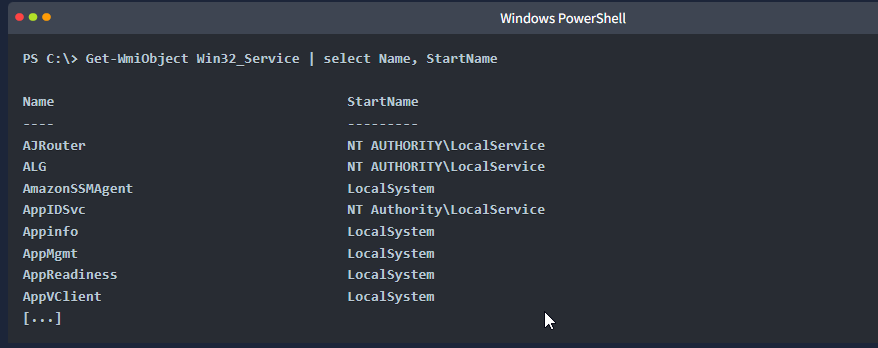
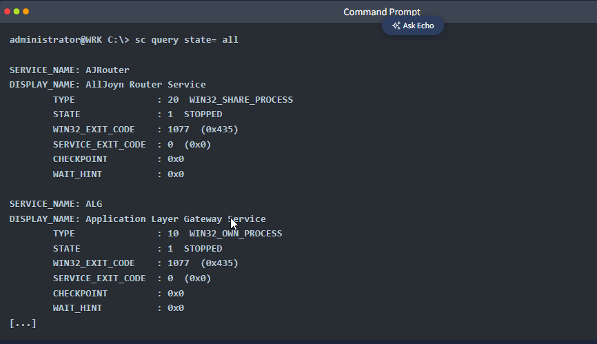
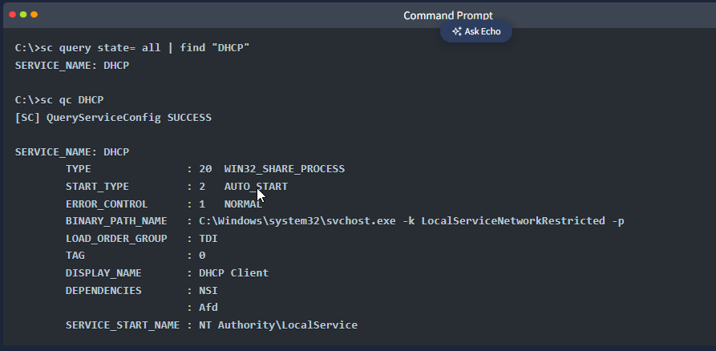
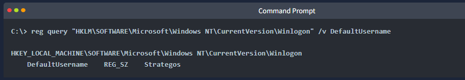
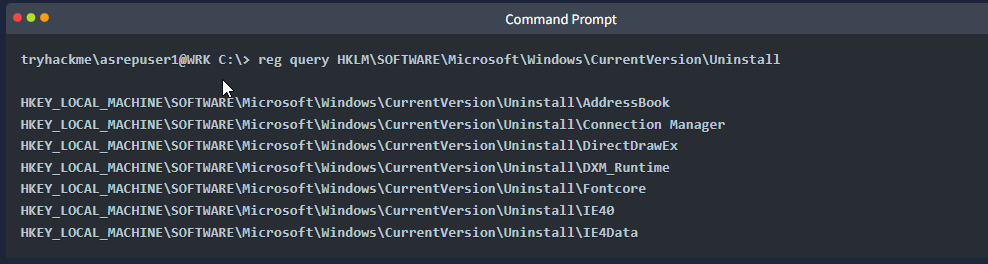

### Domain Groups

Now that you have listed the domain user accounts and have more information about any account you choose, it is time to list all domain groups. The domain groups can be displayed using **`net group /domain`**:

The command above outputs every domain group; however, we omitted several lines to keep the output tidy. Some of the most interesting domain groups are:

- **Domain Admins** and **Administrators** can hold the keys to the whole Active Directory
- **Enterprise Admins** play a key role in a multi-domain forest
- **Server Operators** and **Backup Operators** are privileged built-in accounts that are worth inspecting
- Any group with “Admin” in its name (e.g., “SQL Admins”) could be worth targeting.

Generally, any group with “Admin” in its name is worth checking.

The Domain Controllers and Domain Computers contain machine accounts. We can discover the names of the computers on the domain by using `net group <Group Name> / domain`. For example, the `net group "Domain Computers" /domain` will return all the computer accounts that exist in the domain. Note that machine accounts end with `$`, for example `DESKTOP-ACCT05$`.

You can use the same syntax to list the members of any user group as well. For example, `net group "Domain Admins" /domain` will show you all the accounts that belong to the Domain Admins group.

If you want to check the local groups, you can list all the local groups using `net localgroup`. The terminal below shows an example output.

Furthermore, if you want to know the members of a specific local group, such as `Administrators`, you need to issue `net localgroup Administrators`. In the example output below, we can see that the `Domain Admins` belong to the local `Administrators` group, which is what you would expect.

So far, we have listed the domain users and groups and managed to fetch information about any notable account. As mentioned, `net` can be used from the Command Prompt and the PowerShell window. For something exclusive to PowerShell, we will cover the ActiveDirectory module and PowerView in a later task.

## Logged-on Users and Sessions

Let’s return to our analogy of suddenly finding yourself in a dark office. One question you might ask is, “Who else is here?”

In computer system terms, we want to find out the users who logged on to a machine, for example, via Remote Desktop (RDP); moreover, some users might have open sessions, but the session is locked. In addition, there might be service accounts running scheduled tasks. All of this information gives us a better idea about the system we are in.

You can run `query user`, or `quser` for short, to list users logged on to a machine. The terminal below shows an example output.

You can learn that the administrator is logged in over RDP while another user is logged in on the physical console.

Noticing an account with administrator privileges logged on to a machine is a big find. Generally speaking, there is a high chance that we can find their credentials or tokens in memory. Consequently, an attacker would aim to dump LSASS to get their password hash or Kerberos ticket, for instance. Furthermore, the attacker can impersonate their session token provided their account has `SeImpersonatePrivilege`. In brief, a logged-on admin is a clue that attempting to steal a token or launch Mimikatz can lead to a great reward.

There are other useful commands to gather information about what’s happening on the system activity and who is using it. Note that the following two example commands require elevated privileges to run:

- `tasklist` displays a list of currently running processes. You can use `tasklist /V` for verbose task information.
- `net session` lists the SMB sessions between the computer and other computers on the network. It requires administrator privileges to run.

Now that we have learned who else is on the system, we can find users who have logged into the system at least once by checking the `C:\Users\` directory for individual users’ folders; every user that has logged on at least once has their home directory created.

## Identifying Service Accounts

Not all accounts are for human users; many are service accounts. Service accounts are local and domain accounts used by applications and services. They usually have privileges just enough to get the job done; however, this might still be high privileges in many cases. As you would expect, service accounts tend to have static passwords that are not likely to expire. If the service account of the backup application has an expired password, the backup will start failing; no one wants that.

### Search Using WMIC

We can use WMIC to gather information about Windows services, including the account for each service. If you run `wmic service get`, you will get plenty of information about each service; each service’s information is shown in one very long row. You might want to display specific rows, such as the service name and the associated account, using `wmic service get Name,StartName` as shown below. Please note that we need administrator privileges to run it.

The `StartName` is the account under which the service runs. The standard accounts are: `LocalSystem`, `NT AUTHORITY\LocalService`, `NT AUTHORITY\NetworkService`, and `NT SERVICE\SomeServiceName` for those running as virtual service accounts. Occasionally, you might find a service with a domain account, `DomainName\username`. Such domain accounts are worth investigating as they might be reused elsewhere, or their password may not match the expected password complexity.

If you are using PowerShell, an equivalent of the `wmic service get Name,StartName` command is `Get-WmiObject Win32_Service | select Name, StartName`. The output should be similar to the one above. Similarly, this requires administrator privileges.

Skimming through the list can reveal some interesting accounts you might not know.

### Search Using SC

In addition to `wmic`, we can enumerate services on a local machine using the `sc` command. SC is a command-line program that communicates with services and the Service Control Manager.

`sc query state= all` will return all services on a Windows system; however, it requires administrator privileges to run.

Alternatively, because it will return a very long list, you might want to filter out the output, for example, `sc query state= all | find "Keyword"`. Once you obtain the service name, you can use `sc qc <ServiceName>` to discover the service name. Note that you need the service name for `sc qc` to work.

As you can see, the `SERVICE_START_NAME` reveals the name of the service account that started the `DHCP` service.

## Watching the Environment and Registry

The last point in this task covers persistent system configuration, particularly environment variables and the Windows Registry.

We’ve already visited the amount of information available to us via the `set` command. From the attacker’s perspective, the environment variables, such as `JAVA_HOME`, reveal hints about installed software, applications, and development tools.

The Windows Registry can hold a myriad of information about the system’s activities. However, it is enormous and unrealistic to go through all its keys and values. We will mention a few points that might be worth checking.

### Saved Auto-Logon Credentials

After booting, servers and systems are locked until a user manually enters the login credentials. In the case of a misconfigured or testing system, the credentials for auto-logon might be saved. If this is the case, they can be found under `HKEY_LOCAL_MACHINE\SOFTWARE\Microsoft\Windows NT\CurrentVersion\Winlogon`. You might want to check `DefaultPassword` if saved and `AutoAdminLogon` if set to 1. You can search for the value you want using `reg query "HKLM\SOFTWARE\Microsoft\Windows NT\CurrentVersion\Winlogon" /v keyword` the following:

If saved, the password will be in plaintext.

Another interesting Registry location is `HKLM\Security\Cache`; however, this one requires administrator access; moreover, the credentials will be hashed and require cracking.

### Installed Applications

You can run `reg query HKLM\SOFTWARE\Microsoft\Windows\CurrentVersion\Uninstall` to quickly get a list of installed applications. This list can be handy, especially if you find a server with known default credentials. In this approach, we assume that you have command-line access and don’t have access to the Control Panel.

### Searching the Registry

There are many other things that you might discover from the register. We end the registry section with the following command to search the registry for a specific keyword. For example, to search the registry for `password`, you can use:

`reg query HKLM /f "password" /t REG_SZ /s`

## Scheduled Tasks

One more thing to consider before finishing this part is the scheduled tasks. You can list all scheduled tasks using `schtasks /query`. On a side note, you can use `schtasks` to create a new scheduled task using `/create` or run an existing scheduled task with `/run`.

Use an SSH client to connect to the Workstation with the IP address `10.211.12.20`. Use the following domain account credentials:

- Username: `asrepuser1`
- Password: `qwerty123!`
