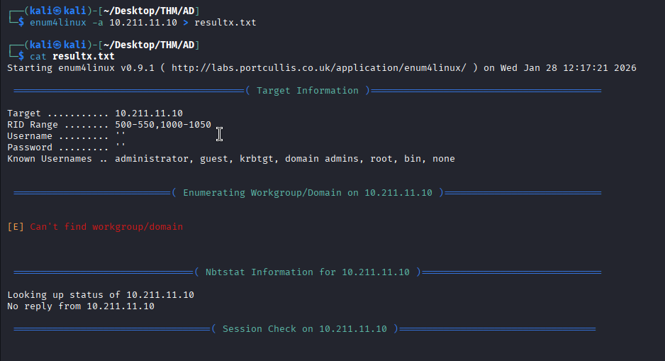
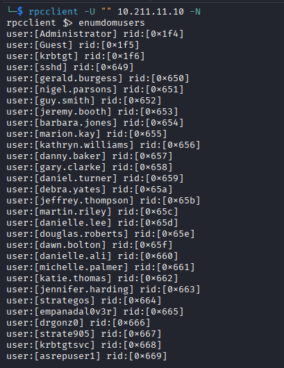
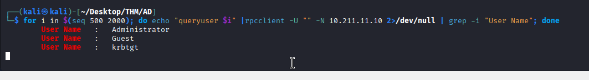

Now that we have a better understanding of our target's network, it's time to enumerate users to help us identify valid accounts and potential targets. Usernames can be gathered through various unauthenticated methods, each relying on different misconfigurations.

In this task, we'll explore some of the tools and techniques needed for successful user enumeration.

## LDAP Enumeration (Anonymous Bind)

Lightweight Directory Access Protocol (LDAP) is a widely used protocol for accessing and managing directory services, such as Microsoft Active Directory. LDAP helps locate and organise resources within a network, including users, groups, devices, and organisational information, by providing a central directory that applications and users can query.  
Some LDAP servers allow anonymous users to perform read-only queries. This can expose user accounts and other directory information.

We can test if anonymous LDAP bind is enabled with `ldapsearch`:

`ldapsearch -x -H ldap://10.211.11.10 -s base`

- `-x`: Simple authentication, in our case, anonymous authentication.
- `-H`: Specifies the LDAP server.
- `-s`: Limits the query only to the base object and does not search subtrees or children.

If it is enabled, we should see lots of data, similar to the output below:

We can then query user information with this command:

`ldapsearch -x -H ldap://10.211.11.10 -b "dc=tryhackme,dc=loc" "(objectClass=person)"`

## Enum4linux-ng

**enum4linux-ng** is a tool that automates various enumeration techniques against Windows systems, including user enumeration. It utilizes SMB and RPC protocols to gather information such as user lists, group memberships, and share details.

We can run the following command to get as much information as possible from the DC:

`enum4linux-ng -A 10.211.11.10 -oA results.txt`

- `-A`: Performs all available enumeration functions (users, groups, shares, password policy, RID cycling, OS information and NetBIOS information).
- `-oA`: Writes output to YAML and JSON files.




## RPC Enumeration (Null Sessions)

Microsoft Remote Procedure Call (MSRPC) is a protocol that enables a program running on one computer to request services from a program on another computer, without needing to understand the underlying details of the network. RPC services can be accessed over the SMB protocol. When SMB is configured to allow null sessions that do not require authentication, an unauthenticated user can connect to the IPC$ share and enumerate users, groups, shares, and other sensitive information from the system or domain.

We can run the following command to verify null session access with:

`rpcclient -U "" 10.211.11.10 -N`

- `-U`: Used to specify the username, in our case, we are using an empty string for anonymous login.
- `-N`: Tells RPC not to prompt us for a password.

If successful, we can enumerate users with: `enumdomusers`


You can run **help** in the rpcclient shell to view the list of available commands. With the right permissions, we can enumerate the domain thoroughly through RPC.

## RID Cycling

In Active Directory, RID (Relative Identifier) ranges are used to assign unique identifiers to user and group objects. These RIDs are components of the Security Identifier (SID), which uniquely identifies each object within a domain. Certain RIDs are well-known and standardised.

**500** is the Administrator account, **501** is the Guest account and **512-514** are for the following groups: Domain Admins, Domain users and Domain guests. User accounts typically start from RID **1000** onwards.

We can use **enum4linux-ng** to determine the RID range, or we can start with a known range, for example, 1000-1200, and increment if we get results.

If `enumdomusers` is restricted, we can manually try querying each individual user RID with this bash command:
```sh
for i in $(seq 500 2000); do echo "queryuser $i" |rpcclient -U "" -N 10.211.11.10 2>/dev/null | grep -i "User Name"; done
```




- `for i in $(seq 500 2000)`: We first run a for loop to iterate through a range of possible RIDs to identify valid user accounts.
- `echo "queryuser $i"`: queries information about the user associated with RID $i.
- `2>/dev/null`: Redirects any error messages (standard error) to /dev/null, effectively silencing them.
- `| grep -i "User Name"`: filters the output to display lines containing "User Name", ignoring case sensitivity (`-i`).

## Username Enumeration With Kerbrute

**Kerberos** is the primary authentication protocol for Microsoft Windows domains. Unlike **NTLM**, which relies on a challenge-response mechanism, **Kerberos** uses a ticket-based system managed by a trusted third party, the **Key Distribution Centre (KDC)**. This approach not only enables mutual authentication between client and server but also leverages stronger encryption methods, making it generally more resilient against attacks. **Kerbrute** is a popular enumeration tool used to brute-force and enumerate valid Active Directory users by abusing the Kerberos pre-authentication.

Tools like **enum4linux-ng** or **rpcclient** may return _some_ usernames, but they could be:

- Disabled accounts
- Non-domain accounts
- Fake honeypot users
- Or even false positives

Running those through **kerbrute** lets us confirm which ones are real, active AD users, which allows us to target them more accurately with password sprays.

We can create a user list thanks to the usernames we gathered with the previous tools.


### What group is the user rduke part of?
