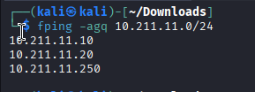
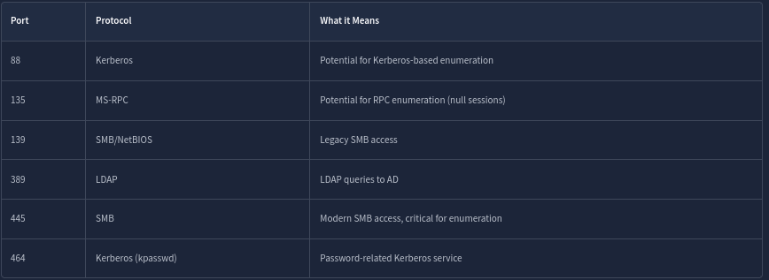

We've just been given VPN access to an Active Directory network. We don't have any credentials yet; only our attacking machine is equipped with the greatest and latest tools. Our goal is to discover the structure of the Active Directory environment, identify hosts and services, and map out the network. Let's imagine for a second that we don't have a nice network diagram, and are given the following subnet as part of our scope: `10.211.11.0/24`

## Host Discovery

One of the first things we can do is run a subnet host discovery scan. This will allow us to identify all live hosts in our target network range. Most clients will include a subnet range in the pentest scope, so we must discover all active hosts we might want to target. We will showcase two different tools that can be used for initial host discovery.

**fping**

Just like **ping**, **fping** uses Internet Control Message Protocol (ICMP) requests to determine if a host is live or not. However, with **fping**, we can specify any number of targets, including a subnet, making it more versatile than the **ping** command. Instead of sending a packet to one target until it replies or times out, **fping** will move to the next target after each request.

We can run the following command to discover live hosts in our target network:

- `-a`: shows systems that are alive.
- `-g`: generates a target list from a supplied IP netmask.
- `-q`: quiet mode, doesn't show per-probe results or ICMP error messages.
**Nmap**

We can also use Nmap in ping scan mode (`-sn`) to probe the entire subnet:

`nmap -sn 10.211.11.0/24`

- `-sn`: Ping scan to determine which hosts are up without port scanning.

## Port Scanning

Once we've discovered live hosts, we must identify which one is the Domain Controller (DC) to determine which critical AD-related services are being used and can be exploited. These are some common Active Directory ports and protocols:


We can run a service version scan with these specific ports to help identify the DC:

`nmap -p 88,135,139,389,445 -sV -sC -iL hosts.txt`

- `-sV`: This enables version detection. Nmap will try to determine the version of the services running on the open ports.
- `-sC`: Runs Nmap Scripting Engine (NSE) scripts in the default category.
- `-iL`: This tells Nmap to read the list of target hosts from the file `hosts.txt`. Each line in this file should contain a single IP address or hostname.

We can spot the Domain Controller because it will often have ports 88 (Kerberos), 389 (LDAP), and 445 (SMB) open, with banners like 'Windows Server' or even domain names revealed in the output of our nmap command.

If we were running a more exhaustive assessment or dealing with unfamiliar environments, starting with a full port scan ensures we don't miss critical services running on non-standard ports. We could use this command to scan for all open ports:

`nmap -sS -p- -T3 -iL hosts.txt -oN full_port_scan.txt`

- `-sS`: TCP SYN scan, which is stealthier than a full connect scan
- `-p-`: Scans all 65,535 TCP ports.
- `-T3`: Sets the timing template to "normal" to balance speed and stealth.
- `-iL hosts.txt`: Inputs the list of live hosts from the previous nmap command.
- `-oN full_port_scan.txt`: Outputs the results to a file.

Through these enumeration techniques, we have identified two live hosts in our target network, one DC and one Workstation, and the domain. We have also confirmed a couple of known services running on the DC, which we can target to further enumerate the domain.

```sh
nmap -A -T4 -sV -iL hosts.txt 
Starting Nmap 7.95 ( https://nmap.org ) at 2026-01-28 11:48 IST
Stats: 0:01:42 elapsed; 0 hosts completed (3 up), 3 undergoing Script Scan
NSE Timing: About 99.96% done; ETC: 11:50 (0:00:00 remaining)
Nmap scan report for 10.211.11.10
Host is up (0.18s latency).
Not shown: 986 closed tcp ports (reset)
PORT     STATE SERVICE       VERSION
22/tcp   open  ssh           OpenSSH for_Windows_7.7 (protocol 2.0)
| ssh-hostkey: 
|   2048 57:d9:ac:9e:bc:f9:27:c9:8a:7f:01:28:72:9f:05:7a (RSA)
|   256 bc:21:8a:c6:9f:71:dc:8f:b7:e9:6b:71:71:cd:eb:ef (ECDSA)
|_  256 76:ba:01:61:c4:69:5b:c4:d6:8a:dd:8d:c7:32:7b:f3 (ED25519)
53/tcp   open  domain        Simple DNS Plus
88/tcp   open  kerberos-sec  Microsoft Windows Kerberos (server time: 2026-01-28 06:19:35Z)
135/tcp  open  msrpc         Microsoft Windows RPC
139/tcp  open  netbios-ssn   Microsoft Windows netbios-ssn
389/tcp  open  ldap          Microsoft Windows Active Directory LDAP (Domain: tryhackme.loc0., Site: Default-First-Site-Name)
445/tcp  open  microsoft-ds  Windows Server 2019 Datacenter 17763 microsoft-ds (workgroup: TRYHACKME)
464/tcp  open  kpasswd5?
593/tcp  open  ncacn_http    Microsoft Windows RPC over HTTP 1.0
636/tcp  open  tcpwrapped
3268/tcp open  ldap          Microsoft Windows Active Directory LDAP (Domain: tryhackme.loc0., Site: Default-First-Site-Name)
3269/tcp open  tcpwrapped
3389/tcp open  ms-wbt-server Microsoft Terminal Services
|_ssl-date: 2026-01-28T06:20:43+00:00; +1s from scanner time.
| rdp-ntlm-info: 
|   Target_Name: TRYHACKME
|   NetBIOS_Domain_Name: TRYHACKME
|   NetBIOS_Computer_Name: DC
|   DNS_Domain_Name: tryhackme.loc
|   DNS_Computer_Name: DC.tryhackme.loc
|   DNS_Tree_Name: tryhackme.loc
|   Product_Version: 10.0.17763
|_  System_Time: 2026-01-28T06:20:05+00:00
| ssl-cert: Subject: commonName=DC.tryhackme.loc
| Not valid before: 2026-01-26T06:31:45
|_Not valid after:  2026-07-28T06:31:45
5985/tcp open  http          Microsoft HTTPAPI httpd 2.0 (SSDP/UPnP)
|_http-server-header: Microsoft-HTTPAPI/2.0
|_http-title: Not Found
No exact OS matches for host (If you know what OS is running on it, see https://nmap.org/submit/ ).
TCP/IP fingerprint:
OS:SCAN(V=7.95%E=4%D=1/28%OT=22%CT=1%CU=41890%PV=Y%DS=2%DC=T%G=Y%TM=6979AAC
OS:1%P=x86_64-pc-linux-gnu)SEQ(SP=100%GCD=1%ISR=10B%TI=I%CI=I%II=I%SS=S%TS=
OS:U)SEQ(SP=102%GCD=1%ISR=10E%TI=I%CI=I%II=I%SS=S%TS=U)SEQ(SP=103%GCD=1%ISR
OS:=107%TI=I%CI=I%II=I%SS=S%TS=U)SEQ(SP=105%GCD=1%ISR=10E%TI=I%CI=I%II=I%SS
OS:=S%TS=U)SEQ(SP=FE%GCD=1%ISR=105%TI=I%CI=I%II=I%SS=S%TS=U)OPS(O1=M509NW8N
OS:NS%O2=M509NW8NNS%O3=M509NW8%O4=M509NW8NNS%O5=M509NW8NNS%O6=M509NNS)WIN(W
OS:1=FFFF%W2=FFFF%W3=FFFF%W4=FFFF%W5=FFFF%W6=FF70)ECN(R=Y%DF=Y%T=80%W=FFFF%
OS:O=M509NW8NNS%CC=Y%Q=)T1(R=Y%DF=Y%T=80%S=O%A=S+%F=AS%RD=0%Q=)T2(R=Y%DF=Y%
OS:T=80%W=0%S=Z%A=S%F=AR%O=%RD=0%Q=)T3(R=Y%DF=Y%T=80%W=0%S=Z%A=O%F=AR%O=%RD
OS:=0%Q=)T4(R=Y%DF=Y%T=80%W=0%S=A%A=O%F=R%O=%RD=0%Q=)T5(R=Y%DF=Y%T=80%W=0%S
OS:=Z%A=S+%F=AR%O=%RD=0%Q=)T6(R=Y%DF=Y%T=80%W=0%S=A%A=O%F=R%O=%RD=0%Q=)T7(R
OS:=Y%DF=Y%T=80%W=0%S=Z%A=S+%F=AR%O=%RD=0%Q=)U1(R=Y%DF=N%T=80%IPL=164%UN=0%
OS:RIPL=G%RID=G%RIPCK=G%RUCK=G%RUD=G)IE(R=Y%DFI=N%T=80%CD=Z)

Network Distance: 2 hops
Service Info: Host: DC; OS: Windows; CPE: cpe:/o:microsoft:windows

Host script results:
| smb-os-discovery: 
|   OS: Windows Server 2019 Datacenter 17763 (Windows Server 2019 Datacenter 6.3)
|   Computer name: DC
|   NetBIOS computer name: DC\x00
|   Domain name: tryhackme.loc
|   Forest name: tryhackme.loc
|   FQDN: DC.tryhackme.loc
|_  System time: 2026-01-28T06:20:04+00:00
|_clock-skew: mean: 1s, deviation: 0s, median: 0s
| smb2-security-mode: 
|   3:1:1: 
|_    Message signing enabled and required
| smb-security-mode: 
|   account_used: <blank>
|   authentication_level: user
|   challenge_response: supported
|_  message_signing: required
| smb2-time: 
|   date: 2026-01-28T06:20:07
|_  start_date: N/A

TRACEROUTE (using port 1720/tcp)
HOP RTT       ADDRESS
1   193.87 ms 10.250.11.1
2   193.96 ms 10.211.11.10

Nmap scan report for 10.211.11.20
Host is up (0.18s latency).
Not shown: 995 filtered tcp ports (no-response)
PORT     STATE SERVICE       VERSION
22/tcp   open  ssh           OpenSSH for_Windows_7.7 (protocol 2.0)
| ssh-hostkey: 
|   2048 90:be:d9:8d:4d:6b:b9:3f:af:c5:4d:ed:3e:ec:3f:e4 (RSA)
|   256 84:e1:0c:8a:bf:bd:32:01:b9:10:0b:1c:82:8a:df:c9 (ECDSA)
|_  256 75:1c:46:be:b8:9e:6b:c1:66:51:39:1b:71:78:6a:a5 (ED25519)
135/tcp  open  msrpc         Microsoft Windows RPC
139/tcp  open  netbios-ssn   Microsoft Windows netbios-ssn
445/tcp  open  microsoft-ds?
3389/tcp open  ms-wbt-server Microsoft Terminal Services
| ssl-cert: Subject: commonName=WRK.tryhackme.loc
| Not valid before: 2026-01-26T06:32:33
|_Not valid after:  2026-07-28T06:32:33
| rdp-ntlm-info: 
|   Target_Name: TRYHACKME
|   NetBIOS_Domain_Name: TRYHACKME
|   NetBIOS_Computer_Name: WRK
|   DNS_Domain_Name: tryhackme.loc
|   DNS_Computer_Name: WRK.tryhackme.loc
|   Product_Version: 10.0.17763
|_  System_Time: 2026-01-28T06:20:04+00:00
|_ssl-date: 2026-01-28T06:20:43+00:00; +1s from scanner time.
Warning: OSScan results may be unreliable because we could not find at least 1 open and 1 closed port
Device type: general purpose
Running (JUST GUESSING): Microsoft Windows 2019|10 (95%)
OS CPE: cpe:/o:microsoft:windows_server_2019 cpe:/o:microsoft:windows_10
Aggressive OS guesses: Windows Server 2019 (95%), Microsoft Windows 10 1903 - 21H1 (91%)
No exact OS matches for host (test conditions non-ideal).
Network Distance: 2 hops
Service Info: OS: Windows; CPE: cpe:/o:microsoft:windows

Host script results:
| smb2-time: 
|   date: 2026-01-28T06:20:08
|_  start_date: N/A
| smb2-security-mode: 
|   3:1:1: 
|_    Message signing enabled but not required

TRACEROUTE (using port 139/tcp)
HOP RTT       ADDRESS
-   Hop 1 is the same as for 10.211.11.10
2   172.36 ms 10.211.11.20

Nmap scan report for 10.211.11.250
Host is up (0.18s latency).
Not shown: 999 closed tcp ports (reset)
PORT   STATE SERVICE VERSION
22/tcp open  ssh     OpenSSH 7.6p1 Ubuntu 4ubuntu0.5 (Ubuntu Linux; protocol 2.0)
| ssh-hostkey: 
|   2048 17:06:3b:ce:02:29:7c:a2:30:12:34:cb:8e:3c:7a:b1 (RSA)
|   256 ec:0f:a2:c2:ea:a0:58:ca:2a:31:08:96:ca:c7:9f:3a (ECDSA)
|_  256 87:5c:3f:3e:23:2e:eb:3e:d8:f4:6b:19:d3:ca:85:7c (ED25519)
Device type: general purpose
Running: Linux 4.X|5.X
OS CPE: cpe:/o:linux:linux_kernel:4 cpe:/o:linux:linux_kernel:5
OS details: Linux 4.15 - 5.19
Network Distance: 1 hop
Service Info: OS: Linux; CPE: cpe:/o:linux:linux_kernel

TRACEROUTE (using port 8888/tcp)
HOP RTT       ADDRESS
1   193.86 ms 10.211.11.250

Post-scan script results:
| clock-skew: 
|   1s: 
|     10.211.11.10
|_    10.211.11.20
OS and Service detection performed. Please report any incorrect results at https://nmap.org/submit/ .
Nmap done: 3 IP addresses (3 hosts up) scanned in 121.38 seconds
```
