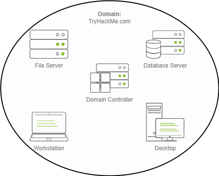

A Windows domain is a group of users and computers under the administration of a given business. The main idea behind a domain is to centralise the administration of common components of a Windows computer network in a single repository called Active Directory (AD). The server that runs the Active Directory services is known as a Domain Controller (DC).

The main advantages of having a configured Windows domain are:

- **Centralised identity management:** All users across the network can be configured from Active Directory with minimum effort.
- **Managing security policies:** You can configure security policies directly from Active Directory and apply them to users and computers across the network as needed.

The core of any Windows Domain is the **Active Directory Domain Service (AD DS)**. This service acts as a catalogue that holds the information of all of the "objects" that exist on your network. Amongst the many objects supported by AD, we have users, groups, machines, printers, shares and many others.

