# External Recon and Enumeration Principles

Before kicking off any pentest, it can be beneficial to perform `external reconnaissance` of your target. This can serve many different functions, such as:

- Validating information provided to you in the scoping document from the client
- Ensuring you are taking actions against the appropriate scope when working remotely
- Looking for any information that is publicly accessible that can affect the outcome of your test, such as leaked credentials

Think of it like this; we are trying to get the `lay of the land` to ensure we provide the most comprehensive test possible for our customer. That also means identifying any potential information leaks and breach data out in the world. This can be as simple as gleaning a username format from the customer's main website or social media. We may also dive as deep as scanning GitHub repositories for credentials left in code pushes, hunting in documents for links to an intranet or remotely accessible sites, and just looking for any information that can key us in on how the enterprise environment is configured.

---

## What Are We Looking For?

When conducting our external reconnaissance, there are several key items that we should be looking for. This information may not always be publicly accessible, but it would be prudent to see what is out there. If we get stuck during a penetration test, looking back at what could be obtained through passive recon can give us that nudge needed to move forward, such as password breach data that could be used to access a VPN or other externally facing service. The table below highlights the "`What`" in what we would be searching for during this phase of our engagement.

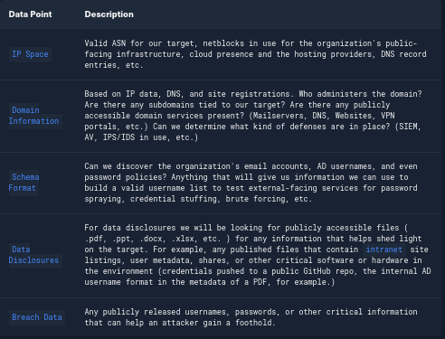

We have addressed the `why` and `what` of external reconnaissance; let's dive into the `where` and `how`.

---

## Where Are We Looking?

Our list of data points above can be gathered in many different ways. There are many different websites and tools that can provide us with some or all of the information above that we could use to obtain information vital to our assessment. The table below lists a few potential resources and examples that can be used.
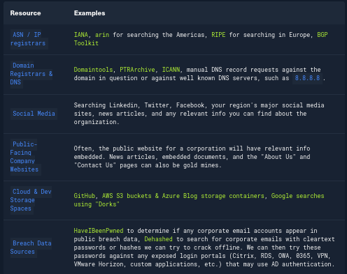

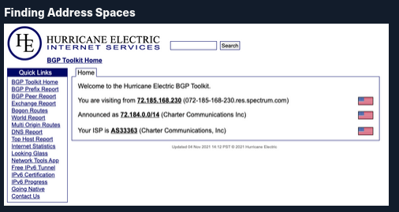

The `BGP-Toolkit` hosted by [Hurricane Electric](http://he.net/) is a fantastic resource for researching what address blocks are assigned to an organization and what ASN they reside within. Just punch in a domain or IP address, and the toolkit will search for any results it can. We can glean a lot from this info. Many large corporations will often self-host their infrastructure, and since they have such a large footprint, they will have their own ASN. This will typically not be the case for smaller organizations or fledgling companies. As you research, keep this in mind since smaller organizations will often host their websites and other infrastructure in someone else's space (Cloudflare, Google Cloud, AWS, or Azure, for example). Understanding where that infrastructure resides is extremely important for our testing. We have to ensure we are not interacting with infrastructure out of our scope. If we are not careful while pentesting against a smaller organization, we could end up inadvertently causing harm to another organization sharing that infrastructure. You have an agreement to test with the customer, not with others on the same server or with the provider. Questions around self-hosted or 3rd party managed infrastructure should be handled during the scoping process and be clearly listed in any scoping documents you receive.

In some cases, your client may need to get written approval from a third-party hosting provider before you can test. Others, such as AWS, have specific [guidelines](https://aws.amazon.com/security/penetration-testing/) for performing penetration tests and do not require prior approval for testing some of their services. Others, such as Oracle, ask you to submit a [Cloud Security Testing Notification](https://docs.oracle.com/en-us/iaas/Content/Security/Concepts/security_testing-policy_notification.htm). These types of steps should be handled by your company management, legal team, contracts team, etc. If you are in doubt, escalate before attacking any external-facing services you are unsure of during an assessment. It is our responsibility to ensure that we have explicit permission to attack any hosts (both internal and external), and stopping and clarifying the scope in writing never hurts.

### DNS

DNS is a great way to validate our scope and find out about reachable hosts the customer did not disclose in their scoping document. Sites like [domaintools](https://whois.domaintools.com/), and [viewdns.info](https://viewdns.info/) are great spots to start. We can get back many records and other data ranging from DNS resolution to testing for DNSSEC and if the site is accessible in more restricted countries. Sometimes we may find additional hosts out of scope, but look interesting. In that case, we could bring this list to our client to see if any of them should indeed be included in the scope. We may also find interesting subdomains that were not listed in the scoping documents, but reside on in-scope IP addresses and therefore are fair game
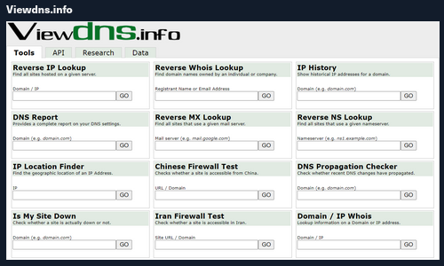

This is also a great way to validate some of the data found from our IP/ASN searches. Not all information about the domain found will be current, and running checks that can validate what we see is always good practice.

### Public Data

Social media can be a treasure trove of interesting data that can clue us in to how the organization is structured, what kind of equipment they operate, potential software and security implementations, their schema, and more. On top of that list are job-related sites like LinkedIn, Indeed.com, and Glassdoor. Simple job postings often reveal a lot about a company. For example, take a look at the job listing below. It's for a `SharePoint Administrator` and can key us in on many things. We can tell from the listing that the company has been using SharePoint for a while and has a mature program since they are talking about security programs, backup & disaster recovery, and more. What is interesting to us in this posting is that we can see the company likely uses SharePoint 2013 and SharePoint 2016. That means they may have upgraded in place, potentially leaving vulnerabilities in play that may not exist in newer versions. This also means we may run into different versions of SharePoint during our engagements.

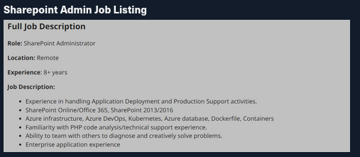

Don't discount public information such as job postings or social media. You can learn a lot about an organization just from what they post, and a well-intentioned post could disclose data relevant to us as penetration testers.

Websites hosted by the organization are also great places to dig for information. We can gather contact emails, phone numbers, organizational charts, published documents, etc. These sites, specifically the embedded documents, can often have links to internal infrastructure or intranet sites that you would not otherwise know about. Checking any publicly accessible information for those types of details can be quick wins when trying to formulate a picture of the domain structure. With the growing use of sites such as GitHub, AWS cloud storage, and other web-hosted platforms, data can also be leaked unintentionally. For example, a dev working on a project may accidentally leave some credentials or notes hardcoded into a code release. If you know where to look for that data, it can give you an easy win. It could mean the difference between having to password spray and brute-force credentials for hours or days or gaining a quick foothold with developer credentials, which may also have elevated permissions. Tools like [Trufflehog](https://github.com/trufflesecurity/truffleHog) and sites like [Greyhat Warfare](https://buckets.grayhatwarfare.com/) are fantastic resources for finding these breadcrumbs.

We have spent some time discussing external enumeration and recon of an organization, but this is just one piece of the puzzle. For a more detailed introduction to OSINT and external enumeration, check out the [Footprinting](https://academy.hackthebox.com/course/preview/footprinting) and [OSINT:Corporate Recon](https://academy.hackthebox.com/course/preview/osint-corporate-recon) modules.

Up to this point, we have been mostly passive in our discussions. As you move forward into the pentest, you will become more hands-on, validating the information you have found and probing the domain for more information. Let's take a minute to discuss enumeration principles and how we can put a process in place to perform these actions.

---

## Overarching Enumeration Principles

Keeping in mind that our goal is to understand our target better, we are looking for every possible avenue we can find that will provide us with a potential route to the inside. Enumeration itself is an iterative process we will repeat several times throughout a penetration test. Besides the customer's scoping document, this is our primary source of information, so we want to ensure we are leaving no stone unturned. When starting our enumeration, we will first use `passive` resources, starting wide in scope and narrowing down. Once we exhaust our initial run of passive enumeration, we will need to examine the results and then move into our active enumeration phase.

---

## Example Enumeration Process

We have already covered quite a few concepts pertaining to enumeration. Let's start putting it all together. We will practice our enumeration tactics on the `inlanefreight.com` domain without performing any heavy scans (such as Nmap or vulnerability scans which are out of scope). We will start first by checking our Netblocks data and seeing what we can find.
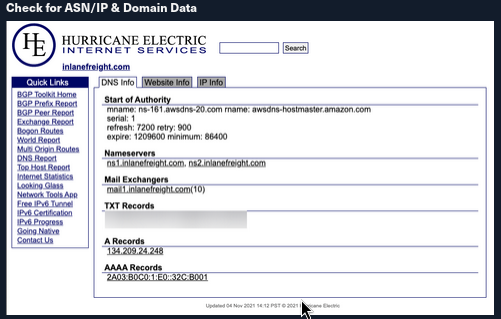

From this first look, we have already gleaned some interesting info. BGP.he is reporting:

- IP Address: 134.209.24.248
- Mail Server: mail1.inlanefreight.com
- Nameservers: NS1.inlanefreight.com & NS2.inlanefreight.com

For now, this is what we care about from its output. Inlanefreight is not a large corporation, so we didn't expect to find that it had its own ASN. Now let's validate some of this information.
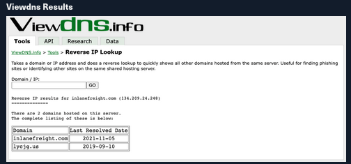

In the request above, we utilized `viewdns.info` to validate the IP address of our target. Both results match, which is a good sign. Now let's try another route to validate the two nameservers in our results.

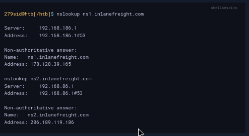

We now have `two` new IP addresses to add to our list for validation and testing. Before taking any further action with them, ensure they are in-scope for your test. For our purposes, the actual IP addresses would not be in scope for scanning, but we could passively browse any websites to hunt for interesting data. For now, that is it with enumerating domain information from DNS. Let's take a look at the publicly available information.

Inlanefreight is a fictitious company that we are using for this module, so there is no real social media presence. However, we would check sites like LinkedIn, Twitter, Instagram, and Facebook for helpful info if it were real. Instead, we will move on to examining the website `inlanefreight.com`.

The first check we ran was looking for any documents. Using `filetype:pdf inurl:inlanefreight.com` as a search, we are looking for PDFs.

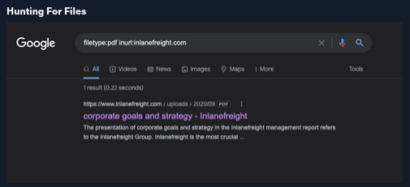

One document popped up, so we need to ensure we note the document and its location and download a copy locally to dig through. It is always best to save files, screenshots, scan output, tool output, etc., as soon as we come across them or generate them. This helps us keep as comprehensive a record as possible and not risk forgetting where we saw something or losing critical data. Next, let's look for any email addresses we can find.

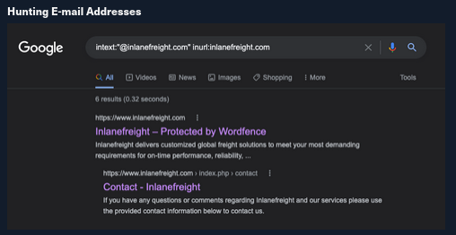

Using the dork `intext:"@inlanefreight.com" inurl:inlanefreight.com`, we are looking for any instance that appears similar to the end of an email address on the website. One promising result came up with a contact page. When we look at the page (pictured below), we can see a large list of employees and contact info for them. This information can be helpful since we can determine that these people are at least most likely active and still working with the company.

#### E-mail Dork Results

Browsing the [contact page](https://www.inlanefreight.com/index.php/contact/), we can see several emails for staff in different offices around the globe. We now have an idea of their email naming convention (first.last) and where some people work in the organization. This could be handy in later password spraying attacks or if social engineering/phishing were part of our engagement scope.

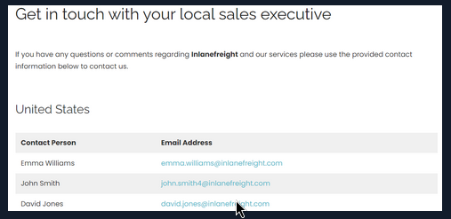

#### Username Harvesting

We can use a tool such as [linkedin2username](https://github.com/initstring/linkedin2username) to scrape data from a company's LinkedIn page and create various mashups of usernames (flast, first.last, f.last, etc.) that can be added to our list of potential password spraying targets.

#### Credential Hunting

[Dehashed](http://dehashed.com/) is an excellent tool for hunting for cleartext credentials and password hashes in breach data. We can search either on the site or using a script that performs queries via the API. Typically we will find many old passwords for users that do not work on externally-facing portals that use AD auth (or internal), but we may get lucky! This is another tool that can be useful for creating a user list for external or internal password spraying.

Note: For our purposes, the sample data below is fictional.

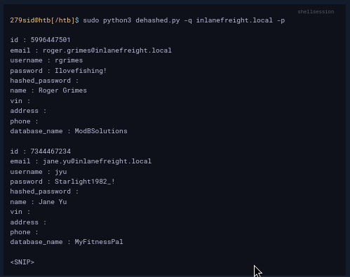

Now that we have a hang of this try your hand at searching for other results related to the inlanefreight.com domain. What can you find? Are there any other useful files, pages, or information embedded on the site? This section demonstrated the importance of thoroughly analyzing our target, provided that we stay in scope and do not test anything we are not authorized to and stay within the time constraints of the engagement. I have had quite a few assessments where I was having trouble gaining a foothold from an anonymous standpoint on the internal network and resorted to creating a wordlist using varying outside sources (Google, LinkedIn scraping, Dehashed, etc.) and then performed targeted internal password spraying to get valid credentials for a standard domain user account. As we will see in the following sections, we can perform the vast majority of our internal AD enumeration with just a set of low-privilege domain user credentials and even many attacks. The fun starts once we have a set of credentials. Let's move into internal enumeration and begin analyzing the internal `INLANEFREIGHT.LOCAL` domain passively and actively per our assessment's scope and rules of engagement.

# Initial Enumeration of the Domain

---

We are at the very beginning of our AD-focused penetration test against Inlanefreight. We have done some basic information gathering and gotten a picture of what to expect from the customer via the scoping documents.

---

## Setting Up

For this first portion of the test, we are starting on an attack host placed inside the network for us. This is one common way that a client might select for us to perform an internal penetration test. A list of the types of setups a client may choose for testing includes:

- A penetration testing distro (typically Linux) as a virtual machine in their internal infrastructure that calls back to a jump host we control over VPN, and we can SSH into.
- A physical device plugged into an ethernet port that calls back to us over VPN, and we can SSH into.
- A physical presence at their office with our laptop plugged into an ethernet port.
- A Linux VM in either Azure or AWS with access to the internal network that we can SSH into using public key authentication and our public IP address whitelisted.
- VPN access into their internal network (a bit limiting because we will not be able to perform certain attacks such as LLMNR/NBT-NS Poisoning).
- From a corporate laptop connected to the client's VPN.
- On a managed workstation (typically Windows), physically sitting in their office with limited or no internet access or ability to pull in tools. They may also elect this option but give you full internet access, local admin, and put endpoint protection into monitor mode so you can pull in tools at will.
- On a VDI (virtual desktop) accessed using Citrix or the like, with one of the configurations described for the managed workstation typically accessible over VPN either remotely or from a corporate laptop.

These are the most common setups I have seen, though a client may come up with another variation of one of these. The client may also choose from a "grey box" approach where they give us just a list of in-scope IP addresses/CIDR network ranges, or "black box" where we have to plug in and do all discovery blindly using various techniques. Finally, they can choose either evasive, non-evasive, or hybrid evasive (starting "quiet" and slowly getting louder to see what threshold we are detected at and then switching to non-evasive testing. They may also elect to have us start with no credentials or from the perspective of a standard domain user.

Our customer Inlanefreight has chosen the following approach because they are looking for as comprehensive an assessment as possible. At this time, their security program is not mature enough to benefit from any form of evasive testing or a "black box" approach.

- A custom pentest VM within their internal network that calls back to our jump host, and we can SSH into it to perform testing.
- They've also given us a Windows host that we can load tools onto if need be.
- They've asked us to start from an unauthenticated standpoint but have also given us a standard domain user account (`htb-student`) which can be used to access the Windows attack host.
- "Grey box" testing. They have given us the network range 172.16.5.0/23 and no other information about the network.
- Non-evasive testing.

We have not been provided credentials or a detailed internal network map.

---

## Tasks

Our tasks to accomplish for this section are:

- Enumerate the internal network, identifying hosts, critical services, and potential avenues for a foothold.
- This can include active and passive measures to identify users, hosts, and vulnerabilities we may be able to take advantage of to further our access.
- Document any findings we come across for later use. Extremely important!

We will start from our Linux attack host without domain user credentials. It's a common thing to start a pentest off in this manner. Many organizations will wish to see what you can do from a blind perspective, such as this, before providing you with further information for the test. It gives a more realistic look at what potential avenues an adversary would have to use to infiltrate the domain. It can help them see what an attacker could do if they gain unauthorized access via the internet (i.e., a phishing attack), physical access to the building, wireless access from outside (if the wireless network touches the AD environment), or even a rogue employee. Depending on the success of this phase, the customer may provide us with access to a domain-joined host or a set of credentials for the network to expedite testing and allow us to cover as much ground as possible.

Below are some of the key data points that we should be looking for at this time and noting down into our notetaking tool of choice and saving scan/tool output to files whenever possible.

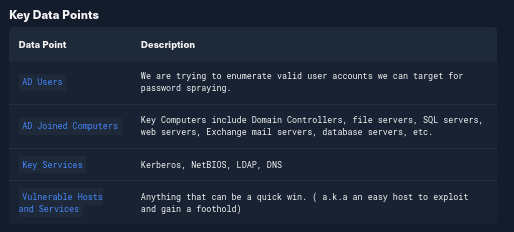

## TTPs

Enumerating an AD environment can be overwhelming if just approached without a plan. There is an abundance of data stored in AD, and it can take a long time to sift if not looked at in progressive stages, and we will likely miss things. We need to set a game plan for ourselves and tackle it piece by piece. Everyone works in slightly different ways, so as we gain more experience, we'll start to develop our own repeatable methodology that works best for us. Regardless of how we proceed, we typically start in the same place and look for the same data points. We will experiment with many tools in this section and subsequent ones. It is important to reproduce every example and even try to recreate examples with different tools to see how they work differently, learn their syntax, and find what approach works best for us.

We will start with `passive` identification of any hosts in the network, followed by `active` validation of the results to find out more about each host (what services are running, names, potential vulnerabilities, etc.). Once we know what hosts exist, we can proceed with probing those hosts, looking for any interesting data we can glean from them. After we have accomplished these tasks, we should stop and regroup and look at what info we have. At this time, we'll hopefully have a set of credentials or a user account to target for a foothold onto a domain-joined host or have the ability to begin credentialed enumeration from our Linux attack host.

Let's look at a few tools and techniques to help us with this enumeration.

### Identifying Hosts

First, let's take some time to listen to the network and see what's going on. We can use `Wireshark` and `TCPDump` to "put our ear to the wire" and see what hosts and types of network traffic we can capture. This is particularly helpful if the assessment approach is "black box." We notice some [ARP](https://en.wikipedia.org/wiki/Address_Resolution_Protocol) requests and replies, [MDNS](https://en.wikipedia.org/wiki/Multicast_DNS), and other basic [layer two](https://www.juniper.net/documentation/us/en/software/junos/multicast-l2/topics/topic-map/layer-2-understanding.html) packets (since we are on a switched network, we are limited to the current broadcast domain) some of which we can see below. This is a great start that gives us a few bits of information about the customer's network setup.

Scroll to the bottom, spawn the target, connect to the Linux attack host using `xfreerdp` and fire up Wireshark to begin capturing traffic.

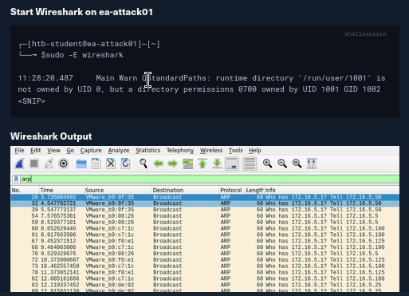
ARP packets make us aware of the hosts: 172.16.5.5, 172.16.5.25 172.16.5.50, 172.16.5.100, and 172.16.5.125.

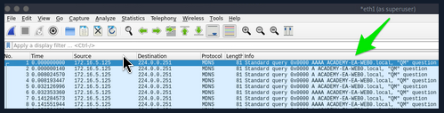
- MDNS makes us aware of the ACADEMY-EA-WEB01 host.
If we are on a host without a GUI (which is typical), we can use [tcpdump](https://linux.die.net/man/8/tcpdump), [net-creds](https://github.com/DanMcInerney/net-creds), and [NetMiner](https://www.netminer.com/en/product/netminer.php), etc., to perform the same functions. We can also use tcpdump to save a capture to a .pcap file, transfer it to another host, and open it in Wireshark.

```sh
sudo tcpdump -i ens224
```
There is no one right way to listen and capture network traffic. There are plenty of tools that can process network data. Wireshark and tcpdump are just a few of the easiest to use and most widely known. Depending on the host you are on, you may already have a network monitoring tool built-in, such as `pktmon.exe`, which was added to all editions of Windows 10. As a note for testing, it's always a good idea to save the PCAP traffic you capture. You can review it again later to look for more hints, and it makes for great additional information to include while writing your reports.

Our first look at network traffic pointed us to a couple of hosts via `MDNS` and `ARP`. Now let's utilize a tool called `Responder` to analyze network traffic and determine if anything else in the domain pops up.

[Responder](https://github.com/lgandx/Responder-Windows) is a tool built to listen, analyze, and poison `LLMNR`, `NBT-NS`, and `MDNS` requests and responses. It has many more functions, but for now, all we are utilizing is the tool in its Analyze mode. This will passively listen to the network and not send any poisoned packets. We'll cover this tool more in-depth in later sections.

```sh
sudo responder -I ens224 -A
```

As we start Responder with passive analysis mode enabled, we will see requests flow in our session. Notice below that we found a few unique hosts not previously mentioned in our Wireshark captures. It's worth noting these down as we are starting to build a nice target list of IPs and DNS hostnames.

Our passive checks have given us a few hosts to note down for a more in-depth enumeration. Now let's perform some active checks starting with a quick ICMP sweep of the subnet using `fping`.

[Fping](https://fping.org/) provides us with a similar capability as the standard ping application in that it utilizes ICMP requests and replies to reach out and interact with a host. Where fping shines is in its ability to issue ICMP packets against a list of multiple hosts at once and its scriptability. Also, it works in a round-robin fashion, querying hosts in a cyclical manner instead of waiting for multiple requests to a single host to return before moving on. These checks will help us determine if anything else is active on the internal network. ICMP is not a one-stop-shop, but it is an easy way to get an initial idea of what exists. Other open ports and active protocols may point to new hosts for later targeting. Let's see it in action.

#### FPing Active Checks

Here we'll start `fping` with a few flags: `a` to show targets that are alive, `s` to print stats at the end of the scan, `g` to generate a target list from the CIDR network, and `q` to not show per-target results.

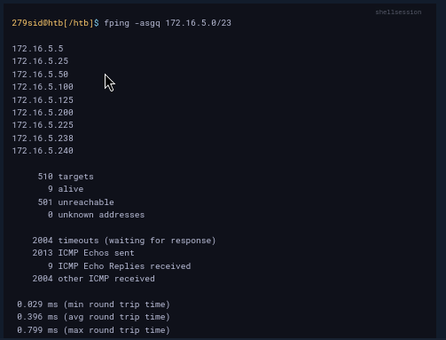

The command above validates which hosts are active in the `/23` network and does it quietly instead of spamming the terminal with results for each IP in the target list. We can combine the successful results and the information we gleaned from our passive checks into a list for a more detailed scan with Nmap. From the `fping` command, we can see 9 "live hosts," including our attack host.

Note: Scan results in the target network will differ from the command output in this section due to the size of the lab network. It is still worth reproducing each example to practice how these tools work and note down every host that is live in this lab.

#### Nmap Scanning

Now that we have a list of active hosts within our network, we can enumerate those hosts further. We are looking to determine what services each host is running, identify critical hosts such as `Domain Controllers` and `web servers`, and identify potentially vulnerable hosts to probe later. With our focus on AD, after doing a broad sweep, it would be wise of us to focus on standard protocols typically seen accompanying AD services, such as DNS, SMB, LDAP, and Kerberos name a few. Below is a quick example of a simple Nmap scan.
```sh
sudo nmap -v -A -iL hosts.txt -oN /home/htb-student/Documents/host-enum
```
The [-A (Aggressive scan options)](https://nmap.org/book/man-misc-options.html) scan will perform several functions. One of the most important is a quick enumeration of well-known ports to include web services, domain services, etc. For our hosts.txt file, some of our results from Responder and fping overlapped (we found the name and IP address), so to keep it simple, just the IP address was fed into hosts.txt for the scan.

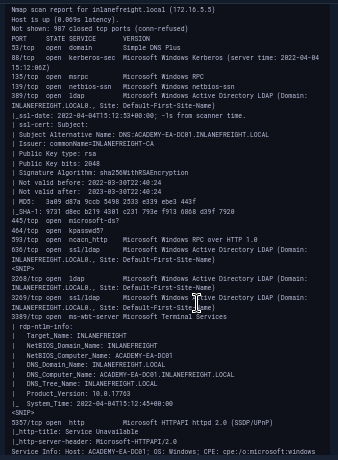

Our scans have provided us with the naming standard used by NetBIOS and DNS, we can see some hosts have RDP open, and they have pointed us in the direction of the primary `Domain Controller` for the INLANEFREIGHT.LOCAL domain (ACADEMY-EA-DC01.INLANEFREIGHT.LOCAL). The results below show some interesting results surrounding a possibly outdated host (not in our current lab).

We can see from the output above that we have a potential host running an outdated operating system ( Windows 7, 8, or Server 2008 based on the output). This is of interest to us since it means there are legacy operating systems running in this AD environment. It also means there is potential for older exploits like EternalBlue, MS08-067, and others to work and provide us with a SYSTEM level shell. As weird as it sounds to have hosts running legacy software or end-of-life operating systems, it is still common in large enterprise environments. You will often have some process or equipment such as a production line or the HVAC built on the older OS and has been in place for a long time. Taking equipment like that offline is costly and can hurt an organization, so legacy hosts are often left in place. They will likely try to build a hard outer shell of Firewalls, IDS/IPS, and other monitoring and protection solutions around those systems. If you can find your way into one, it is a big deal and can be a quick and easy foothold. Before exploiting legacy systems, however, we should alert our client and get their approval in writing in case an attack results in system instability or brings a service or the host down. They may prefer that we just observe, report, and move on without actively exploiting the system.

The results of these scans will clue us into where we will start looking for potential domain enumeration avenues, not just host scanning. We need to find our way to a domain user account. Looking at our results, we found several servers that host domain services ( DC01, MX01, WS01, etc.). Now that we know what exists and what services are running, we can poll those servers and attempt to enumerate users. Be sure to use the `-oA` flag as a best practice when performing Nmap scans. This will ensure that we have our scan results in several formats for logging purposes and formats that can be manipulated and fed into other tools.

We need to be aware of what scans we run and how they work. Some of the Nmap scripted scans run active vulnerability checks against a host that could cause system instability or take it offline, causing issues for the customer or worse. For example, running a large discovery scan against a network with devices such as sensors or logic controllers could potentially overload them and disrupt the customer's industrial equipment causing a loss of product or capability. Take the time to understand the scans you use before running them in a customer's environment.

We will most likely return to these results later for further enumeration, so don't forget about them. We need to find our way to a domain user account or `SYSTEM` level access on a domain-joined host so we can gain a foothold and start the real fun. Let's dive into finding a user account.

## Identifying Users

If our client does not provide us with a user to start testing with (which is often the case), we will need to find a way to establish a foothold in the domain by either obtaining clear text credentials or an NTLM password hash for a user, a SYSTEM shell on a domain-joined host, or a shell in the context of a domain user account. Obtaining a valid user with credentials is critical in the early stages of an internal penetration test. This access (even at the lowest level) opens up many opportunities to perform enumeration and even attacks. Let's look at one way we can start gathering a list of valid users in a domain to use later in our assessment.

### Kerbrute - Internal AD Username Enumeration

[Kerbrute](https://github.com/ropnop/kerbrute) can be a stealthier option for domain account enumeration. It takes advantage of the fact that Kerberos pre-authentication failures often will not trigger logs or alerts. We will use Kerbrute in conjunction with the `jsmith.txt` or `jsmith2.txt` user lists from [Insidetrust](https://github.com/insidetrust/statistically-likely-usernames). This repository contains many different user lists that can be extremely useful when attempting to enumerate users when starting from an unauthenticated perspective. We can point Kerbrute at the DC we found earlier and feed it a wordlist. The tool is quick, and we will be provided with results letting us know if the accounts found are valid or not, which is a great starting point for launching attacks such as password spraying, which we will cover in-depth later in this module.

To get started with Kerbrute, we can download [precompiled binaries](https://github.com/ropnop/kerbrute/releases/latest) for the tool for testing from Linux, Windows, and Mac, or we can compile it ourselves. This is generally the best practice for any tool we introduce into a client environment. To compile the binaries to use on the system of our choosing, we first clone the repo:

#### Cloning Kerbrute GitHub Repo
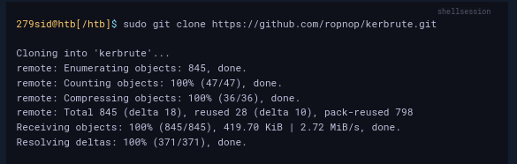

Typing `make help` will show us the compiling options available.

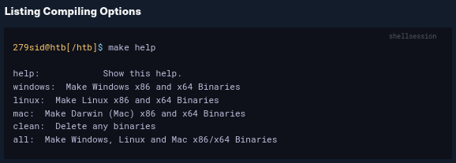
We can choose to compile just one binary or type `make all` and compile one each for use on Linux, Windows, and Mac systems (an x86 and x64 version for each).

#### Compiling for Multiple Platforms and Architectures

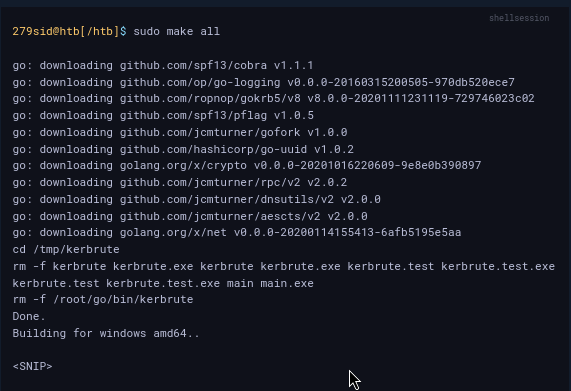

The newly created `dist` directory will contain our compiled binaries.

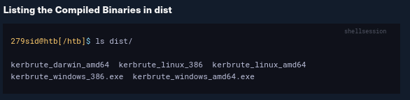

We can then test out the binary to make sure it works properly. We will be using the x64 version on the supplied Parrot Linux attack host in the target environment.

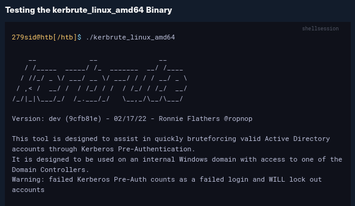

We can add the tool to our PATH to make it easily accessible from anywhere on the host.

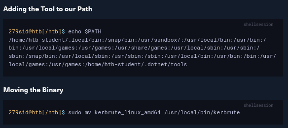

We can now type `kerbrute` from any location on the system and will be able to access the tool. Feel free to follow along on your system and practice the above steps. Now let's run through an example of using the tool to gather an initial username list.


We can see from our output that we validated 56 users in the INLANEFREIGHT.LOCAL domain and it took only a few seconds to do so. Now we can take these results and build a list for use in targeted password spraying attacks.

---

## Identifying Potential Vulnerabilities

The [local system](https://docs.microsoft.com/en-us/windows/win32/services/localsystem-account) account `NT AUTHORITY\SYSTEM` is a built-in account in Windows operating systems. It has the highest level of access in the OS and is used to run most Windows services. It is also very common for third-party services to run in the context of this account by default. A `SYSTEM` account on a `domain-joined` host will be able to enumerate Active Directory by impersonating the computer account, which is essentially just another kind of user account. Having SYSTEM-level access within a domain environment is nearly equivalent to having a domain user account.

There are several ways to gain SYSTEM-level access on a host, including but not limited to:

- Remote Windows exploits such as MS08-067, EternalBlue, or BlueKeep.
- Abusing a service running in the context of the `SYSTEM account`, or abusing the service account `SeImpersonate` privileges using [Juicy Potato](https://github.com/ohpe/juicy-potato). This type of attack is possible on older Windows OS' but not always possible with Windows Server 2019.
- Local privilege escalation flaws in Windows operating systems such as the Windows 10 Task Scheduler 0-day.
- Gaining admin access on a domain-joined host with a local account and using Psexec to launch a SYSTEM cmd window

By gaining SYSTEM-level access on a domain-joined host, you will be able to perform actions such as, but not limited to:

- Enumerate the domain using built-in tools or offensive tools such as BloodHound and PowerView.
- Perform Kerberoasting / ASREPRoasting attacks within the same domain.
- Run tools such as Inveigh to gather Net-NTLMv2 hashes or perform SMB relay attacks.
- Perform token impersonation to hijack a privileged domain user account.
- Carry out ACL attacks.

---

## A Word Of Caution

Keep the scope and style of the test in mind when choosing a tool for use. If you are performing a non-evasive penetration test, with everything out in the open and the customer's staff knowing you are there, it doesn't typically matter how much noise you make. However, during an evasive penetration test, adversarial assessment, or red team engagement, you are trying to mimic a potential attacker's Tools, Tactics, and Procedures. With that in mind, `stealth` is of concern. Throwing Nmap at an entire network is not exactly quiet, and many of the tools we commonly use on a penetration test will trigger alarms for an educated and prepared SOC or Blue Teamer. Always be sure to clarify the goal of your assessment with the client in writing before it begins.

---

## Let's Find a User

In the following few sections, we will hunt for a domain user account using techniques such as LLMNR/NBT-NS Poisoning and password spraying. These attacks are great ways to gain a foothold but must be exercised with caution and an understanding of the tools and techniques. Now let's hunt down a user account so we can move on to the next phase of our assessment and start picking apart the domain piece by piece and digging deep for a multitude of misconfigurations and flaws.
