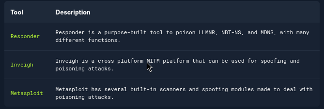
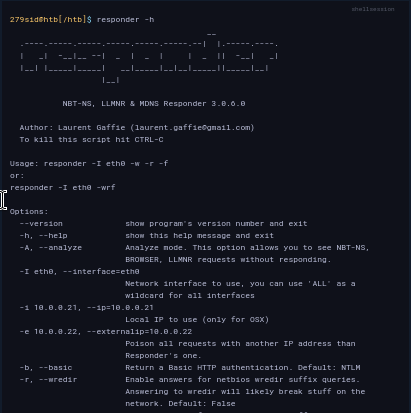
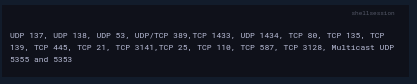
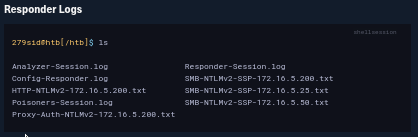
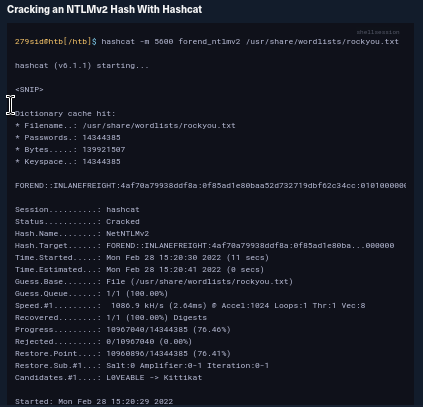
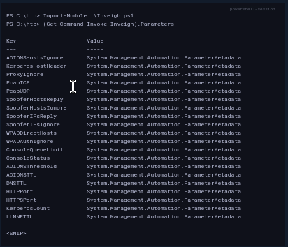
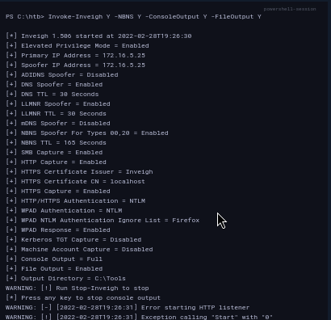
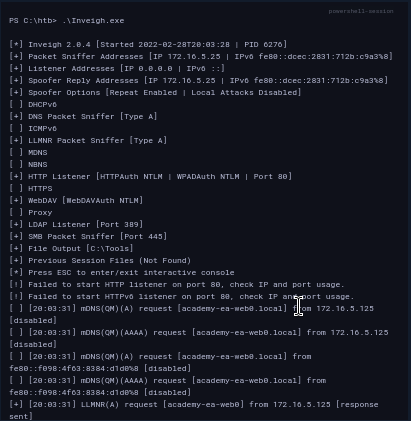

# LLMNR/NBT-NS Poisoning - from Linux

---

At this point, we have completed our initial enumeration of the domain. We obtained some basic user and group information, enumerated hosts while looking for critical services and roles like a Domain Controller, and figured out some specifics such as the naming scheme used for the domain. In this phase, we will work through two different techniques side-by-side: network poisoning and password spraying. We will perform these actions with the goal of acquiring valid cleartext credentials for a domain user account, thereby granting us a foothold in the domain to begin the next phase of enumeration from a credentialed standpoint.

This section and the next will cover a common way to gather credentials and gain an initial foothold during an assessment: a Man-in-the-Middle attack on Link-Local Multicast Name Resolution (LLMNR) and NetBIOS Name Service (NBT-NS) broadcasts. Depending on the network, this attack may provide low-privileged or administrative level password hashes that can be cracked offline or even cleartext credentials. Though not covered in this module, these hashes can also sometimes be used to perform an SMB Relay attack to authenticate to a host or multiple hosts in the domain with administrative privileges without having to crack the password hash offline. Let's dive in!

---

## LLMNR & NBT-NS Primer

[Link-Local Multicast Name Resolution](https://datatracker.ietf.org/doc/html/rfc4795) (LLMNR) and [NetBIOS Name Service](https://docs.microsoft.com/en-us/previous-versions/windows/it-pro/windows-2000-server/cc940063\(v=technet.10\)?redirectedfrom=MSDN) (NBT-NS) are Microsoft Windows components that serve as alternate methods of host identification that can be used when DNS fails. If a machine attempts to resolve a host but DNS resolution fails, typically, the machine will try to ask all other machines on the local network for the correct host address via LLMNR. LLMNR is based upon the Domain Name System (DNS) format and allows hosts on the same local link to perform name resolution for other hosts. It uses port `5355` over UDP natively. If LLMNR fails, the NBT-NS will be used. NBT-NS identifies systems on a local network by their NetBIOS name. NBT-NS utilizes port `137` over UDP.

The kicker here is that when LLMNR/NBT-NS are used for name resolution, ANY host on the network can reply. This is where we come in with `Responder` to poison these requests. With network access, we can spoof an authoritative name resolution source ( in this case, a host that's supposed to belong in the network segment ) in the broadcast domain by responding to LLMNR and NBT-NS traffic as if they have an answer for the requesting host. This poisoning effort is done to get the victims to communicate with our system by pretending that our rogue system knows the location of the requested host. If the requested host requires name resolution or authentication actions, we can capture the NetNTLM hash and subject it to an offline brute force attack in an attempt to retrieve the cleartext password. The captured authentication request can also be relayed to access another host or used against a different protocol (such as LDAP) on the same host. LLMNR/NBNS spoofing combined with a lack of SMB signing can often lead to administrative access on hosts within a domain. SMB Relay attacks will be covered in a later module about Lateral Movement.

---

## Quick Example - LLMNR/NBT-NS Poisoning

Let's walk through a quick example of the attack flow at a very high level:

1. A host attempts to connect to the print server at \\print01.inlanefreight.local, but accidentally types in \\printer01.inlanefreight.local.
2. The DNS server responds, stating that this host is unknown.
3. The host then broadcasts out to the entire local network asking if anyone knows the location of \\printer01.inlanefreight.local.
4. The attacker (us with `Responder` running) responds to the host stating that it is the \\printer01.inlanefreight.local that the host is looking for.
5. The host believes this reply and sends an authentication request to the attacker with a username and NTLMv2 password hash.
6. This hash can then be cracked offline or used in an SMB Relay attack if the right conditions exist.

---

## TTPs

We are performing these actions to collect authentication information sent over the network in the form of NTLMv1 and NTLMv2 password hashes. As discussed in the [Introduction to Active Directory](https://academy.hackthebox.com/course/preview/introduction-to-active-directory) module, NTLMv1 and NTLMv2 are authentication protocols that utilize the LM or NT hash. We will then take the hash and attempt to crack them offline using tools such as [Hashcat](https://hashcat.net/hashcat/) or [John](https://www.openwall.com/john/) with the goal of obtaining the account's cleartext password to be used to gain an initial foothold or expand our access within the domain if we capture a password hash for an account with more privileges than an account that we currently possess.

Several tools can be used to attempt LLMNR & NBT-NS poisoning:



This section and the following one will show examples of using Responder and Inveigh to capture password hashes and attempt to crack them offline. We commonly start an internal penetration test from an anonymous position on the client's internal network with a Linux attack host. Tools such as Responder are great for establishing a foothold that we can later expand upon through further enumeration and attacks. Responder is written in Python and typically used on a Linux attack host, though there is a .exe version that works on Windows. Inveigh is written in both C# and PowerShell (considered legacy). Both tools can be used to attack the following protocols:

- LLMNR
- DNS
- MDNS
- NBNS
- DHCP
- ICMP
- HTTP
- HTTPS
- SMB
- LDAP
- WebDAV
- Proxy Auth

Responder also has support for:

- MSSQL
- DCE-RPC
- FTP, POP3, IMAP, and SMTP auth

---

### Responder In Action

Responder is a relatively straightforward tool, but is extremely powerful and has many different functions. In the `Initial Enumeration` section earlier, we utilized Responder in Analysis (passive) mode. This means it listened for any resolution requests, but did not answer them or send out poisoned packets. We were acting like a fly on the wall, just listening. Now, we will take things a step further and let Responder do what it does best. Let's look at some options available by typing `responder -h` into our console.

As shown earlier in the module, the `-A` flag puts us into analyze mode, allowing us to see NBT-NS, BROWSER, and LLMNR requests in the environment without poisoning any responses. We must always supply either an interface or an IP. Some common options we'll typically want to use are `-wf`; this will start the WPAD rogue proxy server, while `-f` will attempt to fingerprint the remote host operating system and version. We can use the `-v` flag for increased verbosity if we are running into issues, but this will lead to a lot of additional data printed to the console. Other options such as `-F` and `-P` can be used to force NTLM or Basic authentication and force proxy authentication, but may cause a login prompt, so they should be used sparingly. The use of the `-w` flag utilizes the built-in WPAD proxy server. This can be highly effective, especially in large organizations, because it will capture all HTTP requests by any users that launch Internet Explorer if the browser has [Auto-detect settings](https://docs.microsoft.com/en-us/internet-explorer/ie11-deploy-guide/auto-detect-settings-for-ie11) enabled.

With this configuration shown above, Responder will listen and answer any requests it sees on the wire. If you are successful and manage to capture a hash, Responder will print it out on screen and write it to a log file per host located in the `/usr/share/responder/logs` directory. Hashes are saved in the format `(MODULE_NAME)-(HASH_TYPE)-(CLIENT_IP).txt`, and one hash is printed to the console and stored in its associated log file unless `-v` mode is enabled. For example, a log file may look like `SMB-NTLMv2-SSP-172.16.5.25`. Hashes are also stored in a SQLite database that can be configured in the `Responder.conf` config file, typically located in `/usr/share/responder` unless we clone the Responder repo directly from GitHub.

We must run the tool with sudo privileges or as root and make sure the following ports are available on our attack host for it to function best:



Any of the rogue servers (i.e., SMB) can be disabled in the `Responder.conf` file.



If Responder successfully captured hashes, as seen above, we can find the hashes associated with each host/protocol in their own text file. The animation below shows us an example of Responder running and capturing hashes on the network.

We can kick off a Responder session rather quickly:

#### Starting Responder with Default Settings
```sh
sudo responder -I ens224
```

Typically we should start Responder and let it run for a while in a tmux window while we perform other enumeration tasks to maximize the number of hashes that we can obtain. Once we are ready, we can pass these hashes to Hashcat using hash mode `5600` for NTLMv2 hashes that we typically obtain with Responder. We may at times obtain NTLMv1 hashes and other types of hashes and can consult the [Hashcat example hashes](https://hashcat.net/wiki/doku.php?id=example_hashes) page to identify them and find the proper hash mode. If we ever obtain a strange or unknown hash, this site is a great reference to help identify it. Check out the [Cracking Passwords With Hashcat](https://academy.hackthebox.com/course/preview/cracking-passwords-with-hashcat) module for an in-depth study of Hashcat's various modes and how to attack a wide variety of hash types.

Once we have enough, we need to get these hashes into a usable format for us right now. NetNTLMv2 hashes are very useful once cracked, but cannot be used for techniques such as pass-the-hash, meaning we have to attempt to crack them offline. We can do this with tools such as Hashcat and John.



Looking at the results above, we can see we cracked the NET-NTLMv2 hash for user `FOREND`, whose password is `Klmcargo2`. Lucky for us our target domain allows weak 8-character passwords. This hash type can be "slow" to crack even on a GPU cracking rig, so large and complex passwords may be more difficult or impossible to crack within a reasonable amount of time.

---

## Moving On

At this point in our assessment, we have obtained and cracked one NetNTLMv2 hash for the user `FOREND`. We can use this as a foothold into the domain to begin further enumeration. It is best to collect as much data as possible during an assessment, so we should attempt to crack as many hashes as we can (provided our later enumeration shows the value in cracking them to further our access). We don't want to waste precious assessment time attempting to crack hashes for users that will not help us move further toward our goal. Before we move into other ways to obtain a foothold via password spraying, let's walk through a similar method for obtaining hashes from a Windows host using the Inveigh tool.

# LLMNR/NBT-NS Poisoning - from Windows

LLMNR & NBT-NS poisoning is possible from a Windows host as well. In the last section, we utilized Responder to capture hashes. This section will explore the tool [Inveigh](https://github.com/Kevin-Robertson/Inveigh) and attempt to capture another set of credentials.

---

## Inveigh - Overview

If we end up with a Windows host as our attack box, our client provides us with a Windows box to test from, or we land on a Windows host as a local admin via another attack method and would like to look to further our access, the tool [Inveigh](https://github.com/Kevin-Robertson/Inveigh) works similar to Responder, but is written in PowerShell and C#. Inveigh can listen to IPv4 and IPv6 and several other protocols, including `LLMNR`, DNS, `mDNS`, NBNS, `DHCPv6`, ICMPv6, `HTTP`, HTTPS, `SMB`, LDAP, `WebDAV`, and Proxy Auth. The tool is available in the `C:\Tools` directory on the provided Windows attack host.

We can get started with the PowerShell version as follows and then list all possible parameters. There is a [wiki](https://github.com/Kevin-Robertson/Inveigh/wiki/Parameters) that lists all parameters and usage instructions.

## Using Inveigh


Let's start Inveigh with LLMNR and NBNS spoofing, and output to the console and write to a file. We will leave the rest of the defaults, which can be seen [here](https://github.com/Kevin-Robertson/Inveigh#parameter-help).



We can see that we immediately begin getting LLMNR and mDNS requests. The below animation shows the tool in action.

## C# Inveigh (InveighZero)

The PowerShell version of Inveigh is the original version and is no longer updated. The tool author maintains the C# version, which combines the original PoC C# code and a C# port of most of the code from the PowerShell version. Before we can use the C# version of the tool, we have to compile the executable. To save time, we have included a copy of both the PowerShell and compiled executable version of the tool in the `C:\Tools` folder on the target host in the lab, but it is worth walking through the exercise (and best practice) of compiling it yourself using Visual Studio.

Let's go ahead and run the C# version with the defaults and start capturing hashes.



As we can see, the tool starts and shows which options are enabled by default and which are not. The options with a `[+]` are default and enabled by default and the ones with a `[ ]` before them are disabled. The running console output also shows us which options are disabled and, therefore, responses are not being sent (mDNS in the above example). We can also see the message `Press ESC to enter/exit interactive console`, which is very useful while running the tool. The console gives us access to captured credentials/hashes, allows us to stop Inveigh, and more.

We can hit the `esc` key to enter the console while Inveigh is running.

After typing `HELP` and hitting enter, we are presented with several options:

We can quickly view unique captured hashes by typing `GET NTLMV2UNIQUE`.

We can type in `GET NTLMV2USERNAMES` and see which usernames we have collected. This is helpful if we want a listing of users to perform additional enumeration against and see which are worth attempting to crack offline using Hashcat.


Let's start Inveigh and then interact with the output a bit to put it all together.

