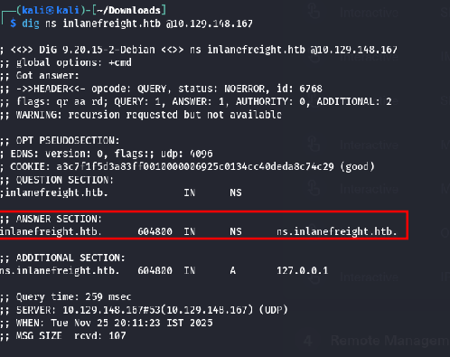
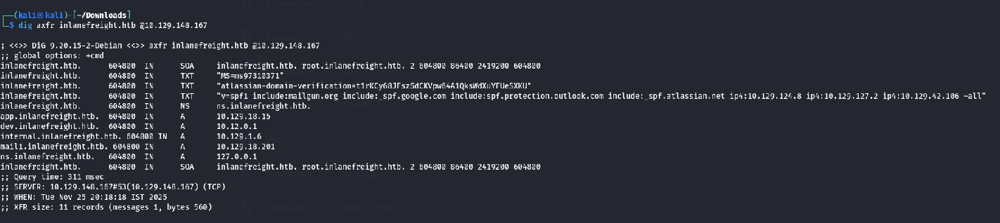
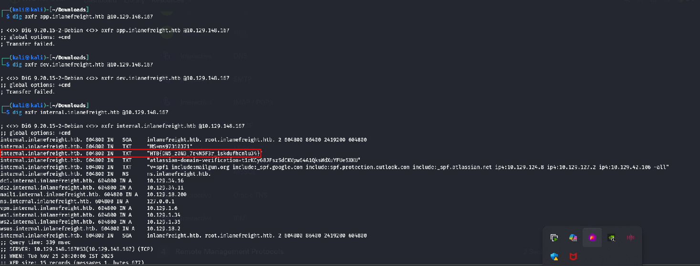

### Q1: Interact with the target DNS using its IP address and enumerate the FQDN of it for the “inlanefreight.htb” domain.
```
dig ns inlanefreight.htb @10.129.148.167
```
**Command Explaination:**

- `dig` The DNS lookup tool
- `ns`  
    The **query type**. Here you’re asking for the domain’s **NS (name server) records** — which nameservers are authoritative for that domai
- `inlanefreight.htb`The **domain name** you’re querying about.
- `@10.129.17.94`The **specific DNS server** to send the query to. Prepending `@` tells `dig` to query that server directly instead of using your system’s default res

### Q2: Identify if its possible to perform a zone transfer and submit the TXT record as the answer. (Format: HTB{…})
zone transfer is the **AXFR**
```
dig axfr inlanefreight.htb @10.129.148.167
```

The server at `10.129.148.167` returned the full zone (9 records), so it is allowing zone transfers

so you have to go through all the A records now and see if you can do zone transfer on them too! good luck

### Q3: What is the IPv4 address of the hostname DC1?

### Q4: What is the FQDN of the host where the last octet ends with “x.x.x.203”?
```
dnsenum --dnsserver 10.129.148.167 --enum -p 0 -s 0 -o sudomains.txt -f /usr/share/seclists/Discovery/DNS/subdomains-top1million-5000.txt inlanefreight.htb
```
**Explenation:**

- `dnsenum` The tool itself — a Perl script that automates a bunch of DNS enumeration tasks (gather A/MX/NS records, try zone transfers, brute‑force subdomains, do Google scraping, perform whois/reverse lookups, etc.). [GitHub](https://github.com/fwaeytens/dnsenum)
- `--dnsserver 10.129.17.94` Tell `dnsenum` to send all DNS queries to the DNS server at **10.129.17.94** instead of using your system’s default resolver. This is useful if you want to hit a specific authoritative server
- `--enum` Run the tool’s **full enumeration mode** — i.e., try all the supported discovery techniques (get A/MX/NS, attempt zone transfers, brute‑force subdomains, do whois and reverse lookups, etc.)
- `-p 0` and `-s 0`These two control the tool’s **Google scraping** behaviour:
- `-p` = number of Google result _pages_ to process, and
- `-s` = maximum number of scraped subdomain results to pull from Google.Setting them to `0` effectively **disables Google scraping** (no pages, no scraped entries). (Docs/examples show `-p 5 -s 20` used to enable scraping.)
- `-o subdomains.txt`Save the tool’s findings to the file `subdomains.txt`. This is the output file you can later grep/scan/analyze.
- `-f /opt/useful/seclists/Discovery/DNS/subdomains-top1million-110000.txt` Use that file as the **wordlist for brute‑force subdomain discovery**. `dnsenum` will try each candidate from the list (e.g., `admin`, `dev`, `mail`) appended to the domain to see which names resolve.
- `inlanefreight.htb` The **target domain** you want to enumerate.

**Results:**

