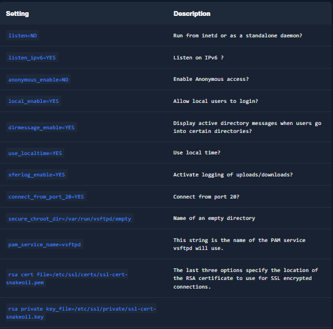

The `File Transfer Protocol` (`FTP`) is one of the oldest protocols on the Internet. The FTP runs within the application layer of the TCP/IP protocol stack. Thus, it is on the same layer as `HTTP` or `POP`. These protocols also work with the support of browsers or email clients to perform their services. There are also special FTP programs for the File Transfer Protocol.

Let us imagine that we want to upload local files to a server and download other files using the [FTP](https://datatracker.ietf.org/doc/html/rfc959) protocol. In an FTP connection, two channels are opened. First, the client and server establish a control channel through `TCP port 21`. The client sends commands to the server, and the server returns status codes. Then both communication participants can establish the data channel via `TCP port 20`. This channel is used exclusively for data transmission, and the protocol watches for errors during this process. If a connection is broken off during transmission, the transport can be resumed after re-established contact.

A distinction is made between `active` and `passive` FTP. In the active variant, the client establishes the connection as described via TCP port 21 and thus informs the server via which client-side port the server can transmit its responses. However, if a firewall protects the client, the server cannot reply because all external connections are blocked. For this purpose, the `passive mode` has been developed. Here, the server announces a port through which the client can establish the data channel. Since the client initiates the connection in this method, the firewall does not block the transfer.

The FTP knows different [commands](https://web.archive.org/web/20230326204635/https://www.smartfile.com/blog/the-ultimate-ftp-commands-list/) and status codes. Not all of these commands are consistently implemented on the server. For example, the client-side instructs the server-side to upload or download files, organize directories or delete files. The server responds in each case with a status code that indicates whether the command was successfully implemented. A list of possible status codes can be found [here](https://en.wikipedia.org/wiki/List_of_FTP_server_return_codes).

Usually, we need credentials to use FTP on a server. We also need to know that FTP is a `clear-text` protocol that can sometimes be sniffed if conditions on the network are right. However, there is also the possibility that a server offers `anonymous FTP`. The server operator then allows any user to upload or download files via FTP without using a password. Since there are security risks associated with such a public FTP server, the options for users are usually limited.

## TFPT
`Trivial File Transfer Protocol` (`TFTP`) is simpler than FTP and performs file transfers between client and server processes. However, it `does not` provide user authentication and other valuable features supported by FTP. In addition, while FTP uses TCP, TFTP uses `UDP`, making it an unreliable protocol and causing it to use UDP-assisted application layer recovery.

This is reflected, for example, in the fact that TFTP, unlike FTP, does not require the user's authentication. It does not support protected login via passwords and sets limits on access based solely on the read and write permissions of a file in the operating system. Practically, this leads to TFTP operating exclusively in directories and with files that have been shared with all users and can be read and written globally. Because of the lack of security, TFTP, unlike FTP, may only be used in local and protected networks.

Let us take a look at a few commands of `TFTP`:
connect - Sets the remote host, and optionally the port, for file transfers.
get - Transfers a file or set of files from the remote host to the local host.
put - Transfers a file or set of files from the local host onto the remote host.
quit - Exits tftp.
status - Shows the current status of tftp, including the current transfer mode (ascii or binary), connection status, time-out value, and so on.
verbose - Turns verbose mode, which displays additional information during file transfer, on or off.

Unlike the FTP client, `TFTP` does not have directory listing functionality.

## Default Configuration
One of the most used FTP servers on Linux-based distributions is [vsFTPd](https://security.appspot.com/vsftpd.html). The default configuration of vsFTPd can be found in `/etc/vsftpd.conf`, and some settings are already predefined by default. It is highly recommended to install the vsFTPd server on a VM and have a closer look at this configuration.
### Install vsFTPd
```sh
279sid@htb[/htb]$ sudo apt install vsftpd
```
The vsFTPd server is only one of a few FTP servers available to us. There are many different alternatives to it, which also bring, among other things, many more functions and configuration options with them. We will use the vsFTPd server because it is an excellent way to show the configuration possibilities of an FTP server in a simple and easy-to-understand way without going into the details of the man pages. If we look at the configuration file of vsFTPd, we will see many options and settings that are either commented or commented out. However, the configuration file does not contain all possible settings that can be made. The existing and missing ones can be found on the [man page](http://vsftpd.beasts.org/vsftpd_conf.html).
### vsFTPd Config File
```sh
279sid@htb[/htb]$ cat /etc/vsftpd.conf | grep -v "#"
```

