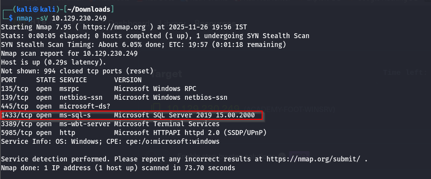
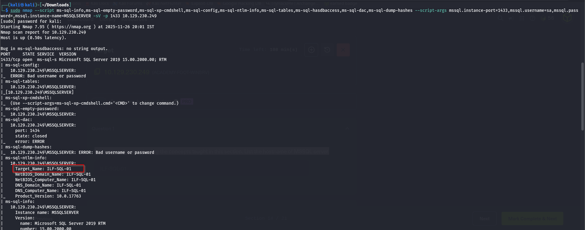
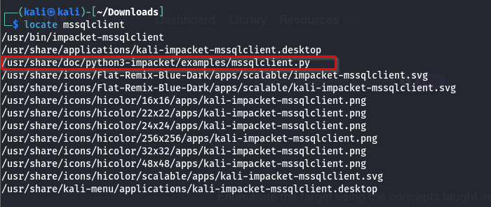
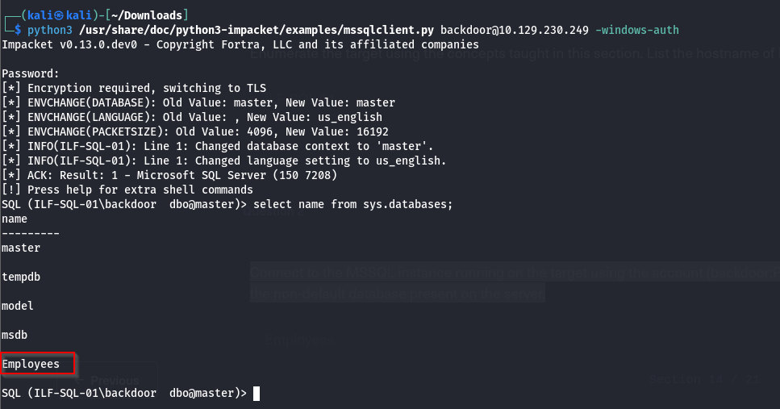

### Q.1 Enumerate the target using the concepts taught in this section. List the hostname of MSSQL server.


```
sudo nmap --script ms-sql-info,ms-sql-empty-password,ms-sql-xp-cmdshell,ms-sql-config,ms-sql-ntlm-info,ms-sql-tables,ms-sql-hasdbaccess,ms-sql-dac,ms-sql-dump-hashes --script-args mssql.instance-port=1433,mssql.username=sa,mssql.password=,mssql.instance-name=MSSQLSERVER -sV -p 1433 10.129.230.249
```

### Q.2 Connect to the MSSQL instance running on the target using the account (backdoor:Password1), then list the non-default database present on the server.

```
python3 /usr/share/doc/python3-impacket/examples/mssqlclient.py backdoor@10.129.230.249 -windows-auth
```

