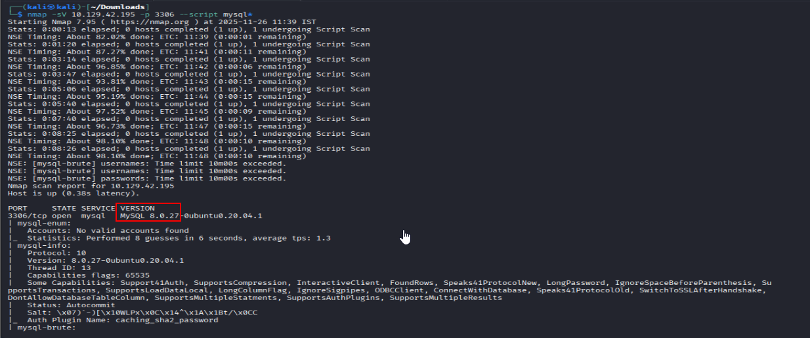
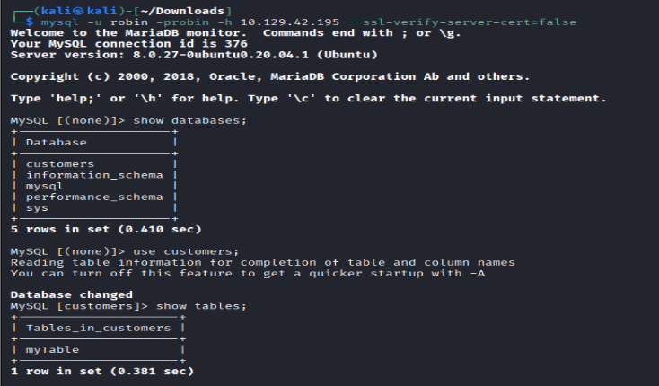
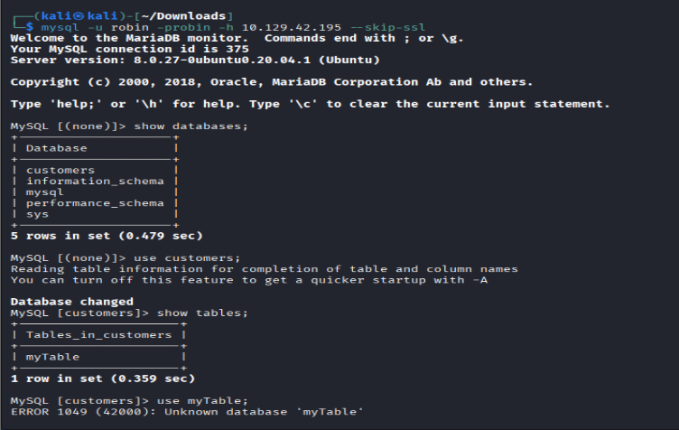
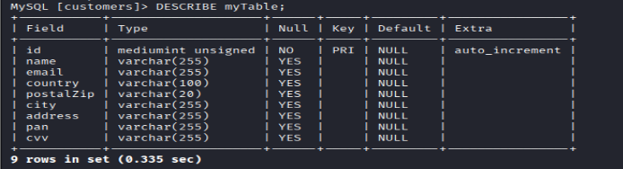
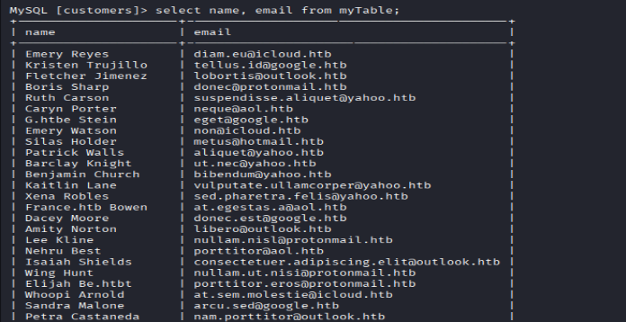
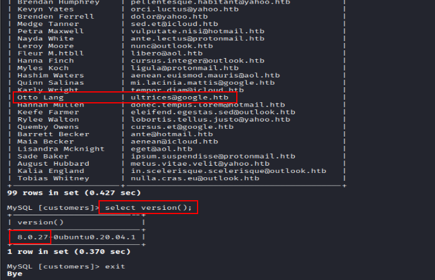
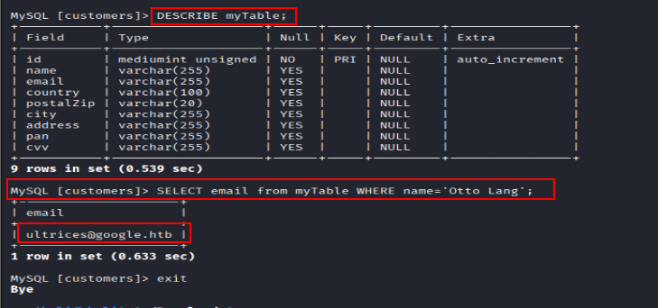

### ### Q.1 Enumerate the MySQL server and determine the version in use. (Format: MySQL X.X.XX)

### ### Q.2 During our penetration test, we found weak credentials "robin:robin". We should try these against the MySQL server. What is the email address of the customer "Otto Lang"?

- _u : tag for Username in our case its robin_
- _-p : tag for password in our case same as username . Remember there should not be any space in between -p tag and password._
- _-h : Connects to a remote MySQL server hosted at 10.129.70.181_
- _- -ssl-verify-server-cert=false : It is used to disable the verification of the server’s SSL/TLS certificate._ OR

