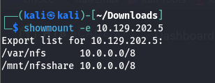
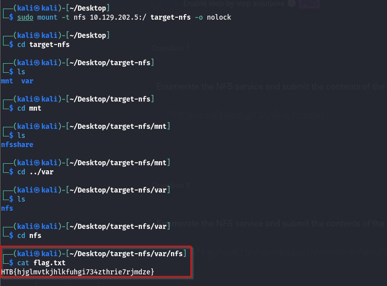
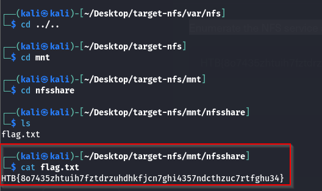

### Q. 1 Enumerate the NFS service and submit the contents of the flag.txt in the "nfs" share as the answer.

 Make a directory and mount shares to it.
 ```
 mkdir target-nfs
 ```


 ```
 sudo mount -t nfs 10.129.202.5:/ target-nfs -o nolock
 ```



### Q.2 Enumerate the NFS service and submit the contents of the flag.txt in the "nfsshare" share as the answer.


