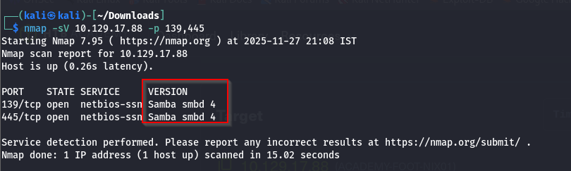
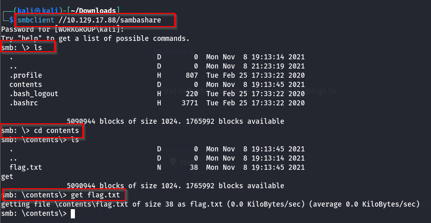
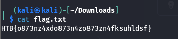
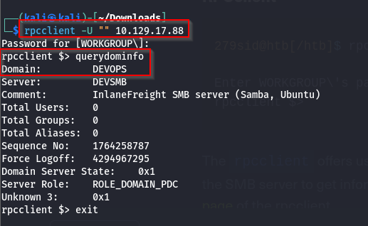
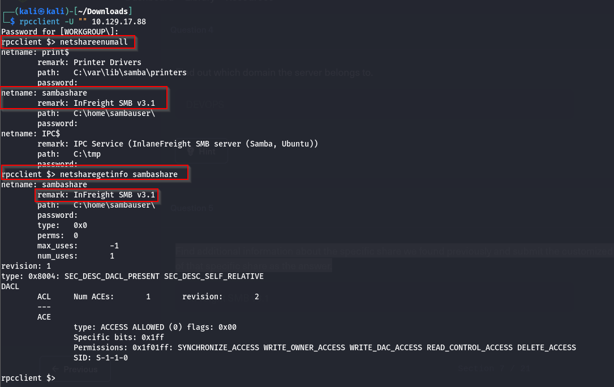
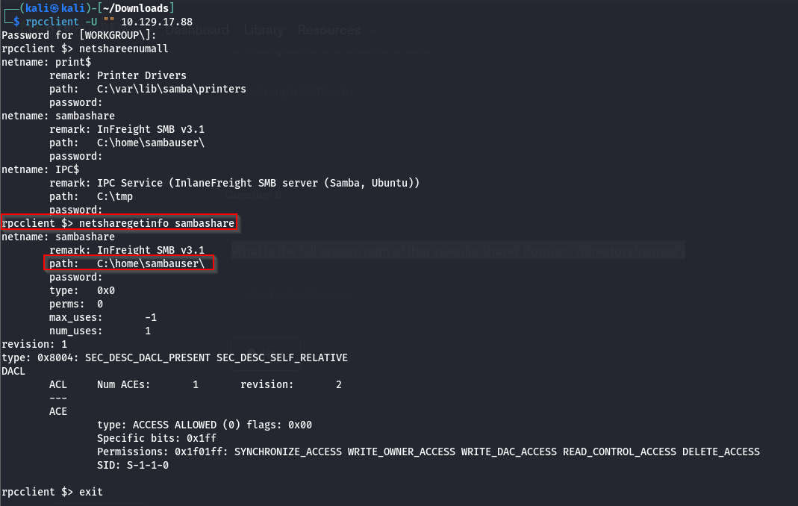

### Q,.1 What version of the SMB server is running on the target system? Submit the entire banner as the answer.

### Q.2 What is the name of the accessible share on the target?

##### We use the so-called null session (-N), which is anonymous access without the input of existing users or valid passwords.

### Q.3 Connect to the discovered share and find the flag.txt file. Submit the contents as the answer.

### Q.4 Find out which domain the server belongs to.

### Q.5 Find additional information about the specific share we found previously and submit the customized version of that specific share as the answer.

### Q.6 What is the full system path of that specific share? (format: "/directory/names")
