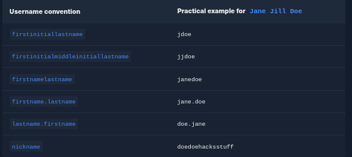
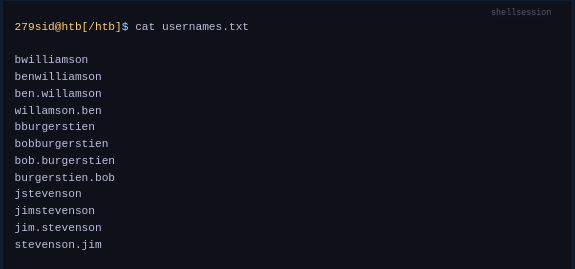
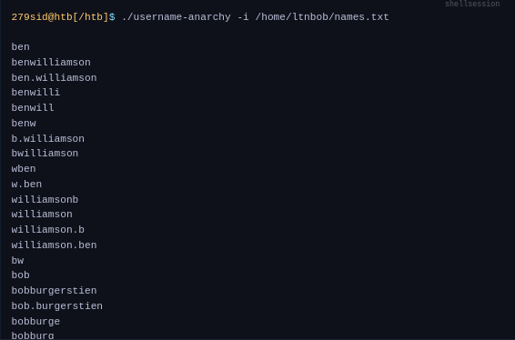
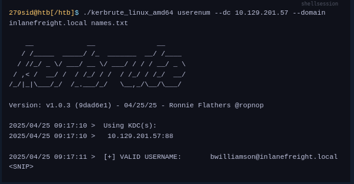
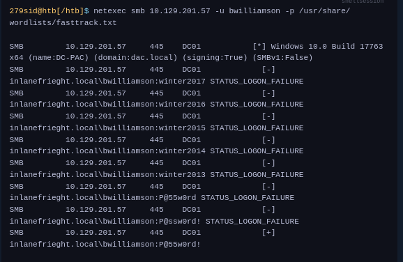
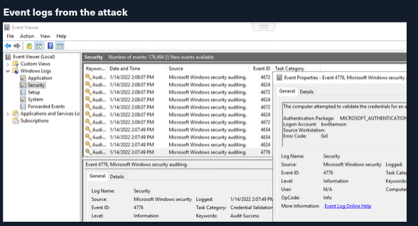
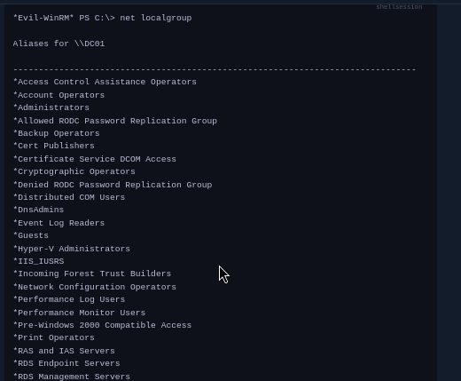
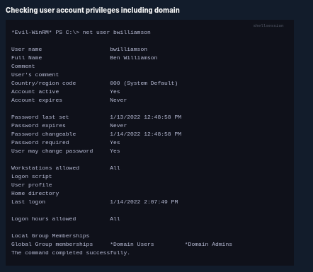

`Active Directory` (`AD`) is a common and critical directory service in modern enterprise networks. AD is something we will repeatedly encounter, so we need to be familiar with various methods we can use to attack and defend these environments. It is safe to conclude that if the organization uses Windows, then AD is used to manage those Windows systems. Attacking AD is such an extensive and significant topic that we have multiple modules covering the subject.

In this section, we will focus primarily on how we can extract credentials through the use of a `dictionary attack` against `AD accounts` and `dumping hashes` from the `NTDS.dit` file.

Like many of the attacks we have covered thus far, our target must be reachable over the network. This means it is highly likely that we will need to have a foothold established on the internal network to which the target is connected. That said, there are situations where an organization may be using port forwarding to forward the remote desktop protocol (`3389`) or other protocols used for remote access on their [edge router](https://www.cisco.com/c/en/us/products/routers/what-is-an-edge-router.html) to a system on their internal network. Please know that most methods covered in this module simulate the steps after an initial compromise, and a foothold is established on an internal network. Before we get hands-on with the attack methods, let's consider the authentication process once a Windows system has been joined to the domain. This approach will help us better understand the significance of Active Directory and the password attacks it can be susceptible to.

Once a Windows system is joined to a domain, it will `no longer default to referencing the SAM database to validate logon requests`. That domain-joined system will now send authentication requests to be validated by the domain controller before allowing a user to log on. This does not mean the SAM database can no longer be used. Someone looking to log on using a local account in the SAM database can still do so by specifying the `hostname` of the device proceeded by the `Username` (Example: `WS01\nameofuser`) or with direct access to the device then typing `.\` at the logon UI in the `Username` field. This is worthy of consideration because we need to be mindful of what system components are impacted by the attacks we perform. It can also give us additional avenues of attack to consider when targeting Windows desktop operating systems or Windows server operating systems with direct physical access or over a network. Keep in mind that we can also study NTDS attacks by keeping track of this [technique](https://attack.mitre.org/techniques/T1003/003/).

## Dictionary attacks against AD accounts using NetExec

Keep in mind that a dictionary attack is essentially using the power of a computer to guess a username and/or password using a customized list of potential usernames and passwords. It can be rather `noisy` (easy to detect) to conduct these attacks over a network because they can generate a lot of network traffic and alerts on the target system as well as eventually get denied due to login attempt restrictions that may be applied through the use of [Group Policy](https://docs.microsoft.com/en-us/previous-versions/windows/it-pro/windows-server-2012-r2-and-2012/hh831791\(v=ws.11\)).

When we find ourselves in a scenario where a dictionary attack is a viable next step, we can benefit from trying to tailor our attack as much as possible. In this case, we can consider the organization we are working with to perform the engagement against and use searches on various social media websites and look for an employee directory on the company's website. Doing this can result in us gaining the names of employees that work at the organization. One of the first things a new employee will get is a username. Many organizations follow a naming convention when creating employee usernames. Here are some common conventions to consider:

Often, an email address's structure will give us the employee's username (structure: `username@domain`). For example, from the email address `jdoe`@`inlanefreight.com`, we can infer that `jdoe` is the username.

#### Creating a custom list of usernames

Let's say we have done our research and gathered a list of names based on publicly available information. We will keep the list relatively short for the sake of this lesson because organizations can have a huge number of employees. Example list of names:

- Ben Williamson
- Bob Burgerstien
- Jim Stevenson
- Jill Johnson
- Jane Doe

We can create a custom list on our attack host using the names above. We can use a command line-based text editor like `Vim` or a graphical text editor to create our list. Our list may look something like this:


Of course, this is just an example and doesn't include all of the names, but notice how we can include a different naming convention for each name if we do not already know the naming convention used by the target organization.

We can manually create our list(s) or use an `automated list generator` such as the Ruby-based tool [Username Anarchy](https://github.com/urbanadventurer/username-anarchy) to convert a list of real names into common username formats. Once the tool has been cloned to our local attack host using `Git`, we can run it against a list of real names as shown in the example output below:



Using automated tools can save us time when crafting lists. Still, we will benefit from spending as much time as we can attempting to discover the naming convention an organization is using with usernames because this will reduce the need for us to guess the naming convention.

It is ideal to limit the need to guess as much as possible when conducting password attacks.

#### Enumerating valid usernames with Kerbrute

Before we start guessing passwords for usernames which might not even exist, it may be worthwhile identifying the correct naming convention and confirming the validity of some usernames. We can do this with a tool like [Kerbrute](https://github.com/ropnop/kerbrute). Kerbrute can be used for brute-forcing, password spraying and username enumeration. Right now, we are only interested in username enumeration, which would look like this:



#### Launching a brute-force attack with NetExec

Once we have our list(s) prepared or discover the naming convention and some employee names, we can launch a brute-force attack against the target domain controller using a tool such as NetExec. We can use it in conjunction with the SMB protocol to send logon requests to the target Domain Controller. Here is the command to do so:



In this example, NetExec is using SMB to attempt to logon as user (`-u`) `bwilliamson` using a password (`-p`) list containing a list of commonly used passwords (`/usr/share/wordlists/fasttrack.txt`). If the admins configured an account lockout policy, this attack could lock out the account that we are targeting. At the time of this writing (January 2022), an account lockout policy is not enforced by default with the default group policies that apply to a Windows domain, meaning it is possible that we will come across environments vulnerable to this exact attack we are practicing.



It can be useful to know what might have been left behind by an attack. Knowing this can make our remediation recommendations more impactful and valuable for the client we are working with. On any Windows operating system, an admin can navigate to `Event Viewer` and view the Security events to see the exact actions that were logged. This can inform decisions to implement stricter security controls and assist in any potential investigation that might be involved following a breach.

Once we have discovered some credentials, we could proceed to try to gain remote access to the target domain controller and capture the NTDS.dit file.

## Capturing NTDS.dit

`NT Directory Services` (`NTDS`) is the directory service used with AD to find & organize network resources. Recall that `NTDS.dit` file is stored at `%systemroot%/ntds` on the domain controllers in a [forest](https://learn.microsoft.com/en-us/windows-server/identity/ad-ds/plan/using-the-organizational-domain-forest-model). The `.dit` stands for [directory information tree](https://docs.oracle.com/cd/E19901-01/817-7607/dit.html). This is the primary database file associated with AD and stores all domain usernames, password hashes, and other critical schema information. If this file can be captured, we could potentially compromise every account on the domain similar to the technique we covered in this module's `Attacking SAM, SYSTEM, and SECURITY` section. As we practice this technique, consider the importance of protecting AD and brainstorm a few ways to stop this attack from happening.

#### Connecting to a DC with Evil-WinRM

We can connect to a target DC using the credentials we captured.
```sh
evil-winrm -i 10.129.201.57  -u bwilliamson -p 'P@55w0rd!'
```

Evil-WinRM connects to a target using the Windows Remote Management service combined with the PowerShell Remoting Protocol to establish a PowerShell session with the target.

#### Checking local group membership

Once connected, we can check to see what privileges `bwilliamson` has. We can start with looking at the local group membership using the command:


We are looking to see if the account has local admin rights. To make a copy of the NTDS.dit file, we need local admin (`Administrators group`) or Domain Admin (`Domain Admins group`) (or equivalent) rights. We also will want to check what domain privileges we have.

#### Checking user account privileges including domain


This account has both Administrators and Domain Administrator rights which means we can do just about anything we want, including making a copy of the NTDS.dit file.

### Creating shadow copy of C:

We can use `vssadmin` to create a [Volume Shadow Copy](https://docs.microsoft.com/en-us/windows-server/storage/file-server/volume-shadow-copy-service) (`VSS`) of the `C:` drive or whatever volume the admin chose when initially installing AD. It is very likely that NTDS will be stored on `C:` as that is the default location selected at install, but it is possible to change the location. We use VSS for this because it is designed to make copies of volumes that may be read & written to actively without needing to bring a particular application or system down. VSS is used by many different backup and disaster recovery software to perform operations.


