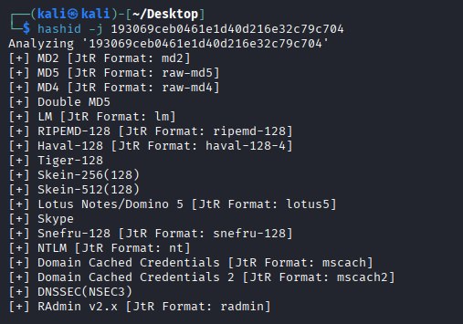
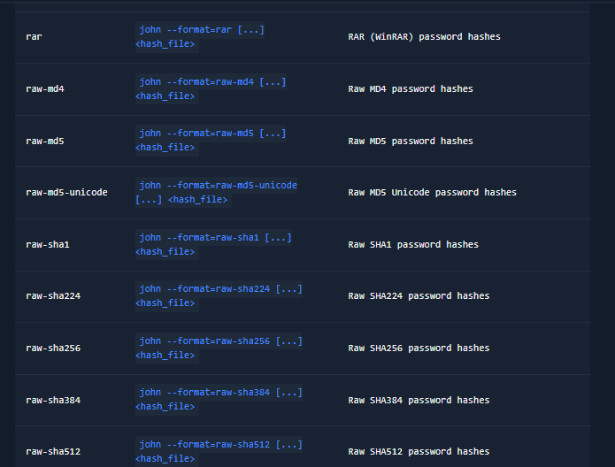
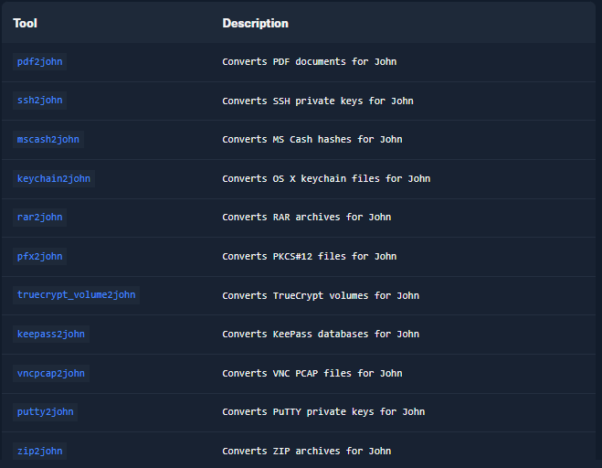

[John the Ripper](https://github.com/openwall/john) (aka. `JtR` aka. `john`) is a well-known penetration testing tool used for cracking passwords through various attacks including brute-force and dictionary. It is open-source software initially developed for UNIX-based systems and was first released in 1996. It has become a staple of the security industry due to its various capabilities. The `"jumbo"` variant is recommended for our uses, as it has performance optimizations, additional features such as multilingual word lists, and support for 64-bit architectures. This version is able to crack passwords with greater accuracy and speed. Included with JtR are various tools for converting different types of files and hashes into formats that are usable by JtR. Additionally, the software is regularly updated to keep up with the current security trends and technologies.

## Cracking modes

#### Single crack mode

`Single crack mode` is a rule-based cracking technique that is most useful when targeting Linux credentials. It generates password candidates based on the victim's username, home directory name, and [GECOS](https://en.wikipedia.org/wiki/Gecos_field) values (full name, room number, phone number, etc.). These strings are run against a large set of rules that apply common string modifications seen in passwords (e.g. a user whose real name is `Bob Smith` might use `Smith1` as their password).

**Note:** The Linux authentication process, as well as cracking rules, will be covered in-depth in later sections. The following example is simplified for demonstration purposes.

Imagine we as attackers came across the file `passwd` with the following contents:
```sh
r0lf:$6$ues25dIanlctrWxg$nZHVz2z4kCy1760Ee28M1xtHdGoy0C2cYzZ8l2sVa1kIa8K9gAcdBP.GI6ng/qA4oaMrgElZ1Cb9OeXO4Fvy3/:0:0:Rolf Sebastian:/home/r0lf:/bin/bash
```
Based on the contents of the file, it can be inferred that the victim has the username `r0lf`, the real name `Rolf Sebastian`, and the home directory `/home/r0lf`. Single crack mode will use this information to generate candidate passwords and test them against the hash. We can run the attack with the following command:
Copy the complete data and make a file named passwd.

In this case, the password hash was successfully cracked.
#### Wordlist mode

`Wordlist mode` is used to crack passwords with a dictionary attack, meaning it attempts all passwords in a supplied wordlist against the password hash. The basic syntax for the command is as follows:
```sh
john --wordlist=rockyou.txt hash_file
```

## Identifying hash formats

Sometimes, password hashes may appear in an unknown format, and even John the Ripper (JtR) may not be able to identify them with complete certainty. For example, consider the following hash:
One way to get an idea is to consult [JtR's sample hash documentation](https://openwall.info/wiki/john/sample-hashes), or [this list by PentestMonkey](https://pentestmonkey.net/cheat-sheet/john-the-ripper-hash-formats). Both sources list multiple example hashes as well as the corresponding JtR format. Another option is to use a tool like [hashID](https://github.com/psypanda/hashID), which checks supplied hashes against a built-in list to suggest potential formats. By adding the `-j` flag, hashID will, in addition to the hash format, list the corresponding JtR format:

Unfortunately, in our example it is still quite unclear what format the hash is in. This will sometimes be the case, and is simply one of the "problems" you will encounter as a pentester. Many times, the context of where the hash came from will be enough to make an educated case on the format. In this specific example, the hash format is RIPEMD-128.

JtR supports hundreds of hash formats, some of which are listed in the table below. The `--format` argument can be supplied to instruct JtR which format target hashes have.

## Cracking files

It is also possible to crack password-protected or encrypted files with JtR. Multiple `"2john"` tools come with JtR that can be used to process files and produce hashes compatible with JtR. The generalized syntax for these tools is:

```sh
<tool> <file_to_crack> > file.hash
```


