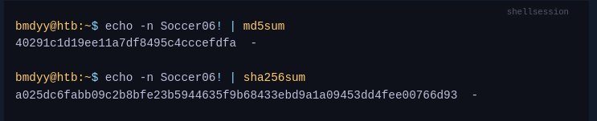
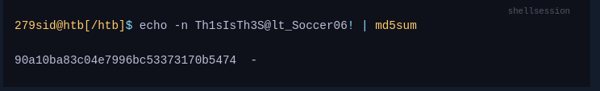

Passwords are commonly `hashed` when stored, in order to provide some protection in the event they fall into the hands of an attacker. `Hashing` is a mathematical function which transforms an arbitrary number of input bytes into a (typically) fixed-size output; common examples of hash functions are `MD5`, and `SHA-256`.

Take the password `Soccer06!` for example. The corresponding `MD5` and `SHA-256` hashes can be generated with the following commands:



Hash functions are designed to work in `one direction`. This means it should not be possible to figure out what the original password was based on the hash alone. When attackers attempt to do this, it is called `password cracking`. Common techniques are to use `rainbow tables`, to perform `dictionary attacks`, and typically as a last resort, to perform `brute-force attacks`.
## Rainbow tables

Rainbow tables are large pre-compiled maps of input and output values for a given hash function. These can be used to very quickly identify the password if its corresponding hash has already been mapped.
Because rainbow tables are such a powerful attack, `salting` is used. A `salt`, in cryptographic terms, is a random sequence of bytes added to a password before it is hashed. To maximize impact, salts should not be reused, e.g. for all passwords stored in one database. For example, if the salt `Th1sIsTh3S@lt_` is prepended to the same password, the MD5 hash would now be as follows:

A salt is not a secret value — when a system goes to check an authentication request, it needs to know what salt was used so that it can check if the password hash matches. For this reason, salts are typically prepended to corresponding hashes. The reason this technique works against rainbow tables is that even if the correct password has been mapped, the combination of salt and password has likely not (especially if the salt contains non-printable characters). To make rainbow tables effective again, an attacker would need to update their mapping to account for every possible salt. A salt consisting of `just one single byte` would mean the `15 billion` entries from before would have to be `3.84 trillion` (factor of 256).

## Brute-force attack

A `brute-force` attack involves attempting every possible combination of letters, numbers, and symbols until the correct password is discovered. Obviously, this can take a very long time—especially for long passwords—however shorter passwords (<9 characters) are viable targets, even on consumer hardware. Brute-forcing is the only password cracking technique that is `100% effective` - in that, given enough time, any password will be cracked with this technique. That said, it is hardly ever used because of how much time it takes for stronger passwords, and is typically replaced by much more efficient `mask attacks`. This is something we will cover in the next couple sections.

## Dictionary attack

A `dictionary` attack, otherwise known as a `wordlist` attack, is one of the most `efficient` techniques for cracking passwords, especially when operating under time-constraints as penetration testers usually do. Rather than attempting every possible combination of characters, a list containing statistically likely passwords is used. Well-known wordlists for password cracking are [rockyou.txt](https://github.com/brannondorsey/naive-hashcat/releases/download/data/rockyou.txt) and those included in [SecLists](https://github.com/danielmiessler/SecLists).


### What is the SHA1 hash for `Academy#2025`?
```sh
echo -n Academy#2025 | sha1sum
750fe4b402dc9f91cedf09b652543cd85406be8c  -
```
