## WinRM

Windows Remote Management (WinRM) is the Microsoft implementation of the Web Services Management Protocol (WS-Management). It is a network protocol based on XML web services using the Simple Object Access Protocol (SOAP) used for remote management of Windows systems. It takes care of the communication between Web-Based Enterprise Management (WBEM) and the Windows Management Instrumentation (WMI), which can call the Distributed Component Object Model (DCOM).

For security reasons, WinRM must be activated and configured manually in Windows 10/11. Therefore, it depends heavily on the environment security in a domain or local network where we want to use WinRM. In most cases, one uses certificates or only specific authentication mechanisms to increase its security. By default, WinRM uses the TCP ports 5985 (HTTP) and 5986 (HTTPS).

A handy tool that we can use for our password attacks is NetExec, which can also be used for other protocols such as SMB, LDAP, MSSQL, and others. We recommend reading the official documentation for this tool to become familiar with it.

```sh
netexec <proto> <target-IP> -u <user or userlist> -p <password or passwordlist>
```

## Evil-WinRM

```sh
evil-winrm -i <target-IP> -u <username> -p <password>
```

### SSH

Secure Shell (SSH) is a more secure way to connect to a remote host to execute system commands or transfer files from a host to a server. The SSH server runs on TCP port 22 by default, to which we can connect using an SSH client. This service uses three different cryptography operations/methods: symmetric encryption, asymmetric encryption, and hashing.

**Symmetric Encryption**
Symmetric encryption uses the same key for encryption and decryption. Anyone who has access to the key could also access the transmitted data. Therefore, a key exchange procedure is needed for secure symmetric encryption. The Diffie-Hellman key exchange method is used for this purpose. If a third party obtains the key, it cannot decrypt the messages because the key exchange method is unknown. However, this is used by the server and client to determine the secret key needed to access the data. Many different variants of the symmetrical cipher system can be used, such as AES, Blowfish, 3DES, etc.

**Asymmetric Encryption**
Asymmetric encryption uses two keys: a private key and a public key. The private key must remain secret because only it can decrypt the messages that have been encrypted with the public key. If an attacker obtains the private key, which is often not password protected, he will be able to log in to the system without credentials. Once a connection is established, the server uses the public key for initialization and authentication. If the client can decrypt the message, it has the private key, and the SSH session can begin.

**Hashing**
The hashing method converts the transmitted data into another unique value. SSH uses hashing to confirm the authenticity of messages. This is a mathematical algorithm that only works in one direction.
Hydra - SSH

We can use a tool like Hydra to brute force SSH. This is covered in-depth in the Login Brute Forcing module.
```sh
hydra -L user.list -P password.list ssh://10.129.42.197
```

## Remote Desktop Protocol (RDP)

Microsoft's Remote Desktop Protocol (RDP) is a network protocol that allows remote access to Windows systems via TCP port 3389 by default. RDP provides both users and administrators/support staff with remote access to Windows hosts within an organization. The Remote Desktop Protocol defines two participants for a connection: a so-called terminal server, on which the actual work takes place, and a terminal client, via which the terminal server is remotely controlled. In addition to the exchange of image, sound, keyboard, and pointing device, the RDP can also print documents of the terminal server on a printer connected to the terminal client or allow access to storage media available there. Technically, the RDP is an application layer protocol in the IP stack and can use TCP and UDP for data transmission. The protocol is used by various official Microsoft apps, but it is also used in some third-party solutions.
Hydra - RDP

We can also use Hydra to perform RDP bruteforcing.

```sh
hydra -L user.list -P password.list rdp://10.129.42.197
```

```sh
xfreerdp3 /dynamic-resolution +clipboard /cert:ignore /v:10.201.50.83 /u:Administrator /p:'TryH4ckM3!'
```

## SMB

Server Message Block (SMB) is a protocol responsible for transferring data between a client and a server in local area networks. It is used to implement file and directory sharing and printing services in Windows networks. SMB is often referred to as a file system, but it is not. SMB can be compared to NFS for Unix and Linux for providing drives on local networks.

SMB is also known as Common Internet File System (CIFS). It is part of the SMB protocol and enables universal remote connection of multiple platforms such as Windows, Linux, or macOS. In addition, we will often encounter Samba, which is an open-source implementation of the above functions. For SMB, we can also use hydra again to try different usernames in combination with different passwords.
Hydra - SMB

```sh
hydra -L user.list -P password.list smb://10.129.42.197
```

However, we may also get the following error describing that the server has sent an invalid reply.
**Hydra - Error**

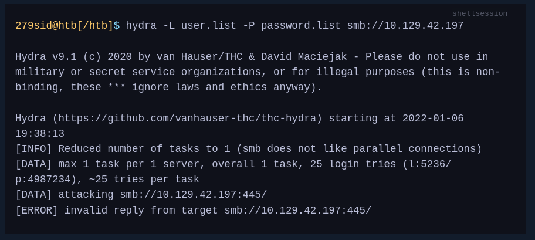

This is because we most likely have an outdated version of THC-Hydra that cannot handle SMBv3 replies. To work around this problem, we can manually update and recompile hydra or use another very powerful tool, the Metasploit framework.

**Metasploit Framework**
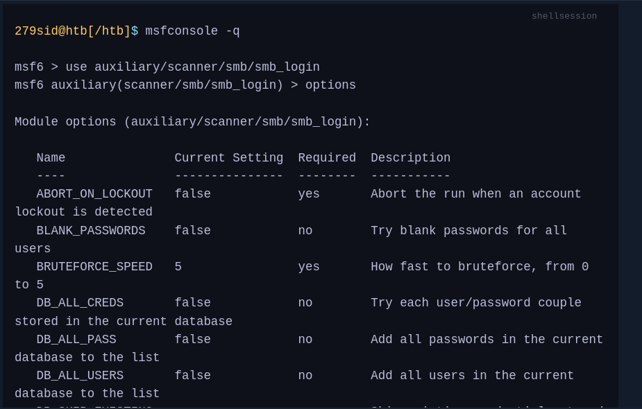

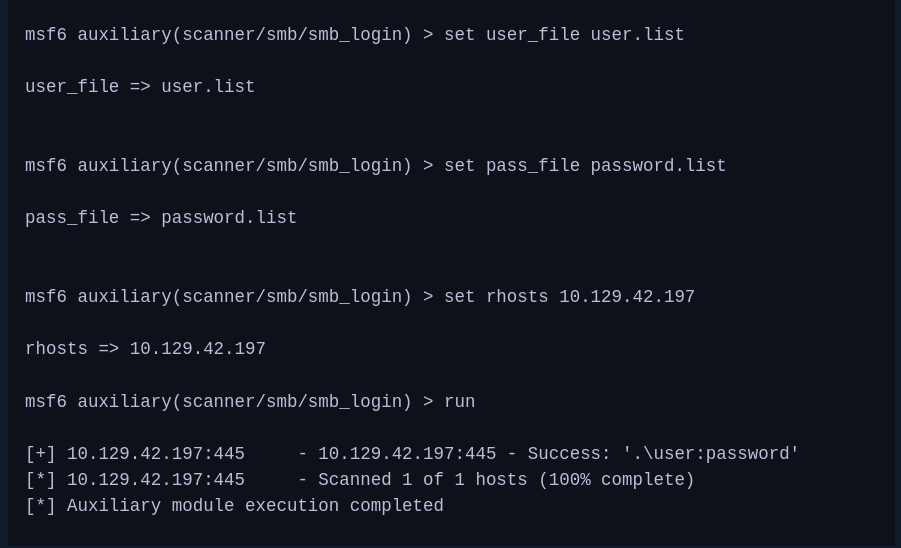

Now we can use NetExec again to view the available shares and what privileges we have for them.

```sh
netexec smb 10.129.42.197 -u "user" -p "password" --shares
```

To communicate with the server via SMB, we can use, for example, the tool smbclient. This tool will allow us to view the contents of the shares, upload, or download files if our privileges allow it.
```sh
smbclient -U user \\\\10.129.42.197\\SHARENAME
```

### Q.1 Find the user for the WinRM service and crack their password. Then, when you log in, you will find the flag in a file there. Submit the flag you found as the answer.


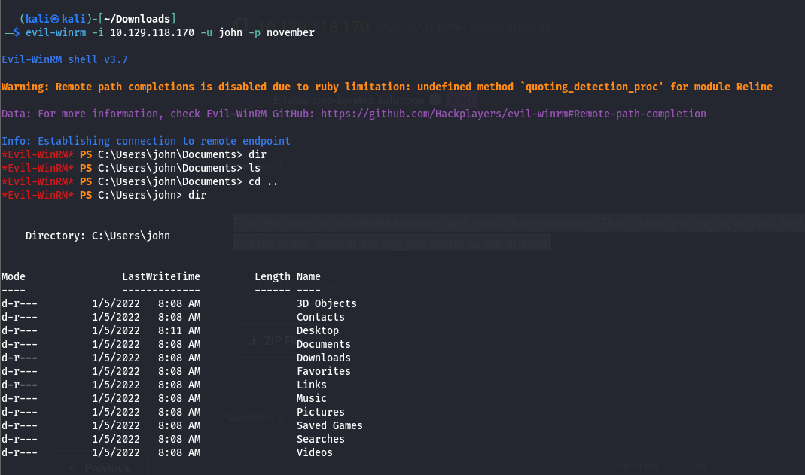

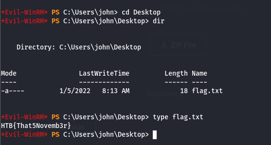

### Q.2 Find the user for the SSH service and crack their password. Then, when you log in, you will find the flag in a file there. Submit the flag you found as the answer.


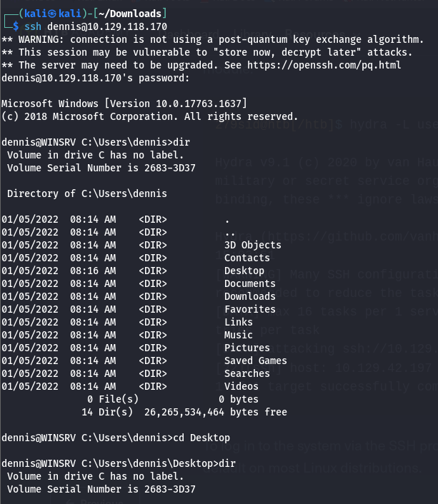

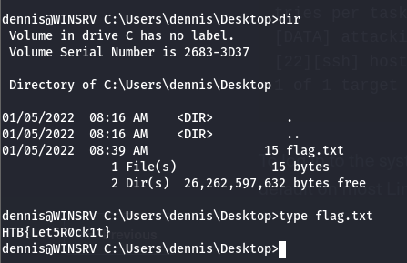

### Q.3 Find the user for the RDP service and crack their password. Then, when you log in, you will find the flag in a file there. Submit the flag you found as the answer.
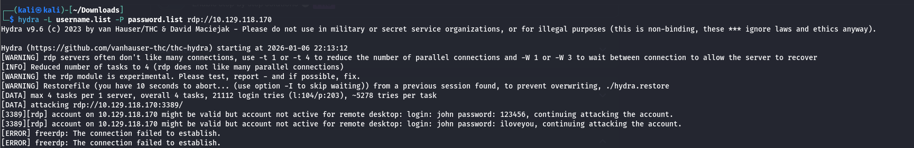

### Q.4 Find the user for the SMB service and crack their password. Then, when you log in, you will find the flag in a file there. Submit the flag you found as the answer.
**Hydra error**
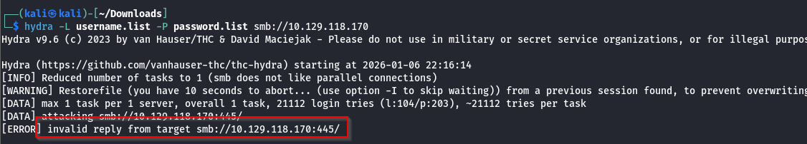

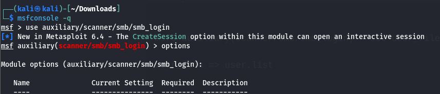

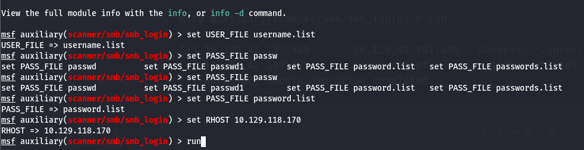
