## SSH Local Port Forwarding
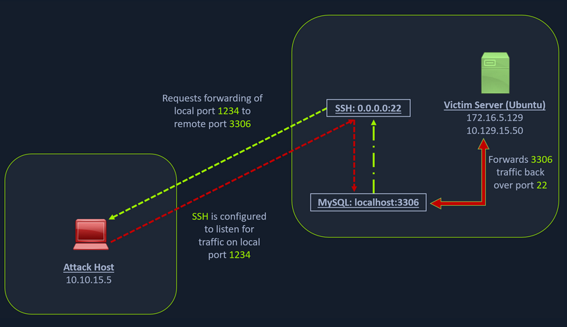

We have our attack host (10.10.15.x) and a target Ubuntu server (10.129.x.x), which we have compromised. We will scan the target Ubuntu server using Nmap to search for open ports.

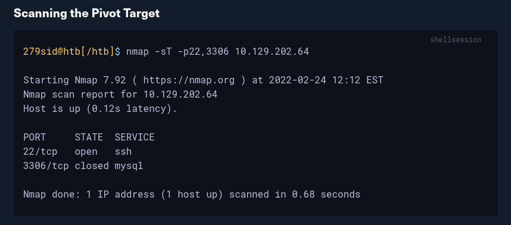

The Nmap output shows that the SSH port is open. To access the MySQL service, we can either SSH into the server and access MySQL from inside the Ubuntu server, or we can port forward it to our localhost on port 1234 and access it locally. A benefit of accessing it locally is if we want to execute a remote exploit on the MySQL service, we won't be able to do it without port forwarding. This is due to MySQL being hosted locally on the Ubuntu server on port 3306. So, we will use the below command to forward our local port (1234) over SSH to the Ubuntu server.

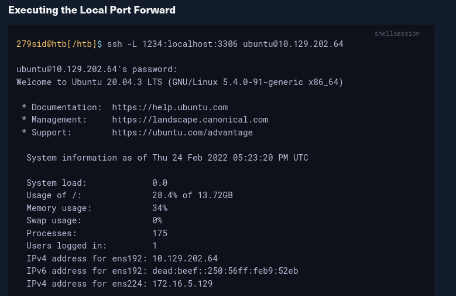

The -L command tells the SSH client to request the SSH server to forward all the data we send via the port 1234 to localhost:3306 on the Ubuntu server. By doing this, we should be able to access the MySQL service locally on port 1234. We can use Netstat or Nmap to query our local host on 1234 port to verify whether the MySQL service was forwarded.

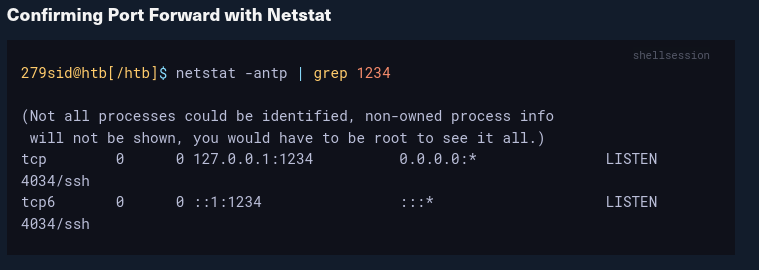

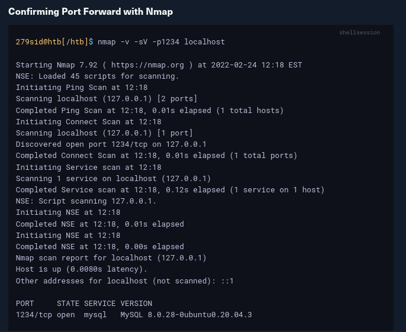

Similarly, if we want to forward multiple ports from the Ubuntu server to your localhost, you can do so by including the local port:server:port argument to your ssh command. For example, the below command forwards the apache web server's port 80 to your attack host's local port on 8080.

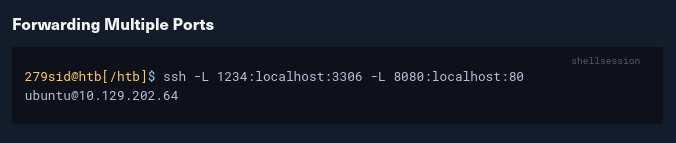

Setting up to Pivot

Now, if you type ifconfig on the Ubuntu host, you will find that this server has multiple NICs:

    One connected to our attack host (ens192)
    One communicating to other hosts within a different network (ens224)
    The loopback interface (lo).

Looking for Opportunities to Pivot using ifconfig

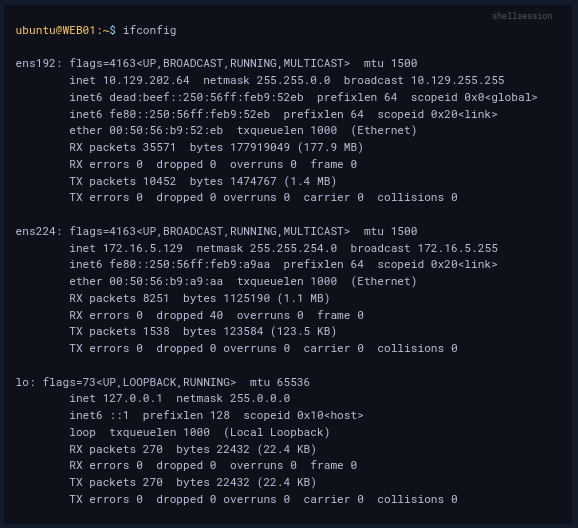

Unlike the previous scenario where we knew which port to access, in our current scenario, we don't know which services lie on the other side of the network. So, we can scan smaller ranges of IPs on the network (172.16.5.1-200) or the entire subnet (172.16.5.0/23). We cannot perform this scan directly from our attack host because it does not have routes to the 172.16.5.0/23 network. To do this, we will have to perform dynamic port forwarding and pivot our network packets via the Ubuntu server. We can do this by starting a SOCKS listener on our local host (personal attack host or Pwnbox) and then configure SSH to forward that traffic via SSH to the network (172.16.5.0/23) after connecting to the target host.

This is called SSH tunneling over SOCKS proxy. SOCKS stands for Socket Secure, a protocol that helps communicate with servers where you have firewall restrictions in place. Unlike most cases where you would initiate a connection to connect to a service, in the case of SOCKS, the initial traffic is generated by a SOCKS client, which connects to the SOCKS server controlled by the user who wants to access a service on the client-side. Once the connection is established, network traffic can be routed through the SOCKS server on behalf of the connected client.

This technique is often used to circumvent the restrictions put in place by firewalls, and allow an external entity to bypass the firewall and access a service within the firewalled environment. One more benefit of using SOCKS proxy for pivoting and forwarding data is that SOCKS proxies can pivot via creating a route to an external server from NAT networks. SOCKS proxies are currently of two types: SOCKS4 and SOCKS5. SOCKS4 doesn't provide any authentication and UDP support, whereas SOCKS5 does provide that. Let's take an example of the below image where we have a NAT'd network of 172.16.5.0/23, which we cannot access directly.

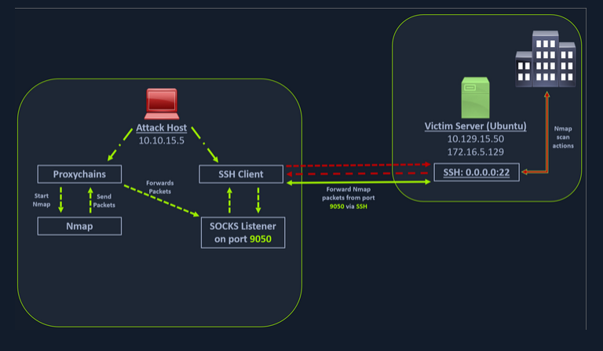

In the above image, the attack host starts the SSH client and requests the SSH server to allow it to send some TCP data over the ssh socket. The SSH server responds with an acknowledgment, and the SSH client then starts listening on localhost:9050. Whatever data you send here will be broadcasted to the entire network (172.16.5.0/23) over SSH. We can use the below command to perform this dynamic port forwarding.

**Enabling Dynamic Port Forwarding with SSH**

```sh
ssh -D 9050 ubuntu@10.129.202.64
```

The -D argument requests the SSH server to enable dynamic port forwarding. Once we have this enabled, we will require a tool that can route any tool's packets over the port 9050. We can do this using the tool proxychains, which is capable of redirecting TCP connections through TOR, SOCKS, and HTTP/HTTPS proxy servers and also allows us to chain multiple proxy servers together. Using proxychains, we can hide the IP address of the requesting host as well since the receiving host will only see the IP of the pivot host. Proxychains is often used to force an application's TCP traffic to go through hosted proxies like SOCKS4/SOCKS5, TOR, or HTTP/HTTPS proxies.

To inform proxychains that we must use port 9050, we must modify the proxychains configuration file located at /etc/proxychains.conf. We can add socks4 127.0.0.1 9050 to the last line if it is not already there.

**Checking /etc/proxychains.conf**

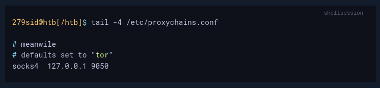

Now when you start Nmap with proxychains using the below command, it will route all the packets of Nmap to the local port 9050, where our SSH client is listening, which will forward all the packets over SSH to the 172.16.5.0/23 network.

**Using Nmap with Proxychains**
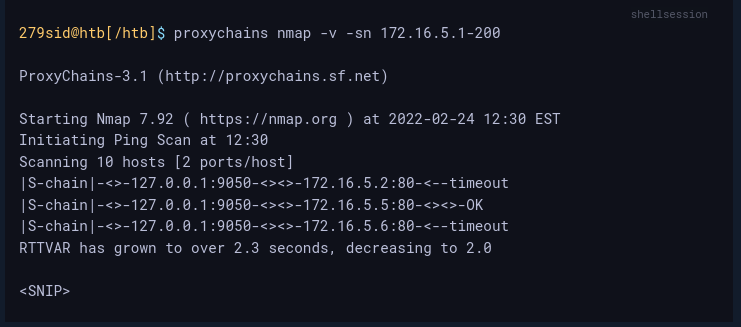

This part of packing all your Nmap data using proxychains and forwarding it to a remote server is called SOCKS tunneling. One more important note to remember here is that we can only perform a full TCP connect scan over proxychains. The reason for this is that proxychains cannot understand partial packets. If you send partial packets like half connect scans, it will return incorrect results. We also need to make sure we are aware of the fact that host-alive checks may not work against Windows targets because the Windows Defender firewall blocks ICMP requests (traditional pings) by default.

A full TCP connect scan without ping on an entire network range will take a long time. So, for this module, we will primarily focus on scanning individual hosts, or smaller ranges of hosts we know are alive, which in this case will be a Windows host at 172.16.5.19

We will perform a remote system scan using the below command.
**Enumerating the Windows Target through Proxychains**


The Nmap scan shows several open ports, one of which is RDP port (3389). Similar to the Nmap scan, we can also pivot msfconsole via proxychains to perform vulnerable RDP scans using Metasploit auxiliary modules. We can start msfconsole with proxychains.
**Using Metasploit with Proxychains**

We can also open Metasploit using proxychains and send all associated traffic through the proxy we have established.

```sh
proxychains msfconsole
```

Let's use the rdp_scanner auxiliary module to check if the host on the internal network is listening on 3389.
Using rdp_scanner Module

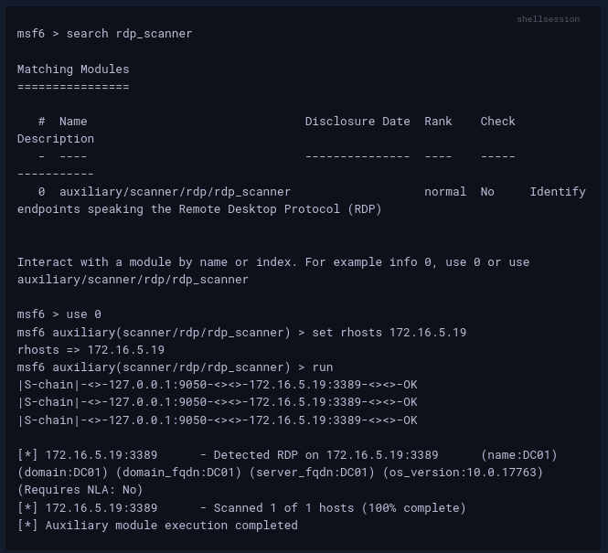

At the bottom of the output above, we can see the RDP port open with the Windows OS version.

Depending on the level of access we have to this host during an assessment, we may try to run an exploit or log in using gathered credentials. For this module, we will log in to the Windows remote host over the SOCKS tunnel. This can be done using xfreerdp. The user in our case is victor, and the password is pass@123

**Using xfreerdp with Proxychains**


The xfreerdp command will require an RDP certificate to be accepted before successfully establishing the session. After accepting it, we should have an RDP session, pivoting via the Ubuntu server.

**Successful RDP Pivot**


