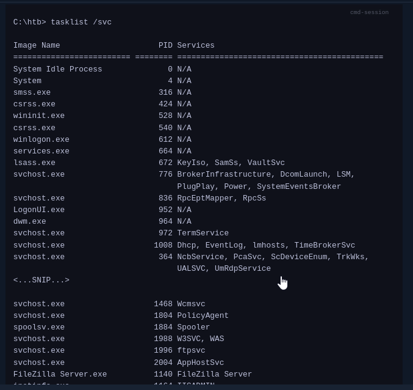
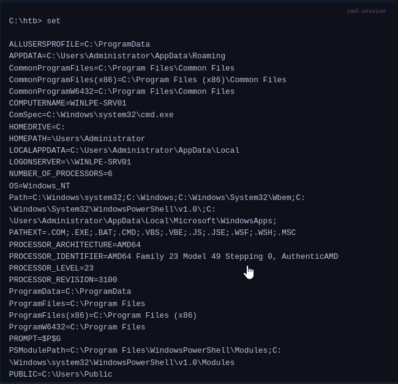
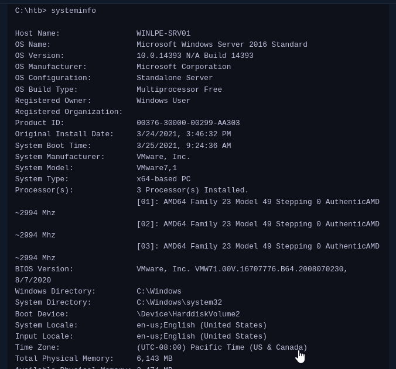
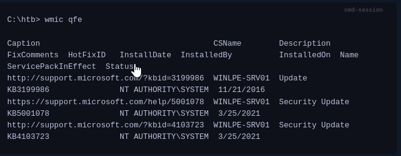
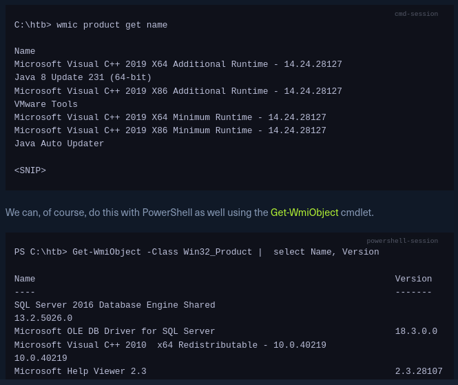
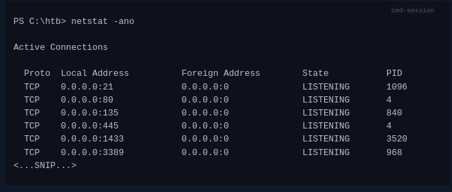

During an assessment, we may gain a low-privileged shell on a Windows host (domain-joined or not) and need to perform privilege escalation to further our access. Fully compromising the host may gain us access to sensitive files/file shares, grant us the ability to capture traffic to obtain more credentials, or obtain credentials that can help further our access or even escalate directly to Domain Admin in an Active Directory environment. We can escalate privileges to one of the following depending on the system configuration and what type of data we encounter:

The highly privileged **NT AUTHORITY\SYSTEM account, or LocalSystem account** which is a highly privileged account with more privileges than a local administrator account and is used to run most Windows services.
The built-in local **administrator accoun**t. Some organizations disable this account, but many do not. It is not uncommon to see this account reused across multiple systems in a client environment.
Another local account that is a **member of the local Administrators group**. Any account in this group will have the same privileges as the built-in administrator account.
A standard (non-privileged) domain user who is part of the **local Administrators group.**
A domain admin (highly privileged in the Active Directory environment) that is part of the **local Administrators group.**

Enumeration is the key to privilege escalation. When we gain initial shell access to the host, it is vital to gain situational awareness and uncover details relating to the OS version, patch level, installed software, current privileges, group memberships, and more. Let's walk through some of the key data points that we should be reviewing after gaining initial access. This is not an exhaustive list by any means, and the various enumeration scripts/tools that we covered in the previous section cover all of these data points and many, many more. Nonetheless, it is essential to understand how to perform these tasks manually, especially if we find ourselves in an environment where we cannot load tools due to network restrictions, lack of internet access, or protections in place.

This Windows commands reference(https://docs.microsoft.com/en-us/windows-server/administration/windows-commands/windows-commands) is very handy for performing manual enumeration tasks.

### Key Data Points

OS name: Knowing the type of Windows OS (workstation or server) and level (Windows 7 or 10, Server 2008, 2012, 2016, 2019, etc.) will give us an idea of the types of tools that may be available (such as the PowerShell version), or lack thereof on legacy systems. This would also identify the operating system version for which there may be public exploits available.

Version: As with the OS version, there may be public exploits that target a vulnerability in a specific version of Windows. Windows system exploits can cause system instability or even a complete crash. Be careful running these against any production system, and make sure you fully understand the exploit and possible ramifications before running one.

Running Services: Knowing what services are running on the host is important, especially those running as NT AUTHORITY\SYSTEM or an administrator-level account. A misconfigured or vulnerable service running in the context of a privileged account can be an easy win for privilege escalation.

Let's take a more in-depth look.
System Information

Looking at the system itself will give us a better idea of the exact operating system version, hardware in use, installed programs, and security updates. This will help us narrow down our hunt for any missing patches and associated CVEs that we may be able to leverage to escalate privileges. Using the tasklist command to look at running processes will give us a better idea of what applications are currently running on the system.
#### Tasklist
```cmd
tasklist /svc
```



It is essential to become familiar with standard Windows processes such as Session Manager Subsystem (smss.exe), Client Server Runtime Subsystem (csrss.exe), WinLogon (winlogon.exe), Local Security Authority Subsystem Service (LSASS), and Service Host (svchost.exe), among others and the services associated with them. Being able to spot standard processes/services quickly will help speed up our enumeration and enable us to hone in on non-standard processes/services, which may open up a privilege escalation path. In the example above, we would be most interested in the FileZilla FTP server running and would attempt to enumerate the version to look for public vulnerabilities or misconfigurations such as FTP anonymous access, which could lead to sensitive data exposure or more.

Other processes such as MsMpEng.exe, Windows Defender, are interesting because they can help us map out what protections are in place on the target host that we may have to evade/bypass.
Display All Environment Variables

The environment variables explain a lot about the host configuration. To get a printout of them, Windows provides the set command. One of the most overlooked variables is PATH. In the output below, nothing is out of the ordinary. However, it is not uncommon to find administrators (or applications) modify the PATH. One common example is to place Python or Java in the path, which would allow the execution of Python or . JAR files. If the folder placed in the PATH is writable by your user, it may be possible to perform DLL Injections against other applications. Remember, when running a program, Windows looks for that program in the CWD (Current Working Directory) first, then from the PATH going left to right. This means if the custom path is placed on the left (before C:\Windows\System32), it is much more dangerous than on the right.

In addition to the PATH, set can also give up other helpful information such as the HOME DRIVE. In enterprises, this will often be a file share. Navigating to the file share itself may reveal other directories that can be accessed. It is not unheard of to be able to access an "IT Directory," which contains an inventory spreadsheet that includes passwords. Additionally, shares are utilized for home directories so the user can log on to other computers and have the same experience/files/desktop/etc. (Roaming Profiles). This may also mean the user takes malicious items with them. If a file is placed in USERPROFILE\AppData\Microsoft\Windows\Start Menu\Programs\Startup, when the user logs into a different machine, this file will execute.
```cmd
set
```


### View Detailed Configuration Information

The systeminfo command will show if the box has been patched recently and if it is a VM. If the box has not been patched recently, getting administrator-level access may be as simple as running a known exploit. Google the KBs installed under HotFixes to get an idea of when the box has been patched. This information isn't always present, as it is possible to hide hotfixes software from non-administrators. The System Boot Time and OS Version can also be checked to get an idea of the patch level. If the box has not been restarted in over six months, chances are it is also not being patched.

Additionally, many guides will say the Network Information is important as it could indicate a dual-homed machine (connected to multiple networks). Generally speaking, when it comes to enterprises, devices will just be granted access to other networks via a firewall rule and not have a physical cable run to them.
```cmd
systeminfo
```

### Patches and Updates

If systeminfo doesn't display hotfixes, they may be queriable with WMI using the WMI-Command binary with QFE (Quick Fix Engineering) to display patches.
```cmd
wmic qfe
```

We can do this with PowerShell as well using the Get-Hotfix cmdlet.
```PS
Get-HotFix | ft -AutoSize
```

### Installed Programs

WMI can also be used to display installed software. This information can often guide us towards hard-to-find exploits. Is FileZilla/Putty/etc installed? Run LaZagne to check if stored credentials for those applications are installed. Also, some programs may be installed and running as a service that is vulnerable.
```cmd
wmic product get name
```


### Display Running Processes

The netstat command will display active TCP and UDP connections which will give us a better idea of what services are listening on which port(s) both locally and accessible to the outside. We may find a vulnerable service only accessible to the local host (when logged on to the host) that we can exploit to escalate privileges.
#### Netstat
```PS
netstat -ano
```

### User & Group Information

Users are often the weakest link in an organization, especially when systems are configured and patched well. It is essential to gain an understanding of the users and groups on the system, members of specific groups that can provide us with admin level access, the privileges our current user has, password policy information, and any logged on users that we may be able to target. We may find the system to be well patched, but a member of the local administrators group's user directory is browsable and contains a password file such as logins.xlsx, resulting in a very easy win.
#### Logged-In Users

It is always important to determine what users are logged into a system. Are they idle or active? Can we determine what they are working on? While more challenging to pull off, we can sometimes attack users directly to escalate privileges or gain further access. During an evasive engagement, we would need to tread lightly on a host with other user(s) actively working on it to avoid detection.
```cmd
query user
```
#### Current User

When we gain access to a host, we should always check what user context our account is running under first. Sometimes, we are already SYSTEM or equivalent! Suppose we gain access as a service account. In that case, we may have privileges such as SeImpersonatePrivilege, which can often be easily abused to escalate privileges using a tool such as Juicy Potato.
```cmd
echo %USERNAME%
```
#### Current User Privileges

As mentioned prior, knowing what privileges our user has can greatly help in escalating privileges. We will look at individual user privileges and escalation paths later in this module.
```cmd
whoami /priv
```
#### Current User Group Information

Has our user inherited any rights through their group membership? Are they privileged in the Active Directory domain environment, which could be leveraged to gain access to more systems?
```cmd
whoami /groups
```

#### Get All Users

Knowing what other users are on the system is important as well. If we gained RDP access to a host using credentials we captured for a user bob, and see a bob_adm user in the local administrators group, it is worth checking for credential re-use. Can we access the user profile directory for any important users? We may find valuable files such as scripts with passwords or SSH keys in a user's Desktop, Documents, or Downloads folder.
```cmd
net user
```
#### Get All Groups

Knowing what non-standard groups are present on the host can help us determine what the host is used for, how heavily accessed it is, or may even lead to discovering a misconfiguration such as all Domain Users in the Remote Desktop or local administrators groups.
```cmd
net localgroup
```
#### Details About a Group

It is worth checking out the details for any non-standard groups. Though unlikely, we may find a password or other interesting information stored in the group's description. During our enumeration, we may discover credentials of another non-admin user who is a member of a local group that can be leveraged to escalate privileges.
```cmd
net localgroup administrators
```
#### Get Password Policy & Other Account Information
```cmd
net accounts
```
