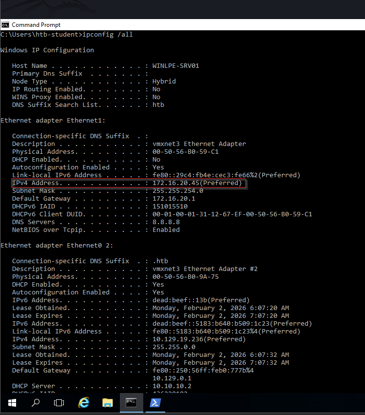
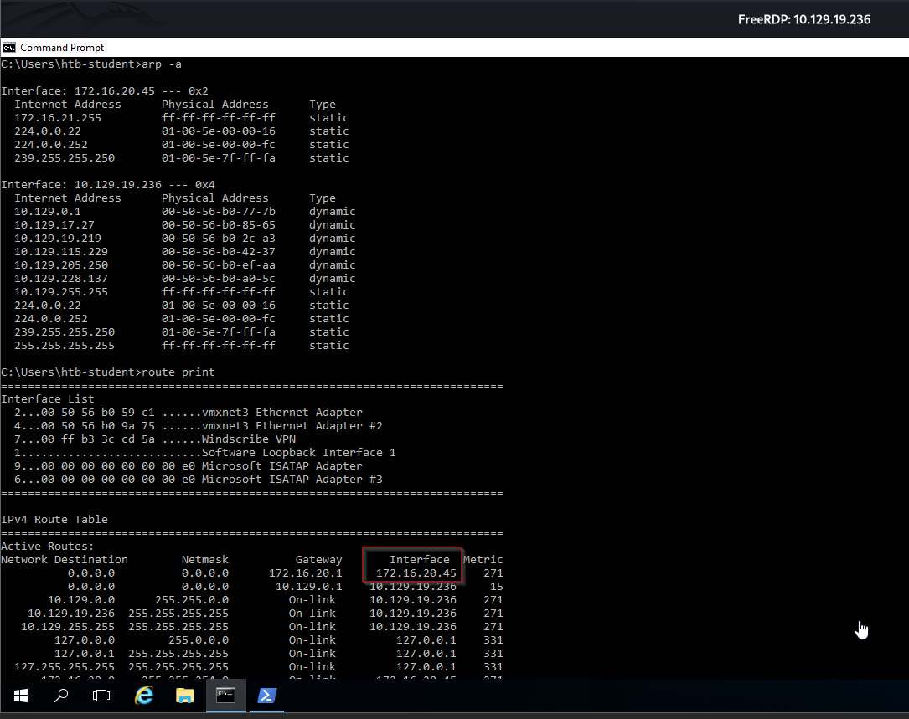
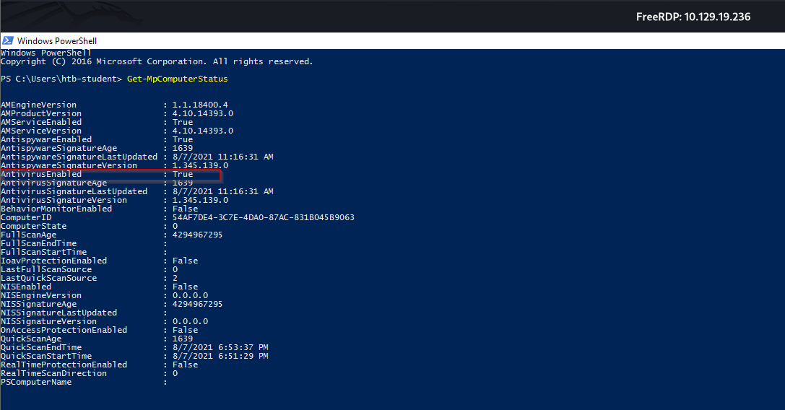
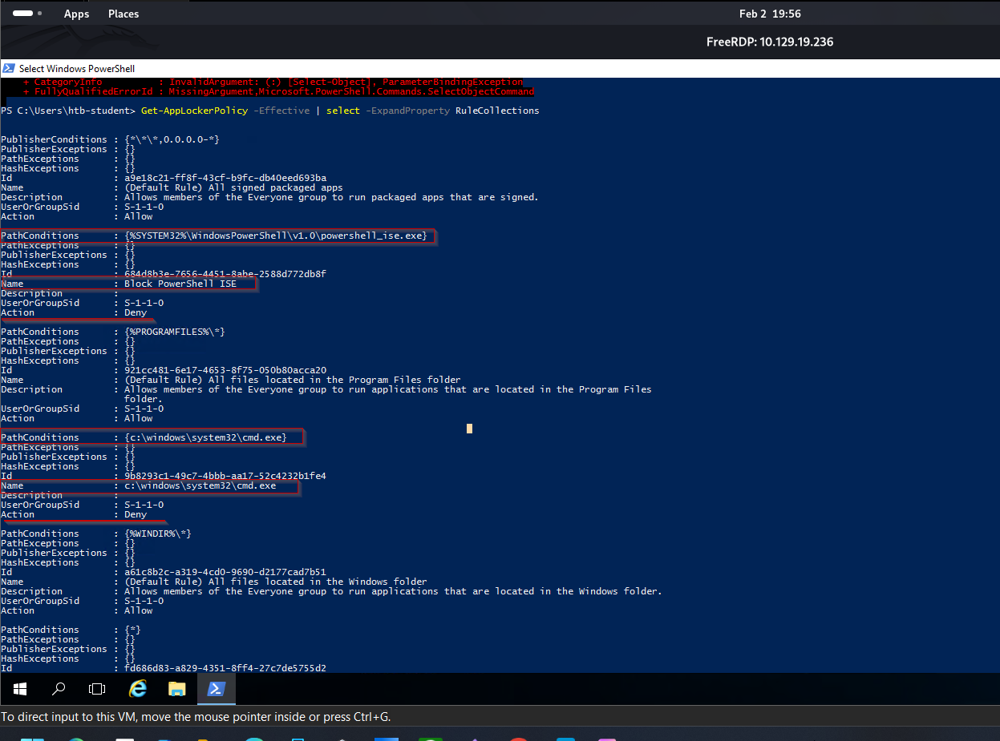

### Network Information

Gathering network information is a crucial part of our enumeration. We may find that the host is dual-homed and that compromising the host may allow us to move laterally into another part of the network that we could not access previously. Dual-homed means that the host or server belongs to two or more different networks and, in most cases, has several virtual or physical network interfaces. We should always look at routing tables to view information about the local network and networks around it. We can also gather information about the local domain (if the host is part of an Active Directory environment), including the IP addresses of domain controllers. It is also important to use the arp command to view the ARP cache for each interface and view other hosts the host has recently communicated with. This could help us with lateral movement after obtaining credentials. It could be a good indication of which hosts administrators are connecting to via RDP or WinRM from this host.

This network information may help directly or indirectly with our local privilege escalation. It may lead us down another path to a system that we can access or escalate privileges on or reveal information that we can use for lateral movement to further our access after escalating privileges on the current system.
Interface(s), IP Address(es), DNS Information
```cmd
ipconfig /all
```
```cmd
arp -a
```



### Enumerating Protections

Most modern environments have some sort of anti-virus or Endpoint Detection and Response (EDR) service running to monitor, alert on, and block threats proactively. These tools may interfere with the enumeration process. They will very likely present some sort of challenge during the privilege escalation process, especially if we are using some kind of public PoC exploit or tool. Enumerating protections in place will help us ensure that we are using methods that are not being blocked or detected and will help us if we have to craft custom payloads or modify tools before compiling them.

Many organizations utilize some sort of application whitelisting solution to control what types of applications and files certain users can run. This may be used to attempt to block non-admin users from running cmd.exe or powershell.exe or other binaries and file types not needed for their day-to-day work. A popular solution offered by Microsoft is AppLocker. We can use the GetAppLockerPolicy cmdlet to enumerate the local, effective (enforced), and domain AppLocker policies. This will help us see what binaries or file types may be blocked and whether we will have to perform some sort of AppLocker bypass either during our enumeration or before running a tool or technique to escalate privileges.

In a real-world engagement, the client will likely have protections in place that detect the most common tools/scripts (including those introduced in the previous section). There are ways to deal with these, and enumerating the protections in use can help us modify our tools in a lab environment and test them before using them against a client system. Some EDR tools detect on or even block usage of common binaries such as net.exe, tasklist, etc. Organizations may restrict what binaries a user can run or immediately flag suspicious activities, such as an accountant's machine showing specific binaries being run via cmd.exe. Early enumeration and a deep understanding of the client's environment and workarounds against common AV and EDR solutions can save us time during a non-evasive engagement and make or break an evasive engagement.

```PS
Get-MpComputerstatus
```

```PS
Get-AppLockerPolicy -Effective | select -ExpandProperty RuleCollections
```

### To test Applockerpolicy
```PS
 Get-AppLockerPolicy -Local |test-appLockerPolicy -path c:\windows\system32\cmd.exe -User Everyone
```


