## Laudanum
### Laudanum Demonstration

Now that we understand what Laudanum is and how it works, let's look at a web application we have found in our lab environment and see if we can run a web shell. If you wish to follow along with this demonstration, you will need to add an entry into your `/etc/hosts` file on your attack VM or within Pwnbox for the host we are attacking. That entry should read: `<target ip> status.inlanefreight.local`. Once this is done, you can play and explore this demonstration as long as you are on the VPN or using Pwnbox.

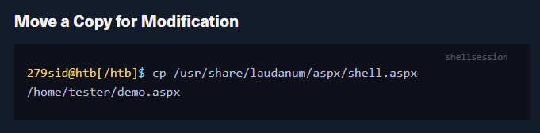

Add your IP address to the `allowedIps` variable on line `59`. Make any other changes you wish. It can be prudent to remove the ASCII art and comments from the file. These items in a payload are often signatured on and can alert the defenders/AV to what you are doing.
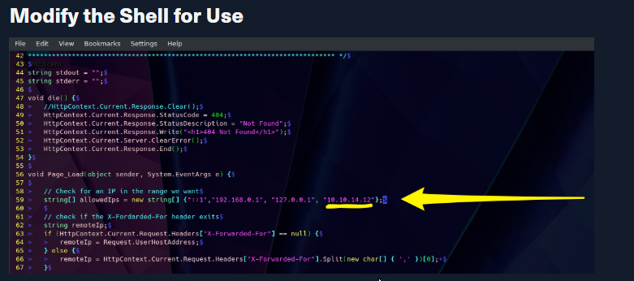

We are taking advantage of the upload function at the bottom of the status page(`Green Arrow`) for this to work. Select your shell file and hit upload. If successful, it should print out the path to where the file was saved (Yellow Arrow). Use the upload function. Success prints out where the file went, navigate to it.

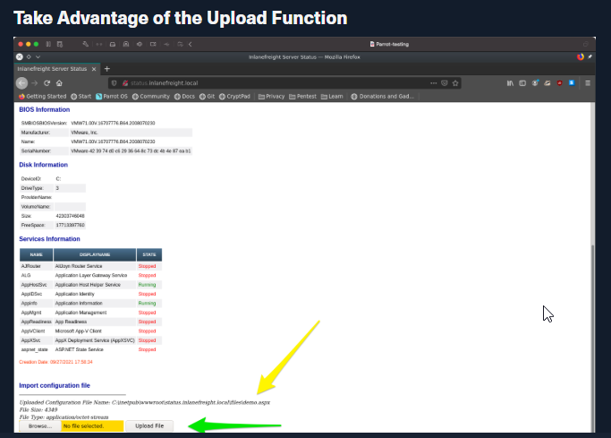
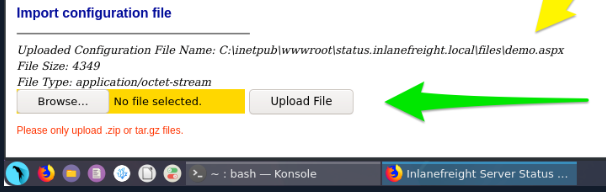

Once the upload is successful, you will need to navigate to your web shell to utilize its functions. The image below shows us how to do it. As seen from the last image, our shell was uploaded to the `\\files\` directory, and the name was kept the same. This won't always be the case. You may run into some implementations that randomize filenames on upload that do not have a public files directory or any number of other potential safeguards. For now, we are lucky that's not the case. With this particular web application, our file went to `status.inlanefreight.local\\files\demo.aspx` and will require us to browse for the upload by using that \ in the path instead of the / like normal. Once you do this, your browser will clean it up in your URL window to appear as `status.inlanefreight.local//files/demo.aspx`.

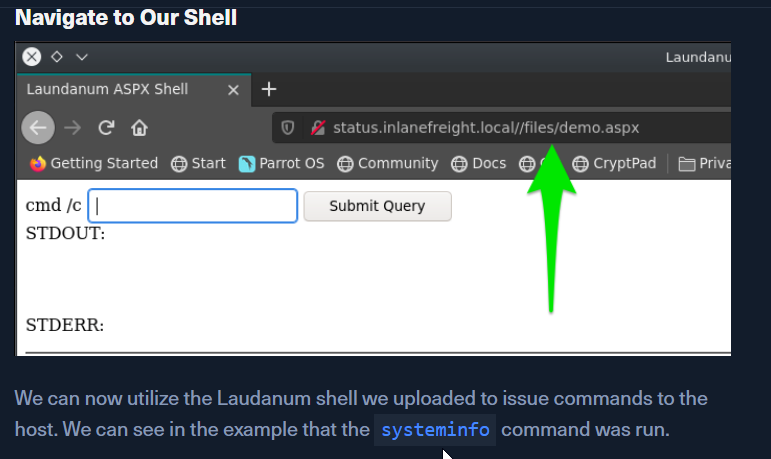
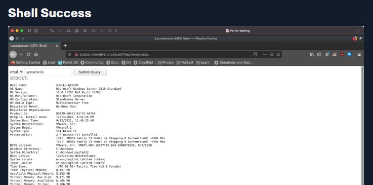

### Antak Webshell

Antak is a web shell built in ASP.Net included within the [Nishang project](https://github.com/samratashok/nishang). Nishang is an Offensive PowerShell toolset that can provide options for any portion of your pentest. Since we are focused on web applications for the moment, let's keep our eyes on `Antak`. Antak utilizes PowerShell to interact with the host, making it great for acquiring a web shell on a Windows server. The UI is even themed like PowerShell. It's time to dive in and experiment with Antak.

#### Working with Antak

The Antak files can be found in the `/usr/share/nishang/Antak-WebShell` directory.
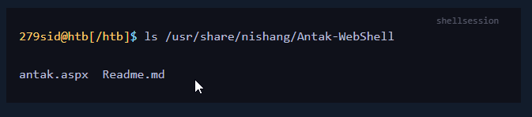

Antak web shell functions like a Powershell Console. However, it will execute each command as a new process. It can also execute scripts in memory and encode commands you send. As a web shell, Antak is a pretty powerful tool.
#### Antak Demonstration

Now that we understand what Antak is and how it works let's put it to the test against the same web application from the Laudanum section. If you wish to follow along with this demonstration, you will need to add an entry into your `/etc/hosts` file on your attack VM or within Pwnbox for the host we are attacking. That entry should read: `<target ip> status.inlanefreight.local`. Once this is done, as long as you are on the VPN or using Pwnbox, you can also play and explore this demonstration.

#### Move a Copy for Modification

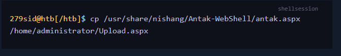

Make sure you set credentials for access to the web shell. Modify `line 14`, adding a user (green arrow) and password (orange arrow). This comes into play when you browse to your web shell, much like Laudanum. This can help make your operations more secure by ensuring random people can't just stumble into using the shell. It can be prudent to remove the ASCII art and comments from the file. These items in a payload are often signatured on and can alert the defenders/AV to what you are doing.

#### Modify the Shell for Use
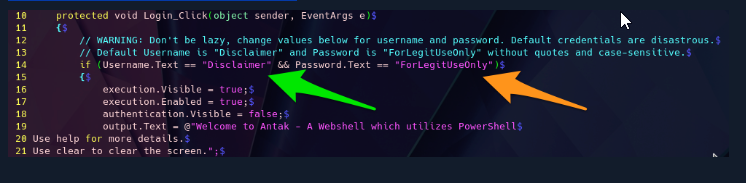

For the sake of demonstrating the tool, we are uploading it to the same status portal we used for Laudanum. That host was a Windows host, so our shell should work just fine with PowerShell. Upload the file and then navigate to the page for use. It will give you a user and password prompt. Remember, with this web application, the files are stored in the `\\files\` directory. When you navigate to the `upload.aspx` file, you should see a prompt as we have below.

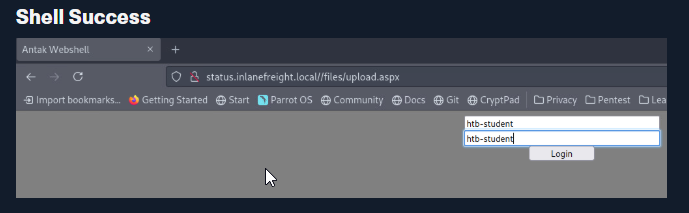

As seen in the following image, we will be granted access if our credentials are entered properly.

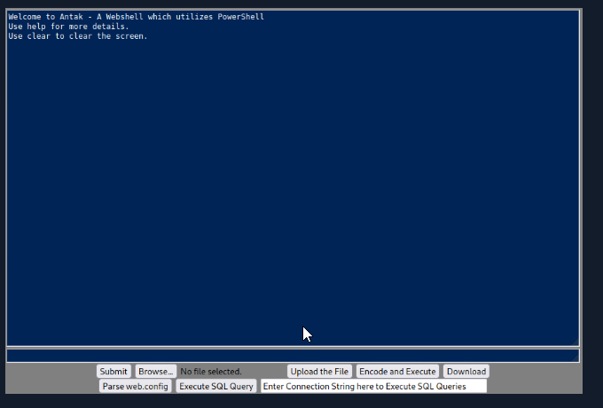

Now that we have access, we can utilize PowerShell commands to navigate and take actions against the host. We can issue basic commands from the Antak shell window, upload and download files, encode and execute scripts, and much more (green arrow below). This is an excellent way to utilize a Webshell to deliver us a callback to our command and control platform. We could upload the payload via the Upload function or use a PowerShell one-liner to download and execute the shell for us. If you feel unsure where to start, issue the command `help` in the prompt window (orange arrow ) below.

