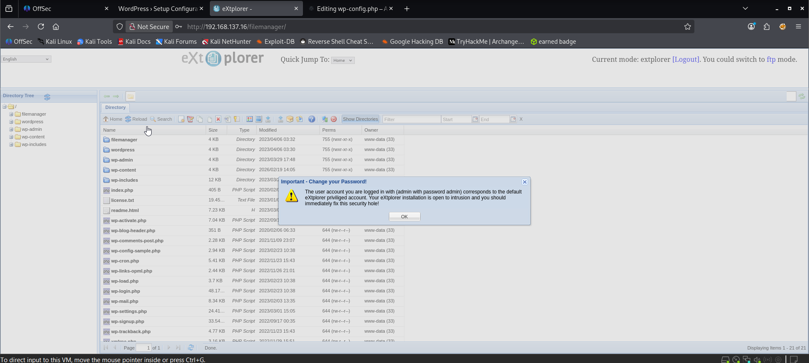
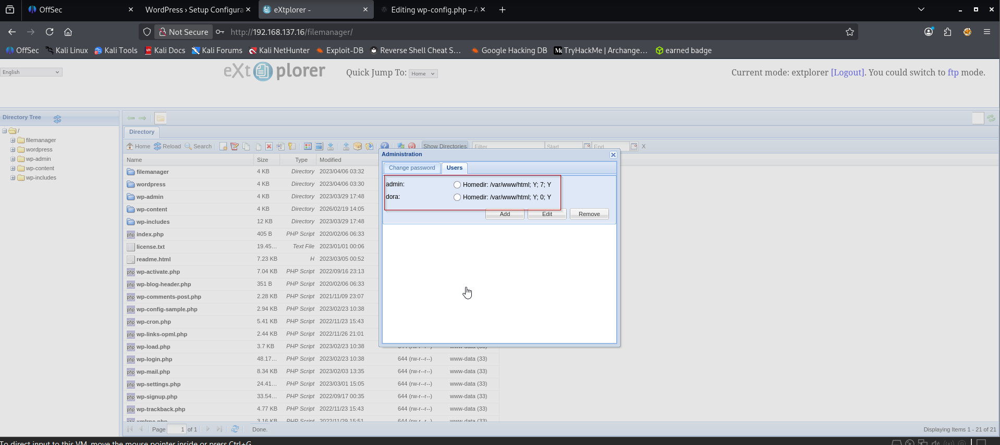
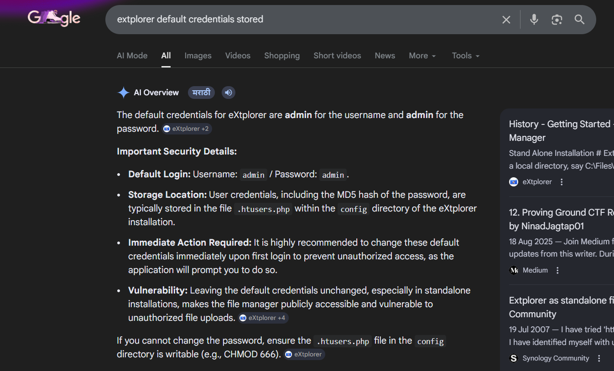
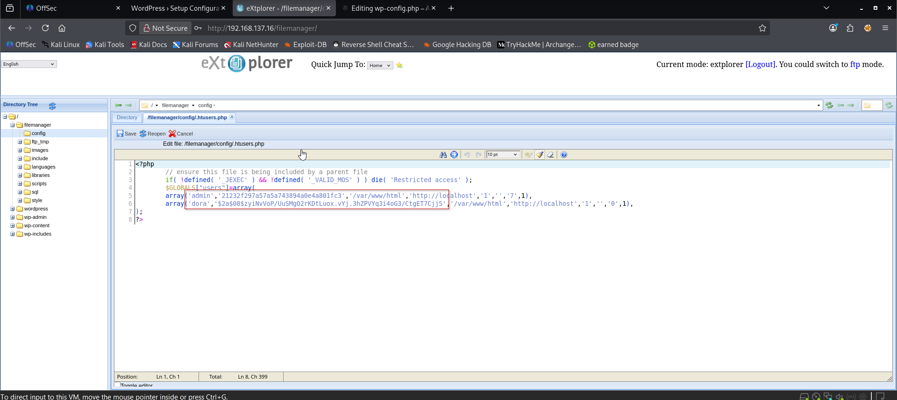
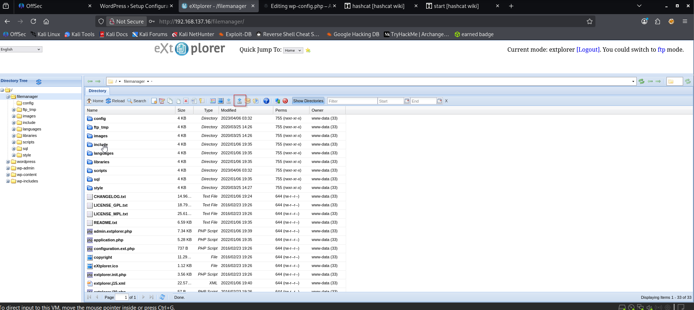
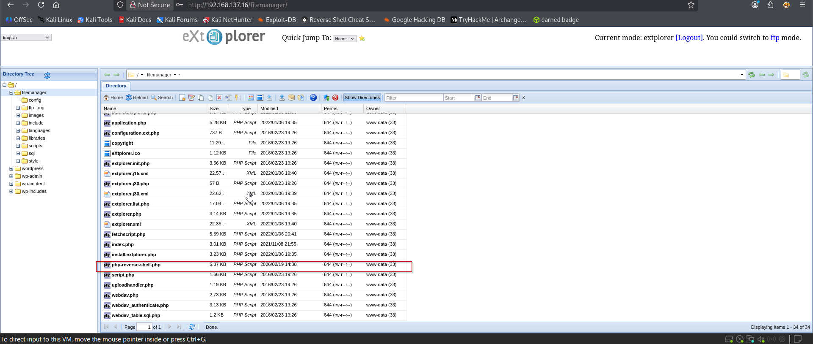
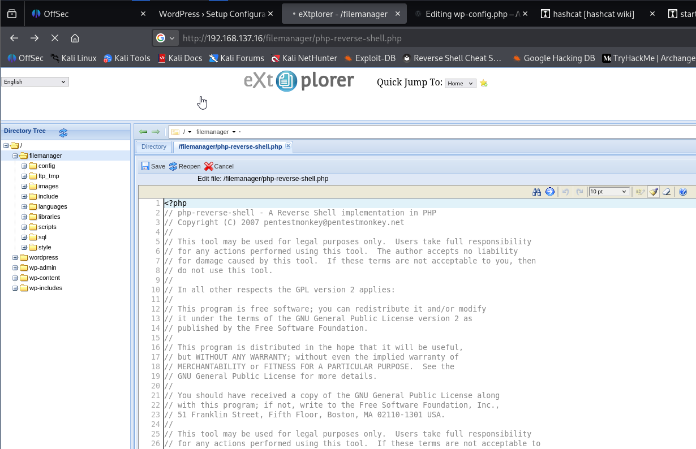
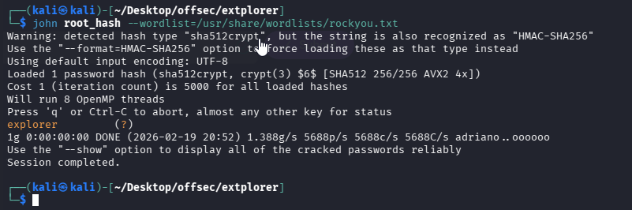
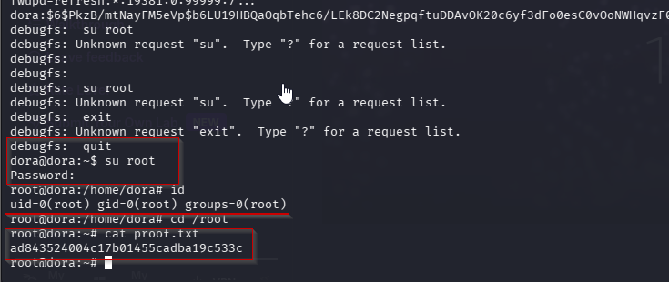

Nmap scan
```sh
nmap -p- --min-rate 5000 -T4 -Pn 192.168.137.16
Starting Nmap 7.95 ( https://nmap.org ) at 2026-02-19 19:21 IST
Nmap scan report for 192.168.137.16
Host is up (0.074s latency).
Not shown: 65533 filtered tcp ports (no-response)
PORT   STATE SERVICE
22/tcp open  ssh
80/tcp open  http

Nmap done: 1 IP address (1 host up) scanned in 26.70 seconds
```

```sh
nmap -sC -sV -T4 -Pn -p 22,80 192.168.137.16   
Starting Nmap 7.95 ( https://nmap.org ) at 2026-02-19 19:22 IST
Nmap scan report for 192.168.137.16
Host is up (0.087s latency).

PORT   STATE SERVICE VERSION
22/tcp open  ssh     OpenSSH 8.2p1 Ubuntu 4ubuntu0.5 (Ubuntu Linux; protocol 2.0)
| ssh-hostkey: 
|   3072 98:4e:5d:e1:e6:97:29:6f:d9:e0:d4:82:a8:f6:4f:3f (RSA)
|   256 57:23:57:1f:fd:77:06:be:25:66:61:14:6d:ae:5e:98 (ECDSA)
|_  256 c7:9b:aa:d5:a6:33:35:91:34:1e:ef:cf:61:a8:30:1c (ED25519)
80/tcp open  http    Apache httpd 2.4.41 ((Ubuntu))
|_http-server-header: Apache/2.4.41 (Ubuntu)
Service Info: OS: Linux; CPE: cpe:/o:linux:linux_kernel

Service detection performed. Please report any incorrect results at https://nmap.org/submit/ .
Nmap done: 1 IP address (1 host up) scanned in 108.11 seconds
```
By dir brute forcing, we found /filemanager.
Go to the path URL/filemanager would see a simple login screen, after testing with the weak password combination **“admin:admin”.** We are able to get into the filemanager web service.

We tried default creds `admin : admin`


In the administration page, we could see that there are two users in this application admin and dora. Both of the users are having the home directory as /var/www/html, this indicating all the files uploaded to the path would be published on the HTTP/80 port as website. This could be our entry point to the server.

**At this stage, we conducted some basic research to understand where the application stores its user credentials**

**I navigated to that location and found the stored credentials.**

```
admin : 21232f297a57a5a743894a0e4a801fc3
dora : $2a$08$zyiNvVoP/UuSMgO2rKDtLuox.vYj.3hZPVYq3i4oG3/CtgET7CjjS
```

### Cracking the hash
**We found two users: admin and dora. The admin credentials were stored as an MD5 hash. For dora, we need to crack the password hash, so we will use John the Ripper**

`dora : doraemon`
We attempted SSH access with Dora’s credentials, but SSH login was not available for this user. Next, we shifted to the web application and found a file upload column.

We found that the application accepts PHP files, so we uploaded a PHP reverse shell to gain a reverse connection.

We modified the uploaded PHP file and successfully received a reverse shell connection.

Note : Do not open file through double clicking the shell file as it wont give you shell. Open it by pasting the file name in URl.


We got the shell.

We found a local.txt file but did not have permission to read it. Using previously obtained credentials, we were able to access and read local.txt


### Privilege Escalation — user with disk group

In the linpeas result, the disk group of the user dora is highlighted in the result which indicating this is a high potential privilege escalation point.


Googling the Disk user, there is a page published on Hacktricks about privilege escalation using disk group.
https://www.hackingarticles.in/disk-group-privilege-escalation/

reading the shadow file using debugfs for cracking the password

```
root:$6$AIWcIr8PEVxEWgv1$3mFpTQAc9Kzp4BGUQ2sPYYFE/dygqhDiv2Yw.XcU.Q8n1YO05.a/4.D/x4ojQAkPnv/v7Qrw7Ici7.hs0sZiC.:19453:0:99999:7:::
```
Cracking the password using john.

`root : explorer`
Now switch the user to root in shell only.

