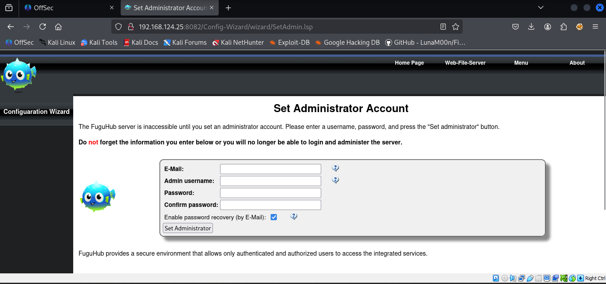
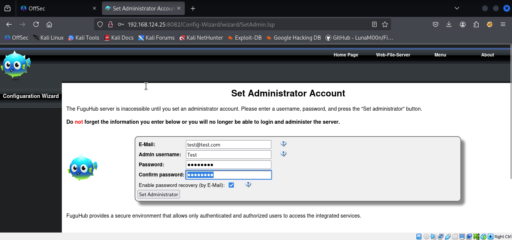

Nmap scan
```sh
 nmap -p- --min-rate 5000 -T4 -Pn 192.168.124.25
Starting Nmap 7.95 ( https://nmap.org ) at 2026-03-02 14:52 IST
Warning: 192.168.124.25 giving up on port because retransmission cap hit (6).
Stats: 0:00:51 elapsed; 0 hosts completed (1 up), 1 undergoing SYN Stealth Scan
SYN Stealth Scan Timing: About 97.29% done; ETC: 14:53 (0:00:01 remaining)
Nmap scan report for 192.168.124.25
Host is up (0.70s latency).
Not shown: 48048 closed tcp ports (reset), 17483 filtered tcp ports (no-response)
PORT     STATE SERVICE
22/tcp   open  ssh
80/tcp   open  http
8082/tcp open  blackice-alerts
9999/tcp open  abyss

Nmap done: 1 IP address (1 host up) scanned in 94.28 seconds
```

```sh
 nmap -sC -sV -T4 -Pn -p 22,80,8082,9999 192.168.124.25     
Starting Nmap 7.95 ( https://nmap.org ) at 2026-03-02 14:55 IST
Nmap scan report for 192.168.124.25
Host is up (0.62s latency).

PORT     STATE SERVICE  VERSION
22/tcp   open  ssh      OpenSSH 8.4p1 Debian 5+deb11u1 (protocol 2.0)
| ssh-hostkey: 
|   3072 c9:c3:da:15:28:3b:f1:f8:9a:36:df:4d:36:6b:a7:44 (RSA)
|   256 26:03:2b:f6:da:90:1d:1b:ec:8d:8f:8d:1e:7e:3d:6b (ECDSA)
|_  256 fb:43:b2:b0:19:2f:d3:f6:bc:aa:60:67:ab:c1:af:37 (ED25519)
80/tcp   open  http     nginx 1.18.0
|_http-server-header: nginx/1.18.0
|_http-title: 403 Forbidden
8082/tcp open  http     Barracuda Embedded Web Server
| http-methods: 
|_  Potentially risky methods: PROPFIND PATCH PUT COPY DELETE MOVE MKCOL PROPPATCH LOCK UNLOCK
|_http-title: Home
|_http-server-header: BarracudaServer.com (Posix)
| http-webdav-scan: 
|   Server Type: BarracudaServer.com (Posix)
|   WebDAV type: Unknown
|   Server Date: Mon, 02 Mar 2026 09:25:56 GMT
|_  Allowed Methods: OPTIONS, GET, HEAD, PROPFIND, PATCH, POST, PUT, COPY, DELETE, MOVE, MKCOL, PROPFIND, PROPPATCH, LOCK, UNLOCK
9999/tcp open  ssl/http Barracuda Embedded Web Server
|_http-title: Home
| http-webdav-scan: 
|   Server Type: BarracudaServer.com (Posix)
|   WebDAV type: Unknown
|   Server Date: Mon, 02 Mar 2026 09:25:57 GMT
|_  Allowed Methods: OPTIONS, GET, HEAD, PROPFIND, PATCH, POST, PUT, COPY, DELETE, MOVE, MKCOL, PROPFIND, PROPPATCH, LOCK, UNLOCK
|_http-server-header: BarracudaServer.com (Posix)
| http-methods: 
|_  Potentially risky methods: PROPFIND PATCH PUT COPY DELETE MOVE MKCOL PROPPATCH LOCK UNLOCK
| ssl-cert: Subject: commonName=FuguHub/stateOrProvinceName=California/countryName=US
| Subject Alternative Name: DNS:FuguHub, DNS:FuguHub.local, DNS:localhost
| Not valid before: 2019-07-16T19:15:09
|_Not valid after:  2074-04-18T19:15:09
Service Info: OS: Linux; CPE: cpe:/o:linux:linux_kernel

Service detection performed. Please report any incorrect results at https://nmap.org/submit/ .
Nmap done: 1 IP address (1 host up) scanned in 30.74 seconds
```

Visiting web server on port 8082.


It appears that Port 8082 is hosting a recently set up FuguHub appliance, which means we need to establish our own admin account. Instant admin access lol.
Searched for public exploits and found one.

