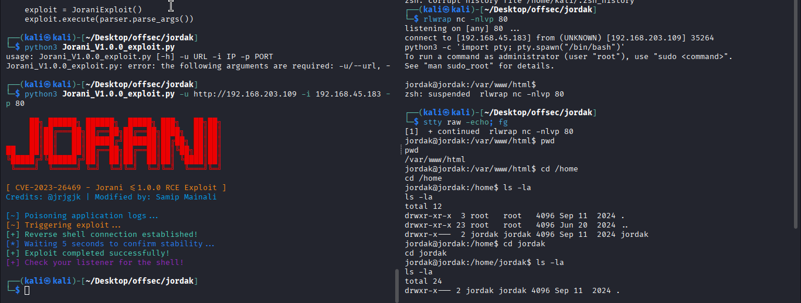
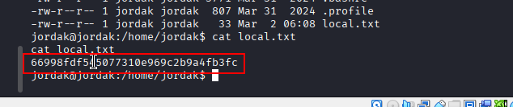
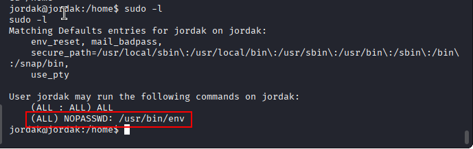
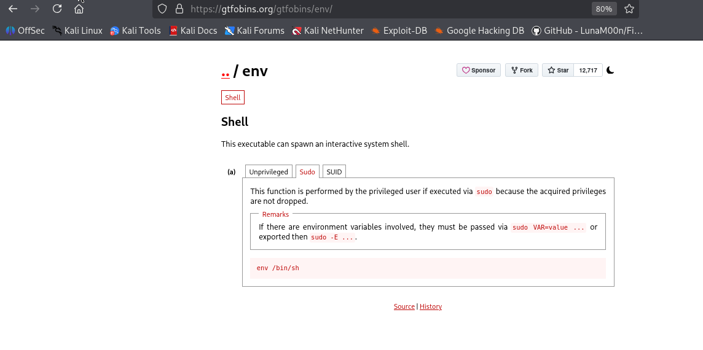
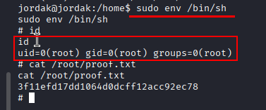

Nmap scan
```sh
nmap -p- --min-rate 5000 -T4 -Pn 192.168.203.109
Starting Nmap 7.95 ( https://nmap.org ) at 2026-03-02 11:39 IST
Warning: 192.168.203.109 giving up on port because retransmission cap hit (6).
Stats: 0:01:30 elapsed; 0 hosts completed (1 up), 1 undergoing SYN Stealth Scan
SYN Stealth Scan Timing: About 99.99% done; ETC: 11:40 (0:00:00 remaining)
Nmap scan report for 192.168.203.109
Host is up (1.6s latency).
Not shown: 47977 closed tcp ports (reset), 17556 filtered tcp ports (no-response)
PORT   STATE SERVICE
22/tcp open  ssh
80/tcp open  http

Nmap done: 1 IP address (1 host up) scanned in 93.89 seconds
```

```sh
nmap -sC -sV -T4 -Pn -p 22,80 192.168.203.109   
Starting Nmap 7.95 ( https://nmap.org ) at 2026-03-02 11:40 IST
Nmap scan report for 192.168.203.109
Host is up (0.43s latency).

PORT   STATE SERVICE VERSION
22/tcp open  ssh     OpenSSH 9.6p1 Ubuntu 3ubuntu13.5 (Ubuntu Linux; protocol 2.0)
| ssh-hostkey: 
|   256 76:18:f1:19:6b:29:db:da:3d:f6:7b:ab:f4:b5:63:e0 (ECDSA)
|_  256 cb:d8:d6:ef:82:77:8a:25:32:08:dd:91:96:8d:ab:7d (ED25519)
80/tcp open  http    Apache httpd 2.4.58 ((Ubuntu))
| http-robots.txt: 1 disallowed entry 
|_/
|_http-trane-info: Problem with XML parsing of /evox/about
|_http-server-header: Apache/2.4.58 (Ubuntu)
|_http-title: Apache2 Ubuntu Default Page: It works
Service Info: OS: Linux; CPE: cpe:/o:linux:linux_kernel

Service detection performed. Please report any incorrect results at https://nmap.org/submit/ .
Nmap done: 1 IP address (1 host up) scanned in 15.21 seconds
```

Visiting web server on port 80.

Clicking on maunal we found login page.

We search for public exploits but we didnt found anything on exploit-db. But, luckily we found RCE exploit on github.
https://github.com/samipmainali/Jorani-Reverse-Shell-v1.0.0/blob/main/Jorani_V1.0.0_exploit.py

We run the exploit and we got shell.

Local flag

### Privilege Escalation
We can notice all users can run below command as root.

We searched for `env` on GTFobins.

We run the command and got root shell.



