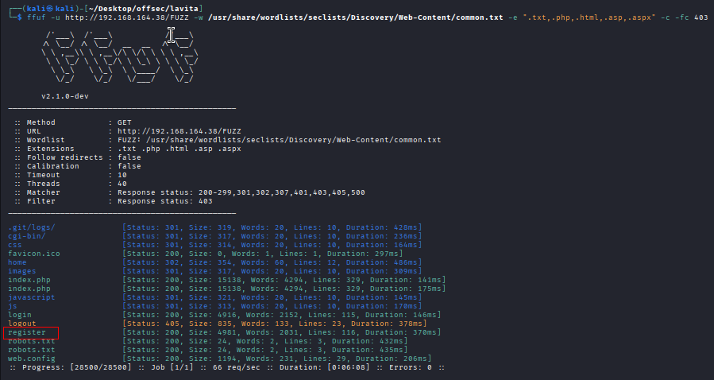
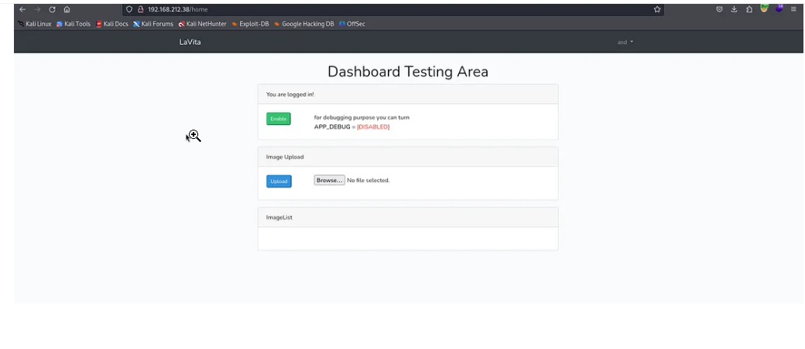
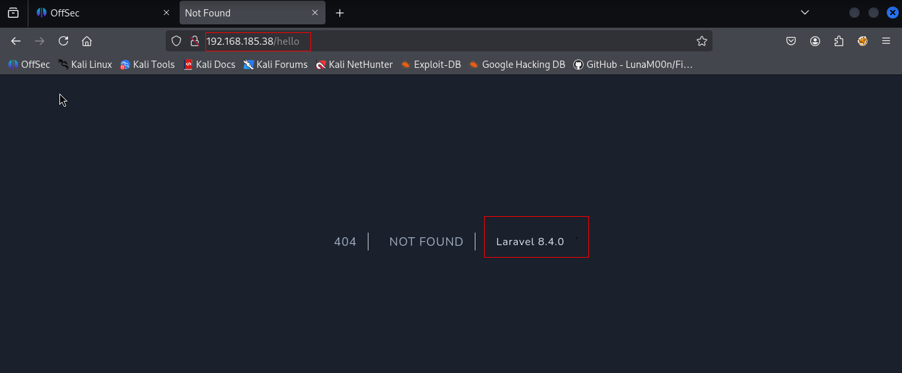
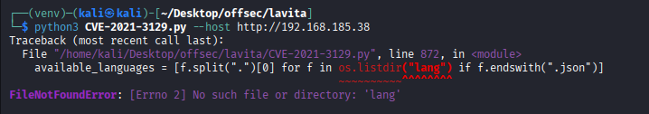

Nmap scan
```sh
nmap -p- --min-rate 5000 -T4 -Pn 192.168.164.38
Starting Nmap 7.95 ( https://nmap.org ) at 2026-02-25 10:14 IST
Warning: 192.168.164.38 giving up on port because retransmission cap hit (6).
Stats: 0:00:31 elapsed; 0 hosts completed (1 up), 1 undergoing SYN Stealth Scan
SYN Stealth Scan Timing: About 86.57% done; ETC: 10:14 (0:00:05 remaining)
Nmap scan report for 192.168.164.38
Host is up (1.2s latency).
Not shown: 65448 closed tcp ports (reset), 85 filtered tcp ports (no-response)
PORT   STATE SERVICE
22/tcp open  ssh
80/tcp open  http

Nmap done: 1 IP address (1 host up) scanned in 45.82 seconds
```

```sh
nmap -sC -sV -T4 -Pn -p 22,80 192.168.164.38   
Starting Nmap 7.95 ( https://nmap.org ) at 2026-02-25 10:16 IST
Nmap scan report for 192.168.164.38
Host is up (0.23s latency).

PORT   STATE SERVICE VERSION
22/tcp open  ssh     OpenSSH 8.4p1 Debian 5+deb11u2 (protocol 2.0)
| ssh-hostkey: 
|   3072 c9:c3:da:15:28:3b:f1:f8:9a:36:df:4d:36:6b:a7:44 (RSA)
|   256 26:03:2b:f6:da:90:1d:1b:ec:8d:8f:8d:1e:7e:3d:6b (ECDSA)
|_  256 fb:43:b2:b0:19:2f:d3:f6:bc:aa:60:67:ab:c1:af:37 (ED25519)
80/tcp open  http    Apache httpd 2.4.56 ((Debian))
|_http-server-header: Apache/2.4.56 (Debian)
|_http-title: W3.CSS Template
Service Info: OS: Linux; CPE: cpe:/o:linux:linux_kernel

Service detection performed. Please report any incorrect results at https://nmap.org/submit/ .
Nmap done: 1 IP address (1 host up) scanned in 12.21 seconds
```
Visiting web server on port 80.

Directory brute forcing.
```sh
ffuf -u http://192.168.164.38/FUZZ -w /usr/share/wordlists/seclists/Discovery/Web-Content/common.txt -e ".txt,.php,.html,.asp,.aspx" -c -fc 403
```




Go to the register page and register an account. We managed to login to the website.
**We were unable to login as internet was slow and because of that we couldn't login.**

Checking out the website, I find that entering an invalid URI exposes the back end application and version being used to host the website:


Searched for public exploits and we found one RCE exploit.

After downloading we were facing below error. So we download from exploit-db but it also didn't work. So we cloned it from github repo.
https://github.com/joshuavanderpoll/CVE-2021-3129

After cloning we again face this error. So we found out permanent solution for this type of errors.
```sh
python3 -m venv venv
source venv/bin/activate
pip install -r requirements.txt
```
