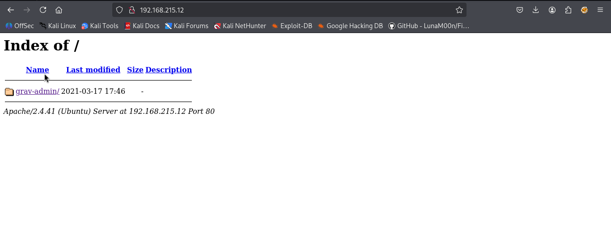
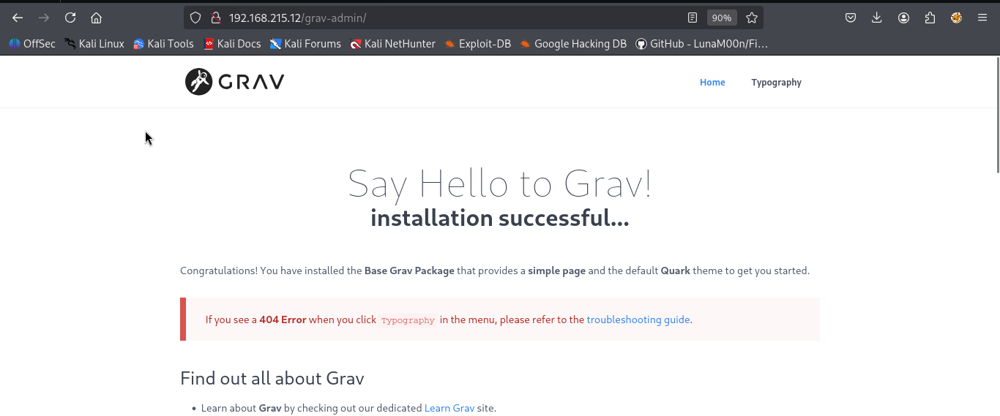
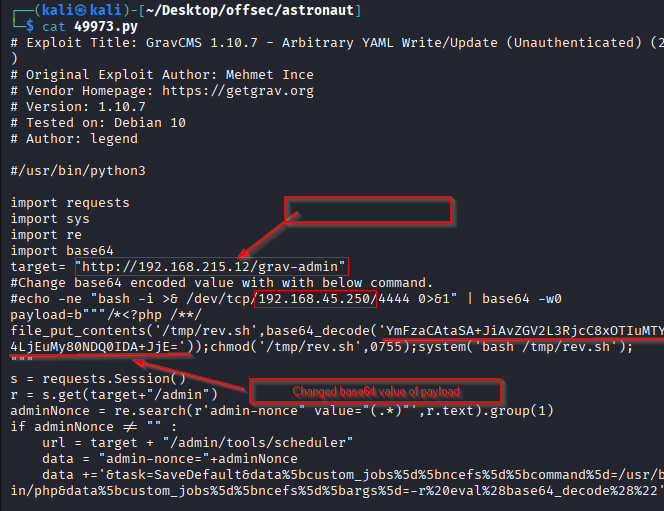
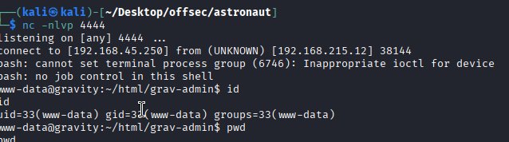
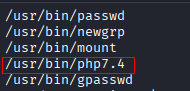
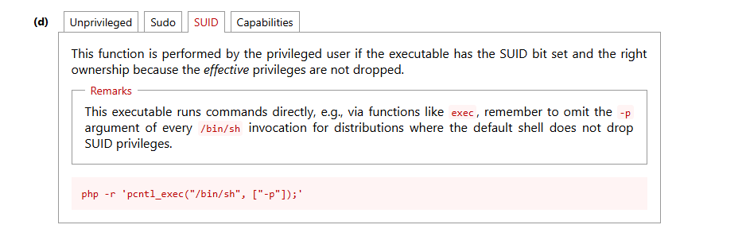
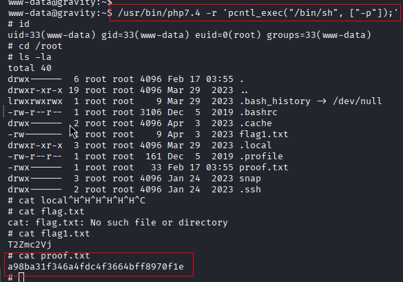

Nmap scan
```sh
nmap -p- --min-rate 5000 -T4 -Pn 192.168.215.12     
Starting Nmap 7.95 ( https://nmap.org ) at 2026-02-17 09:26 IST
Warning: 192.168.215.12 giving up on port because retransmission cap hit (6).
Nmap scan report for 192.168.215.12
Host is up (0.20s latency).
Not shown: 60502 closed tcp ports (reset), 5031 filtered tcp ports (no-response)
PORT   STATE SERVICE
22/tcp open  ssh
80/tcp open  http

Nmap done: 1 IP address (1 host up) scanned in 43.71 seconds
```
```sh
nmap -sC -sV -T4 -Pn -p 22,80 192.168.215.12               
Starting Nmap 7.95 ( https://nmap.org ) at 2026-02-17 09:27 IST
Nmap scan report for 192.168.215.12
Host is up (0.10s latency).

PORT   STATE SERVICE VERSION
22/tcp open  ssh     OpenSSH 8.2p1 Ubuntu 4ubuntu0.5 (Ubuntu Linux; protocol 2.0)
| ssh-hostkey: 
|   3072 98:4e:5d:e1:e6:97:29:6f:d9:e0:d4:82:a8:f6:4f:3f (RSA)
|   256 57:23:57:1f:fd:77:06:be:25:66:61:14:6d:ae:5e:98 (ECDSA)
|_  256 c7:9b:aa:d5:a6:33:35:91:34:1e:ef:cf:61:a8:30:1c (ED25519)
80/tcp open  http    Apache httpd 2.4.41
|_http-title: Index of /
|_http-server-header: Apache/2.4.41 (Ubuntu)
| http-ls: Volume /
| SIZE  TIME              FILENAME
| -     2021-03-17 17:46  grav-admin/
|_
Service Info: Host: 127.0.0.1; OS: Linux; CPE: cpe:/o:linux:linux_kernel

Service detection performed. Please report any incorrect results at https://nmap.org/submit/ .
Nmap done: 1 IP address (1 host up) scanned in 10.29 seconds
```
Visiting web server on port 80.

Clicking on grav-admin we redirected to below page.

Executed dirsearch. Found /admin dir but nothing interesting as default creds didn't work.
Simultaneously, we will search for known vulnerabilities related to **Grav** using **searchsploit**:

I will proceed with testing the exploit for the higher version, **Arbitrary YAML Write/Update (Unauthenticated)**, as there is a reasonable chance it may still be effective. Additionally,  we noticed YAML on web page also.


Downloaded the exploit. And did necessary changes. 


Started nc and run the exploit. Wait for 10-15 seconds after running the exploit to achieve the shell.



We looked into home directory for flag, but permission denied.

We searched for SUID bit set binary and found php binary.
```sh
find / -perm -u=s -type f 2>/dev/null
```




We run the above command with php7.4 version as it was the same on server and found the flag.

