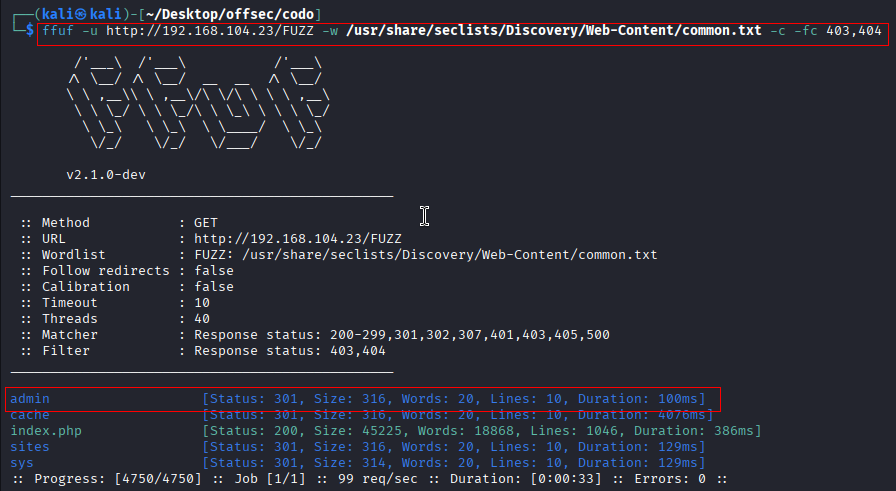
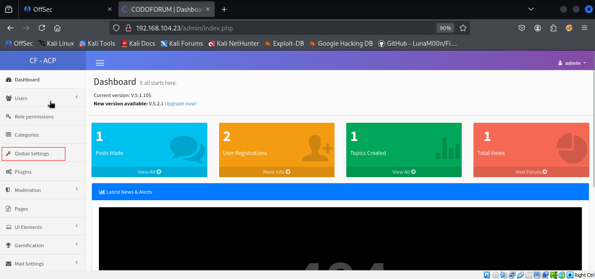
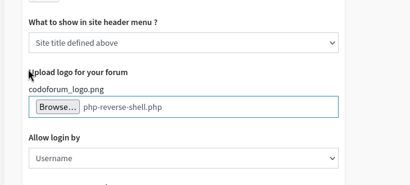
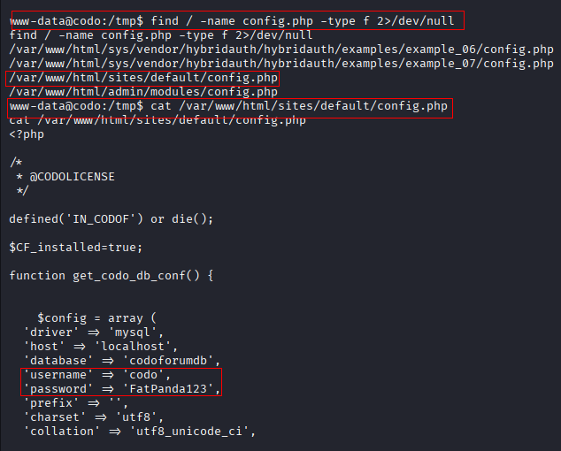
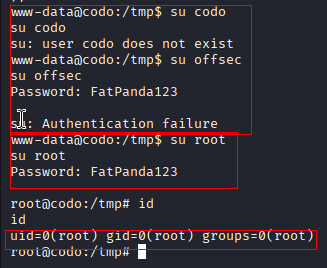
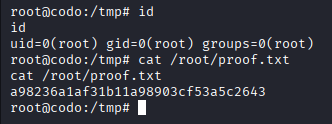

Nmap scan.
```sh
nmap -p- --min-rate 5000 -T4 -Pn 192.168.104.23
Starting Nmap 7.95 ( https://nmap.org ) at 2026-02-27 11:38 IST
RTTVAR has grown to over 2.3 seconds, decreasing to 2.0
RTTVAR has grown to over 2.3 seconds, decreasing to 2.0
Nmap scan report for 192.168.104.23
Host is up (2.9s latency).
Not shown: 65533 filtered tcp ports (no-response)
PORT   STATE SERVICE
22/tcp open  ssh
80/tcp open  http

Nmap done: 1 IP address (1 host up) scanned in 28.56 seconds
```

```sh
nmap -sC -sV -T4 -Pn -p 22,80 192.168.104.23   
Starting Nmap 7.95 ( https://nmap.org ) at 2026-02-27 11:39 IST
Nmap scan report for 192.168.104.23
Host is up (0.14s latency).

Bug in http-generator: no string output.
PORT   STATE SERVICE VERSION
22/tcp open  ssh     OpenSSH 8.2p1 Ubuntu 4ubuntu0.7 (Ubuntu Linux; protocol 2.0)
| ssh-hostkey: 
|   3072 62:36:1a:5c:d3:e3:7b:e1:70:f8:a3:b3:1c:4c:24:38 (RSA)
|   256 ee:25:fc:23:66:05:c0:c1:ec:47:c6:bb:00:c7:4f:53 (ECDSA)
|_  256 83:5c:51:ac:32:e5:3a:21:7c:f6:c2:cd:93:68:58:d8 (ED25519)
80/tcp open  http    Apache httpd 2.4.41 ((Ubuntu))
|_http-server-header: Apache/2.4.41 (Ubuntu)
|_http-title: All topics | CODOLOGIC
| http-cookie-flags: 
|   /: 
|     PHPSESSID: 
|_      httponly flag not set
Service Info: OS: Linux; CPE: cpe:/o:linux:linux_kernel

Service detection performed. Please report any incorrect results at https://nmap.org/submit/ .
Nmap done: 1 IP address (1 host up) scanned in 13.74 seconds
```

Visiting web server port 80.

Logged in using default creds `admin : admin`


Directory brute forcing.

Found /admin page. Logged in with default creds `admin : admin`

From the admin console, we can see the version of Codoforun running is 5.1.105. A quick search in exploit DB shows us that there is a exploit available for this.

Lets run the exploit. Exploit didn't work but we found a way to exploit path so we'll do it manually.

Follow the below steps.

I’ve added PHP to the list of allowed file types just to be certain.

Upload our reverse php shell in below mentioned browse option and save it.

Now, hit the below URL. This path was discovered from our failed exploit.

We got the shell.


## Privilege Escalation
After running linpeas, we found below.

**Another method,**

Tried logging in with user `codo and offsec` but we failed. So, we tried logging in with user `root` and we were successful.




